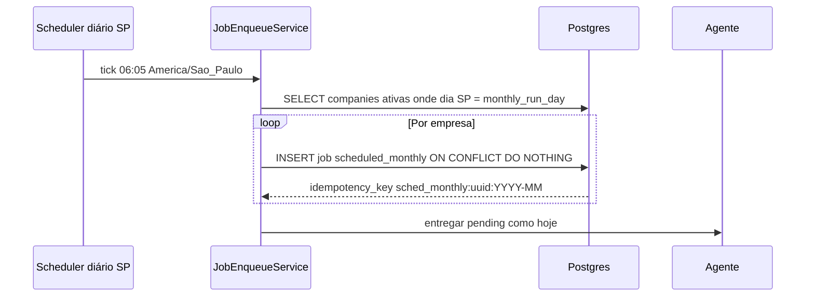

# Arquitetura técnica — Incremento: dia da automação mensal por empresa

**Entradas:** `docs/prd-atualizacao-agendamento-por-empresa.md`, `docs/prd.md` v0.2 (Stories **2.4**, **4.3**), `docs/front-end-spec-agendamento-por-empresa.md`.  
**Arquitetura base:** `docs/architecture.md` — este ficheiro define **delta** de dados, API, agendador e idempotência; o diagrama global de componentes mantém-se.

---

## 1. Resumo executivo

| Tópico | Decisão |
|--------|---------|
| Persistência | Coluna `companies.monthly_run_day` — `SMALLINT NOT NULL DEFAULT 1` com `CHECK (monthly_run_day BETWEEN 1 AND 28)`. |
| API | `POST /companies` e `PATCH /companies/:id` aceitam `monthlyRunDay` (JSON camel) ou `monthly_run_day` (snake); resposta espelha o mesmo campo. Validação duplicada na camada de serviço. |
| Agendador | Tick **diário** no fuso `America/Sao_Paulo` (ex.: **06:05** local), após a janela nominal **06:00** do PRD, para materializar jobs do **dia D** de cada empresa. |
| `scheduled_for` | `TIMESTAMPTZ` = instante **06:00** no dia **D** do mês corrente (interpretado em `America/Sao_Paulo`). |
| Idempotência | `idempotency_key` única por **empresa + mês civil de referência** no fuso SP (`sched_monthly:{company_id}:{YYYY-MM}`). |
| Job imediato | **Inalterado:** ao criar empresa, `INSERT` job `immediate` como hoje; não depende de `monthly_run_day`. |
| Front / shared | `monthlyRunDay` em TypeScript (`packages/shared`); serialização API alinhada ao contrato abaixo. |

---

## 2. Modelo de dados (PostgreSQL)

### 2.1 Migração `companies`

```sql
ALTER TABLE companies
  ADD COLUMN IF NOT EXISTS monthly_run_day SMALLINT NOT NULL DEFAULT 1
    CHECK (monthly_run_day >= 1 AND monthly_run_day <= 28);

COMMENT ON COLUMN companies.monthly_run_day IS
  'Dia do mês (1-28) em America/Sao_Paulo para job scheduled_monthly; default 1.';
```

- **Retrocompatibilidade:** `DEFAULT 1` preenche linhas existentes.  
- **Sem nullable:** simplifica queries do worker; UI trata “ausente no JSON antigo” como 1 até persistir.

### 2.2 Índices

Não é obrigatório índice só para `monthly_run_day`. O worker continua a iterar `companies` por `account_id` + `active = true` (índice existente `idx_companies_account`); volume MVP (dezenas por conta) é suficiente.

---

## 3. Contrato HTTP (normativo)

### 3.1 Criar empresa — `POST /api/companies` (ou rota equivalente)

**Corpo (exemplo):**

```json
{
  "cnpjDigits": "12345678000199",
  "tradeName": "Loja",
  "systemCode": "sefaz-sp",
  "monthlyRunDay": 5
}
```

- **Omissão** de `monthlyRunDay` → servidor persiste **1**.  
- **Validação:** inteiro ∈ [1, 28]; caso contrário **400** com corpo `{ "error": "validation", "message": "Dia inválido. Use um número entre 1 e 28." }` (ou lista de erros por campo).

### 3.2 Atualizar empresa — `PATCH /api/companies/:id`

- Mesmo campo e validação.  
- **Autorização:** `company.account_id = session.user.id`.  
- Alterar `monthly_run_day` **não** cancela jobs `immediate` nem reescreve jobs `scheduled_monthly` já terminal; ver §5.

### 3.3 Resposta serializada

Preferência: **camelCase** na API pública (`monthlyRunDay`) para alinhar ao cliente Next/TS; coluna DB permanece `snake_case`.

---

## 4. Domínio e validação (servidor)

1. **`CompanyService.create` / `update`:** normalizar `monthlyRunDay` para inteiro; rejeitar fora do intervalo antes de tocar no ORM.  
2. **Invariante:** `monthly_run_day` nunca NULL na DB após migração.  
3. **Auditoria (recomendado):** `AuditEvent` com `action=company.updated`, payload diff incluindo `monthly_run_day` antigo/novo (opcional no MVP mínimo).

---

## 5. Agendador e idempotência (worker / cron)

### 5.1 Objetivo do tick

Garantir **no máximo um** job `scheduled_monthly` por **empresa** por **mês civil** (referência **America/Sao_Paulo**), com `scheduled_for` às **06:00** no dia **D** dessa empresa.

### 5.2 Algoritmo (referência)

Executar **uma vez por dia** após as 06:00 em SP (ex.: 06:05) via **Vercel Cron** + route handler secreto ou worker BullMQ:

1. Obter **data atual** `calendar_date` em `America/Sao_Paulo` (biblioteca **tzdata** / `Temporal` / `luxon` / `date-fns-tz` — escolha fixada no repo).  
2. Para cada `company` com `active = true`:  
   - Se `company.monthly_run_day != calendar_date.day` em SP → **skip** (não é o dia D).  
   - Se `calendar_date.day == company.monthly_run_day` e **hora atual em SP ≥ 06:00** (ou o tick só corre às 06:05, logo sempre verdadeiro):  
     - Calcular `period_key = YYYY-MM` da **data de calendário SP atual** (mês em que o job mensal “pertence”).  
     - Tentar `INSERT INTO jobs (...)` com  
       `idempotency_key = 'sched_monthly:' || company.id || ':' || period_key`  
       e `type = 'scheduled_monthly'`, `scheduled_for = <esse dia D às 06:00 SP em TIMESTAMPTZ>`.  
     - **Conflito** em `idempotency_key` UNIQUE → ignorar (idempotência).  

3. **Mudança de D intra-mês (Story 4.3):**  
   - Se já existe job com essa `idempotency_key` (pendente, running, success ou failed), **não** inserir outro no mesmo `period_key`.  
   - Alterar `monthly_run_day` na empresa **não atualiza** `scheduled_for` de linhas já criadas; o novo D só influencia o **próximo** mês (próximo `period_key`).  
   - Se o utilizador mudar D **antes** de existir qualquer linha para `period_key` corrente, o **primeiro** insert bem-sucedido usa o **D atual** (o tick do dia D novo cria o job quando o calendário coincidir — pode implicar que, se mudou de 1 para 20 no dia 10, o job de **esse** mês só aparece se ainda não havia job e o dia 20 ainda não passou; casos finos podem ser documentados no runbook — o PRD prioriza “sem duplicata no mesmo mês”).

### 5.3 Diagrama de sequência (atualizado)



### 5.4 Relação com o documento antigo “dia 1 fixo”

Substitui a lógica “sempre dia 1” por “dia = `companies.monthly_run_day`”; o resto do pipeline (fila, agente offline, retentativas **NFR9**) **inalterado**.

---

## 6. Front-end e pacote partilhado

- **`packages/shared`:** `Company.monthlyRunDay: number` (1–28), conforme UX spec.  
- **Hidratação `localStorage`:** se objeto empresa não tiver chave, tratar **1** e persistir no próximo save (evita drift com API).  
- **TanStack Query:** após `PATCH`, `invalidateQueries(['companies', id])` para detalhe e lista.

---

## 7. Segurança e limites

- **Input:** validação estrita impede injeção via inteiro; rejeitar floats/strings.  
- **Rate limit:** criar empresa mantém limites existentes; PATCH não aumenta superfície crítica.  
- **Multi-tenant:** todos os paths verificam `account_id` da sessão.

---

## 8. Testes recomendados

1. **Unidade:** função “é dia D em SP?” + construção de `scheduled_for` para fevereiro com D=28.  
2. **Integração:** dois ticks no mesmo dia → um único job por empresa.  
3. **Integração:** PATCH `monthlyRunDay` com valor 0 ou 29 → 400.  
4. **E2E smoke:** criar empresa com D=15, verificar resposta e, com DB de teste, linha em `jobs` no mês esperado após simulação de tick.

---

## 9. Rastreio PRD / UX

| Artefacto | Secção / ID |
|-----------|-------------|
| PRD incremento | FR10, FR18, NFR idempotência |
| PRD principal | Story 2.4, Story 4.3, FR11 |
| UX spec | Modelo `monthlyRunDay`, contrato API, ficheiros UI |

---

## Change Log

| Date       | Version | Description | Author |
| ---------- | ------- | ----------- | ------ |
| 2026-04-22 | 0.1     | Arquitetura do incremento agendamento por empresa | Architect (AIOS / Aria) |

---

— Aria, arquitetando o futuro 🏗️
