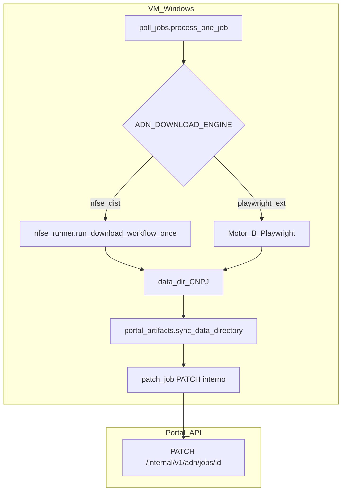

# Arquitetura técnica — Motor alternativo cenário B (Playwright + extensão no worker Windows)

**Fontes:** [`prd-cenario-b-adn-playwright-extensao-chrome.md`](prd-cenario-b-adn-playwright-extensao-chrome.md) (**FR-ADN-B-01** a **08**, **NFR-ADN-B-01** a **06**), [`front-end-spec-cenario-b-adn-playwright-extensao-chrome.md`](front-end-spec-cenario-b-adn-playwright-extensao-chrome.md), [`briefing-cenario-b-adn-playwright-extensao-chrome.md`](briefing-cenario-b-adn-playwright-extensao-chrome.md).  
**Documento base (ADN):** [`architecture-integracao-nfse-dist-adn.md`](architecture-integracao-nfse-dist-adn.md), [`workers/nfse-portal-bridge/poll_jobs.py`](../workers/nfse-portal-bridge/poll_jobs.py), [`workers/nfse-portal-bridge/nfse_runner.py`](../workers/nfse-portal-bridge/nfse_runner.py), [`workers/nfse-portal-bridge/portal_artifacts.py`](../workers/nfse-portal-bridge/portal_artifacts.py).

**Normativa:** o **portal** e as rotas **`/api/internal/v1/adn/*`** (HMAC, **NFR20** / **NFR-ADN-B-06**) **não** mudam de propósito. Altera-se apenas o **processo local no Windows** entre “correr NFSE_dist” e “correr automação de browser + eventual subprocesso”, desde que a saída em disco seja consumível por **`sync_data_directory`** e que **`summary_json`** cumpra **FR-ADN-B-04**. Em conflito com este incremento, prevalece segurança multi-tenant e certificado conforme [`prd-integracao-nfse-dist-adn.md`](prd-integracao-nfse-dist-adn.md).

**Change log:**

| Data       | Versão | Descrição |
| ---------- | ------ | --------- |
| 2026-04-30 | 0.1    | Arquitectura inicial: motor, env, contrato `summary_json`, subprocesso B2, segurança, concorrência, portal/UI. |

---

## 1. Resumo executivo

| Tema | Decisão |
| ---- | -------- |
| **Local de mudança** | Quase exclusivamente **`workers/nfse-portal-bridge`** (Python): ramificação após materializar certificado / `clients.json` e **antes** de `sync_data_directory`. |
| **Selecção do motor** | Variável de ambiente (ex. **`ADN_DOWNLOAD_ENGINE`**) com valor por defeito que preserva comportamento actual (`nfse_dist`). Valor alternativo activa implementação cenário B. |
| **Ingestão ao portal** | **Inalterada:** mesmo fluxo `prepare` → PUT → `commit` em [`portal_artifacts.py`](../workers/nfse-portal-bridge/portal_artifacts.py) (**FR-ADN-B-03**). |
| **Persistência de estado** | **`adn_sync_jobs.summary_json`** (JSONB), já aceite pelo [`PATCH /api/internal/v1/adn/jobs/:jobId`](../frontend/src/app/api/internal/v1/adn/jobs/[jobId]/route.ts); extensão de chaves normalizadas (§4). |
| **Implementação motor B** | **Recomendação:** variante **B2** — subprocesso **Node + Playwright** ou **Python + Playwright** com CLI estável, para isolar dependências e versões de Chromium (**NFR-ADN-B-05**). Variante **B1** (Playwright em thread no mesmo processo Python) é aceitável em POC se simplificar. |
| **UI** | Consumo de **`summary_json`** nas vistas públicas quando existir API de listagem de jobs/execuções alinhada ao [`front-end-spec-cenario-b-adn-playwright-extensao-chrome.md`](front-end-spec-cenario-b-adn-playwright-extensao-chrome.md). **Nota:** a página [`execucoes/page.tsx`](../frontend/src/app/(dashboard)/execucoes/page.tsx) pode continuar com dados **simulados** em `localStorage` até story dedicada ligar **GET** autenticado a `adn_sync_jobs`. |

---

## 2. Vista de componentes (worker)

**Invariantes:**

1. **`NFSE_BRIDGE_SKIP_NFSE_DIST=1`** continua a saltar a fase de descarga (**FR-ADN-B-07**); com motor B, o runbook deve definir se o skip aplica também ao subprocesso browser (recomendação: **sim** — nenhum motor de descarga corre).
2. Falhas no motor B devem produzir **`patch_job(..., status="failed", summary={...})`** com **`failureCategory`** e mensagem truncada (**NFR-ADN-B-02**), sem HTML.

---

## 3. Variáveis de ambiente (proposta)

Nomes exactos podem ser ajustados na story; todas **opcionais** excepto as já exigidas pelo bridge.

| Variável | Defeito | Função |
| -------- | ------- | ------ |
| **`ADN_DOWNLOAD_ENGINE`** | `nfse_dist` | `nfse_dist` — fluxo actual; valor cenário B acordado (ex. `playwright_extension`) — activa ramo browser. |
| **`ADN_PLAYWRIGHT_SCRIPT`** | — | Caminho para executável ou `node script.js` do motor B (variante B2). |
| **`ADN_BROWSER_EXTENSION_DIR`** | — | Directorio descompactado da extensão para `--load-extension` (nunca no repo). |
| **`ADN_CHROME_USER_DATA_DIR`** | — | Perfil persistente **fora** do repositório (**NFR-ADN-B-01**); permissões restritas. |
| **`ADN_BROWSER_PHASE_TIMEOUT_SEC`** | ex. `3600` | Limite único da fase browser; falha → `failureCategory: timeout`. |
| **`ADN_BROWSER_DEBUG`** | `0` | Se `1`, permite artefactos de debug **locais** ao VM (**NFR-ADN-B-03**); não enviar ao portal. |
| **`ADN_BROWSER_MAX_CONCURRENT`** | `1` | Limite de subprocessos browser simultâneos no mesmo VM (**NFR-ADN-B-04**); implementação pode serializar em `poll_jobs` ou fila interna. |

**Rollback:** remover ou repor `ADN_DOWNLOAD_ENGINE=nfse_dist` restaura o comportamento sem alterar deploy Vercel (**O4**).

---

## 4. Contrato `summary_json` (extensão FR-ADN-B-04)

O worker já envia resumo com `engine: "NFSE_dist"` em sucesso ([`poll_jobs.py`](../workers/nfse-portal-bridge/poll_jobs.py)). Para **alinhar** com PRD e UX:

| Chave | Tipo | Obrigatório quando | Descrição |
| ----- | ---- | ------------------- | --------- |
| **`downloadEngine`** | `string` | Motor B activo ou após migrar NFSE_dist | Valores canónicos API: `nfse_dist`, `playwright_extension`. Manter **`engine`** legível por humanos só se necessário para retrocompatibilidade; preferir **`downloadEngine`** como fonte para UI. |
| **`browserPhaseSeconds`** | `number` | Motor B completou fase browser | Duração em segundos (inteiro); UI arredonda (“cerca de Xm”). |
| **`failureCategory`** | `string` | `status=failed` e falha atribuível | Um de: `session`, `portal`, `extension`, `disk`, `timeout`, `unknown` — mapeamento para copy em [`front-end-spec-cenario-b-adn-playwright-extensao-chrome.md`](front-end-spec-cenario-b-adn-playwright-extensao-chrome.md) §5. |
| **`userSafeDetail`** | `string` | Opcional | Mensagem curta já **filtrada** para exibir em **Detalhe** (sem paths, sem stack). Se omitido, UI usa só `failureCategory`. |

**Compatibilidade:** jobs antigos sem `downloadEngine`: UI trata como legado (spec UX §9 — não inferir motor incorrectamente).

---

## 5. Variante B2 — contrato do subprocesso

**Entrada (argumentos ou env injectado pelo pai):**

- `JOB_ID`, `COMPANY_CNPJ`, `OUTPUT_DIR` (deve coincidir com `NFSE_DIST_ROOT/data/{cnpj}/` ou caminho acordado).
- Opcional: intervalo de datas se o motor precisar (fonte: `summary_json` do job ou colunas futuras — definir na story).

**Saída:**

- **Exit code 0** — ficheiros esperados no `OUTPUT_DIR`; pai continua para `sync_data_directory`.
- **Exit ≠ 0** — pai mapeia stderr/última linha para **`failureCategory`** (regex ou tabela); **nunca** repassar stderr cru ao `summary_json` do portal.

**Logs:** subprocesso escreve para ficheiro rotativo local com redacção; opcionalmente stdout só nível INFO sem URLs completas (**NFR-ADN-B-02**).

---

## 6. Segurança e operações

| Requisito | Implementação |
| --------- | ------------- |
| **NFR-ADN-B-01** | `ADN_CHROME_USER_DATA_DIR` sob pasta controlada (ex. `C:\ProgramData\...` ou disco de dados VM); ACL apenas conta de serviço; **backup** não em partilha pública. |
| **NFR-ADN-B-03** | Screenshots só com `ADN_BROWSER_DEBUG=1` e path **fora** de artefactos de CI públicos. |
| **O5 / FR-ADN-B-08** | Evidência em sistema externo (ticket, Doc); não codificar “aprovação” no runtime sem decisão de produto. |

---

## 7. Concorrência e desempenho

- **NFR-ADN-B-04:** predefinir **`ADN_BROWSER_MAX_CONCURRENT=1`** até métricas RAM/CPU estaveis; documentar no runbook.
- Vários jobs `queued`: o `poll_jobs` pode processar um de cada vez já por construção do loop; se no futuro houver **workers paralelos**, necessário **advisory lock** ou fila por VM para não disparar dois browsers no mesmo perfil Chrome.

---

## 8. Portal e API (camada Next.js)

| Área | Impacto |
| ---- | ------- |
| **PATCH interno** | Nenhuma alteração de schema Zod necessária — `summaryJson` já é `record` flexível. |
| **API pública / v1** | Story separada: **GET** lista de `adn_sync_jobs` (filtrado por org/empresa, ACL) para substituir dados simulados em **Execuções**; campos expostos devem **omitir** chaves internas não mapeadas no spec UX. |
| **Auditoria** | Eventos `adn_sync_completed` / `adn_sync_failed` mantêm-se; opcionalmente enriquecer `metadata` com `downloadEngine` (avaliar PII — preferir só em `summary_json`). |

---

## 9. Testes e observabilidade

- **Smoke:** combinações `ADN_DOWNLOAD_ENGINE` × `NFSE_BRIDGE_SKIP_NFSE_DIST` documentadas no runbook (**FR-ADN-B-07**).
- **Métricas:** opcional contador `adn_browser_phase_seconds` / falhas por `failureCategory` no worker logs estruturados (prefixo JSON ou campo fixo) para agregar em Loki/Datadog — fora do âmbito código neste documento.
- **Versões:** registar no startup do subprocesso versão Playwright + Chromium (**NFR-ADN-B-05**); não obriga persistir na BD no MVP.

---

## 10. Riscos técnicos (resumo)

| Risco | Mitigação arquitectónica |
| ----- | ------------------------- |
| Extensão dependente de UI headful | Documentar modo **headed**; não assumir headless no desenho inicial. |
| Sessão gov.br expira | `failureCategory=session` + runbook de reauth no perfil; não automatizar credenciais no Git. |
| Duplicação de chaves `engine` vs `downloadEngine` | Migrar gradualmente para **`downloadEngine`**; teste de regressão no PATCH. |

---

## 11. Referências cruzadas

- PRD: [`prd-cenario-b-adn-playwright-extensao-chrome.md`](prd-cenario-b-adn-playwright-extensao-chrome.md)  
- UX: [`front-end-spec-cenario-b-adn-playwright-extensao-chrome.md`](front-end-spec-cenario-b-adn-playwright-extensao-chrome.md)  
- ADN base: [`architecture-integracao-nfse-dist-adn.md`](architecture-integracao-nfse-dist-adn.md)

— **Aria (Architect) / AIOS** — documento vivo; revisar após POC de Playwright no Windows de staging.
