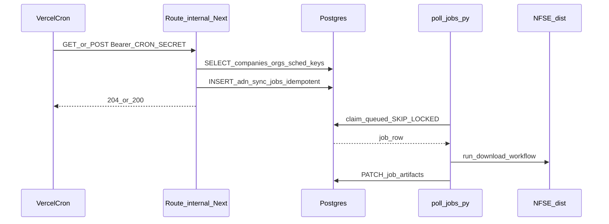
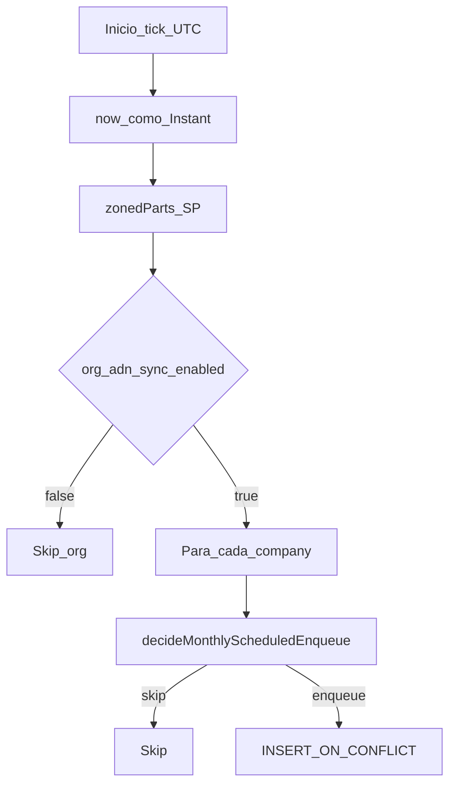

# Arquitectura técnica — Coleta mensal ADN no dia configurável (enfileiramento automático)

**Entradas normativas:** [`prd-coleta-mensal-adn-dia-configuravel.md`](prd-coleta-mensal-adn-dia-configuravel.md), [`front-end-spec-coleta-mensal-adn-dia-configuravel.md`](front-end-spec-coleta-mensal-adn-dia-configuravel.md).  
**Contexto:** [`briefing-coleta-mensal-adn-dia-configuravel.md`](briefing-coleta-mensal-adn-dia-configuravel.md), [`architecture-agendamento-por-empresa.md`](architecture-agendamento-por-empresa.md), [`runbooks/agendamento-mensal-por-empresa.md`](runbooks/agendamento-mensal-por-empresa.md).

**Arquitectura base:** [`architecture.md`](architecture.md) — este ficheiro define **delta** para materializar trabalho em **`adn_sync_jobs`**, não na tabela genérica `jobs` descrita no documento legado. Em caso de conflito sobre **onde** o job vive, prevalece este delta e o PRD de coleta ADN.

**Data:** 2026-04-30

---

## 1. Resumo executivo

| Tópico | Decisão |
|--------|---------|
| Fila de trabalho | Tabela Postgres **`adn_sync_jobs`** ([`packages/db/src/schema.ts`](../packages/db/src/schema.ts)); worker [`poll_jobs.py`](../workers/nfse-portal-bridge/poll_jobs.py) sem filtro por `trigger`. |
| Agendador | **Cron HTTP** diário (ex.: **06:05** `America/Sao_Paulo`), via Vercel Cron ou equivalente, chamando **uma** route interna Next.js autenticada por segredo. |
| Idempotência | `idempotency_key = sched_monthly:{company_id}:{YYYY-MM}` (mês civil SP); persistência com **`INSERT … ON CONFLICT DO NOTHING`** após **índice UNIQUE** em chaves não nulas (ver secção 4). |
| Lógica pura TZ | Pacote [`@repo/scheduling`](../packages/scheduling/src/monthly-enqueue.ts) — `decideMonthlyScheduledEnqueue`, chaves e `scheduledForIso` (referência temporal; coluna opcional no job). |
| Organização | Só enfileirar se `organizations.adn_sync_enabled = true` (alinhado ao `JOIN` existente no worker). |
| Actor | `requested_by_user_id` **NULL** para jobs criados pelo cron. |
| UI | Copy e módulo partilhado conforme [`front-end-spec-coleta-mensal-adn-dia-configuravel.md`](front-end-spec-coleta-mensal-adn-dia-configuravel.md) (**FR-ADN-MONTHLY-07**). |

---

## 2. Vista de componentes e fluxo

### 2.1 Decisão por empresa (referência)

---

## 3. Fronteira HTTP e segurança

| Requisito | Implementação |
|-----------|----------------|
| **FR-ADN-MONTHLY-02**, **NFR-ADN-MONTHLY-01** | Header `Authorization: Bearer <token>` igual à variável de ambiente (ex.: `CRON_SECRET`). Sem cookie de sessão. |
| Resposta | Preferir **204 No Content** ou **200** com corpo mínimo JSON (`{ "ok": true, "enqueued": n }`) **sem** eco do segredo. |
| Logs | Nunca registar o token completo; opcional hash ou últimos 4 caracteres para diagnóstico. |
| Path sugerido | Colocar sob o mesmo prefixo que rotas internas ADN existentes: [`frontend/src/app/api/internal/v1/adn/`](../frontend/src/app/api/internal/v1/adn/) — ex.: `…/cron/monthly-enqueue/route.ts` (nome exacto livre, manter `api/internal`). |

**Nota deploy:** **um único** projecto Vercel regista `crons` no `vercel.json` que aponta para este path (**NFR-ADN-MONTHLY-03**). Hoje [`backend/vercel.json`](../backend/vercel.json) não define `crons`; a equipa deve escolher o deploy que tem **`DATABASE_URL`** e código Next estável (tipicamente **frontend** se for a app principal). Evitar dois crons a apontar para ambientes distintos.

---

## 4. Modelo de dados e idempotência

### 4.1 Estado actual

- **`adn_sync_jobs`** criada em [`db/migrations/20260425103000_adn_01_ddl.sql`](../db/migrations/20260425103000_adn_01_ddl.sql): `idempotency_key TEXT NULL`, **sem** constraint UNIQUE.
- Pedidos manuais ([`adn-sync.ts`](../frontend/src/server/api/v1/handlers/adn-sync.ts)) usam idempotência opcional por cabeçalho — várias linhas podem ter `idempotency_key` nulo.

### 4.2 Delta recomendado (migração dedicada)

1. **UNIQUE parcial** (PostgreSQL):  
   `CREATE UNIQUE INDEX … ON adn_sync_jobs (idempotency_key) WHERE idempotency_key IS NOT NULL;`  
   Garante unicidade das chaves `sched_monthly:…` sem impedir múltiplos jobs manuais sem chave.

2. **`INSERT`** no handler:  
   `INSERT INTO adn_sync_jobs (…) VALUES (…) ON CONFLICT (idempotency_key) DO NOTHING`  
   **apenas** se o índice UNIQUE for **não parcial** na coluna; com índice parcial, usar `ON CONFLICT ON CONSTRAINT` adequado ou equivalente Drizzle. Alternativa: índice UNIQUE só em prefixo conhecido (mais complexo). A equipa de dados valida a forma exacta com Drizzle.

3. **Chave:** `sched_monthly:{companyId}:{YYYY-MM}` — `YYYY-MM` do mês civil em SP (já calculado em [`decideMonthlyScheduledEnqueue`](../packages/scheduling/src/monthly-enqueue.ts)).

### 4.3 Empresa “activa” (PRD)

O modelo Drizzle de [`companies`](../packages/db/src/schema.ts) **não** inclui coluna `active` (diferente do rascunho em [`architecture-agendamento-por-empresa.md`](architecture-agendamento-por-empresa.md)). **Decisão MVP:** considerar **todas** as linhas em `companies` como elegíveis ao tick; exclusão por `ON DELETE CASCADE` remove jobs órfãos. Se no futuro existir soft-delete / `active`, o handler deve filtrar explicitamente.

### 4.4 Organização

- Filtrar apenas empresas cujo `organizations.adn_sync_enabled = true` (**FR-ADN-MONTHLY-05**), coerente com o `JOIN` em [`poll_jobs.py`](../workers/nfse-portal-bridge/poll_jobs.py) (`claim_next_job`).

---

## 5. Alinhamento `trigger`: PRD, Postgres e domínio UX

| Camada | Estado |
|--------|--------|
| **PRD** | Valor **`monthly`** em `adn_sync_jobs.trigger` ([**FR-ADN-MONTHLY-04**](prd-coleta-mensal-adn-dia-configuravel.md)). |
| **Postgres** | `CHECK (trigger IN ('manual', 'scheduled', 'retry', 'worker'))` em [`20260425103000_adn_01_ddl.sql`](../db/migrations/20260425103000_adn_01_ddl.sql) — **não** inclui `monthly`. |
| **Drizzle** | [`schema.ts`](../packages/db/src/schema.ts): `trigger` como `text` sem enum TS estrito alinhado ao CHECK. |
| **Worker** | Não inspeciona `trigger`; qualquer valor permitido pelo CHECK que não quebre `poll_jobs` é aceitável. |
| **Portal types** | [`ExecutionTrigger`](../packages/shared/src/portal-types.ts) inclui `"monthly"` para UX / simulação. |

**Decisão de arquitectura (recomendada):**

1. **Migração SQL:** alterar o `CHECK` de `adn_sync_jobs.trigger` para **incluir** `'monthly'` (lista explícita: `'manual', 'scheduled', 'retry', 'worker', 'monthly'`). Documentar semântica: **`monthly`** = job criado pelo **cron diário** quando o calendário SP coincide com `monthlyRunDay`.

2. **Alternativa temporária:** usar `'scheduled'` para o cron até existir migração; nesse caso documentar mapeamento **PRD → DB** e actualizar copy/UI para não assumir diferença entre “scheduled” e “monthly” na mesma lista — **menos desejável** por colisão semântica com outros tipos agendados futuros.

3. **Sincronizar** código de insert do cron com o valor escolhido e validar que [`adn-sync.ts`](../frontend/src/server/api/v1/handlers/adn-sync.ts) continua a inserir `manual` / `retry` conforme hoje.

---

## 6. Handler do tick (lógica server)

1. Validar segredo; se inválido → **401** sem detalhes.

2. Instanciar `now` (produção: `new Date()`; testes: injecção).

3. Carregar candidatos: query que devolve pares `(company, organization)` com `adn_sync_enabled = true` e dados necessários (`company.id`, `monthlyRunDay`). Índices existentes em `organization_id` / `company_id` ajudam volume MVP.

4. Para cada empresa, construir `existingKeys`: `SELECT idempotency_key FROM adn_sync_jobs WHERE company_id = ? AND idempotency_key LIKE 'sched_monthly:' || ? || ':%'` ou agregação por período — optimizar para não N+1 pesado (uma query agrupada por empresa ou por tick).

5. Chamar `decideMonthlyScheduledEnqueue({ now, companyId, monthlyRunDay, active: true, existingKeys })`.

6. Se `action === 'enqueue'`: `INSERT` com `trigger` conforme secção 5, `status: 'queued'`, `idempotency_key`, `requested_by_user_id: null`, `summary_json` alinhado ao manual (ex.: `{ phase: 'queued', fetchMode: 'incremental', source: 'cron_monthly' }`).

7. Opcional: [`maybeLogMonthlyEnqueueDecision`](../packages/scheduling/src/enqueue-telemetry.ts) / telemetria **NFR-ADN-MONTHLY-04**.

8. Retornar contagem resumida para observabilidade.

---

## 7. Deploy e operações

| Tópico | Nota |
|--------|------|
| Variáveis | `CRON_SECRET` (ou nome único do repo), `DATABASE_URL` no runtime da função. |
| `vercel.json` | Acrescentar array `crons` com **schedule** em UTC equivalente a **06:05** em `America/Sao_Paulo` (atenção a DST — revisar duas vezes por ano ou usar serviço que dispare em TZ SP). |
| Runbook | Âncoras [#duplo-tick-mesmo-dia](runbooks/agendamento-mensal-por-empresa.md), [#mudanca-intra-mes](runbooks/agendamento-mensal-por-empresa.md). |

---

## 8. Front-end (delta técnico)

| Item | Referência |
|------|------------|
| Copy e superfícies | [`front-end-spec-coleta-mensal-adn-dia-configuravel.md`](front-end-spec-coleta-mensal-adn-dia-configuravel.md) |
| Implementação sugerida | Módulo [`execution-display.ts`](../frontend/src/lib/execution-display.ts) (criar), consumido por [`dashboard/page.tsx`](../frontend/src/app/%28dashboard%29/dashboard/page.tsx) e [`execucoes/page.tsx`](../frontend/src/app/%28dashboard%29/execucoes/page.tsx). |
| Paridade PRD | **FR-ADN-MONTHLY-07** — não hardcodar “dia 1º” para origem mensal. |

Não é obrigatório para o MVP do cron ligar a lista de execuções à API real de `adn_sync_jobs`; o documento de UX prevê **v2** com campo opcional na execução.

---

## 9. Testes

| Nível | Âmbito |
|-------|--------|
| Unitário | Existente em [`packages/scheduling`](../packages/scheduling/src/monthly-enqueue.test.ts); manter cobertura de borda (fev 28, duplo tick). |
| Integração | Route com DB de teste ou mock: segredo inválido → 401; dia D + ADN activo → uma linha; segundo tick → sem nova linha; org sem ADN → zero inserts mensais para essa org. |
| Worker | Smoke: job `queued` criado pelo cron é reclamado por [`poll_jobs.py`](../workers/nfse-portal-bridge/poll_jobs.py) (critério 4 do PRD). |

---

## 10. Riscos e mitigações (técnicas)

| Risco | Mitigação |
|-------|-----------|
| Cron duplicado em dois projectos | Um único `vercel.json` activo; revisão de operações. |
| Migração `CHECK` + dados legacy | Validar valores actuais em `trigger` antes de alterar constraint. |
| UNIQUE idempotency vs jobs manuais | Índice parcial `WHERE idempotency_key IS NOT NULL`. |

---

## 11. Referências de código

| Artefacto | Caminho |
|-----------|---------|
| Schema Drizzle `adn_sync_jobs` | [`packages/db/src/schema.ts`](../packages/db/src/schema.ts) |
| DDL inicial ADN | [`db/migrations/20260425103000_adn_01_ddl.sql`](../db/migrations/20260425103000_adn_01_ddl.sql) |
| Agendamento puro | [`packages/scheduling/src/monthly-enqueue.ts`](../packages/scheduling/src/monthly-enqueue.ts) |
| POST sync manual | [`frontend/src/server/api/v1/handlers/adn-sync.ts`](../frontend/src/server/api/v1/handlers/adn-sync.ts) |
| Worker | [`workers/nfse-portal-bridge/poll_jobs.py`](../workers/nfse-portal-bridge/poll_jobs.py) |
| Rotas internas ADN | [`frontend/src/app/api/internal/v1/adn/`](../frontend/src/app/api/internal/v1/adn/) |

---

*Delta de arquitectura — AIOS; implementação e migrações SQL sob priorização da equipa.*
