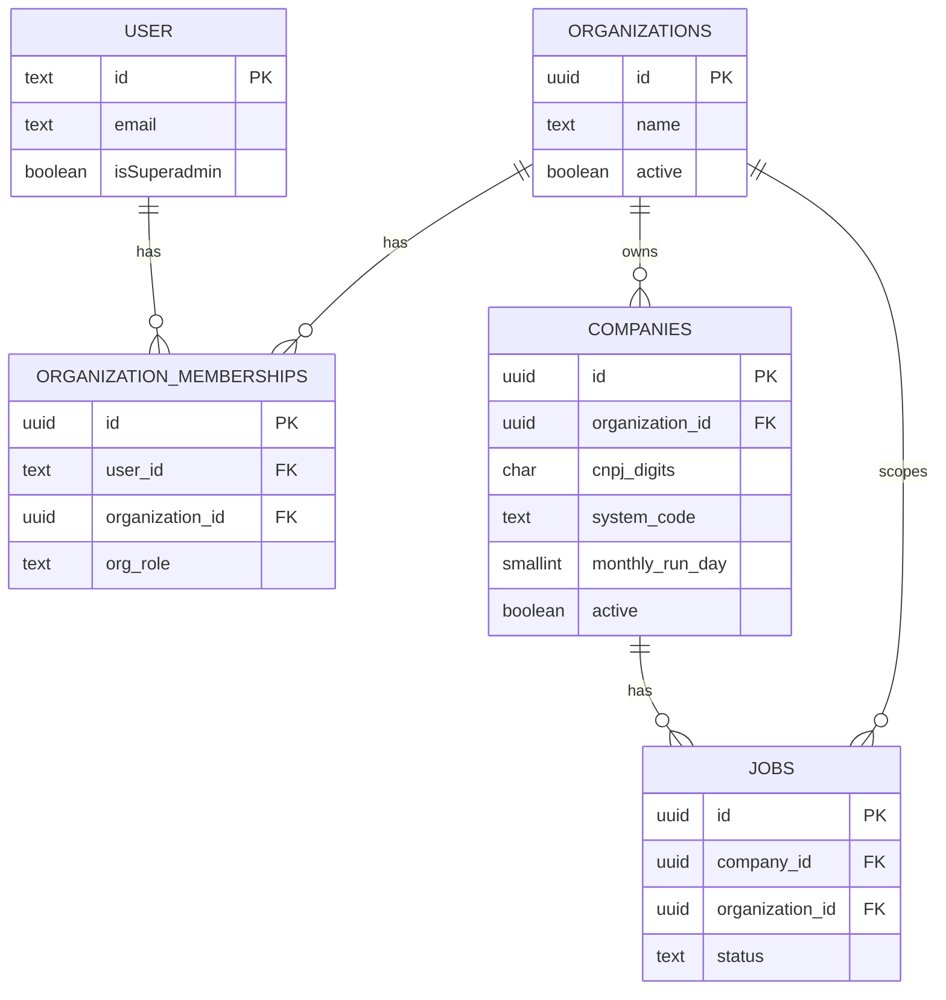

# Arquitetura técnica — Incremento: organização (tenant) vs. empresas monitoradas (fiscal)

**Fontes:** `docs/prd-atualizacao-dois-niveis-organizacao-vs-empresas-fiscais.md` (**FR33–FR40**, **NFR16–NFR18**), `docs/front-end-spec-dois-niveis-organizacao-vs-empresas-fiscais.md`.  
**Documentos base:** `docs/architecture.md`, `docs/architecture-login-empresas-roles.md`.  
**Estado do código de referência:** migração `db/migrations/20260423120000_ler_auth_multitenant.sql` (Better Auth, `session.activeCompanyId` → `companies`, `company_memberships.company_id` → `companies`).

**Normativa:** após este incremento, o **tenant** de sessão e de memberships é a **organização**; a tabela `companies` representa apenas **empresa monitorada** (CNPJ + automação). O incremento de login passa a ser **reinterpretado**: nomes legados `activeCompanyId` / `company_id` em memberships, onde ainda existirem, devem migrar para **`organization_id`** conforme abaixo.

---

## 1. Resumo executivo

| Camada | Decisão |
| ------ | -------- |
| **Domínio** | Dois níveis: `Organization` (workspace, ACL, convites) e `Company` = empresa monitorada (CNPJ, `system_code`, `monthly_run_day`, jobs). |
| **Persistência** | Nova tabela `organizations`; `companies.organization_id NOT NULL` (FK); memberships passam a referir **`organizations`**, não `companies`. |
| **Sessão** | Coluna de contexto ativo na sessão referencia **`organizations.id`** (nome alvo: `activeOrganizationId`; migração a partir de `activeCompanyId`). |
| **Jobs / agente** | `jobs.company_id` mantém-se como FK para **`companies.id`** (empresa monitorada); **`organization_id`** em `jobs` é **recomendado** para auditoria e queries operacionais sem join obrigatório (**FR36**). |
| **API** | Rotas de domínio fiscal exigem **organização ativa** coerente com `companies.organization_id`; listagens de tenant usam `organization_id` (**FR35**). |

---

## 2. Problema do modelo anterior (LER-01)

No schema LER atual, **`companies`** acumula dois papéis:

1. **Entidade fiscal** (CNPJ, código do sistema) — alinhado ao PRD original.  
2. **Recipiente de membership** — `company_memberships.company_id` e `session.activeCompanyId` apontam para a **mesma** tabela.

Isso impede modelar um escritório (**uma organização**) com **vários CNPJs monitorados** sem multiplicar “tenants” artificiais. O incremento **corrige** a separação semântica (**FR33–FR34**).

---

## 3. Modelo de dados alvo (PostgreSQL)

### 3.1 Tabela `organizations` (nova)

| Coluna | Tipo | Notas |
| ------ | ---- | ----- |
| `id` | `UUID PK` | |
| `name` | `TEXT NOT NULL` | Nome exibido no picker (“Escritório Silva”). |
| `trade_name` | `TEXT NULL` | Opcional. |
| `tax_id_digits` | `CHAR(14) NULL` | CNPJ da **pessoa jurídica da organização**, se existir; único opcional por produto. |
| `active` | `BOOLEAN NOT NULL DEFAULT true` | |
| `created_at` / `updated_at` | `TIMESTAMPTZ` | |

**Índices:** `(active)`, `(name)` para busca `ILIKE` (com `pg_trgm` opcional em fase 2).

### 3.2 Tabela `companies` (empresa monitorada — evolução)

Manter o **nome físico** `companies` para reduzir churn em código/agente (`jobs.company_id`, contratos). Semântica: **apenas** nível fiscal.

| Alteração | Notas |
| --------- | ----- |
| `organization_id` | `UUID NOT NULL REFERENCES organizations(id) ON DELETE CASCADE` (após backfill). |
| `UNIQUE (organization_id, cnpj_digits, system_code)` | Substitui a unicidade por `account_id` (**FR4** evoluído). |
| `account_id` | **Legado:** manter nullable como “criador/registo histórico” ou deprecar após migração; **não** usar para autorização. |

**Índices:** `(organization_id)`, `(organization_id, active)`.

### 3.3 Tabela `organization_memberships` (recomendado)

**Opção A (recomendada):** nova tabela `organization_memberships` com a mesma forma de `company_memberships` (papeis, `job_title`, etc.) e FK `organization_id`. Depois **deprecar** `company_memberships` e remover numa fase 2 após cutover.

**Opção B:** alterar `company_memberships` para `organization_id` (renomear coluna e FK). Maior risco em PRs com código que ainda importa o nome antigo.

| Coluna | Tipo |
| ------ | ---- |
| `id` | `UUID PK` |
| `organization_id` | `UUID NOT NULL REFERENCES organizations(id) ON DELETE CASCADE` |
| `user_id` | `TEXT NOT NULL REFERENCES "user"(id) ON DELETE CASCADE` (alinhar ao Better Auth) |
| `org_role` | `ENUM` ou `TEXT CHECK` — valores `user`, `admin` (equivalente a `company_role`) |
| `job_title`, `department`, `phone` | `TEXT NULL` |
| `created_at` / `updated_at` | `TIMESTAMPTZ` |

**Constraint:** `UNIQUE (user_id, organization_id)`.

### 3.4 Sessão (Better Auth `session`)

| Coluna alvo | Notas |
| ----------- | ----- |
| `activeOrganizationId` | `UUID NULL REFERENCES organizations(id) ON DELETE SET NULL`. Migração: popular a partir do mapeamento `activeCompanyId` → organização dona da `company` antiga. |
| Remover ou ignorar `activeCompanyId` | Após cutover de API e UI; migração em duas fases possível (coluna nova + dual-write temporário). |

### 3.5 Tabela `jobs`

| Alteração | Motivo |
| --------- | ------ |
| `organization_id` | `UUID NOT NULL REFERENCES organizations(id)` **denormalizado** na criação do job a partir da `company` — simplifica listagens “por org”, observabilidade e **FR36** / **FR37**. |
| `company_id` | Mantém-se; invariante: `EXISTS (SELECT 1 FROM companies c WHERE c.id = jobs.company_id AND c.organization_id = jobs.organization_id)`. |

**Índice:** `(organization_id, scheduled_for DESC)`, `(organization_id, status)`.

### 3.6 `audit_events`

Estender com:

| Coluna | Tipo |
| ------ | ---- |
| `organization_id` | `UUID NULL REFERENCES organizations(id)` |
| Manter `company_id` | Semântica: **empresa monitorada** (não renomear na primeira migração para não quebrar ferramentas). Documentar em comentário SQL. |

Eventos novos ou existentes (**FR37**): preencher `organization_id` sempre que `company_id` estiver preenchido (trigger opcional ou responsabilidade da aplicação).

---

## 4. Diagrama entidade–relação (alvo)



---

## 5. Matriz de autorização (servidor) — revisão

Funções sugeridas (`lib/authz/`):

```text
isSuperadmin(user) → "user".isSuperadmin

hasOrgMembership(userId, organizationId) → EXISTS organization_memberships

orgRole(userId, organizationId) → org_role | null

canAccessOrganization(user, organizationId)
  → isSuperadmin(user) OR hasOrgMembership(userId, organizationId)

canManageOrgUsers(user, organizationId)
  → orgRole = 'admin' OR isSuperadmin(user)

canMutateMonitoredCompany(user, organizationId)
  → orgRole = 'admin' na organização OU política futura de suporte
  → MVP Superadmin: igual ao PRD de login — **sem** admin na org, **sem** mutação de dados fiscais

canReadMonitoredCompany(user, companyId)
  → EXISTS companies c JOIN organizations o ON c.organization_id = o.id
     WHERE c.id = companyId AND canAccessOrganization(user, o.id)
```

**Listagens:**

- **Picker / organizações acessíveis:** `SELECT organizations ...` filtrado por membership ou todas se superadmin (**FR22** reinterpretado).
- **Empresas monitoradas:** `SELECT companies WHERE organization_id = session.activeOrganizationId` (+ checagem de acesso à org).

---

## 6. Política HTTP **403** vs **404** (mantida)

Igual a `architecture-login-empresas-roles.md` §5, substituindo “empresa” por **organização** onde aplicável:

- Sem membership na **organização** alvo: **404** (anti-enumeração) ou **403** conforme ambiente.
- Sem papel para mutação: **403**.

---

## 7. API REST (v1) — delta

Prefixo e formato de erro iguais ao incremento de login. Alterações conceituais:

| Método | Rota | Descrição |
| ------ | ---- | --------- |
| `GET` | `/me` | Incluir `activeOrganizationId`, `isSuperadmin`; remover ou deprecar `activeCompanyId` no wire após migração. |
| `POST` | `/session/active-organization` | Body `{ organizationId }`; valida `canAccessOrganization`; persiste na sessão; auditoria `active_organization_set` (ou manter tipo genérico + metadata). |
| `GET` | `/organizations/accessible` | Substitui ou convive com `/companies/accessible` do login; devolve summaries de **organização** (nome, membros, flags admin). |
| `GET` | `/organizations/:organizationId/monitored-companies` | Lista **companies** scoped; exige `activeOrganizationId === organizationId` **ou** superadmin com política de leitura. |
| `POST` | `/organizations/:organizationId/monitored-companies` | Cria `companies` com `organization_id`; exige papel **admin** na org. |
| `PATCH` / `DELETE` | `.../monitored-companies/:companyId` | Valida que `company.organization_id` coincide com o scope. |
| `GET` | `/organizations/:organizationId/members` | Migração da rota `.../companies/:id/members` (gestão de utilizadores **da organização**). |

**Compatibilidade temporária:** manter rotas antigas com **redirect 308** ou **proxy interno** para as novas, por um release, se necessário (**NFR16** UX com rotas legadas).

**Contrato JSON (wire):** preferir **camelCase** (`organizationId`, `monitoredCompanyId`) alinhado ao restante do monorepo; documentar mapeamento para colunas `snake_case` no Drizzle/Postgres.

---

## 8. Next.js — routing e middleware (delta)

| Caminho | Guard |
| ------- | ----- |
| `/empresas` (picker de **organizações**) | Autenticado; **não** exige `activeOrganizationId`. |
| `(dashboard)/**` | Autenticado + `activeOrganizationId` válido para rotas de negócio (lista fiscal, agente, etc.). |
| `/empresas/[orgId]/usuarios` | `orgId` é **organization** (alinhar à spec UX §11). |

**TanStack Query:** chaves `['organizations', userId]`, `['monitored-companies', organizationId]`, `['org-members', organizationId]`; invalidar tudo sob `organizationId` ao `POST /session/active-organization`.

---

## 9. Workers, scheduler e agente

- **Idempotência mensal:** chaves que hoje usam `company_id` + mês mantêm-se; workers devem carregar `organization_id` da `company` ao publicar métricas (**NFR17**).
- **Comando ao agente:** payload continua a identificar a **empresa monitorada** (`companyId`); incluir **`organizationId`** no envelope quando útil para logging correlacionado no cliente.
- **Validação:** ao despachar job, verificar que a `company` referenciada pertence à **mesma** organização esperada pelo contexto do dispositivo/sessão técnica.

---

## 10. Migração brownfield (FR40) — fases recomendadas

### Fase 0 — Pré-requisitos

- Congelar novas features que criem `company_memberships` sem plano de cutover.
- Backup da base.

### Fase 1 — DDL + colunas nullable

1. `CREATE TABLE organizations (...)`.  
2. `ALTER TABLE companies ADD COLUMN organization_id UUID NULL REFERENCES organizations(id)`.  
3. `CREATE TABLE organization_memberships (...)` (ou renomear estratégia da opção B).  
4. `ALTER TABLE jobs ADD COLUMN organization_id UUID NULL`.  
5. `ALTER TABLE audit_events ADD COLUMN organization_id UUID NULL`.  
6. `ALTER TABLE session ADD COLUMN activeOrganizationId UUID NULL REFERENCES organizations(id)` (nome físico conforme convenção Better Auth / Drizzle).

### Fase 2 — Backfill (dados)

**Regra MVP sugerida** (ajustar se negócio tiver modelo diferente):

1. Para cada valor distinto de `companies.account_id` **não nulo**, criar **uma** `organization` (nome derivado: `COALESCE(trade_name, 'Organização ' || left(id::text,8))`).  
2. Atualizar `companies.organization_id` para essa org.  
3. Para `company_memberships` existentes: obter `organization_id` via `companies.organization_id` do `company_id` antigo; inserir `organization_memberships` **deduplicado** `(user_id, organization_id)`; em conflito de papel, manter o mais elevado (`admin` > `user`).  
4. Para cada `session.activeCompanyId` antigo: definir `activeOrganizationId` = `companies.organization_id` dessa company.  
5. Preencher `jobs.organization_id` a partir de `companies.organization_id`.  
6. Preencher `audit_events.organization_id` a partir de `companies.organization_id` quando `company_id` presente.

**Validação pós-backfill:** `SELECT count(*) FROM companies WHERE organization_id IS NULL` = **0**; idem verificação de integridade de memberships.

### Fase 3 — Constraints NOT NULL + unicidade nova

1. `ALTER companies ALTER organization_id SET NOT NULL`.  
2. Criar `UNIQUE (organization_id, cnpj_digits, system_code)`; remover `UNIQUE (account_id, ...)` após código deixar de depender.  
3. `ALTER jobs ALTER organization_id SET NOT NULL` (se política for 100% backfill).

### Fase 4 — Cutover aplicação

1. Trocar guards e handlers para `activeOrganizationId`.  
2. Remover `company_memberships` ou deixar somente leitura até remoção.  
3. Remover coluna `session.activeCompanyId` num release posterior.

---

## 11. RLS (opcional, Supabase)

Se PostgREST + RLS forem adotados (**NFR13** do PRD principal):

- Política em `companies`: `organization_id IN (SELECT organization_id FROM organization_memberships WHERE user_id = auth.uid())` (ajustar `auth.uid()` ao modelo real).  
- `jobs`: leitura por `organization_id` acessível.  
- **Nota:** com Better Auth + Drizzle só no servidor, RLS pode permanecer desligado no MVP; este incremento não o exige.

---

## 12. Observabilidade (NFR17)

Campos mínimos em logs estruturados (JSON):

- `organizationId`  
- `monitoredCompanyId` (ou `companyId` documentado como monitorada)  
- `userId`, `jobId`, `requestId`

Métricas: contagens de jobs por `organizationId` para dashboards operacionais.

---

## 13. Testes de integração (NFR18)

- Utilizador com membership apenas na **org A** não obtém **200** em `GET /organizations/:idB/monitored-companies` (404/403).  
- `POST` de empresa monitorada com `organizationId` da sessão **B** enquanto ativo **A** → **403**.  
- Superadmin: listagem global de organizações sem vazar dados de membros (campos mínimos).

---

## 14. Rastreio PRD → arquitetura

| FR | Secções |
| -- | -------- |
| FR33 | §3.1, §4, §7 |
| FR34 | §3.2 |
| FR35 | §5, §7, §8 |
| FR36 | §3.5, §9 |
| FR37 | §3.6, §12 |
| FR38–FR39 | §8 (routing), entrega em `@dev` + spec UX |
| FR40 | §10 |

| NFR | Secções |
| --- | -------- |
| NFR16 | §7 compat, copy em `@dev` |
| NFR17 | §12 |
| NFR18 | §13 |

---

## 15. Próximos passos

1. **`@data-engineer`** — scripts SQL finais, ordem de locks, rollback documentado; revisão de índices sob carga esperada.  
2. **`@dev`** — Drizzle schema, serviços, handlers, middleware, query keys.  
3. **`@architect` (revisão)** — após merge, atualizar `docs/architecture.md` e deprecar secções contraditórias em `architecture-login-empresas-roles.md` (nota de supersession).  
4. **`@sm`** — histórias por fase (§10) com AC mensuráveis.

---

— Aria (Architect) — AIOS; alinhado ao PRD e à spec de UX do incremento **dois níveis**.
