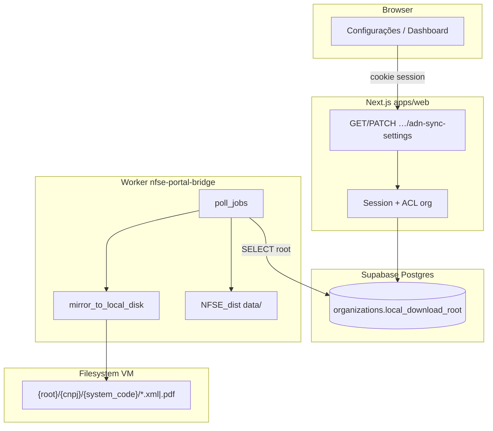
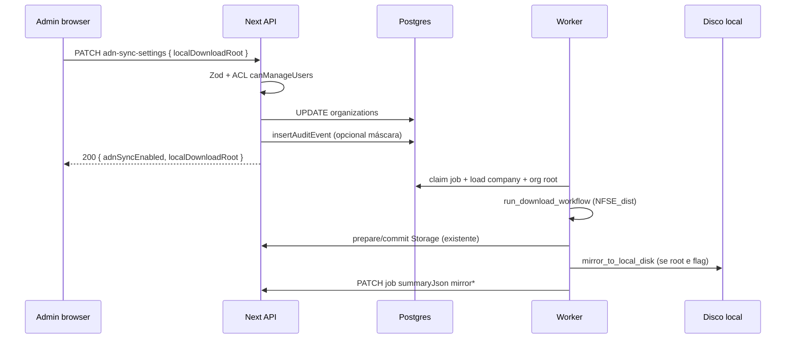

# Arquitectura técnica — Espelho local XML/PDF (`local_download_root`)

**Fontes:** `docs/prd-download-automatico-xml-pdf-pasta-raiz-windows.md` (**FR58–FR63**, **NFR30–NFR34**), `docs/front-end-spec-download-automatico-xml-pdf-pasta-raiz-windows.md`, `docs/briefing-download-automatico-xml-pdf-pasta-raiz-windows.md`.  
**Arquitectura base ADN:** `docs/architecture-integracao-nfse-dist-adn.md`, `docs/architecture-supabase-fe-be.md`, `docs/architecture-dois-niveis-organizacao-vs-empresas-fiscais.md`.

**Normativa:** o **portal** persiste e valida o **caminho texto**; apenas o **worker** (filesystem na VM Windows) **executa** escrita em disco. O browser **nunca** recebe capacidade de escrita fora dos mecanismos web normais (download via URL assinada — **FR44**). Conflitos de rota única vs múltiplos endpoints: **prevalece este documento** — **um** recurso REST por organização para definições ADN + espelho (**§4**).

---

## 1. Resumo executivo

| Tema | Decisão |
| ---- | -------- |
| **Persistência** | Coluna existente `organizations.local_download_root` (`TEXT NULL`) — garantir migração aplicada em todos os ambientes (**FR58**). |
| **API pública (sessão)** | **Estender** `GET` e `PATCH` em **`/api/v1/organizations/:organizationId/adn-sync-settings`** com campo opcional `localDownloadRoot` (camelCase JSON) ↔ coluna `local_download_root` — **um** contrato para «definições de operação ADN da org», mesmo padrão ACL que `adnSyncEnabled` (**FR59**, **NFR31**). |
| **Validação servidor** | Zod + regras **NFR30** (comprimento máx., sem caracteres de controlo, sem sequências `..` como path traversal semântico — ver **§5**). |
| **Respostas 400** | Corpo JSON `{ "message": "…", "error_code": "LOCAL_PATH_*" }` alinhado à matriz da spec UX (**§5.3**). |
| **Worker** | Novo módulo **`mirror_to_local_disk`** invocado desde `poll_jobs.process_one_job` **após** `sync_data_directory` (ou iterando os mesmos ficheiros em `data/<CNPJ>/`), lendo `local_download_root` + `companies.system_code` + `cnpj_digits` (**FR61**). |
| **Flag de desactivação** | Env opcional `NFSE_LOCAL_MIRROR_DISABLED=1` no processo worker — ignora espelho mesmo com coluna preenchida (operadores cloud). |
| **Auditoria** | `insertAuditEvent` em `PATCH` quando o valor **normalizado** difere do anterior (**NFR32**). |
| **Job summary** | Acrescentar chaves opcionais em `summaryJson` do `PATCH` final do job: `mirrorWritten`, `mirrorFailed`, `mirrorErrorsSample` (**FR62**). |

---

## 2. Vista de sistema



**Invariante:** o valor em `ORG` é uma **string opaca** para o portal; o worker interpreta como path absoluto Windows quando não vazio.

---

## 3. Fluxo temporal (LM-01 + LM-02)



---

## 4. Contrato HTTP — recurso único

**Base path:** `/api/v1/organizations/:organizationId/adn-sync-settings`  
**Handlers:** `apps/web/src/server/api/v1/handlers/organization-adn-sync-settings.ts` (estender; manter ficheiro de rota actual).

### 4.1 `GET`

**Resposta 200** (`Cache-Control: no-store`):

```json
{
  "adnSyncEnabled": true,
  "canManage": true,
  "localDownloadRoot": "C:\\\\NFs"
}
```

- `localDownloadRoot`: `string | null` — `null` se coluna SQL `NULL` ou string vazia após trim.  
- **NFR31:** só devolver se `canAccessOrganization` + mesma regra de `effectiveOrganizationId` que o GET actual; **não** incluir campo extra para membros sem papel de gestão se política for «só admin vê o path» — **recomendação:** devolver sempre a **mesma** visibilidade que `adnSyncEnabled` (qualquer membro com acesso à org vê o caminho **ou** restringir a `canManage === true` — **fechar com PO**; default técnico: **visível a quem já vê GET ADN**, pois o path não é segredo criptográfico).

### 4.2 `PATCH`

**Corpo** (campos opcionais; pelo menos um obrigatório — reutilizar padrão: se vazio object, 400):

```json
{
  "adnSyncEnabled": true,
  "localDownloadRoot": "C:\\\\NFs"
}
```

- `adnSyncEnabled`: `boolean` — opcional se já existir semântica «partial patch»; se o produto exigir **só** alterar path, permitir **apenas** `localDownloadRoot` no body.  
- `localDownloadRoot`: `string | null` — `null` ou `""` após trim → persistir **`NULL`** na coluna (espelho desligado no worker).

**Resposta 200:** eco dos campos actualizados (espelho do GET).

**Erros 400** (`application/json`):

| `error_code` | Condição |
| ------------- | --------- |
| `LOCAL_PATH_TOO_LONG` | len > **512** (constante partilhada TS + documentada). |
| `LOCAL_PATH_INVALID_CHARS` | Regex falhou (controlo Unicode C0/C1, `\n`, `\r`, `\0`, etc.). |
| `LOCAL_PATH_TRAVERSAL` | Segmentos `..` ou prefixos UNC proibidos por política (`\\?\`, `\\.\`) se equipa decidir bloquear. |
| `LOCAL_PATH_INVALID` | Outros (só símbolos estranhos) — mensagem genérica. |

**403:** mesmo texto que PATCH ADN actual quando não `canManageUsers`.

---

## 5. Validação (`packages/shared` ou co-local no handler)

### 5.1 Regras mínimas (NFR30)

1. **Trim** inicial e final; se vazio → `NULL`.  
2. **Comprimento** ≤ **512** (config `MAX_LOCAL_DOWNLOAD_ROOT_LENGTH`).  
3. **Proibido** codepoints de controlo (`/[\u0000-\u001F\u007F]/u`).  
4. **Opcional (recomendado):** rejeitar caminhos que **começam** por `\\` (UNC) no MVP se não houver teste com shares; se permitir UNC, documentar requisitos de permissão do serviço Windows.  
5. **Não** validar existência de pasta no servidor Next.

### 5.2 Schema Zod (ilustrativo)

```typescript
const localDownloadRootSchema = z
  .union([z.string().max(512), z.null()])
  .transform((s) => (typeof s === "string" ? s.trim() : null))
  .refine((s) => s === null || s.length > 0, { message: "use_null_for_clear" })
  .refine((s) => s === null || !/[\u0000-\u001F\u007F]/.test(s), { message: "LOCAL_PATH_INVALID_CHARS" });
```

*(Ajustar `refine` para mapear `error_code` no handler — padrão `adnJsonFromZodError` ou `jsonError` com código.)*

### 5.3 Mapeamento para UI

O handler deve devolver `error_code` estável para o front mapear copy (**front-end spec §5.2**).

---

## 6. Camada de dados

| Artefacto | Acção |
| --------- | ----- |
| **Migração** | `ALTER TABLE organizations ADD COLUMN IF NOT EXISTS local_download_root TEXT NULL;` + comentário SQL; ficheiro em `db/migrations/` com timestamp. |
| **Drizzle** | `packages/db/src/schema.ts` — campo já existe; garantir `snake_case` ↔ API. |
| **Índice** | Não obrigatório (baixa cardinalidade por linha). |

---

## 7. Worker (`workers/nfse-portal-bridge`)

### 7.1 Novo módulo `mirror_local.py` (nome sugerido)

**Entrada:**

- `root: str | None` — de `organizations.local_download_root` (query SQL no `process_one_job` ou extend `load_company`).  
- `cnpj_digits: str`, `system_code: str` — da linha `companies`.  
- `nfse_data_dir: Path` — `nfse_root / "data" / cnpj` (igual a `sync_data_directory`).  
- `skip: bool` — `os.environ.get("NFSE_LOCAL_MIRROR_DISABLED","").strip()=="1"` **ou** `root` vazio.

**Lógica:**

1. Sanitizar `system_code` para componente de pasta: **mesma regra** que o PRD principal (**FR6**) — reutilizar função única se existir em TS; em Python, duplicar tabela de caracteres proibidos documentada aqui (`<>:"|?*` + controlo) ou normalizar para `[A-Za-z0-9_-]{1,80}`.  
2. Para cada par `*.xml` com chave válida (44 chars):  
   - destino_dir = `Path(root) / cnpj_digits / safe_system_code`  
   - `destino_dir.mkdir(parents=True, exist_ok=True)`  
   - `shutil.copy2(xml_path, destino_dir / f"{chave}.xml")`  
   - se `pdf_path.exists()`: copiar PDF.  
3. Contar sucessos/falhas; capturar `OSError` por ficheiro sem abortar o job inteiro (**FR62** best-effort fase 1).  
4. Retornar `dict` com contagens para `patch_job` `summaryJson`.

**Ordem:** executar **depois** de `sync_data_directory` bem-sucedido por ficheiro **ou** uma única passagem ao final do job — **recomendação:** **após** todo o upload ao Storage no `process_one_job`, iterar de novo `data_dir.rglob("*.xml")` para manter uma única passagem de espelho e reutilizar ficheiros já validados.

**Concorrência:** mesmo processo single-threaded do `poll_jobs`; sem lock global; sobrescrita **NFR33**.

---

## 8. Auditoria (NFR32)

| Campo | Valor |
| ----- | ----- |
| `eventType` | `organization_local_download_root_updated` (ou `organization_settings_updated` com `metadata.key`). |
| `metadata` | `{ "previousLength": n, "newLength": m, "suffixPreview": "…\\\\NFs" }` — **nunca** logar path completo em tabela pública se política de privacidade o proibir; mínimo: `organizationId`, `actorUserId`. |

---

## 9. Segurança e multi-tenant

| Risco | Mitigação |
| ----- | --------- |
| **Cross-org** | `UPDATE … WHERE id = :organizationId` sempre com `organizationId` da rota validada por `canAccessOrganization` + `effectiveOrganizationId` (**NFR31**). |
| **Path injection no servidor** | Validação **§5**; não `eval` / não executar path. |
| **Worker lê org errada** | `organization_id` vem do **job** já escopado; SELECT `local_download_root` com `WHERE id = job.organization_id`. |

---

## 10. Observabilidade (NFR34)

- **Worker:** logs `INFO` por job com `mirrorWritten`, `mirrorFailed`; primeiro erro de I/O em `WARNING` com errno.  
- **Portal:** contagem de `PATCH` 400 por `error_code` (métrica futura); não bloqueia MVP.

---

## 11. Matriz de rastreio (FR / NFR → componente)

| ID | Componente |
| -- | ------------ |
| **FR58** | Migração + Drizzle (já em schema). |
| **FR59** | `organization-adn-sync-settings.ts` ACL. |
| **FR60** | `configuracoes/page.tsx` + fetch GET/PATCH. |
| **FR61** | `mirror_local.py` + `poll_jobs.py`. |
| **FR62** | `patch_job` `summaryJson` + decisão `partial` (opcional) no worker Python. |
| **FR63** | Copy UI — spec UX. |
| **NFR30** | Zod + handler. |
| **NFR31** | Testes integração API. |
| **NFR32** | `insertAuditEvent` no PATCH. |
| **NFR33** | `copy2` overwrite. |
| **NFR34** | Logs worker. |

---

## 12. Fora de âmbito (arquitectura)

- Agente local **LM-03** (WebSocket, pairing, binário) — apenas nota: consumirá o mesmo `GET …/adn-sync-settings` ou endpoint dedicado de **preferências de agente** quando existir.  
- **RLS** PostgREST directo ao campo — continuação do modelo «API servidor + Drizzle».

---

## 13. Referências de código (ponto de extensão)

- `apps/web/src/server/api/v1/handlers/organization-adn-sync-settings.ts`  
- `apps/web/src/app/api/v1/organizations/[organizationId]/adn-sync-settings/route.ts`  
- `workers/nfse-portal-bridge/poll_jobs.py`, `portal_artifacts.py`  
- `packages/db/src/schema.ts` → `organizations.localDownloadRoot`

---

## 14. Checklist de implementação (@dev)

1. Migração SQL + `npm`/`drizzle` push conforme processo do repo.  
2. Estender Zod PATCH + GET select `localDownloadRoot`.  
3. UI conforme `docs/front-end-spec-download-automatico-xml-pdf-pasta-raiz-windows.md`.  
4. Worker: `mirror_local` + env `NFSE_LOCAL_MIRROR_DISABLED`.  
5. Testes: PATCH 400 por caracteres inválidos; PATCH 403 sem admin; worker smoke com `NFSE_BRIDGE_SKIP_NFSE_DIST` + disco temp.

---

*Documento de arquitectura para LM-01 / LM-02; ajustes de detalhe em PR após revisão @data-engineer em migrações.*

— **Aria (Architect)**
