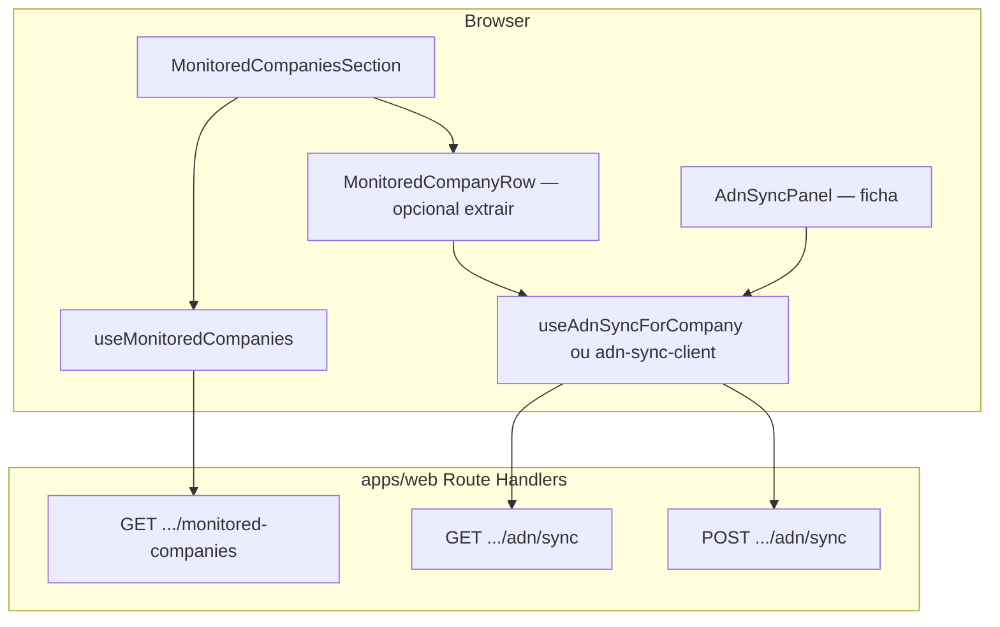

# Arquitectura técnica — Incremento: empresas monitoradas — edição e sincronização ADN na lista

**Fontes:** `docs/prd-empresas-monitoradas-editar-e-forcar-automacao.md` (**FR53–FR57**, **NFR26–NFR29**, épico **EM-01**), `docs/front-end-spec-empresas-monitoradas-editar-e-forcar-automacao.md`.  
**Documentos base:** `docs/architecture.md`, `docs/architecture-nav-sidebar-empresas-monitoradas.md`, `docs/architecture-dois-niveis-organizacao-vs-empresas-fiscais.md` (quando aplicável a `organizationId` efectivo).

**Normativa:** **sem** novos endpoints públicos, **sem** migrações de schema. Reutilizar **`GET`/`POST`** existentes sob  
`/api/v1/organizations/:organizationId/monitored-companies/:companyId/adn/sync`  
(`apps/web/src/app/api/v1/organizations/[organizationId]/monitored-companies/[companyId]/adn/sync/route.ts` + handlers em `apps/web/src/server/api/v1/handlers/adn-sync.ts`). O incremento é **UI cliente + factorização de lógica de fetch** já espelhada em `AdnSyncPanel`.

### Change log

| Data       | Versão | Descrição |
| ---------- | ------ | ---------- |
| 2026-04-24 | 1.0    | Arquitectura inicial: módulos cliente, contratos HTTP, concorrência, segurança, testes, rastreio FR/NFR. |

### Supersessão

A linha **«Portal / jobs locais — `runSync` paridade lista»** em `docs/architecture-nav-sidebar-empresas-monitoradas.md` §1 (tabela resumo) fica **obsoleta para a lista de monitoradas** após EM-01: a paridade deixa de ser simulação local e passa a ser **ADN** conforme este documento. Actualizar o doc NAV na mesma entrega ou tarefa de documentação associada.

---

## 1. Resumo executivo

| Camada | Decisão |
| ------ | -------- |
| **Routing** | **Nenhuma** rota nova; manter `/empresas-monitoradas`, `/dashboard`, `/empresas/[id]`. |
| **Listagem** | `useMonitoredCompanies` + `GET .../monitored-companies` **inalterados** no contrato (FR56). |
| **Edição** | `Link` → `/empresas/[companyId]`; zero lógica nova de persistência na lista. |
| **ADN na lista** | Mesmo contrato que `AdnSyncPanel`: `GET` e `POST` no path `.../adn/sync`; cabeçalhos e corpo idênticos ao painel da ficha. |
| **Factorização (NFR26)** | Extrair módulo **puro** (funções async + tipos) e/ou hook **`useAdnSyncForCompany`**: *status* (espelho de `access`) + *requestSync* (POST + mapeamento de erros). `AdnSyncPanel` e `MonitoredCompaniesSection` (ou sub-componente de linha) consomem a mesma API interna. |
| **`PortalProvider` / `runSync`** | **Remover** dependência da secção de monitoradas; o `PortalProvider` pode permanecer para **outras** superfícies (ex.: widget de execuções no Painel) até épico de limpeza. |
| **Concorrência `GET`** | Para **N** empresas, **não** disparar **N** pedidos em paralelo ilimitado: ver **§6**. |

---

## 2. Diagrama de contexto (C4 — lógico)



**Fronteira:** toda a lógica sensível (rate limit, `assertAdnOrgAdmin`, RLS implícita via sessão) permanece no **servidor**; o cliente apenas consome HTTP com cookies de sessão (`credentials: "include"`).

---

## 3. Módulos e ficheiros propostos

### 3.1 Novo módulo partilhado (recomendado)

| Ficheiro sugerido | Responsabilidade |
| ----------------- | ----------------- |
| `apps/web/src/lib/adn-sync-client.ts` | `buildAdnSyncUrl(organizationId, companyId)`, `fetchAdnSyncStatus(url)`, `postAdnSyncRequest(url, options)` — parsing mínimo de JSON, leitura de `Retry-After`, tipos de resultado (`202`, `403`, `429`, erro genérico). **Sem** React. |
| `apps/web/src/hooks/use-adn-sync-for-company.ts` | Estado por `(organizationId, companyId)`: `access`, `lastJob`, `busy`, `actionMsg`; `refresh()` = GET; `requestSync()` = confirm + POST + mensagens alinhadas à ficha. |

**Alternativa mínima:** só `adn-sync-client.ts` + `useReducer` local em cada consumidor — **rejeitada** para NFR26 se duplicar mensagens.

### 3.2 Componentes a alterar

| Ficheiro | Alteração |
| -------- | --------- |
| `apps/web/src/components/monitored-companies-section.tsx` | Deixar de importar `usePortal` / `runSync`; renderizar **linhas** com `Link` Editar + botão ADN condicionado ao estado; opcional extrair `monitored-company-row.tsx`. |
| `apps/web/src/app/(dashboard)/empresas/[id]/adn-sync-panel.tsx` | Delegar `refresh` / `requestSync` / tratamento de status no módulo partilhado (refactor mecânico, comportamento idêntico). |

### 3.3 Páginas consumidoras

| Ficheiro | Notas |
| -------- | ----- |
| `apps/web/src/app/(dashboard)/empresas-monitoradas/page.tsx` | Sem mudança estrutural obrigatória se a secção continuar a receber só `query`. |
| `apps/web/src/app/(dashboard)/dashboard/page.tsx` | Mantém `<MonitoredCompaniesSection query={...} />`; herda novo layout automaticamente. |

---

## 4. Contrato HTTP (cliente)

Base URL (relativa ao origin):

```text
/api/v1/organizations/{organizationId}/monitored-companies/{companyId}/adn/sync
```

| Operação | Método | Headers relevantes | Corpo | Respostas mapeadas na UI |
| -------- | ------ | -------------------- | ----- | ------------------------- |
| Estado / último job | `GET` | `credentials: "include"` | — | **200** + JSON `{ lastJob }`; **404** → `feature_off`; **403** → `forbidden`; falha rede/5xx → `error`. |
| Pedido de fila | `POST` | `Content-Type: application/json`, `Idempotency-Key: <uuid>`, `credentials: "include"` | `{}` | **202** sucesso; **403**, **429** (+ `Retry-After`), corpo JSON com `message` nos restantes. |

**Invariante:** `organizationId` na URL deve ser o **mesmo** que o hook de listagem usou para obter a empresa (proveniência `company.organizationId` na resposta de `rowToCompany` / tipo `Company`). Se a API de listagem **não** devolver `organizationId` no item, usar o `effectiveOrganizationId` da página — deve coincidir com o filtro do `GET` monitoradas (**NFR29**).

---

## 5. Máquina de estados (espelho servidor → UI)

Reutilizar o enum conceptual já usado em `AdnSyncPanel`:

| `access` | Origem típica | Botão POST na linha |
| -------- | -------------- | ------------------- |
| `loading` | Antes do primeiro GET concluído | Oculto ou placeholder |
| `feature_off` | GET **404** | **Oculto** (FR55) |
| `forbidden` | GET **403** | **Oculto** (preferência UX spec) |
| `error` | GET não OK (exc. casos acima) | Oculto + mensagem secção opcional |
| `active` | GET **200** | **Visível** |

Transições **POST** não mudam o enum de forma obrigatória no MVP; após **202**, `refresh()` opcional para actualizar `lastJob` (fase 1.1 se coluna existir).

---

## 6. Concorrência e performance

**Problema:** lista com **até** `pageSize` empresas (ex.: 100) × **GET** ADN por linha = risco de **thundering herd** no browser e pressão no rate limit do servidor.

**Política recomendada (ordem de preferência):**

1. **Pool limitado:** fila de `GET` com concorrência **2–3** (implementação: `p-queue`, `async-sema`, ou loop manual com `Promise.all` em chunks). Cada linha subscreve ao resultado quando o seu `companyId` completa.  
2. **Lazy por viewport:** `IntersectionObserver` — só enfileirar `GET` quando a linha entra no viewport (com **rootMargin** para pré-carregar ligeiramente). Combinável com (1).  
3. **Optimização futura (fora EM-01):** endpoint agregado «ADN habilitado + último job por empresa» — exigiria PRD/API novo; **não** assumir neste incremento.

**Rate limit (NFR28):** o cliente **não** reencadeia `POST` em 429; mostra mensagem e respeita `Retry-After` na copy (igual à ficha).

---

## 7. Segurança e multi-tenant

- **Sessão:** mantém-se cookie-based / Better Auth já usado nas rotas `api/v1`.  
- **Autorização:** o servidor já resolve `resolveAdnPublicAccess` + `assertAdnOrgAdmin` no `POST`; o cliente apenas reage aos códigos.  
- **Não** aceitar `organizationId` vindo de query string não validada para construir URL de **outra** org: usar sempre o ID efectivo da sessão / campo `organizationId` do registo da empresa devolvido pela API de listagem (**NFR29**).  
- **Superadmin:** comportamento existente em `handleGetMonitoredCompanies`; nenhuma excepção nova requerida na arquitectura da lista.

---

## 8. Acessibilidade e Hidratação

- **FR57:** dois controlos focáveis por linha (`Link` + `button`); evitar `<button>` wrapper na linha.  
- **`aria-live`:** região de mensagens por linha ou por secção conforme spec UX.  
- **`window.confirm`:** bloqueia a thread principal; aceite MVP. Se migrar para **`<dialog>`**, garantir **focus trap** e `aria-modal` — trabalho coordenado com @qa.  
- **Next.js:** lista pode permanecer em Client Component; não é necessário RSC para ADN neste fluxo (já é client na ficha).

---

## 9. Testes recomendados

| Nível | Âmbito |
| ----- | ------ |
| **Unit** | `adn-sync-client.ts` — mapear respostas mock (`Response`) para tipos/erros. |
| **Component** | Linha com estados `feature_off` / `active` + clique POST (MSW ou `fetch` mock). |
| **E2E (opcional MVP+)** | Smoke: abrir `/empresas-monitoradas`, tab até Editar, navegar; com utilizador admin stub, clicar sync e ver mensagem (depende de ambiente). |

Regressão **FR56:** testes existentes de `monitored-companies` API, se houver, permanecem válidos.

---

## 10. Riscos e mitigações

| Risco | Mitigação |
| ----- | ---------- |
| Drift entre ficha e lista após refactor | Testes unit do cliente + checklist manual «copiar mensagens da ficha» (NFR27). |
| Degradação com muitas empresas | §6 pool + lazy; monitorar Network no PR. |
| `runSync` ainda esperado por E2E legado | Grep em `e2e/` e actualizar ou remover asserts. |

---

## 11. Rastreio PRD / NFR → arquitectura

| ID | Secção |
| -- | ------ |
| **FR53** | §3.2, §3.3 |
| **FR54** | §2, §4 |
| **FR55** | §5 |
| **FR56** | §1, §3.3 |
| **FR57** | §8 |
| **NFR26** | §3.1 |
| **NFR27** | §10 |
| **NFR28** | §4, §6 |
| **NFR29** | §7 |

---

## 12. Ordem de implementação sugerida

1. Introduzir `adn-sync-client.ts` extraindo lógica mínima de `AdnSyncPanel` (GET/POST) com testes unit.  
2. Introduzir `use-adn-sync-for-company.ts` (ou equivalente) e migrar **`AdnSyncPanel`** para o hook — **sem** mudança visual.  
3. Refactor **`MonitoredCompaniesSection`**: layout linha + `Link` + consumo do hook por linha; remover `usePortal`.  
4. Ajustar documentação NAV / arquitectura NAV (`runSync` paridade).  
5. QA manual segundo matriz do spec UX §11.

---

*Arquitectura elaborada no âmbito AIOS (Architect — Aria).*
