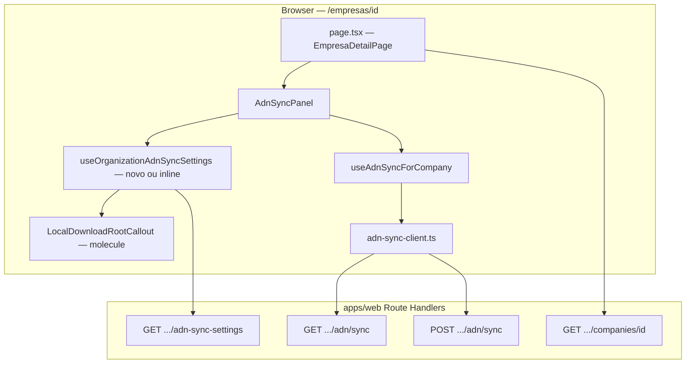

# Arquitectura técnica — Forçar busca de notas na ficha da empresa (contexto de pasta local)

**Fontes:** `docs/prd-forcar-busca-notas-ficha-empresa.md` (**FR64–FR68**, **NFR35–NFR38**, épico **BNF-01**), `docs/front-end-spec-forcar-busca-notas-ficha-empresa.md`.  
**Documentos base:** `docs/architecture.md`, `docs/architecture-empresas-monitoradas-editar-e-forcar-automacao.md`, `docs/architecture-download-automatico-xml-pdf-pasta-raiz-windows.md`, `docs/architecture-integracao-nfse-dist-adn.md` (quando aplicável).

**Normativa:** **sem** novos endpoints públicos, **sem** migrações SQL. Reutilizar **`GET`** e **`POST`** já expostos em:

- `GET /api/v1/organizations/{organizationId}/adn-sync-settings` — `localDownloadRoot`, `adnSyncEnabled`, `canManage`
- `GET`/`POST /api/v1/organizations/{organizationId}/monitored-companies/{companyId}/adn/sync` — estado do job e enfileiramento (**FR64**, inalterado no contrato)

### Change log

| Data       | Versão | Descrição |
| ---------- | ------ | --------- |
| 2026-04-24 | 1.0    | Arquitectura inicial: fluxo de dados, módulos, segurança, cache, testes, decisões ADR. |

---

## 1. Resumo executivo

| Camada | Decisão |
| ------ | -------- |
| **API** | **Nenhum** route handler novo. `localDownloadRoot` continua a ser exposto apenas por `handleGetOrganizationAdnSyncSettings` (`apps/web/src/server/api/v1/handlers/organization-adn-sync-settings.ts`). |
| **Persistência** | Coluna `organizations.local_download_root` já existente; sem alteração de schema. |
| **Cliente — sync ADN** | Manter `useAdnSyncForCompany` + `adn-sync-client.ts` como **única** implementação de `GET`/`POST` sync (**NFR35**). Renomear rótulo de botão / copy no `AdnSyncPanel` **sem** duplicar `postAdnSyncRequest`. |
| **Cliente — raiz local** | Nova leitura **`GET .../adn-sync-settings`** na ficha, keyed por `company.organizationId`, com **mesma semântica** que o Painel (`dashboard/page.tsx` já faz fetch semelhante). |
| **Factorização opcional** | Extrair hook **`useOrganizationAdnSyncSettings`** (ou nome equivalente) partilhado entre **Painel** e **`AdnSyncPanel`** para evitar duplicação de `fetch` + parsing + cancelamento — recomendado na mesma entrega ou tarefa técnica imediata. |
| **`GET /api/v1/companies/{id}`** | **Não** estender a resposta com `localDownloadRoot` no MVP (**ADR-01** abaixo). |

---

## 2. Diagrama de contexto (C4 — lógico)

**Fronteira:** autorização e multi-tenant permanecem no servidor (`getAuthedSession`, `canAccessOrganization`, `assertAdnOrgAdmin` no fluxo de sync). O cliente só envia `organizationId` e `companyId` já validados pela própria ficha (dados da empresa carregados com sucesso).

---

## 3. ADR — decisões de arquitectura

### ADR-01: Origem de `localDownloadRoot` na ficha (vs. embed em `GET company`)

- **Contexto:** o PRD pede visibilidade da raiz na secção de notas; a spec UX aponta para `GET .../adn-sync-settings`.
- **Decisão:** consumir **`GET /api/v1/organizations/{organizationId}/adn-sync-settings`** a partir da ficha.
- **Rationale:**  
  1. **Coerência** com Configurações e Painel, que já usam este recurso.  
  2. **NFR38:** o handler já restringe `organizationId` à sessão (effective org + `canAccessOrganization`).  
  3. **Separação de recursos:** `Company` mantém-se entidade fiscal; definições de org (`adnSyncEnabled`, `localDownloadRoot`) permanecem no recurso de definições ADN.  
  4. **Um round-trip extra** aceitável na montagem da ficha (ver §7); evita inflar o contrato de `GET company`.
- **Consequências:** o `AdnSyncPanel` (ou página) precisa de `organizationId` — já disponível em `company.organizationId` após `GET /api/v1/companies/{id}`.

### ADR-02: Onde colocar o fetch de settings

- **Opção A (recomendada):** hook dedicado `useOrganizationAdnSyncSettings(organizationId)` usado **dentro** de `AdnSyncPanel`, passando `company.organizationId`. Mantém a página `page.tsx` fina.  
- **Opção B:** `useEffect` inline no `AdnSyncPanel` (espelho literal do padrão do `dashboard/page.tsx`) — aceitável para MVP mínimo; **substituir** por hook partilhado na primeira refacturação para reduzir drift.  
- **Rejeitada:** fundir `localDownloadRoot` dentro de `useAdnSyncForCompany` sem separação de responsabilidades — mistura “estado do job” com “settings de org” e dificulta testes unitários.

### ADR-03: Sincronização de cache após alterar a raiz em Configurações

- O projecto **não** usa TanStack Query neste momento.  
- **Decisão:** `Cache-Control: no-store` já vem do **GET** settings; ao regressar da Configurações via navegação Next, a montagem do `AdnSyncPanel` refaz o fetch. Opcional: chamar `router.refresh()` após guardar em Configurações se no futuro a ficha permanecer montada em layout persistente.  
- **Invalidação explícita:** documentar na story se o shell do dashboard mantiver estado entre rotas.

---

## 4. Contratos HTTP (reutilizados)

### 4.1 `GET /api/v1/organizations/{organizationId}/adn-sync-settings`

| Aspecto | Detalhe |
| ------- | -------- |
| **Auth** | Sessão; org activa deve coincidir com `organizationId` (não-superadmin); superadmin com `canAccessOrganization`. |
| **Resposta 200** | `{ adnSyncEnabled: boolean, localDownloadRoot: string \| null, canManage: boolean }` — `localDownloadRoot` já normalizado no handler. |
| **Headers** | `Cache-Control: no-store` (já definido no handler). |
| **Uso na UI** | **FR65/FR66:** derivar `hasLocalRoot = typeof localDownloadRoot === "string" && localDownloadRoot.length > 0`. **FR66:** `canManage === true` pode condicionar exibição de *preview* mascarado do path (política de produto). |

### 4.2 `GET`/`POST .../monitored-companies/{companyId}/adn/sync`

Inalterados relativamente a **BNF-01**; ver `docs/architecture-empresas-monitoradas-editar-e-forcar-automacao.md` §4 e `apps/web/src/lib/adn-sync-client.ts`.

---

## 5. Módulos e ficheiros propostos

| Ficheiro | Responsabilidade |
| -------- | ---------------- |
| `apps/web/src/hooks/use-organization-adn-sync-settings.ts` (**novo**, recomendado) | `organizationId` → estado `{ data, loading, error }`; `fetch` com `credentials: "include"`, cancelamento com `AbortController` / flag `cancelled`, parsing idêntico ao Painel. Exportar tipo mínimo para o callout. |
| `apps/web/src/components/local-download-root-callout.tsx` (**novo**, opcional) | Props: `variant: "missing" \| "configured"`, `settingsHref`, `pathPreview?`, `canManage?`. Presentational; sem fetch. |
| `apps/web/src/app/(dashboard)/empresas/[id]/adn-sync-panel.tsx` | Importar hook + callout; inserir bloco **FR67** (texto) + callout **FR65/FR66**; renomear botão primário / `aria-label` / `aria-busy` (**FR68**); alargar `actionMsg` de sucesso (copy — **NFR36**). |
| `apps/web/src/hooks/use-adn-sync-for-company.ts` | Opcional: extrair string de `window.confirm` para constante partilhada se o copy for unificado com o PRD; **sem** segunda chamada `POST`. |
| `apps/web/src/app/(dashboard)/dashboard/page.tsx` | **Opcional:** migrar o `useEffect` de `adn-sync-settings` para o novo hook (reduz duplicação). |

**NFR35:** proibido criar segundo módulo que faça `POST` para `adn/sync` com lógica divergente.

---

## 6. Segurança e multi-tenant

| Risco | Mitigação |
| ----- | ---------- |
| **organizationId errado** | Usar **apenas** `company.organizationId` devolvido por `GET /api/v1/companies/{id}` após `res.ok`; nunca aceitar `organizationId` da query string neste fluxo. |
| **Enumeração cross-org** | O handler de settings já devolve **403/404** conforme acesso; o cliente trata `!res.ok` como “sem dados de raiz” **sem** assumir conteúdo sensível em logs do browser. |
| **Exposição de path** | Se a UI mascarar o path, aplicar função pura no cliente (ex.: últimos segmentos); dados completos só na API se o produto exigir — alinhar com **@qa**. |

---

## 7. Performance e rede

| Tópico | Directriz |
| ------ | ---------- |
| **Pedidos na carga da ficha** | `GET company` (existente) + `GET adn-sync-settings` (novo) + `GET adn/sync` (existente via `refresh` do hook) — **3** GETs na primeira montagem; aceitável para página de detalhe. |
| **Evitar triplicação** | O hook de sync já faz `GET` sync no mount; o hook de settings deve **não** re-disparar em cada render — dependências `[organizationId]`. |
| **Limite de concorrência** | O `adn-sync-client.ts` já limita `GET` sync concorrentes; o **GET** settings é **1** por página — não requer fila adicional. |

---

## 8. Estados da UI (mapeamento técnico)

| Estado `useAdnSyncForCompany.access` | CTA sync | Callout raiz |
| ------------------------------------ | -------- | ------------- |
| `loading` | Botões desactivados conforme actual | Opcional: skeleton ou omitir callout até `settings` carregar |
| `feature_off` | Sem CTA primário de sync | Opcional: omitir callout ou mostrar neutro (“definições ADN indisponíveis”) |
| `forbidden` | Sem permissão — paridade actual | **FR65** ainda pode mostrar-se se `GET settings` for **200** (operador vê raiz mas não dispara); se `GET settings` devolver **403**, esconder dados de raiz |
| `error` | Mensagem de erro existente | Tratar `settings` erro de rede como “indisponível” sem bloquear resto |
| `active` | **FR64** — primário “Buscar notas agora” | **FR65/FR66** conforme `localDownloadRoot` |

**Nota:** se `GET settings` falhar com **403** mas o utilizador vê a empresa, cenário raro — mostrar callout neutro sem valor de raiz.

---

## 9. Testes recomendados

| Nível | Âmbito |
| ----- | ------ |
| **Integração** | Já existe `organization-adn-sync-settings.integration.test.ts`; garantir que `localDownloadRoot` null vs string continua coberto ao alterar copy na UI (sem mudança de API). |
| **E2E / manual** | Matriz do PRD §10: raiz vazia, raiz definida, 429 no POST, leitor de ecrã no CTA. |
| **Unitário (opcional)** | Função pura `maskLocalDownloadRoot(path: string): string` se for introduzida. |

---

## 10. Rastreio PRD / NFR → esta arquitectura

| ID | Secção(ões) |
| -- | ----------- |
| **FR64** | §1, §2, §4.2, §5 |
| **FR65–FR66** | §1, §3 ADR-01, §4.1, §5, §8 |
| **FR67** | §5 (`adn-sync-panel` + dialog) |
| **FR68** | §5 (atributos ARIA no botão) |
| **NFR35** | §1, §5 |
| **NFR36–NFR37** | §4.2 (inalterado), copy na camada de UI |
| **NFR38** | §3 ADR-01, §6 |

---

## 11. Próximos passos para @dev

1. Implementar hook `useOrganizationAdnSyncSettings` (ou equivalente) com cancelamento ao desmontar.  
2. Integrar callout + copy **FR67** em `AdnSyncPanel`; ajustar botão primário e mensagens.  
3. (Opcional) Refactor do Painel para usar o mesmo hook.  
4. Validar manualmente regressão em `PATCH` empresa e fluxo ADN completo.

---

## 12. Fora de âmbito (confirmado)

- Novo `POST` “forçar-notas”.  
- Worker / espelho em disco (**FR61**) — permanecem no PRD de download automático.  
- Alteração do rate limit ou da política de `assertAdnOrgAdmin` no handler de sync.
