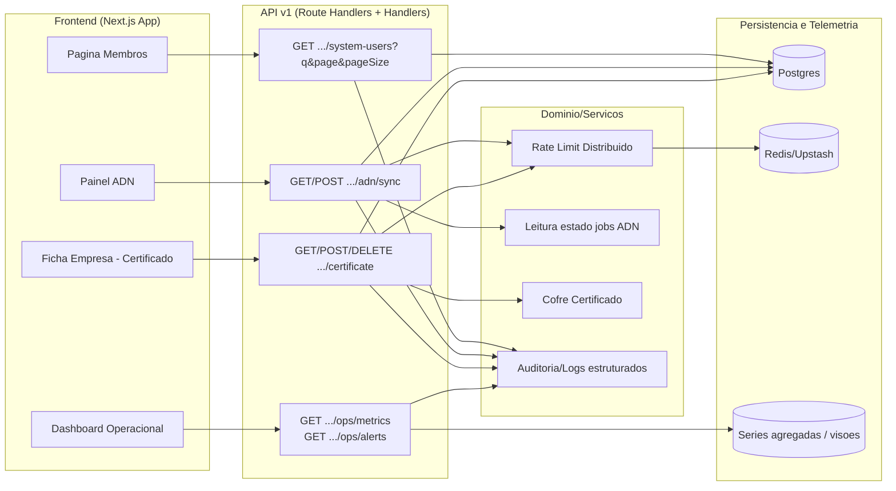

# Arquitetura técnica — Implementação das melhorias prioritárias (confiabilidade, escala e operação)

**Fontes:** `docs/prd-implementacao-melhorias-sistema.md` (FR121–FR131, NFR42–NFR49), `docs/front-end-spec-implementacao-melhorias-sistema.md`.  
**Documentos relacionados:** `docs/architecture-superadmin-cadastro-organizacoes-acesso-global.md`, `docs/architecture-membros-catalogo-utilizadores-filtro-dinamico.md`, `docs/architecture-upload-certificado-browser-edicao-empresa-monitorada.md`, `docs/architecture-integracao-nfse-dist-adn.md`.

**Change log**

| Data | Versão | Descrição | Autor |
| ---- | ------ | --------- | ----- |
| 2026-04-28 | 1.0 | Arquitetura técnica inicial do ciclo de melhorias MSYS-01..07. | Architect (Aria / AIOS) |

---

## 1. Resumo executivo

Este ciclo introduz melhorias transversais em quatro frentes:

1. **Confiabilidade de release**: integração + E2E obrigatórios em CI para fluxo superadmin.
2. **Escala de membros**: migração para busca server-side com debounce no cliente.
3. **Eficiência do ADN**: polling adaptativo e redução de chamadas redundantes.
4. **Segurança e operação**: hardening do cofre de certificado, rate limit distribuído, dashboard e alertas operacionais.

Decisão central: **evolução incremental sem breaking change de contratos públicos já consumidos** (NFR49), concentrando mudanças em comportamento interno, qualidade e observabilidade.

---

## 2. Arquitetura alvo (alto nível)



---

## 3. Domínios de mudança por épico

## 3.1 M1 — Confiabilidade de release (FR121, FR122, FR123, NFR42)

### Decisão

- tornar **integração crítica + smoke E2E** gates obrigatórios em CI para merge do incremento alvo;
- eliminar dependência de validação manual local para cenários centrais.

### Arquitetura de execução

1. Job CI `integration-superadmin` com DB real (ambiente isolado de teste).
2. Job CI `e2e-superadmin-smoke` com seed e credenciais de teste.
3. Branch protection exige ambos em estado `success`.

### Notas

- manter cenários de `201/400/401/403/409` do fluxo de criação de organização;
- incluir validação do aviso FR50 em fluxo real (sem mock de resposta).

---

## 3.2 M2 — Escala de membros (FR124, FR125, NFR43, NFR49)

### Decisão

- substituir abordagem de catálogo completo em memória por busca server-side paginada;
- manter semântica atual das mutações `.../members`.

### Contrato recomendado

**Endpoint:** `GET /api/v1/organizations/{organizationId}/system-users`

**Query:**

- `q?: string` (nome ou email, case-insensitive, trim)
- `page: number` (>= 1)
- `pageSize: number` (1..100)

**Resposta:**

```json
{
  "items": [],
  "page": 1,
  "pageSize": 50,
  "total": 0
}
```

### Estratégia de consulta

- filtro textual no servidor (`q`) com ordenação estável;
- paginação offset inicialmente (cursor como evolução);
- contagem total por query aplicada para paginação precisa.

### Frontend

- debounce 300ms no input;
- cancelar requests obsoletas (AbortController);
- reset de página ao mudar `q`;
- estado discreto `A procurar...` sem bloquear a tela inteira.

---

## 3.3 M3 — Eficiência ADN (FR126, FR127, NFR44)

### Decisão

- adotar polling adaptativo no cliente com pausa em estados terminais;
- evitar chamadas duplicadas de status/readiness/certificate concorrentes sem necessidade.

### Política de polling recomendada

| Estado do job | Intervalo |
| ------------- | --------- |
| `queued` | 4s |
| `running` (curto) | 5s |
| `running` (> 60s) | 10s |
| `running` (> 180s) | 15s |
| `succeeded/failed` | parar |

### Regras de orquestração no frontend

1. Um único loop de polling por empresa/organização ativa.
2. Suspender polling quando aba inativa por longo período (opcional recomendado).
3. Reativar sob ação explícita do usuário (`Atualizar agora`) ou foco.
4. Evitar toasts repetidos para o mesmo `jobId + status`.

### Idempotência e rastreabilidade

- manter `Idempotency-Key` no `POST .../adn/sync`;
- preservar semântica atual de `202`, `403`, `429` e mensagens operacionais.

---

## 3.4 M4 — Segurança e operação (FR128, FR129, FR130, FR131, NFR45–NFR48)

### Cofre de certificado

Decisão arquitetural:

1. manter payload de certificado fora de tabelas de negócio;
2. armazenar em cofre/objeto privado com proteção criptográfica gerenciada;
3. persistir apenas metadados operacionais e referência opaca.

### Rate limit distribuído

- migrar limitação sensível para backend compartilhado (Redis/Upstash);
- chave recomendada: `{acao}:{userId}:{organizationId}:{companyId}`;
- suportar `Retry-After` consistente entre instâncias.

### Dashboard operacional

Novos endpoints de leitura agregada (somente perfis autorizados):

- `GET /api/v1/ops/metrics?from&to&organizationId?&companyId?`
- `GET /api/v1/ops/alerts?status=active|resolved&severity?`

### Alertas

- pipeline de detecção por regras mínimas:
  - taxa de falha ADN acima do limiar;
  - aumento anômalo de `429`;
  - falha recorrente de upload de certificado.

---

## 4. Desenho de componentes (frontend)

## 4.1 Componentes novos/ajustados

| Componente | Camada | Responsabilidade |
| ---------- | ------ | ---------------- |
| `ServerSearchField` | UI | Input com debounce + estado de consulta |
| `MembersDirectoryTable` | UI | Lista paginada por query server-side |
| `AdnSyncPanel` (evolução) | UI | Polling adaptativo + status consolidado |
| `StatusBadge` | UI atom | Padronizar estados (fila, erro, sucesso, revogado) |
| `OpsKpiBoard` | UI | Cartões de KPI e tendências |
| `AlertRow` | UI | Linha de alerta com severidade e drill-down |

## 4.2 Hooks/serviços recomendados

- `useOrganizationSystemUsers(queryState)`
- `useAdnSyncStatusAdaptivePolling(params)`
- `useOpsMetrics(filters)`
- `useOpsAlerts(filters)`

Objetivo: encapsular política de rede e manter páginas finas.

---

## 5. Segurança, autorização e compliance

1. autorização server-side obrigatória para endpoints de membros, ADN, certificado e ops;
2. logs sem exposição de segredo, senha ou conteúdo de certificado;
3. payloads de erro externos sem detalhes internos de infraestrutura;
4. trilha de auditoria para eventos críticos:
   - sync solicitado;
   - upload/revogação de certificado;
   - alerta crítico criado/encerrado (quando aplicável).

---

## 6. Observabilidade e dados operacionais

## 6.1 Métricas mínimas

1. jobs ADN por estado (`queued/running/succeeded/failed`);
2. latência p95 de endpoints críticos;
3. taxa de `429` por ação;
4. sucesso/falha de upload de certificado.

## 6.2 Correlacionadores

Incluir em logs estruturados:

- `requestId`
- `organizationId`
- `companyId`
- `userId`
- `jobId` (quando houver)
- `outcome`

## 6.3 Estratégia de agregação

- leituras do dashboard devem consumir dados agregados para não sobrecarregar rotas transacionais;
- preferir consultas de janela temporal com granularidade definida (ex.: 5min/1h).

---

## 7. Estratégia de rollout

## Semana 1 (M1)

- ativar gates CI obrigatórios para integração e E2E smoke superadmin;
- validar estabilidade de ambiente de testes.

## Semana 2 (M2)

- liberar busca server-side de membros atrás de feature flag (`MEMBERS_SERVER_SEARCH_ENABLED`);
- monitorar latência e erros por endpoint.

## Semana 3 (M3)

- habilitar polling adaptativo ADN (`ADN_ADAPTIVE_POLLING_ENABLED`);
- comparar baseline de chamadas por sessão.

## Semana 4 (M4)

- ativar rate limit distribuído;
- habilitar dashboard operacional e alertas mínimos;
- finalizar hardening do fluxo de certificado.

---

## 8. Testes e validação arquitetural

### Integração

1. `system-users` com `q/page/pageSize` (200, 400, 403, 404).
2. `adn/sync` com idempotência e `429`.
3. `certificate` com falhas operacionais e limitação distribuída.
4. endpoints `ops/*` com autorização e filtros.

### E2E

1. fluxo superadmin completo (criação + acessar agora + aviso FR50);
2. membros com filtro server-side e ações por linha;
3. painel ADN com atualização estável de status.

### Não-funcional

1. medição de redução de requests ADN por sessão (meta NFR44);
2. medição p95 da listagem de membros (NFR43);
3. validação de ausência de dado sensível em logs (NFR45).

---

## 9. Riscos técnicos e mitigação

| Risco | Mitigação |
| ----- | --------- |
| Aumento de carga no `system-users` por busca server-side | Debounce, limites de página, índices e monitoramento p95 |
| Regressão de UX por polling adaptativo | Botão `Atualizar agora`, thresholds simples, rollout gradual |
| Inconsistência de rate limit entre nós | Backend distribuído único + testes de concorrência |
| Complexidade em métricas/alertas | Baseline mínimo primeiro, expansão por prioridade |
| Exposição acidental de segredos em erro/log | Sanitização central e revisão de logs em QA |

---

## 10. Rastreio PRD -> arquitetura

| Requisito | Cobertura |
| --------- | --------- |
| FR121 | §3.1, §8 |
| FR122 | §3.1, §8 |
| FR123 | §3.1 |
| FR124 | §3.2, §4 |
| FR125 | §3.2, §4 |
| FR126 | §3.3, §4 |
| FR127 | §3.3 |
| FR128 | §3.4, §5 |
| FR129 | §3.4 |
| FR130 | §3.4, §6 |
| FR131 | §3.4, §6 |
| NFR42 | §3.1 |
| NFR43 | §3.2, §8 |
| NFR44 | §3.3, §8 |
| NFR45 | §3.4, §5 |
| NFR46 | §3.4 |
| NFR47 | §6 |
| NFR48 | §3.4, §6 |
| NFR49 | §1, §3.2 |

---

## 11. Decisões pendentes (Gate Arquitetural)

1. confirmar stack de armazenamento distribuído para rate limit em produção;
2. definir fonte única de dados agregados para `ops/metrics` (consulta direta vs materialização);
3. validar política final de retenção/purga para artefatos de certificado;
4. decidir se busca de membros evolui já para cursor pagination na primeira entrega.

---

## 12. Handoff

1. `@dev` — implementar M2/M3/M4 conforme seções 3 e 4.
2. `@qa` — executar matriz da seção 8 com foco em regressão e segurança.
3. `@sm` — refletir decisões nos AC das stories MSYS-01..07.
4. `@pm` — validar decisões pendentes da seção 11 com impacto de roadmap/custo.

---

— Aria (Architect) — AIOS; arquitetura técnica baseada no PRD e na spec de UX do ciclo de melhorias.
