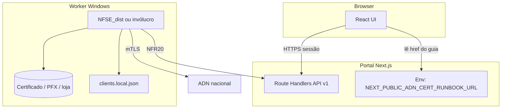
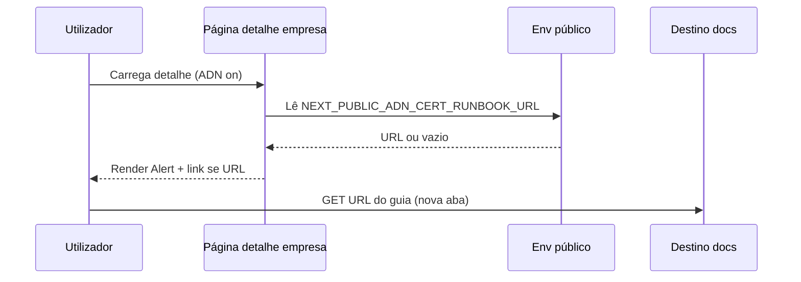

# Arquitetura técnica — Certificado e-CNPJ e guia ADN (portal + worker)

**Fontes:** `docs/prd-importacao-certificado-empresa-monitorada-adn.md` (**CE-FR1–CE-FR12**, **CE-NFR1–CE-NFR8**), `docs/front-end-spec-importacao-certificado-empresa-monitorada-adn.md`, `docs/briefing-importacao-certificado-empresa-monitorada-adn.md`.  
**Documentos irmãos:** `docs/architecture-integracao-nfse-dist-adn.md` (fluxo ingestão, **NFR19–NFR20**), `docs/prd-integracao-nfse-dist-adn.md`, `docs/qa/adn-staging-setup.md`.  
**Referência externa:** [NFSE_dist](https://github.com/RafaelOliveiraCf/NFSE_dist).

**Normativa:** o **certificado e-CNPJ** e `clients.local.json` **nunca** trafegam pelo browser nem por variáveis `NEXT_PUBLIC_*` (**CE-NFR1**). Este documento **complementa** a arquitectura ADN existente; em conflito sobre segredos, prevalece `docs/architecture-integracao-nfse-dist-adn.md` e **NFR19**.

### Change log

| Data       | Versão | Descrição |
| ---------- | ------ | ---------- |
| 2026-04-24 | 1.0    | Arquitectura inicial: limites de confiança, env do guia, worker, códigos de erro, logging, rastreio CE-* |

---

## 1. Resumo executivo

| Tópico | Decisão |
| ------ | -------- |
| **Segredo criptográfico** | Apenas no **worker** (VM Windows ou equivalente): loja Windows + thumbprint **ou** PFX em disco + `senha_cert`; sem endpoint público de upload de PFX. |
| **Portal (Next.js)** | **URL pública de ajuda** via `NEXT_PUBLIC_ADN_CERT_RUNBOOK_URL` (apenas hiperligação; conteúdo pode ser site externo, Confluence ou rota estática `same-origin`). **Nenhum** segredo nesta variável. |
| **Export JSON (FR48)** | Continua a ser **metadados públicos** (CNPJ, nome); **não** substitui nem inclui `clients.local.json`. |
| **Erros “certificado / infra”** | Preferir `error_code` estáveis em `adn_ingestion_failures` / resumo de job, mapeados às mensagens **CE-FR10** na camada API (**nunca** texto bruto do worker). |
| **Logging** | **CE-NFR5:** não registar em **INFO** thumbprint completo + CNPJ em conjunto; usar máscara ou omitir thumbprint em logs de aplicação partilhados. |
| **Repositório** | `*.pfx`, `clients.local.json` com segredos reais: **.gitignore** + revisão manual (**CE-NFR2**); exemplos versionados só com placeholders (**CE-FR12**). |

---

## 2. Limites de confiança (C4 — contentor)

- **Fronteira dura:** `UI` **não** envia nem recebe bytes de certificado; `ENV` expõe **só** um URL de documentação (público por definição do prefixo `NEXT_PUBLIC_` — aceitável porque não é segredo).  
- Se no futuro o URL de ajuda tiver de ser **privado**, migrar para **rota servidor** que redirecciona após sessão (retirar de `NEXT_PUBLIC_*`) — ver §6.

---

## 3. Portal — configuração do link do guia (**CE-FR9**)

### 3.1 Variável de ambiente recomendada

| Nome | Obrigatório | Exemplo | Notas |
| ---- | ----------- | ------- | ----- |
| `NEXT_PUBLIC_ADN_CERT_RUNBOOK_URL` | Recomendado em **staging/prod** | `https://docs.empresa.com/adn/certificado` | **HTTPS**; sem credenciais na URL; sem query strings com tokens. |

- **Semântica:** valor exposto ao bundle cliente; por isso **só** pode conter informação **já pública** (URL de manual). **CE-NFR1** mantém-se: não colocar PFX em base64, tokens HMAC, nem thumbprints nesta variável.  
- **Desenvolvimento:** ausência da variável → UI conforme UX spec: texto “ligação ainda não configurada” + **sem** `href` inválido.

### 3.2 Implementação front-end

- **Fonte única de verdade do `href`:** um helper `getAdnCertRunbookUrl(): string | null` lê `process.env.NEXT_PUBLIC_ADN_CERT_RUNBOOK_URL` em build; **Alert** e modal “Como funciona?” reutilizam o mesmo helper (evita URLs divergentes).  
- **Links externos:** `target="_blank"` + `rel="noopener noreferrer"`.  
- **Links internos:** rota opcional `apps/web/src/app/(dashboard)/ajuda/adn-certificado/page.tsx` (ou `app/ajuda/...`) que renderiza MD estático ou `redirect()` para o mesmo URL público — útil se a equipa quiser **same-origin** sem expor `NEXT_PUBLIC_*` a terceiros.

### 3.3 Modal “Como funciona?” (ADN)

- **Terceiro bullet** (UX spec): o texto “guia” partilha o **mesmo** `href` que o `Alert` de certificado (reutilizar helper).  
- **Não** introduzir fetch ao clicar no bullet; o link é estático.

---

## 4. Worker — materialização do certificado e configuração

### 4.1 Contratos de ficheiro (paridade NFSE_dist)

| Artefacto | Origem | Versionar no Git? |
| --------- | ------ | ------------------- |
| `clients.json` | Export portal (**FR48**) ou geração a partir da BD no worker | **Sim** (sem segredos) |
| `clients.local.json` | Cofre / disco seguro / pipeline de deploy | **Não** (**CE-NFR2**) |
| `certificates/<CNPJ>.pfx` | Instalação manual ou pipeline seguro | **Não** |
| Thumbprint + `cert_store` | Apenas em `clients.local.json` ou equivalente de cofre | **Não** |

**Precedência thumbprint vs PFX:** alinhada ao upstream: se existir `thumbprint` no merge por CNPJ, o cliente HTTP usa **curl/Schannel**; caso contrário **requests_pkcs12** com PFX (**CE-FR1**).

### 4.2 Geração de `clients.local.json`

- **Fora** do runtime do Next.js público. Fluxos aceitáveis:  
  1. **Pipeline de deploy** (GitHub Actions, Azure DevOps) escreve ficheiro a partir de **secrets** do fornecedor de CI;  
  2. **Operador** segue `docs/briefing-importacao-certificado-empresa-monitorada-adn.md` na VM;  
  3. **Futuro:** script que lê cofre (Key Vault) e materializa JSON — documentar em ADR separado (**CE-NFR3**).

### 4.3 Conta de serviço e loja `LocalMachine` (**CE-FR3**)

- O processo que executa o worker (Serviço Windows, `schtasks`, systemd **não** aplica em Windows nativo NFSE_dist) deve ter **acesso de leitura** à chave privada.  
- Documentar no runbook: testar com o **mesmo** utilizador que em produção; evitar “funciona no RDP admin mas falha no serviço”.

### 4.4 Backups (**CE-NFR4**)

- PFX em backup só com **cifra em repouso**; política operacional, não código do portal.

---

## 5. API e modelo de erros (**CE-FR10**)

### 5.1 Princípio

- Respostas **v1** ao browser transportam `error_code` + `message` **já sanitizada** (copy CE-FR10).  
- Campo `error_detail` em Postgres (já previsto em `adn_ingestion_failures` na arquitectura ADN) permanece **só servidor** / suporte.

### 5.2 Códigos estáveis sugeridos (extensível)

| `error_code` | Categoria interna | Mensagem UI (CE-FR10) |
| ------------- | ----------------- | --------------------- |
| `ADN_WORKER_CERT_NOT_FOUND` | Certificado não encontrado | *“Não foi possível validar o certificado…”* |
| `ADN_WORKER_CERT_CONFIG_INVALID` | PFX/senha/thumbprint | *“A configuração do certificado no servidor está incompleta…”* / *“Os dados do certificado… actualizados.”* |
| `ADN_WORKER_TLS_ENV_NOT_READY` | curl ausente / ambiente | *“O servidor de recolha não está preparado…”* |
| `ADN_WORKER_CERT_STORE_INACCESSIBLE` | Loja incorrecta | *“O certificado não está acessível ao serviço…”* |

- **Mapeamento:** implementar tabela única no servidor (`lib/adn-worker-errors.ts` ou equivalente) para evitar duplicação entre Route Handlers.  
- **Origem:** worker envia `error_code` nas chamadas internas (`PATCH job`, `commit` falho) — contrato a fechar com **NFR20** (corpo JSON + HMAC).

### 5.3 Rate limit ADN

- **Não** usar esta tabela para **429/503**; manter códigos existentes do incremento ADN (`ADN_RATE_LIMIT`, etc.) e copy **“Serviço nacional ocupado”**.

---

## 6. Evolução: URL de ajuda não pública

Se o manual interno **não** puder estar em URL pública:

1. Adicionar rota **servidor** `GET /api/v1/.../adn/cert-runbook` ou página **Server Component** que verifica sessão + papel e faz `redirect(302)` para URL assinada de curta duração **ou** serve HTML estático.  
2. Remover dependência de `NEXT_PUBLIC_*` para esse fluxo; o `Alert` passa a usar `href` gerado por acção servidor (ex.: `/ajuda/adn-certificado` com auth).  
3. Registar **ADR** quando esta evolução for necessária.

---

## 7. Logging e observabilidade (**CE-NFR5**, **NFR22**)

- **Proibido** em logs **INFO**/`console.log` em rotas públicas: `thumbprint` completo + `cnpj` na mesma linha.  
- **Permitido:** `company_id` (UUID), `organization_id`, `adn_job_id`, `error_code`.  
- **Debug local:** nível **DEBUG** atrás de flag `ADN_DEBUG_LOGS=true` com redacção (últimos 4 hex do thumbprint, se absolutamente necessário).  
- **Worker:** logs locais `execucao.log` do NFSE_dist ficam na VM; não ingerir automaticamente no portal salvo requisito futuro de observabilidade centralizada (fora do MVP deste documento).

---

## 8. Segurança — checklist de implementação

1. [ ] Nenhuma rota `POST` pública aceita multipart com PFX.  
2. [ ] `.gitignore` inclui `clients.local.json`, `**/*.pfx`, `certificates/*.pfx` nos repositórios que tocam no worker.  
3. [ ] `.env.example` documenta `NEXT_PUBLIC_ADN_CERT_RUNBOOK_URL` com exemplo **placeholder** de URL.  
4. [ ] Testes de regressão: com `adn_sync_enabled=false`, UI ADN ausente (**FR45**) — **sem** leak do URL de ajuda se produto optar por 404 total (decisão: se 404, não renderizar `Alert`; se 404 é neutro sem ADN, `Alert` só quando flag on — alinhar UX).  
5. [ ] Headers de segurança existentes (`CSP`, etc.) permitem `href` do runbook se for domínio externo (lista explícita ou `nonce` — **@dev** valida em staging).

---

## 9. Rastreio requisitos → componentes técnicos

| Requisito | Onde |
| --------- | ---- |
| **CE-FR9** | `getAdnCertRunbookUrl`, `Alert` no bloco ADN, bullet modal |
| **CE-FR10** | Mapa `error_code` → mensagem na API; opcionalmente props do bloco ADN |
| **CE-NFR1** | Ausência de rotas/inputs; revisão de PR |
| **CE-NFR2** | `.gitignore` + templates com placeholders |
| **CE-NFR5** | Padrões de logging no worker wrapper e em `apps/web` |
| **CE-FR8** | Copy próximo ao export FR48 (opcional); documentação |
| **CE-FR1–CE-FR7, CE-FR11–CE-FR12** | Principalmente `docs/briefing-*` + runbooks; sem componente runtime no portal excepto links |

---

## 10. Diagrama — sequência “utilizador abre guia”

**Nota:** não há chamada ao **portal** ao abrir `D` (excepto se `D` for same-origin).

---

## 11. Handoff

- **@dev:** helper URL, `Alert`, modal, `.env.example`, `.gitignore` se necessário, testes de snapshot a11y básicos.  
- **@data-engineer:** se novos `error_code` exigirem constraint ou enum em Postgres — avaliar `TEXT` + validação app primeiro (MVP).  
- **@qa:** matriz §8 + links externos em CSP.  
- **@pm:** aprovar lista final de `error_code` vs CE-FR10.

---

## 12. Decisões em aberto (ADR candidatas)

1. **Ajuda privada vs pública** (§6).  
2. **Cofre alvo** (Key Vault vs disco cifrado) para `clients.local.json` gerado automaticamente.  
3. **Centralização de logs** do worker para SIEM (pós-MVP).

— **Aria (Architect / AIOS)**
