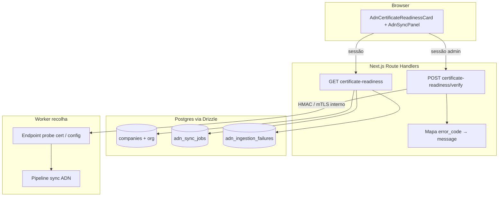
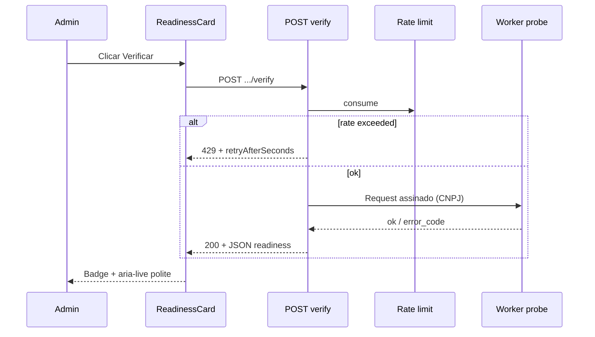

# Arquitectura técnica — Estado e verificação do certificado ADN (UIP Fase 1)

**Fontes:** [`docs/prd-instalacao-certificado-empresa-monitorada-utilizador.md`](prd-instalacao-certificado-empresa-monitorada-utilizador.md), [`docs/front-end-spec-instalacao-certificado-empresa-monitorada-utilizador.md`](front-end-spec-instalacao-certificado-empresa-monitorada-utilizador.md).  
**Documentos irmãos:** [`docs/architecture-importacao-certificado-empresa-monitorada-adn.md`](architecture-importacao-certificado-empresa-monitorada-adn.md) (**CE-NFR1**, **CE-FR10**, §5.2 códigos), [`docs/architecture-integracao-nfse-dist-adn.md`](architecture-integracao-nfse-dist-adn.md) (**NFR19**, **NFR20**).  
**Código de referência:** `apps/web/src/server/api/v1/handlers/adn-public-access.ts`, `adn-sync.ts`, `lib/adn-rate-limit.ts`, `lib/adn-worker-errors.ts`.

**Normativa:** **CE-NFR1** e **NFR19** mantêm-se na Fase 1 — **sem** upload de PFX no portal; material criptográfico apenas no worker. Este documento **não** substitui a arquitectura de certificado existente; **estende** o portal com **leitura** e **pedido de verificação** sanitizados.

### Change log

| Data       | Versão | Descrição |
| ---------- | ------ | ---------- |
| 2026-04-24 | 1.0    | Arquitectura Fase 1: rotas REST, authz, semântica de estado, integração worker (níveis), rate limit, logging, rastreio UIP-* |

---

## 1. Resumo executivo

| Tópico | Decisão |
| ------ | -------- |
| **Superfície API** | Novas rotas sob `.../monitored-companies/:companyId/adn/certificate-readiness` — **GET** (estado) e **POST …/verify** (on-demand). |
| **AuthN / AuthZ** | **GET:** mesmo *gate* que `handleGetAdnSync` via `resolveAdnPublicAccess` (sessão + org activa + `adnSyncEnabled` + empresa na org + `canAccessCompany…`). **POST verify:** exige **admin de org** (`assertAdnOrgAdmin`), alinhado ao POST de sync. |
| **Fonte de verdade do estado `pronto`** | **Nível 1 (MVP recomendado):** *probe* assinado para o worker (**NFR20**) que valida **material local** (PFX/thumbprint/config) **sem** obrigar chamada completa ao ADN nacional (evita **CE-FR7** como pré-condição de cada clique). **Nível 0 (bootstrap):** se o worker ainda não expuser o *probe*, API devolve `pendente_verificacao` com `probeAvailable: false` (opcional) ou heurística derivada de falhas recentes (**§4.3**). |
| **Erros na UI** | `error_code` estáveis reutilizando **`ADN_WORKER_*`** de `adn-worker-errors.ts` + `message` sanitizada; **nunca** `error_detail` bruto. |
| **Rate limit** | Nova chave em `adn-rate-limit` (padrão `consumeAdnRateLimit`) por `userId + organizationId + companyId` no POST **verify** (**UIP-NFR3**). |
| **Persistência opcional** | Cache de último resultado em BD (tabela dedicada ou coluna JSON em `companies`) — **opcional** na primeira entrega; ver §6. |

---

## 2. Contexto no monorepo (C4 — contentor)

- **Fronteira:** o browser **não** recebe paths, thumbprints completos nem corpo de PFX (**CE-NFR5**, **UIP-FR4**).  
- **Worker:** continua dono do segredo; o *probe* apenas devolve **enum de resultado** + `error_code` opcional.

---

## 3. Rotas HTTP (contrato v1)

### 3.1 Ficheiros sugeridos

| Método | Caminho App Router | Handler |
| ------ | ------------------- | -------- |
| `GET` | `apps/web/src/app/api/v1/organizations/[organizationId]/monitored-companies/[companyId]/adn/certificate-readiness/route.ts` | `handleGetAdnCertificateReadiness` |
| `POST` | `apps/web/src/app/api/v1/organizations/[organizationId]/monitored-companies/[companyId]/adn/certificate-readiness/verify/route.ts` | `handlePostAdnCertificateReadinessVerify` |

*Alternativa válida:* um único ficheiro `certificate-readiness/route.ts` com `GET` + `POST` onde `POST` sem subpath actua como *verify* — menos RESTful; subpath **`/verify`** deixa semântica explícita para **UIP-FR2**.

### 3.2 GET — corpo JSON (canónico)

Campos alinhados ao [spec UX §11](front-end-spec-instalacao-certificado-empresa-monitorada-utilizador.md):

| Campo | Tipo | Obrigatório | Notas |
| ----- | ---- | ----------- | ----- |
| `certificateReadiness` | `"pendente_verificacao" \| "pronto" \| "erro"` | sim | Chaves estáveis em inglês (contrato); labels PT na UI. |
| `lastCheckedAt` | `string` ISO8601 \| `null` | sim | Última verificação **bem sucedida** ou última tentativa — definir uma semântica e documentar na story. |
| `userMessage` | `string` \| `null` | não | Preenchido quando `certificateReadiness === "erro"` (copy CE-FR10). |
| `errorCode` | `string` \| `null` | não | Ex.: `ADN_WORKER_CERT_NOT_FOUND`; omitir se `pronto`. |
| `retryAfterSeconds` | `number` \| `null` | não | Reservado para respostas 429 no POST; no GET normalmente `null`. |
| `probeAvailable` | `boolean` | opcional | Se `false`, UI pode mostrar *“Verificação ainda não disponível neste ambiente”* sem quebrar **UIP-FR1**. |

**Headers:** `Cache-Control: no-store` (igual a `handleGetAdnSync`).

**Validação:** schema **Zod** partilhado (`lib/adn-certificate-readiness-schema.ts`) para resposta serializada e testes.

### 3.3 POST …/verify — comportamento

1. `resolveAdnPublicAccess` → se falhar, mesmas respostas 401/403/404 que sync.  
2. `assertAdnOrgAdmin` → 403 para não-admin (inclui superadmin sem papel admin na org, igual ao sync).  
3. `consumeAdnRateLimit({ key: adnCertVerifyRateKey(userId, orgId, companyId), … })` → se falhar, **429** com `Retry-After` (segundos) e corpo `{ message, error_code: "ADN_RATE_LIMIT", retryAfterSeconds }` (reutilizar padrão de `handlePostAdnSync`).  
4. Invocar **estratégia de verificação** (§4).  
5. Responder **200** com o **mesmo shape** do GET (espelha spec UX: *POST idempotente do ponto de vista UX*).

**Idempotência:** múltiplos POST seguidos com worker estável devolvem o mesmo estado; sem efeitos colaterais além de log/métricas.

---

## 4. Semântica de `certificateReadiness` (lógica de negócio servidor)

### 4.1 Estado `erro`

Definir `erro` quando **qualquer** fonte autoritativa reportar falha de **categoria certificado / TLS / ambiente local**, mapeável a:

- `ADN_WORKER_CERT_NOT_FOUND`  
- `ADN_WORKER_CERT_CONFIG_INVALID`  
- `ADN_WORKER_TLS_ENV_NOT_READY`  
- `ADN_WORKER_CERT_STORE_INACCESSIBLE`  

**Mensagem:** sempre via `userMessageForAdnWorkerCode` em `adn-worker-errors.ts` (ou extensão futura lista fechada). **Proibido** propagar substring `certificates/`, `.pfx`, `thumbprint=` no JSON (**testes de integração** como em `adn-api.integration.test.ts`).

### 4.2 Estado `pronto`

**Definição mínima (recomendada):** o *probe* do worker devolveu **sucesso** na janela de frescura (ex.: últimos **15 minutos**) **ou** último **job ADN** terminou em estado **sucesso** *e* o passo de ingestão não registou falha de certificado nas últimas **N** horas (heurística mais fraca — preferir *probe* para evitar falso positivo após rotação incompleta).

**Decisão de produto técnica:** documentar no PR de implementação qual critério foi adoptado; **@qa** valida matriz §8.

### 4.3 Estado `pendente_verificacao`

- Utilizador **nunca** correu POST **verify** **e** não há cache **ou**  
- Último *probe* foi **inconclusivo** / worker **indisponível** (timeout, 5xx interno) — preferir `pendente` com `userMessage` neutra em vez de `erro` para não alarmar quando é problema transitório de rede interna.

### 4.4 Integração worker — níveis

| Nível | Descrição | Quando usar |
| ----- | ----------- | ------------ |
| **0** | Sem chamada ao worker; GET devolve `pendente_verificacao`, `probeAvailable: false`. | Spike / feature flag off. |
| **1** | `POST verify` chama **HTTP interno** ao worker (URL base `ADN_WORKER_INTERNAL_BASE_URL` + path fixo, cabeçalho **HMAC** ou mTLS conforme **NFR20**). Corpo pedido: `{ cnpj: "14 dígitos" }` derivado de `companies.taxId` (ou campo canónico de CNPJ). Resposta: `{ ok: boolean, error_code?: string }`. | MVP alvo. |
| **2** | Derivação apenas de `adn_sync_jobs` / `adn_ingestion_failures` sem *probe* dedicado. | *Fallback* se worker não tiver endpoint a tempo. |

**Activar nível 1 no portal:** `ADN_WORKER_INTERNAL_BASE_URL` **e** `ADN_WORKER_HMAC_SECRET` definidos, e `ADN_CERT_PROBE_ENABLED` diferente de `false`/`0`. Só URL sem segredo **não** activa o *probe* (comportamento intencional; alinhar copy de produto se a story mencionar “URL ou flag” de forma ambígua).

**Paridade NFSE_dist:** o *probe* deve reflectir as mesmas pré-condiciones que o README upstream (ficheiros + `clients.local.json` + loja) **sem** duplicar lógica Python no Node — idealmente o **próprio** worker expõe um comando HTTP que encapsula `config.py` / verificação mínima.

---

## 5. Autorização e multi-tenant (**UIP-NFR1**)

- **organizationId** e **companyId** vêm sempre do **path**; revalidar que `companies.organization_id === organizationId` (já feito em `resolveAdnPublicAccess`).  
- **Não** aceitar `organizationId` por *query* para este recurso.  
- **Superadmin:** mesma regra que ADN sync — precisa papel **admin** na org para POST verify (`assertAdnOrgAdmin`).  
- Testes: tentativa de `GET` com empresa de **outra** org → 404/403 consistente com rotas ADN existentes.

---

## 6. Persistência e cache (opcional)

| Opção | Prós | Contras |
| ----- | ---- | ------- |
| **A — Sem BD** | Menor custo; estado sempre fresco no POST. | GET após reload não mostra “última verificação” sem novo POST. |
| **B — Tabela `adn_certificate_readiness`** | Histórico leve, `lastCheckedAt` fiável, suporte pode consultar. | Migração + RLS (se aplicável). |
| **C — Coluna JSON em `companies`** | Menos joins. | Mistura concerns fiscais com operação ADN. |

**Recomendação:** começar por **A** ou **B** conforme esforço de **@data-engineer**; se **B**, colunas mínimas: `organization_id`, `company_id`, `readiness`, `error_code`, `checked_at`, sem segredos.

---

## 7. Rate limiting (**UIP-NFR3**)

- Adicionar `adnCertVerifyRateKey(userId, organizationId, companyId)` em `adn-rate-limit.ts`, análogo a `adnPostSyncRateKey`.  
- Nova env: `ADN_CERT_VERIFY_RATE_LIMIT_PER_MIN` (default sugerido: **10** — mais frequente que sync, mas limitado).  
- Resposta 429: incluir `retryAfterSeconds` alinhado ao spec UX §6.2.

**Nota operacional:** limite em memória actual **não** é partilhado entre instâncias serverless; aceitável para MVP — documentar como débito técnico (Redis/Upstash em fase posterior).

---

## 8. Logging e observabilidade (**UIP-NFR4**, **CE-NFR5**)

| Evento | Nível | Campos permitidos |
| ------ | ----- | ------------------- |
| `cert_readiness.get` | INFO | `organization_id`, `company_id`, `readiness` |
| `cert_readiness.verify` | INFO | ids + duração ms + resultado `readiness` |
| Falha worker | WARN | ids + `error_code` — **sem** CNPJ + thumbprint na mesma linha em INFO |

**Métricas (opcional):** contador Prometheus/Vercel de verificações e taxa de `erro` por `error_code` (sem labels de alto cardinalidade).

---

## 9. Front-end (implementação)

| Peça | Responsabilidade |
| ---- | ---------------- |
| `lib/adn-certificate-readiness-client.ts` | `fetchCertificateReadiness`, `postCertificateReadinessVerify` — *fetch* com cookies, tratamento 401/403/429. |
| `hooks/use-adn-certificate-readiness.ts` | Estado local + `refresh` + `verify` + `busy`; **não** fazer poll agressivo (spec UX §9). |
| `AdnCertificateReadinessCard.tsx` | Organismo §5 do spec UX; composto dentro de `adn-sync-panel.tsx` **acima** dos CTAs de sync (reordenar conforme spec). |

**Revalidação:** após `postAdnSyncRequest` com sucesso, opcionalmente chamar `refresh()` do readiness (story).

---

## 10. Diagrama de sequência — verificação on-demand

---

## 11. Fase 2 (Trilho B) — nota arquitectural

**Gate:** ADR + emenda **CE-NFR1** no PRD UIP. Até lá, **não** implementar `multipart` em Route Handlers públicos.

Direcção esperada:

- `POST …/certificate` com streaming para **object storage** privado **ou** upload directo para cofre com URL pré-assinada gerada **server-side**.  
- Fila assíncrona para validação de cadeia e match CNPJ (**UIP-FR7**).  
- **Fora** do escopo deste documento até aprovação.

---

## 12. Rastreio requisitos → componentes

| Requisito | Onde |
| --------- | ---- |
| **UIP-FR1** | GET handler + componente badge |
| **UIP-FR2** | POST verify + hook |
| **UIP-FR3** | Reutilizar `getAdnCertRunbookUrl` no card |
| **UIP-FR4** | `userMessage` + `errorCode` + testes ausência de leaks |
| **UIP-FR5** | Não alterar handler de export FR48 |
| **UIP-NFR1** | `resolveAdnPublicAccess` + testes |
| **UIP-NFR3** | `adn-rate-limit` + 429 |
| **UIP-NFR4** | Logging §8 |

---

## 13. Checklist de implementação (@dev)

1. [ ] Rotas GET/POST com Zod de entrada (path UUIDs) e saída.  
2. [ ] Reutilizar `resolveAdnPublicAccess` / `assertAdnOrgAdmin` sem duplicar regras de org.  
3. [ ] Integração worker atrás de **feature flag** `ADN_CERT_PROBE_ENABLED` (nome indicativo).  
4. [ ] Testes de integração: 403 user não-admin no POST; 429; corpo sem paths sensíveis.  
5. [ ] `.env.example`: documentar URL interna worker + limite de taxa.  
6. [ ] Actualizar **§9** de [`architecture-importacao-certificado-empresa-monitorada-adn.md`](architecture-importacao-certificado-empresa-monitorada-adn.md) com link para este doc quando *probe* existir (PR separado opcional).

---

## 14. Decisões em aberto (ADR / story)

1. Critério exacto de `pronto` (**§4.2**): só *probe* vs. mistura com último job.  
2. TTL de frescura do resultado em cache (**§6**).  
3. Timeout do *probe* para o worker (ex.: **5 s**) e comportamento em timeout → `pendente_verificacao` vs `erro`.  
4. Expor `cnpj` mascarado na API pública ou apenas no servidor (preferível **não** devolver CNPJ completo no JSON se não for necessário para a UI).

---

— **Aria (Architect / AIOS)** — Fase 1 UIP; extensão da arquitectura ADN/certificado existente.
