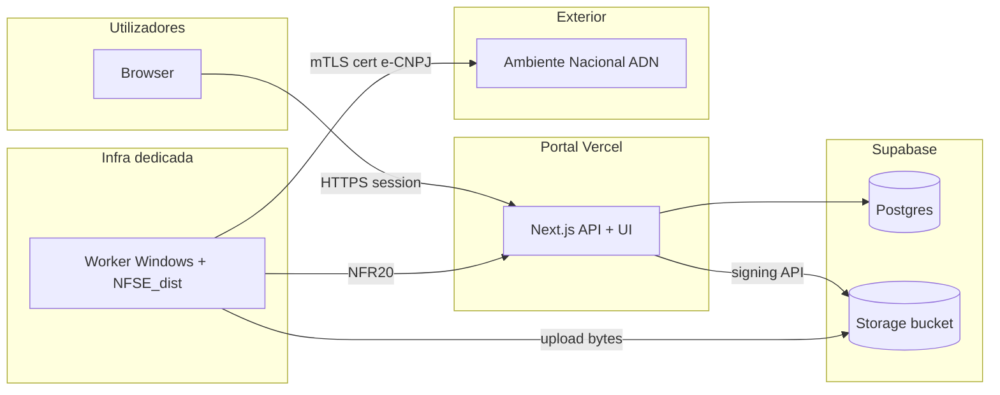
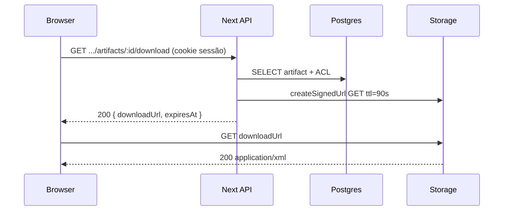

# Arquitetura técnica — Integração ADN (NFS-e / worker + portal)

**Fontes:** `docs/prd-integracao-nfse-dist-adn.md` (**FR41–FR48**, **NFR19–NFR23**), `docs/front-end-spec-integracao-nfse-dist-adn.md`, `docs/briefing-integracao-nfse-dist-adn.md`.  
**Documentos base:** `docs/architecture.md`, `docs/architecture-dois-niveis-organizacao-vs-empresas-fiscais.md`, `docs/architecture-supabase-fe-be.md`.  
**Referência externa:** [NFSE_dist](https://github.com/RafaelOliveiraCf/NFSE_dist) (Windows, `curl`/Schannel, `clients.json`).

**Normativa:** o **browser** nunca contacta o ADN nem vê certificados; o **worker** (processo fora do runtime serverless do Next.js) executa a recolha; o **portal** persiste metadados, emite URLs assinadas e aplica ACL por **organização** + **empresa monitorada**. Conflitos com `docs/architecture.md` sobre “File Storage N/A MVP” **resolvem-se a favor deste incremento** para o âmbito ADN: **object storage** passa a ser componente permitido quando a funcionalidade ADN estiver activa.

---

## 1. Resumo executivo

| Camada | Decisão |
| ------ | -------- |
| **Runtime ADN** | **Worker dedicado** (VM Windows na fase 1) que embala ou invoca a lógica tipo **NFSE_dist**; sem executar downloads ADN dentro de **Vercel Server Functions** de duração curta nem no browser. |
| **Portal (Next.js)** | **Route Handlers** em `apps/web` expõem API **v1** para UI (sessão Better Auth) e namespace **`/api/internal/v1/adn/*`** para ingestão **máquina-a-máquina** (**NFR20**). |
| **Persistência** | **PostgreSQL** (Supabase): jobs, artefactos (metadados + ponteiro para blob), falhas reprocessáveis; **Supabase Storage** (ou S3 compatível via mesmo padrão) para bytes XML/PDF. |
| **Multi-tenant** | Toda linha com `organization_id` + `company_id` (empresa monitorada = `companies.id`); invariantes alinhados a **FR36–FR37**. |
| **Feature flag** | Coluna em `organizations` ou tabela `organization_features`; verificada **no primeiro middleware de handler** antes de qualquer corpo (**FR45**). |
| **Download** | **URL assinada** gerada **no servidor** sob pedido autenticado (`GET …/download` devolve `{ url, expiresAt }` ou redirect 302 temporário) — **FR44**, **NFR19**. |
| **Observabilidade** | Métricas e logs com `organization_id`, `company_id`, `adn_job_id`, `worker_instance_id` (opcional); contadores `adn_http_429_total` por job (**NFR22**). |

---

## 2. Vista de sistema (C4 — contexto)

**Fluxo de ingestão (preferido — upload directo a Storage):**

1. Worker pede ao portal **`POST /api/internal/v1/adn/uploads:prepare`** (HMAC) com `organizationId`, `companyId`, `contentType`, `sha256`, `accessKey` (44 chars).  
2. Portal valida credencial de worker, flag ADN, existência da `company` na org; devolve **URL assinada de upload** (PUT) + `artifactDraftId`.  
3. Worker faz **PUT** do ficheiro para Storage no path acordado.  
4. Worker chama **`POST /api/internal/v1/adn/artifacts:commit`** com `artifactDraftId`, metadados finais; portal fecha transacção, marca job, idempotência por `(company_id, access_key, kind)`.

**Fluxo alternativo (MVP rápido):** `POST` multipart para rota interna com limite de tamanho e streaming para Storage — mais carga no Node; documentar limite (ex.: 15 MB) e migrar para presigned.

---

## 3. Modelo de dados (PostgreSQL)

Nomes físicos sugeridos; **@data-engineer** ajusta tipos e migrações em `db/migrations/`.

### 3.1 Feature flag (**FR45**)

| Opção | Descrição |
| ----- | ---------- |
| **A (recomendada)** | `organizations.adn_sync_enabled BOOLEAN NOT NULL DEFAULT false`. |
| **B** | Tabela `organization_feature_toggles (organization_id, feature_key, enabled)` — útil se muitas flags. |

### 3.2 `adn_sync_jobs` (**FR41**)

| Coluna | Tipo | Notas |
| ------ | ---- | ----- |
| `id` | `UUID PK` | |
| `organization_id` | `UUID NOT NULL` | FK `organizations`. |
| `company_id` | `UUID NOT NULL` | FK `companies` (empresa monitorada). |
| `status` | `TEXT` ou `ENUM` | `scheduled`, `running`, `completed`, `partial`, `failed`. |
| `trigger` | `TEXT` | `manual`, `scheduled`, `retry`, `worker`. |
| `requested_by_user_id` | `TEXT NULL` | Se disparo manual (**FR47**). |
| `idempotency_key` | `TEXT NULL` | Cabeçalho cliente para evitar duplicar jobs. |
| `started_at` / `completed_at` | `TIMESTAMPTZ NULL` | |
| `summary_json` | `JSONB NULL` | Contagens, mensagem amigável para UI (**FR42**). |
| `worker_correlation_id` | `TEXT NULL` | ID devolvido pelo worker para suporte. |
| `http_429_count` / `http_503_count` | `INT DEFAULT 0` | **NFR22**. |

**Índices:** `(company_id, completed_at DESC)`, `(organization_id, status)`, parcial único opcional para “um `running` por company” se política de produto o exigir.

### 3.3 `adn_artifacts` (**FR43**, idempotência)

| Coluna | Tipo | Notas |
| ------ | ---- | ----- |
| `id` | `UUID PK` | |
| `organization_id` / `company_id` | `UUID NOT NULL` | Denormalizados para RLS e listagens. |
| `adn_sync_job_id` | `UUID NULL` | Job que produziu o artefacto. |
| `access_key` | `CHAR(44) NOT NULL` | Chave de acesso NFS-e; **nunca** logar em claro em pipelines de app log. |
| `access_key_prefix` / `access_key_suffix` | `TEXT` | Opcional para listagens sem expor chave completa na API — ou derivar só na resposta HTTP. |
| `kind` | `TEXT CHECK` | `xml`, `pdf`. |
| `content_sha256` | `BYTEA` ou `CHAR(64)` | Idempotência com `access_key` + `kind`. |
| `storage_bucket` | `TEXT NOT NULL` | |
| `storage_object_key` | `TEXT NOT NULL` | Path canónico (ver §5). |
| `content_type` | `TEXT` | `application/xml`, `application/pdf`. |
| `issued_at` | `TIMESTAMPTZ` | Data emissão NF (domínio fiscal). |
| `byte_size` | `BIGINT` | |
| `created_at` | `TIMESTAMPTZ` | |

**Constraint:** `UNIQUE (company_id, access_key, kind)` (ou incluir `organization_id` redundante para índice).

### 3.4 `adn_ingestion_failures` (**FR46**)

| Coluna | Tipo | Notas |
| ------ | ---- | ----- |
| `id` | `UUID PK` | |
| `organization_id` / `company_id` | `UUID NOT NULL` | |
| `adn_sync_job_id` | `UUID NULL` | |
| `access_key` | `CHAR(44) NULL` | Se falha por documento. |
| `kind` | `TEXT` | `xml` / `pdf`. |
| `attempted_at` | `TIMESTAMPTZ` | |
| `error_code` | `TEXT NOT NULL` | Valor estável para mapeamento UI (`ADN_RATE_LIMIT`, `STORAGE_COMMIT_FAILED`, …). |
| `error_detail` | `TEXT NULL` | **Só** para operadores; não expor ao browser; pode ser `NULL` em produção. |
| `can_retry` | `BOOLEAN NOT NULL DEFAULT true` | |
| `resolved_at` | `TIMESTAMPTZ NULL` | Após sucesso ou descarte. |

---

## 4. Supabase Storage (**FR44**, **NFR23**)

### 4.1 Bucket e paths

- **Bucket privado** (ex.: `adn-artifacts`), **sem** leitura pública.  
- **Path canónico:** `org/{organization_id}/company/{company_id}/{access_key}/{kind}.{ext}`  
  - Benefícios: isolamento visual em suporte, políticas RLS Storage alinhadas a prefixo (se usar políticas por JWT — hoje o portal pode usar **service role só no servidor** para assinar, evitando expor Storage ao browser).

### 4.2 Acesso

- **Upload:** worker com URL assinada (PUT) ou servidor com **Services Role** em memória apenas no handler interno.  
- **Download utilizador:** sempre **`GET /api/v1/organizations/:orgId/monitored-companies/:companyId/adn/artifacts/:id/download`** → valida sessão + papel + flag → gera **GET assinado** curto (ex.: 60–120 s) → cliente faz fetch ao URL ou abre nova janela.

---

## 5. API HTTP

### 5.1 Convenções existentes

Prolongar o padrão actual: `apps/web/src/app/api/v1/organizations/[organizationId]/monitored-companies/[companyId]/...`

Todas as rotas abaixo exigem **sessão** + **organização activa** coerente com `:organizationId` (igual às rotas actuais de empresas monitoradas), salvo indicação.

### 5.2 Rotas utilizador (UI)

| Método | Rota (proposta) | Finalidade | FR |
| ------ | ----------------- | ---------- | --- |
| `GET` | `.../adn/sync` | Último job + resumo para badge (**polling** 5–15 s quando `running`). | **FR41–FR42** |
| `POST` | `.../adn/sync` | Enfileira job manual (Admin); body opcional `{ dateFrom, dateTo, idempotencyKey }`. | **FR41** |
| `GET` | `.../adn/artifacts?issuedFrom=&issuedTo=&cursor=` | Lista paginada; resposta **sem** `storage_object_key`; `accessKeyMasked`. | **FR43** |
| `GET` | `.../adn/artifacts/:artifactId/download` | Resposta JSON `{ downloadUrl, expiresAt }` ou 302 — política única por implementação. | **FR44** |
| `GET` | `.../adn/failures?status=open` | Lista falhas com `userMessage` já mapeado. | **FR46** |
| `POST` | `.../adn/failures/:failureId/retry` | Reenfileira reprocessamento (Admin). | **FR46** |
| `POST` | `.../adn/failures:retry-bulk` | Body `{ failureIds: UUID[] }` com limite (ex.: 50). | **FR46** |
| `GET` | `.../adn/automation-export.json` | **FR48** — mesmo contrato que UI “Lista para automação”; `Content-Disposition: attachment`. | **FR48** |

**FR45:** se `adn_sync_enabled = false` para a org, devolver **404** (preferência UX) em todas as rotas acima, sem corpo que revele existência de recurso.

### 5.3 Rotas internas (worker) — **NFR20**

Prefixo sugerido: `/api/internal/v1/adn/...` **não** documentado em OpenAPI pública; protegido por:

1. **HMAC-SHA256** do corpo com `ADN_WORKER_HMAC_SECRET` (timestamp + tolerância de desvio ±5 min), **ou**  
2. **mTLS** com certificado de cliente emitido pela vossa PKI interna (Cloudflare Tunnel / private link).

**Handlers:** Node runtime **sem** edge para assinatura criptográfica estável; timeout elevado só onde necessário.

| Método | Rota (proposta) | Finalidade |
| ------ | ----------------- | ---------- |
| `POST` | `/api/internal/v1/adn/uploads:prepare` | Presigned PUT. |
| `POST` | `/api/internal/v1/adn/artifacts:commit` | Fecha metadados pós-upload. |
| `PATCH` | `/api/internal/v1/adn/jobs/:jobId` | Actualiza `status`, contagens, `summary_json`. |
| `POST` | `/api/internal/v1/adn/jobs` | Opcional: worker pede criação de job `scheduled` antes de iniciar. |

**Rate limiting:** middleware dedicado por IP do worker + por `organizationId` no corpo (**NFR21**).

---

## 6. Autorização (ACL)

| Acção | `org_role=user` | `org_role=admin` | `superadmin` |
| ----- | --------------- | ------------------ | ------------ |
| `GET` sync / artifacts / failures | Sim, se membro da org e empresa acessível | Sim | Sim, dentro da vista de plataforma já definida |
| `POST` sync / retry | Não | Sim | Conforme política existente (preferência: **só** com papel admin na org) |
| `GET` automation-export | Não | Sim | Sim |

Reutilizar helpers em `apps/web/src/server/api/v1/lib/` (ex.: `effective-company-role`, `active-org`) — **não** duplicar matriz de autorização.

---

## 7. Mapeamento de erros → UI (**NFR21**)

Implementar tabela estática **servidor → cliente**:

| `error_code` | HTTP | `userMessage` (pt) |
| ------------- | ---- | ------------------ |
| `ADN_RATE_LIMIT` | 429 | *Serviço nacional ocupado. Tente mais tarde.* |
| `ADN_UNAVAILABLE` | 503 | *Serviço nacional temporariamente indisponível.* |
| `ARTIFACT_NOT_READY` | 409 | *Documento ainda a processar.* |
| `DOWNLOAD_URL_EXPIRED` | 410 | *Ligação expirada. Gere novo download.* |
| `RETRY_NOT_ALLOWED` | 403 | *Não é possível reprocessar este item.* |

A API pública **nunca** devolve `error_detail` de Postgres ou stack.

---

## 8. Auditoria (**FR47**)

Eventos append-only (tabela existente ou extensão alinhada a `audit_events`):

- `adn_sync_requested` — `actor_user_id`, `organization_id`, `company_id`, `adn_sync_job_id`.  
- `adn_sync_completed` / `adn_sync_failed` — incluir contagens.  
- `adn_artifact_downloaded` — `actor_user_id`, `artifact_id`, **sem** URL assinada no payload.

---

## 9. Worker (fora do repo ou submódulo)

### 9.1 Responsabilidades

- Obter lista de CNPJs: **`GET`** API com credencial HMAC (export **FR48**) ou ficheiro gerado offline.  
- Para cada `company_id` elegível: executar download ADN (código **NFSE_dist** ou fork).  
- Respeitar `NFSE_DIST_PDF_*` na fase PDF; MVP pode **desactivar** PDF.  
- Chamar rotas internas do portal em **retry com backoff** se 429/503 do **portal** (distinto do ADN).

### 9.2 Segredos do worker

Variáveis **só** no ambiente da VM: `ADN_WORKER_HMAC_SECRET`, caminhos de certificado, credenciais Storage se não usar exclusivamente presigned do portal.

---

## 10. Front-end (implementação)

- **Local:** secção no detalhe da empresa monitorada — `apps/web/src/app/(dashboard)/empresas/[id]/` (ou rota `organizations/...` quando existir).  
- **Dados:** TanStack Query com chaves do **spec UX**; **polling** apenas quando `status === 'running'` para limitar carga (**NFR21** indirectamente).  
- **Feature flag:** `GET /api/v1/session/...` ou payload da org deve incluir `adnSyncEnabled` para a UI **não** montar rotas (evitar flash).

---

## 11. Diagrama de sequência — download utilizador

---

## 12. Testes de integração (mínimos)

1. **ACL:** utilizador org B não acede `.../organizations/A/.../adn/*` (**403/404**).  
2. **Flag off:** rotas ADN devolvem **404** para org sem flag.  
3. **Idempotência:** dois `commit` com mesmo `(company_id, access_key, kind)` não duplicam linha.  
4. **Worker:** request sem HMAC válido → **401**; com segredo errado → **403** conforme política.

---

## 13. Fora deste documento (delegação)

- **DDL final, índices parciais, RLS em Postgres** se política for “JWT direto ao PostgREST” — hoje o desenho assume **Drizzle no servidor**; RLS Storage nativa fica para **@data-engineer** se migrarem a padrão híbrido.  
- **Dimensionamento** da VM Windows e networking (VPN, IP fixo para allowlist).

---

## 14. Referências cruzadas

| Documento | Secção relevante |
| --------- | ----------------- |
| `docs/architecture.md` | Monorepo, BFF, observabilidade |
| `docs/architecture-dois-niveis-organizacao-vs-empresas-fiscais.md` | `organizations`, `companies`, jobs |
| `docs/architecture-importacao-certificado-empresa-monitorada-adn.md` | Guia ADN no portal, env `NEXT_PUBLIC_ADN_CERT_RUNBOOK_URL`, worker + `clients.local.json`, `error_code` certificado (**CE-FR10**) |
| `docs/front-end-spec-integracao-nfse-dist-adn.md` | Polling, modais, query keys |
| `docs/architecture-cenario-b-adn-playwright-extensao-chrome.md` | Motor opcional de descarga (Playwright + extensão no worker); `summary_json` estendido; contrato HMAC inalterado |

---

**Change log**

| Data       | Versão | Descrição |
| ---------- | ------ | ---------- |
| 2026-04-30 | 1.1    | Referência à arquitectura **motor cenário B** (`architecture-cenario-b-adn-playwright-extensao-chrome.md`). |
| 2026-04-22 | 1.0    | Arquitetura inicial: sistema, dados, API, Storage, segurança worker, testes. |

— **Aria (Architect) / AIOS**
