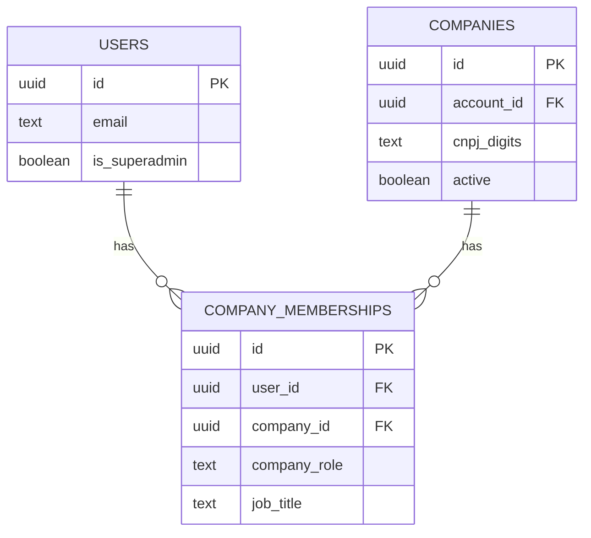
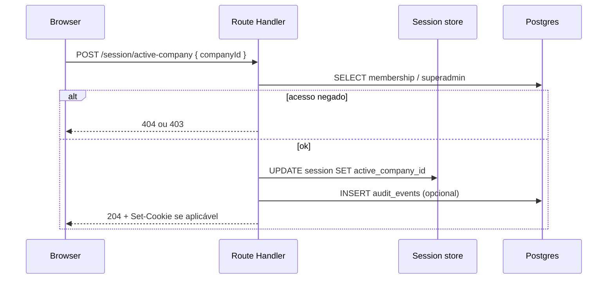

# Arquitetura técnica — Incremento: login, empresas ativas e papéis (Superadmin / Admin / User)

**Fontes:** `docs/prd-atualizacao-login-empresas-roles.md` (FR19–FR32, NFR11–NFR14), `docs/front-end-spec-login-empresas-roles.md`.  
**Documento base:** `docs/architecture.md` (**v0.2+**). Este ficheiro **estende** autenticação/autorização e o modelo de dados; em conflito com a secção histórica “filtra por `account_id`”, **prevalece este incremento** após adoção.

---

## 1. Resumo executivo

O portal deixa de tratar o **utilizador** como dono único implícito de todas as empresas (`account_id = user.id`) e passa a um modelo **multi-tenant por empresa** com:

- **Memberships** (`user` ↔ `company`) com papel `company_role ∈ { user, admin }`.
- **Superadmin** global (`users.is_superadmin`).
- **Empresa ativa** na sessão (`active_company_id`) obrigatória para mutações e leituras de domínio (exceto rotas públicas, auth e picker).
- **Autorização sempre no servidor** (handlers + serviços de domínio); UI consome capacidades já calculadas (**NFR11**).

Stack mantém-se alinhada a `docs/architecture.md`: **Next.js (App Router)**, **PostgreSQL**, **Redis (Upstash)** para rate limit, **Auth.js ou Better Auth** (escolha já prevista) com extensão de sessão.

---

## 2. Mudança de modelo mental

| Antes (doc. arquitetura v0.1) | Depois (incremento) |
| ------------------------------ | --------------------- |
| `Company.account_id = user.id` como critério principal de isolamento | Isolamento por **`company_id`** + verificação de **membership** (ou superadmin para listagem global). |
| Sessão sem contexto de empresa | Sessão com **`active_company_id`** (nullable até picker ou atalho 1 empresa). |
| UI mock / `localStorage` | Cookie de sessão HttpOnly + CSRF conforme biblioteca de auth. |

**`companies.account_id` (legado):** pode manter-se como **auditoria** (“conta que criou o registo”) ou chave de faturação futura; **não** substitui membership para **autorização**. Novas APIs **não** devem filtrar apenas por `account_id` sem validar membership (exceto migrações pontuais documentadas).

---

## 3. Modelo de dados (PostgreSQL)

### 3.1 Alterações em `users`

| Coluna | Tipo | Notas |
| ------ | ---- | ----- |
| `is_superadmin` | `BOOLEAN NOT NULL DEFAULT FALSE` | **FR21**; alterações apenas via script/Admin plataforma. |
| `password_hash` | `TEXT` | Se ainda não existir no schema real (Auth.js adapter). |
| `email_verified_at` | `TIMESTAMPTZ NULL` | Opcional MVP. |

Índice: parcial opcional `WHERE is_superadmin` para relatórios operacionais.

### 3.2 Nova tabela `company_memberships`

| Coluna | Tipo | Notas |
| ------ | ---- | ----- |
| `id` | `UUID PK` | |
| `company_id` | `UUID NOT NULL REFERENCES companies(id) ON DELETE CASCADE` | |
| `user_id` | `UUID NOT NULL REFERENCES users(id) ON DELETE CASCADE` | |
| `company_role` | `TEXT NOT NULL CHECK (company_role IN ('user','admin'))` | **FR20**; enum Postgres preferível. |
| `job_title` | `TEXT NULL` | Cargo UI. |
| `department` | `TEXT NULL` | |
| `phone` | `TEXT NULL` | |
| `created_at` / `updated_at` | `TIMESTAMPTZ` | |

**Constraints:** `UNIQUE (user_id, company_id)`.  
**Índices:** `(company_id)`, `(user_id)`, `(company_id, company_role)` para listagens e guards.

### 3.3 Sessão — `active_company_id`

**Opção A (recomendada MVP):** campo na tabela de sessão do Auth adapter (`Session.activeCompanyId` + coluna `active_company_id UUID NULL REFERENCES companies(id)`), atualizado via **mutation dedicada** `POST /api/v1/session/active-company` após validação de acesso.

**Opção B:** JWT custom claim curto (ex.: 15 min) com `active_company_id` — exige refresh ao trocar empresa; maior complexidade.

**Regra:** `active_company_id` **NULL** permitido só em rotas de **picker**, **logout** e **onboarding**; rotas de workspace exigem valor válido **ou** redirecionam para `/empresas` (UX spec).

### 3.4 Auditoria (**FR32**)

Tabela `audit_events` (append-only lógico):

| Coluna | Tipo |
| ------ | ---- |
| `id` | UUID |
| `occurred_at` | TIMESTAMPTZ default now() |
| `actor_user_id` | UUID NOT NULL |
| `target_user_id` | UUID NULL |
| `company_id` | UUID NULL |
| `event_type` | TEXT — `superadmin_access_company`, `membership_created`, `membership_removed`, `membership_role_changed`, `active_company_set` |
| `metadata` | `JSONB` — diff seguro (sem PII sensível extra se política o proibir) |

Índice `(company_id, occurred_at)`, `(actor_user_id, occurred_at)`.

---

## 4. Matriz de autorização (servidor)

Funções de política sugeridas (implementação em `lib/authz/` ou serviço injectável):

```text
isSuperadmin(user) → users.is_superadmin

hasMembership(userId, companyId) → EXISTS company_memberships

companyRole(userId, companyId) → company_memberships.company_role | null

canListCompany(user, companyId)
  → isSuperadmin(user) OR hasMembership(userId, companyId)

canManageUsers(user, companyId)
  → companyRole(userId, companyId) = 'admin' OR isSuperadmin(user)

canMutateCompanyBusinessData(user, companyId)  // CNPJ, código sistema, jobs, etc.
  → companyRole(userId, companyId) = 'admin' OR (isSuperadmin(user) AND policy 'support' futura)
  → MVP: EXIGE company_role = 'admin' (alinhado PRD — Superadmin sem membership não muta dados fiscais)
```

**Listagem de empresas acessíveis (FR22):**

- Se `isSuperadmin`: `SELECT` todas as companies (com paginação + `q` em nome/CNPJ).
- Caso contrário: `JOIN company_memberships` onde `user_id = session.user.id`.

**Contagem de membros:** `COUNT(*)` por `company_id` em `company_memberships` (materializada em cache opcional pós-MVP).

---

## 5. Política HTTP **403** vs **404** (**FR31**)

| Cenário | Código | Corpo |
| ------- | ------ | ----- |
| Utilizador autenticado, empresa existe, **sem** membership nem superadmin | **404** | Mensagem genérica (“Não encontrado”) — reduz enumeração de IDs. |
| Utilizador autenticado, **sem** papel para ação (ex.: User em `DELETE /members`) | **403** | “Sem permissão para esta ação.” |
| Não autenticado | **401** | Redirect login (`?next=`). |

Configurável por ambiente: em **dev** pode usar 403 sempre para depuração.

---

## 6. API REST (v1) — esboço

Prefixo: `/api/v1` (ou Route Handlers equivalentes). Todas as rotas abaixo exigem sessão salvo indicação.

| Método | Rota | Descrição |
| ------ | ---- | --------- |
| `GET` | `/me` | `{ user, isSuperadmin, activeCompanyId, membershipsSummary? }` |
| `POST` | `/session/active-company` | Body `{ companyId }`; valida acesso; grava sessão; **auditoria** opcional `active_company_set`. |
| `GET` | `/companies/accessible` | Query `q`, `page`, `pageSize`; lista **CompanySummary** com flags `canOpenCompanyAdmin`, `canManageUsers` calculadas no servidor (FR22, FR25). |
| `GET` | `/companies/:companyId/members` | Query `q`; paginação; exige **canManageUsers**. |
| `POST` | `/companies/:companyId/members` | Criar membership (vincular ou criar user — ver corpo discriminado); exige **canManageUsers**. |
| `PATCH` | `/companies/:companyId/members/:userId` | Atualizar role/cargo/dept/telefone; exige **canManageUsers**; impedir auto-remover último admin sem transferência (regra produto a fechar). |
| `DELETE` | `/companies/:companyId/members/:userId` | Remover vínculo apenas (FR30); exige **canManageUsers**; não permitir a User alvo remover a si próprio se for único admin (regra). |

**FR27 / FR28:** corpo `POST /members` pode ser `mode: 'link' | 'create'` com campos validados por Zod em `packages/shared`.

**Erros:** JSON `{ "error": { "code", "message" } }`; **400** validação; **401/403/404** conforme secção 5.

---

## 7. Next.js — routing e middleware

### 7.1 Segmentos sugeridos (alinhamento UX)

| Caminho | Middleware / guard |
| ------- | ------------------- |
| `/login`, `/registo`, `/recuperar` | Público; se sessão válida → redirect para fluxo pós-login. |
| `/empresas` (picker) | Autenticado; **não** exige `active_company_id`. |
| `(dashboard)/**` | Autenticado + **exige** `active_company_id` válido **exceto** rotas explicitamente allowlist (ex.: `/empresas`, `/conta`). |
| `/empresas/[id]/usuarios` | Autenticado + `canManageUsers(session.user, id)` no **layout server** ou RSC; falha → 403 page. |

### 7.2 Middleware (`middleware.ts`)

- Validar cookie de sessão (delegado à lib de auth).
- Não resolver DB pesado no edge se limitar cold start; **mínimo:** presença de sessão + redirect; **refino:** cookie assinado auxiliar `active_company` espelhado (opcional).

### 7.3 TanStack Query

Chaves incluir `['company', activeCompanyId, ...]`; em `POST /session/active-company` com sucesso, **`queryClient.invalidateQueries()`** global nas chaves de domínio (front-end spec).

---

## 8. Segurança e NFRs

| ID | Implementação |
| -- | ------------- |
| **NFR11** | Cada Route Handler chama `assertCanManageUsers` / `assertCanMutateBusiness` antes do serviço. |
| **NFR14** | **Upstash Ratelimit** (ou equivalente): chave `ip:login`, `userId:members-search`; limites orientadores: login 10/min/IP; search members 30/min/user. |
| **NFR4** | Inserção em `audit_events` em transação com mutação de membership quando `isSuperadmin` ou mudança de `company_role`. |
| **FR19** | Sem tokens de API em `localStorage` para auth; preferir cookie **HttpOnly** + **SameSite=Lax** (ajustar `Strict` se todo o fluxo same-site). |

**Criação de empresa (Epic 2 / PRD):** após `INSERT companies`, **`INSERT company_memberships`** com `company_role = 'admin'` para o `user_id` criador (ou política Superadmin documentada).

---

## 9. Integração com jobs e agente

- `DownloadCommandV1.companyId` (já no contrato) deve corresponder a empresa onde o **utilizador do device** tem permissão de operação; validação no worker ao despachar: membership `admin` **ou** regra de device ligada à conta com membership na empresa.
- Superadmin **sem** admin na empresa **não** deve receber comandos de mutação de coleta para essa empresa (MVP).

---

## 10. Diagramas

### 10.1 Entidade-relação (simplificado)



### 10.2 Definir empresa ativa



---

## 11. Migração brownfield (mock → real)

1. Introduzir tabelas `company_memberships`, colunas em `users`, `sessions.active_company_id`.
2. Script de backfill: para cada `company` com `account_id = u`, criar membership `(u, company, admin)`.
3. Remover dependência de `PortalProvider` para **autorização**; manter só UI temporária até auth estar estável.
4. Feature flag `NEXT_PUBLIC_USE_REAL_AUTH` opcional para rollout.

---

## 12. OpenAPI e testes

- Gerar ou manter `openapi.yaml` com os endpoints da secção 6.
- Testes de integração: matriz **user A / empresa B** → 404; **admin** → 200; **superadmin** listagem global.

---

## 13. Rastreio PRD → arquitetura

| FR | Onde |
| -- | ---- |
| FR19–FR21 | Sec. 3, 7, 8 |
| FR22–FR25 | Sec. 4, 6, 7 |
| FR26–FR30 | Sec. 6, 4 |
| FR31 | Sec. 5, 7 |
| FR32 | Sec. 3.4, 8 |
| NFR11–NFR14 | Sec. 8 |

---

## 14. Próximos passos

1. **@data-engineer** — DDL final, índices, RLS opcional (se Postgres RLS for adotado: política `company_id IN (SELECT ... memberships)`).  
2. **@dev** — Auth adapter + handlers + middleware em `apps/web`.  
3. Atualizar **`docs/architecture.md`** (diagrama auth e “filtra por account_id”) quando o incremento estiver merged.

---

— Aria (Architect) — AIOS; alinhado ao PRD e à spec de UX do incremento.
