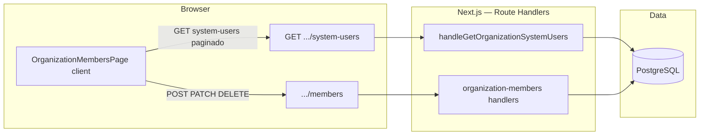

# Arquitectura técnica — Catálogo global de utilizadores em Membros (superadmin)

**Documento:** desenho técnico alinhado a  
`docs/prd-membros-catalogo-utilizadores-filtro-dinamico.md`,  
`docs/front-end-spec-membros-catalogo-utilizadores-filtro-dinamico.md` e  
`docs/front-end-spec-superadmin-aba-organizacoes-gestao-membros.md` (SMEM).  

**Âmbito:** leitura agregada `user` + `organization_memberships` (read path), filtro no cliente, mutações inalteradas em `.../members`.  

**Change log**

| Data | Versão | Descrição | Autor |
| ---- | ------ | --------- | ----- |
| 2026-04-27 | 1.0 | Arquitectura técnica inicial (API, dados, cliente, segurança, evolução). | Architect (Aria / AIOS) |

---

## 1. Visão de sistema

- **Front-end:** página cliente em `frontend/src/app/(dashboard)/admin/organizacoes/[organizationId]/membros/page.tsx` → `OrganizationMembersPage`.  
- **Leitura do catálogo:** apenas **`GET /api/v1/organizations/{organizationId}/system-users`**.  
- **Escrita:** continua centralizada em **`/api/v1/organizations/{organizationId}/members`** e **`.../members/{membershipId}`** (sem novo endpoint de escrita).

---

## 2. Contrato HTTP (referência estável)

### 2.1 `GET /api/v1/organizations/{organizationId}/system-users`

| Aspeto | Decisão |
| ------ | ------- |
| **Autorização** | `getAuthedSession` + `isSuperadmin(session.user)` — igual ao padrão de `handleGetOrganizationMembers` (**NFR36**). |
| **Validação path** | `organizationId` UUID (`z.string().uuid()`); inválido → **400**. |
| **Validação query** | `organizationSystemUsersQuerySchema` em `@repo/shared`: `page` (≥1, default 1), `pageSize` (1–100, default 100). Inválido → **400**. |
| **Organização** | Existência em `organizations`; ausente → **404**. |
| **Resposta 200** | `{ items: OrganizationDirectoryUserItem[], page, pageSize, total }`. |
| **`total`** | `COUNT(*)` sobre a tabela `user` (total global de contas, independente da org). |
| **Erros** | **401** sessão; **403** não superadmin; **404** org; **400** validação; **5xx** via `toPublicApiError` (**NFR39**). |

### 2.2 Semântica do item `OrganizationDirectoryUserItem`

| Campo | Origem | Notas |
| ----- | ------ | ----- |
| `userId`, `email`, `displayName`, `isSuperadmin` | Linha `user` | `displayName` = `user.name` (NOT NULL no schema). |
| `member` | `null` ou objecto `OrganizationMemberListItem` | Preenchido só quando o `LEFT JOIN` devolve membership para a `organizationId` do path; validação no handler exige `membershipId`, `orgRole`, `createdAt`, `updatedAt` não nulos antes de mapear. |

### 2.3 OpenAPI (**NFR41**)

- Acrescentar em `docs/api/openapi-v1-organizations-session.yaml` o path **`/organizations/{organizationId}/system-users`** espelhando §2.1–2.2.  
- Manter paths `.../members` existentes sem alteração de semântica.

---

## 3. Camada de dados

### 3.1 Query principal (implementação actual)

- **FROM** `user`  
- **LEFT JOIN** `organization_memberships` ON `user_id = user.id` AND `organization_id = :organizationId`  
- **SELECT** colunas de `user` + colunas de membership (nullable).  
- **ORDER BY** `user.createdAt` **DESC** (alinhado ao PRD §6.1; mudança para `email` ASC exige apenas alteração de `orderBy` e nota de release).  
- **LIMIT / OFFSET** derivados de `page` e `pageSize`.

**Garantia de cardinalidade:** um utilizador tem no máximo **um** membership por organização (unique `(user_id, organization_id)`); o `LEFT JOIN` não duplica linhas de `user`.

### 3.2 Contagem `total`

- `SELECT count(*) FROM user` — **O(1)** relativo ao offset, mas custo proporcional ao tamanho da tabela `user`.  
- Para **muito grandes** volumes de `user`, avaliar com **@data-engineer**: materialized view, cache de contagem, ou mover `total` para metadata de job (fora do MVP **NFR38**).

### 3.3 Índices (recomendações)

| Tabela | Índice | Justificação |
| ------ | ------ | ------------- |
| `user` | PK em `id` (existente) | Join e lookups. |
| `user` | Opcional: `(created_at DESC)` ou BRIN em `created_at` se a listagem por data for dominante e a tabela crescer muito | Suporta `ORDER BY` + `OFFSET` sem seq scan completo; validar com `EXPLAIN ANALYZE` em dados reais. |
| `organization_memberships` | Unique / índice em `(organization_id, user_id)` (típico de FK composite) | Já reforça o join filtrado por org. |

**Nota:** não é obrigatório criar migração neste incremento até haver evidência de lentidão; o PRD prevê evolução de performance.

### 3.4 Rate limiting

- O endpoint **`system-users`** **não** aplica hoje o rate limit de pesquisa usado em `GET .../members?q=` (**NFR31** membros), porque **não** há parâmetro `q` no servidor — o filtro é no cliente (**FR114**).  
- Se no futuro se introduzir `q` em `system-users` (**NFR38**), reutilizar ou extrair o utilitário em `organization-members-search-rate-limit.ts` com chave `actorId:orgId` e limites definidos por produto.

---

## 4. Segurança e autorização

| Camada | Mecanismo |
| ------ | --------- |
| **Servidor** | Única fonte de verdade: `isSuperadmin` avaliado no handler antes de qualquer query sensível (**FR112**, **NFR36**). |
| **Cliente** | O menu «Organizações» e a rota `/admin/...` podem ocultar UI, mas **não** substituem o controlo do handler. |
| **Dados expostos** | E-mails e nomes de **todos** os utilizadores apenas a superadmin no contexto desta API (clarificação PRD §13). |
| **Logs** | `scope: "organization_system_users"` com `requestId`, `outcome`, `userId`, `organizationId`, `total`, `page` — **sem** PII em excesso nos logs estruturados; alinhar volume de logs a política de retenção existente. |

---

## 5. Arquitectura do cliente (React)

### 5.1 Estado e fluxo de dados

| Estado | Responsabilidade |
| ------ | ----------------- |
| `catalog` | `OrganizationDirectoryUserItem[]` — resultado agregado de todas as páginas `system-users` carregadas. |
| `qInput` | Texto do filtro; **não** dispara `fetch` por mudança. |
| `filteredCatalog` | `useMemo(() => ..., [catalog, qInput])` — filtro case-insensitive em `displayName` e `email`. |
| `page` | Página da **vista** sobre `filteredCatalog` (ex.: 50 linhas). Reset a **1** quando `qInput` muda (spec UX §4.2). |
| Modais | Estado local existente; **AddExistingModal** recebe `initialEmail?: string` quando aberto a partir da linha (**FR115**). |

### 5.2 Carregamento multi-página (**NFR37**)

- Loop: `page = 1..N`, `pageSize = 100`, até `items.length < pageSize` **ou** `acc.length >= total` **ou** `N > maxPages` (ex.: 100).  
- **Truncamento:** se o teto for atingido com `acc.length < total`, a UI deve mostrar aviso (copy `mem.catalog.truncation.warning` na spec UX) e **não** assumir catálogo completo.

### 5.3 Pós-mutação (**FR116**)

- **Preferência arquitectural:** função única `loadSystemUserCatalog()` invocada após sucesso de qualquer modal que chame `.../members`.  
- **Alternativa:** invalidação de cache (React Query) se o projecto migrar para TanStack Query nesta página — manter uma única «fonte de verdade» para o catálogo.

### 5.4 Performance de renderização (**NFR38** preparação)

- Até ~500–2000 linhas, tabela DOM simples + `useMemo` é aceitável.  
- Acima disso: considerar **virtualização** (`@tanstack/react-virtual` ou similar) **sem** alterar o contrato da API; o filtro continua em memória ou migra para servidor.

---

## 6. Partilha de tipos (`@repo/shared`)

- `organizationSystemUsersQuerySchema` — validação Zod da query.  
- `OrganizationDirectoryUserItem` — item de resposta.  
- `OrganizationMemberListItem` — reutilizado dentro de `member` para **paridade** com modais que já consomem o mesmo tipo após `PATCH`/`DELETE`.

Evitar duplicar shape JSON no front; importar tipos do pacote partilhado.

---

## 7. Testes (matriz mínima)

| Cenário | Tipo |
| ------- | ---- |
| Superadmin `GET system-users` 200, estrutura `items` + `member` null / preenchido | Integração API |
| Não superadmin → **403** | Integração API |
| `organizationId` inválido → **400** | Integração API |
| Org inexistente → **404** | Integração API |
| Filtro local + paginação da vista (regressão de página vazia) | Teste E2E ou manual (spec UX) |
| Pré-preenchimento modal + refetch após POST link | E2E ou integração + RTL |

Estender a suíte existente em `frontend/src/app/api/v1/organization-members.integration.test.ts` ou ficheiro dedicado `organization-system-users.integration.test.ts`.

---

## 8. Evolução técnica (backlog **NFR38**)

1. **Query opcional `q`:** `ilike` em `user.name` / `user.email` + rate limit dedicado; cliente pode debounce 300 ms.  
2. **Cursor-based pagination:** substituir `OFFSET` grande por `cursor` estável (`created_at`, `id`) para reduzir custo em páginas altas.  
3. **Virtualização** na tabela e **carregamento progressivo** (mostrar primeira página enquanto as restantes carregam em background) — UX spec §4.1 ponto 4.  
4. **Projections:** endpoint separado «só contagem» se dashboards precisarem sem listar PII.

---

## 9. Inventário de artefactos (referência)

| Artefacto | Caminho |
| --------- | ------- |
| Route handler GET | `frontend/src/app/api/v1/organizations/[organizationId]/system-users/route.ts` |
| Handler | `frontend/src/server/api/v1/handlers/organization-system-users.ts` |
| UI | `frontend/src/components/admin/organization-members-page.tsx` |
| Schemas / tipos | `packages/shared/src/api-v1.ts`, export em `packages/shared/src/index.ts` |
| Mutations (inalteradas) | `frontend/src/server/api/v1/handlers/organization-members.ts` |

---

## 10. Rastreio PRD / NFR → decisões técnicas

| ID | Cobertura técnica |
| -- | ----------------- |
| **FR111** | §2, §3, §9 |
| **FR112** | §4 |
| **FR113–FR116** | §5, modais existentes |
| **NFR36** | §4 |
| **NFR37** | §5.2, §3.2 |
| **NFR38** | §8 |
| **NFR39** | §2.1 `toPublicApiError` |
| **NFR40** | Implementação na UI (labels, `aria-*`) — spec UX §8 |
| **NFR41** | §2.3 |

---

## 11. Handoff

- **`@data-engineer`** — Revisar `EXPLAIN` do `SELECT` + `COUNT` em dados de produção; propor índices §3.3 se necessário.  
- **`@dev`** — Garantir OpenAPI §2.3; testes §7; opcional progress UI §5.2 na spec UX.  
- **`@qa`** — Matriz §7 + regressão SMEM em `.../members`.

---

— Aria (Architect) — AIOS; alinhado aos documentos de produto e UX citados no cabeçalho.
