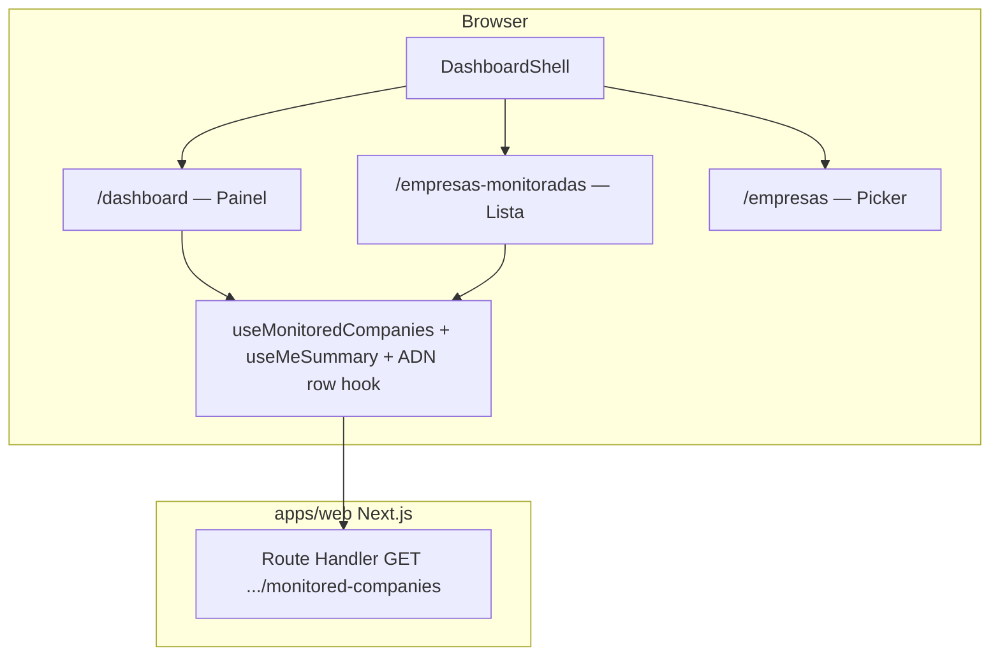

# Arquitetura técnica — Incremento: navegação shell e rota `/empresas-monitoradas`

**Fontes:** `docs/prd-nav-sidebar-empresas-monitoradas.md` (**FR49–FR52**, **NFR24–NFR25**), `docs/front-end-spec-nav-sidebar-empresas-monitoradas.md`.  
**Documentos base:** `docs/architecture.md`, `docs/architecture-dois-niveis-organizacao-vs-empresas-fiscais.md` (contexto de sessão e API por `organizationId`).  
**Estado do código de referência:** `apps/web/src/app/(dashboard)/layout.tsx`, `WorkspaceGate`, `DashboardShell`, `dashboard/page.tsx`, hook `useMonitoredCompanies`.

**Normativa:** **sem** novos endpoints, **sem** alterações de schema ou RLS. O incremento é **puramente de encaminhamento, UI partilhada e regras de estado do cliente** dentro do grupo de rotas `(dashboard)`.

### Change log

| Data       | Versão | Descrição |
| ---------- | ------ | ---------- |
| 2026-04-24 | 1.0    | Arquitectura inicial: rotas, gates, shell, componentes, matriz de pathname, testes, riscos. |
| 2026-04-24 | 1.1    | Paridade lista: ADN via `adn-sync-client` / hook na lista (**EM-01**); ver `docs/architecture-empresas-monitoradas-editar-e-forcar-automacao.md`. |

---

## 1. Resumo executivo

| Camada | Decisão |
| ------ | -------- |
| **Routing (Next.js App Router)** | Nova rota **`/empresas-monitoradas`** como `apps/web/src/app/(dashboard)/empresas-monitoradas/page.tsx` (segmento de URL **hífen**, sem colisão com `/empresas/*`). |
| **Layout** | Reutiliza `(dashboard)/layout.tsx` → `SessionAuthGate` → `WorkspaceGate` → `DashboardShell` → `children`. |
| **Dados** | Mesma stack que o Painel: `useMeSummary` / `useEffectiveOrganizationId` + `useMonitoredCompanies(organizationId)` → `GET /api/v1/organizations/:organizationId/monitored-companies`. |
| **Portal / jobs locais** | A secção **Empresas monitoradas** no Painel e em `/empresas-monitoradas` usa **GET/POST ADN** partilhados (`adn-sync-client` + `useAdnSyncForCompany`) por linha — **sem** `runSync` na lista (**supersedido por EM-01**). `usePortal` permanece para execuções locais / KPIs onde aplicável. Ver `docs/architecture-empresas-monitoradas-editar-e-forcar-automacao.md`. |
| **Shell** | Actualizar array `nav` em `DashboardShell`; implementar **função de match por item** (evitar `startsWith("/empresas")` para o novo item). |
| **A11y** | `aria-current="page"` no `Link` activo do `nav` (**NFR24**). |

---

## 2. Diagrama de contexto (C4 — container lógico)

---

## 3. Rotas e ficheiros

| URL | Ficheiro alvo | Notas |
| --- | ------------- | ----- |
| `/empresas-monitoradas` | `apps/web/src/app/(dashboard)/empresas-monitoradas/page.tsx` | Client Component recomendado (`"use client"`) por paridade com `dashboard/page.tsx` e uso de hooks. |
| *(inalterado)* `/empresas` | `apps/web/src/app/(dashboard)/empresas/page.tsx` | Picker; **não** mudar contrato `?next=` neste incremento. |
| *(inalterado)* `/empresas/nova`, `/empresas/[id]` | Dynamic segments existentes | **Não** entram no `nav`; estado activo do item «Empresas monitoradas» **não** deve usar prefixo `/empresas`. |

**Convenção de pastas:** o segmento `empresas-monitoradas` (com hífen) é válido em App Router e produz pathname canónico sem ambiguidade com `/empresas/...`.

---

## 4. Gates e sessão

### 4.1 `WorkspaceGate` (`apps/web/src/components/workspace-gate.tsx`)

Comportamento actual:

- `ALLOW_NO_ACTIVE = { "/empresas", "/empresas/nova" }` — páginas que podem renderizar **sem** `activeOrganizationId` / contexto legado.
- `needsActiveCompany(pathname)` devolve **false** para essas entradas e para `/empresas/*/usuarios`; para **todas** as outras rotas do dashboard, exige `hasWorkspaceContext(session)`.

**Impacto na nova rota:**

- `/empresas-monitoradas` **não** deve ser adicionada a `ALLOW_NO_ACTIVE`.
- `pathname.startsWith("/empresas/")` usado no gate **não** corresponde a `/empresas-monitoradas` (string não começa por `/empresas/` seguido de segmento — começa por `/empresas-monitoradas`). Portanto, a nova rota **exige organização activa** tal como `/dashboard`, **sem alteração obrigatória** à lógica do gate.
- Se no futuro existir `/empresas-monitoradas/algo`, continua fora de `ALLOW_NO_ACTIVE` salvo requisito explícito de produto.

**Redireccionamento sem contexto:** mantém-se o padrão actual: `router.replace("/empresas?next=" + encodeURIComponent(pathname))` quando o utilizador acede a `/empresas-monitoradas` sem org activa.

### 4.2 `SessionAuthGate`

Sem requisitos novos; a página nova permanece sob o mesmo layout autenticado.

---

## 5. Shell e navegação (`DashboardShell`)

### 5.1 Modelo de dados do `nav`

Substituir o array plano `href + label` por uma estrutura que permita **estratégia de match explícita** (reduz risco PRD §10):

| Campo | Tipo sugerido | Uso |
| ----- | -------------- | --- |
| `href` | `string` | Destino do `Link`. |
| `label` | `string` | Copy UI (`nav.item.monitored`, etc.). |
| `isActive` | `(pathname: string) => boolean` | **Ou** enum `match: "exact" \| "prefix"` com `href` como prefixo canónico. |

**Regras vinculativas (espelho do spec UX §3.2):**

| Item | `isActive(pathname)` |
| ---- | -------------------- |
| Painel | `pathname === "/dashboard"` |
| Empresas monitoradas | `pathname === "/empresas-monitoradas" \|\| pathname.startsWith("/empresas-monitoradas/")` |
| Execuções | `pathname.startsWith("/execucoes")` |
| Configurações | `pathname.startsWith("/configuracoes")` |

**Proibido:** para o item «Empresas monitoradas», `pathname.startsWith("/empresas")` — activaria picker, nova empresa e detalhe.

**Nota crítica (colisão de prefixos em JavaScript):** `"/empresas-monitoradas".startsWith("/empresas")` é **verdadeiro** (o nono carácter é `-`, não `/`). Qualquer lógica legacy do tipo `pathname.startsWith(item.href)` com `item.href === "/empresas"` **marcaria activo** o item errado se a URL `/empresas-monitoradas` coexistisse com um `nav` ainda apontado para `/empresas`. Por isso o match **tem** de ser por função explícita ou por prefixo **`/empresas/`** (com barra) para rotas «filhas» do picker, **nunca** só `/empresas` como prefixo genérico para a nova lista.

### 5.2 Implementação com Next.js `Link`

- Passar `aria-current={isActive ? "page" : undefined}` no `Link` de cada item (**NFR24**). O tipo `aria-current` em React aceita `"page"` ou `undefined`.
- Duplicar a mesma lógica no bloco **móvel** (scroll horizontal) e no **aside** — um único map sobre a mesma config reduz drift.

### 5.3 «Trocar organização»

- Mantém `href="/empresas"`; preservar query `next` apenas se o produto já a construir nesse link (hoje não é obrigatório no spec).

---

## 6. Página lista e reutilização de UI

### 6.1 Opções (por ordem de preferência arquitectónica)

1. **Extrair organismo partilhado** (recomendado pelo PRD §10):  
   - Ex.: `apps/web/src/components/monitored-companies-section.tsx` (nome negociável).  
   - Props mínimas: `companies`, `loading`, `issue`, `onRetry`, `onRunSync`, `emptyHref` (`/empresas/nova`).  
   - `dashboard/page.tsx` e `empresas-monitoradas/page.tsx` importam o mesmo organismo; **uma** implementação de `runSync` / labels de botão.

2. **Duplicação temporária** (aceite só se PR única extremamente pequena): copiar bloco JSX do Painel para a nova página com comentário `TODO NAV-01` para extrair na PR seguinte — **dívida técnica explícita**.

### 6.2 Dependências de runtime da lista

| Dependência | Origem | Notas |
| ----------- | ------ | ----- |
| Lista monitoradas | `useMonitoredCompanies(effectiveOrganizationId)` | Cache em estado local do hook; após troca de org, `pathname` muda e efeitos existentes no shell podem ajudar a refrescar contexto — alinhar a invalidação já descrita no spec dois níveis (chaves com `organizationId`). |
| Disparo de teste | `usePortal().runSync` | Igual ao Painel; sem nova API. |
| Cópia canónica | Strings do spec UX §4.1–4.2 | Centralizar em constantes ou objeto `copy` no ficheiro do organismo para facilitar harmonização futura com `fiscal.list.*`. |

### 6.3 Estados sem `organizationId`

Quando `effectiveOrganizationId` é `null`/`undefined` mas o gate já deixou passar (caso raro de corrida) ou durante loading:

- `useMonitoredCompanies` já trata `organizationId` ausente → lista vazia e `loading` false.  
- Preferível alinhar ao padrão de outras páginas: skeleton enquanto `WorkspaceGate` / sessão resolvem, ou não renderizar lista até existir id — **registar escolha na story** (PRD §6).

---

## 7. API e backend

**Nenhuma alteração** obrigatória a Route Handlers, middleware Edge ou Postgres.

Validação de regressão: garantir que chamadas desde `/empresas-monitoradas` usam o **mesmo** `organizationId` que o Painel (origem: sessão Better Auth + `useMeSummary`).

---

## 8. Matriz de testes (mínimo)

| Cenário | pathname | Item activo no `nav` |
| ------- | -------- | -------------------- |
| Painel | `/dashboard` | Painel |
| Lista nova | `/empresas-monitoradas` | Empresas monitoradas |
| Picker | `/empresas` | *(nenhum dos quatro)* ou política actual se `/empresas` estiver fora do shell — hoje picker está **dentro** do shell; ver nota §8.1 |
| Nova empresa | `/empresas/nova` | *(nenhum)* |
| Detalhe fiscal | `/empresas/[uuid]` | *(nenhum)* |
| Utilizadores org | `/empresas/[uuid]/usuarios` | *(nenhum)* |
| Execuções | `/execucoes` | Execuções |

**§8.1 Picker dentro do shell:** o `DashboardShell` envolve `/empresas`; os quatro itens do `nav` aparecem no picker. Com a regra nova, em `/empresas` **nenhum** dos quatro deve ficar com realce de «activo» (o pathname não é `/dashboard` nem `/empresas-monitoradas`, etc.) — coerente com o spec UX §3.2.

---

## 9. E2E e regressão

- **Smoke:** se existir `apps/web/e2e/ler-smoke.spec.ts` (ou equivalente), acrescentar navegação `→ /empresas-monitoradas` e assert de título `h1` / lista.  
- **Manual:** tab até `nav`, confirmar ordem de foco e `aria-current` único (**spec UX §6**).

---

## 10. Alternativa técnica (âncora)

Se o PRD for alterado para **âncora** `/dashboard#empresas-monitoradas`:

- Acrescentar `id="empresas-monitoradas"` na secção do Painel.  
- Item do menu: `href="/dashboard#empresas-monitoradas"`.  
- **Estado activo:** apenas `pathname === "/dashboard"` para o item Painel; o item «Empresas monitoradas» **não** pode usar `aria-current` em simultâneo com o Painel sem decisão de produto — preferir **não** marcar «Empresas monitoradas» como `aria-current` nesta variante, ou marcar só o Painel (**spec UX §9**).  
- Opcional: `useEffect` com `location.hash` para scroll — cuidado com hidratação.

Esta arquitectura documenta a **rota dedicada** como caminho principal; a âncora fica como variante documentada no PRD.

---

## 11. Riscos e mitigações

| Risco | Mitigação |
| ----- | ---------- |
| Drift entre Painel e lista dedicada | Organismo partilhado (§6.1). |
| Confusão futura com rota `/empresas` = lista | Fora de âmbito; manter picker em `/empresas` até épico de rename de URLs. |
| Nome `empresas-monitoradas` vs convenção REST | Aceitável em UI routes; não confundir com API paths. |

---

## 12. Rastreio PRD / UX → arquitectura

| ID | Onde está coberto |
| -- | ----------------- |
| FR49 | §3, §5 |
| FR50 | §5.3 |
| FR51 | §3, §6 |
| FR52 | §5.1, §8 |
| NFR24 | §5.2 |
| NFR25 | §6.2 (copy centralizada) |

---

## 13. Próximos passos para `@dev`

1. Criar `empresas-monitoradas/page.tsx` sob `(dashboard)`.  
2. Refactor `DashboardShell` com `isActive` por item + `aria-current`.  
3. Extrair `MonitoredCompaniesSection` (ou equivalente) e usar no Painel e na nova página.  
4. Executar matriz §8 manualmente + actualizar e2e se existir pipeline.

---

*Arquitectura elaborada no âmbito AIOS (@architect).*
