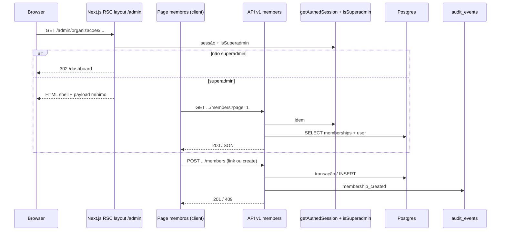

# Arquitetura técnica — Incremento: aba «Organizações» reforçada e gestão de membros (superadmin)

**Fontes:** `docs/prd-superadmin-aba-organizacoes-gestao-membros.md` (**FR100–FR110**, **NFR30–NFR35**), `docs/front-end-spec-superadmin-aba-organizacoes-gestao-membros.md`.  
**Base existente:** `docs/architecture-superadmin-cadastro-organizacoes-acesso-global.md`, `docs/architecture-login-empresas-roles.md`, `packages/db/src/schema.ts`, `frontend/src/lib/authz.ts`, `frontend/src/server/api/v1/handlers/organizations-create.ts`, `packages/shared/src/api-v1.ts`.

---

## 1. Resumo executivo

Este incremento acrescenta:

1. **Gate servidor** para rotas **`/admin/*`** (FR101), evitando hidratar HTML com dados administrativos para utilizadores autenticados sem `isSuperadmin`.
2. **API v1** para CRUD de **`organization_memberships`** ao abrigo de uma `organizationId`, exclusivo a superadmin (FR102–FR107).
3. **Regra transaccional FR108** («último administrador da organização») em `PATCH` e `DELETE`.
4. **Auditoria** obrigatória nas mutações (FR109), reutilizando `insertAuditEvent` e tipos já definidos em `frontend/src/lib/audit.ts`.
5. **UI** em Next.js App Router na rota recomendada pelo UX: **`/admin/organizacoes/[organizationId]/membros`**.

### Decisões arquitecturais fechadas

| Tema | Decisão |
|------|---------|
| **HTML GET `/admin/*` sem superadmin** | **`redirect(302)` para `/dashboard`** (melhor UX que página 403 vazia); **sem** querystring de motivo no MVP (evitar fingerprinting; copy genérica no cliente se necessário). |
| **API JSON sem superadmin** | **`403`** com corpo `{ "error": "…" }` alinhado a `jsonError` existente; **nunca** listar membros. |
| **Organização inexistente** | **`404`** em todos os endpoints sob `/organizations/{id}/…` quando o UUID não existir em `organizations`. |
| **FR108 — código HTTP** | **`409 Conflict`** com campo **`code: "LAST_ORG_ADMIN"`** estável no JSON para a UI mapear copy (alinha ao padrão de conflito de negócio já usado em CNPJ duplicado). |
| **Duplicidade de membership** | **`409`** com **`code: "MEMBERSHIP_DUPLICATE"`** (constraint `organization_memberships_user_org_unique`). |
| **Paginação** | `page` ≥ 1, **`pageSize` default 50**, máximo **100** (igual espírito a `membersQuerySchema` / companies em `@repo/shared`). |
| **Schemas Zod** | Novos schemas em **`@repo/shared`** com nomes explícitos (`organizationMember*`), **sem** reutilizar `memberPostBodySchema` (esse modelo está acoplado a `companyRole` / empresa fiscal). |
| **Criação de utilizador (FR104)** | Handler servidor único: transacção **criar `user` + `account` (password)** compatível com Better Auth **ou** chamada à API interna do Better Auth se o projecto expuser método suportado na versão instalada; **fora** deste documento: escolha exacta da primitive (`auth.api.*`) validada por `@dev` com teste de hash verificável em login. |
| **Rotas Next API** | Árvore **`/api/v1/organizations/[organizationId]/members`** e **`.../members/[membershipId]`** (ficheiros `route.ts` por segmento). |

---

## 2. Estado actual e lacunas

**Já existente:**

- `organization_memberships` com `org_role` (`user` \| `admin`), FK para `organizations` e `user`, índice único `(user_id, organization_id)`.
- `isSuperadmin` em `frontend/src/lib/authz.ts`; padrão de handler em `organizations-create.ts` (`getAuthedSession`, `jsonError`, logs JSON com `requestId`).
- Schemas genéricos de paginação `membersQuerySchema` em `packages/shared` (referência; os novos schemas de **organização** devem ser nomes distintos para evitar confusão com **company** members).

**Lacunas:**

- Sem `layout.tsx` servidor dedicado a `/admin`.
- Sem endpoints REST para membros da organização.
- Sem página `.../membros` nem integração na lista de organizações.

---

## 3. Vista de sistema (alto nível)



---

## 4. Gate servidor (FR101 / NFR30)

### 4.1 Ficheiro recomendado

`frontend/src/app/(dashboard)/admin/layout.tsx` (ou o segmento de rotas onde `admin/organizacoes` já vive) como **Server Component**.

### 4.2 Lógica

1. Resolver sessão com a mesma fonte de verdade usada nas API routes (ex.: `auth.api.getSession({ headers: await headers() })` do Better Auth / wrapper do projecto).
2. Se **não autenticado** → `redirect("/login?next=" + encodeURIComponent(pathname))`.
3. Se autenticado e **`!isSuperadmin(user)`** → `redirect("/dashboard")`.
4. Caso contrário → `return children`.

### 4.3 Excepções

- Não colocar rotas públicas sob `/admin`.
- **API** não usa redirect: mantém **403** JSON.

### 4.4 Considerações RSC / cookies

- Garantir que a leitura de sessão no layout usa **`headers()`** (ou padrão Next 15 async request APIs) de forma compatível com a configuração actual do Better Auth (`nextCookies()`).

---

## 5. Modelo de dados (sem alterações obrigatórias)

Reutilizar:

- `organizations` (validação de existência por `id`).
- `organization_memberships` (`id`, `organization_id`, `user_id`, `org_role`, `job_title`, `department`, `phone`, timestamps).
- `user` (`id`, `email`, `name`, `isSuperadmin`, …).

**Índices:** o único `(user_id, organization_id)` já evita duplicidade — mapear `23505` para **409** `MEMBERSHIP_DUPLICATE` quando o constraint for esse.

**Migrações:** nenhuma obrigatória para o MVP deste incremento, salvo optimização futura (ex.: índice composto `(organization_id, org_role)` para acelerar contagem de admins — opcional, medir antes).

---

## 6. Regra FR108 — último administrador

### 6.1 Definição operacional

Para uma dada `organization_id`:

- `admin_count` = número de linhas em `organization_memberships` com `org_role = 'admin'`.

Operações sujeitas à regra:

- **`DELETE`** de uma linha onde `org_role = 'admin'` **não permitida** se `admin_count <= 1`.
- **`PATCH`** que altera `org_role` de `admin` → `user` **não permitida** se, após a alteração, `admin_count` seria **0** (equivalente: era o único admin).

Operações **sempre permitidas** (MVP):

- Promover `user` → `admin` quando `admin_count >= 1` ou quando `admin_count === 0` (organização sem admin local — alinhado a FR50 e permite «correcção»).

### 6.2 Pseudocódigo (servidor)

```text
on DELETE(membershipId):
  load membership org_id, org_role
  if org_role != 'admin': allow delete
  countAdmins = SELECT COUNT(*) FROM organization_memberships
                WHERE organization_id = org_id AND org_role = 'admin'
  if countAdmins <= 1: return 409 LAST_ORG_ADMIN
  else: DELETE row; audit membership_removed

on PATCH(membershipId, newRole):
  if newRole is undefined or same as current: skip FR108 branch for role
  if currentRole == 'admin' AND newRole == 'user':
      countAdmins = ... as above
      if countAdmins <= 1: return 409 LAST_ORG_ADMIN
  apply update; if org_role changed: audit membership_role_changed
```

### 6.3 Concorrência

- Usar transacção **`READ COMMITTED`** + `SELECT … FOR UPDATE` nas linhas relevantes **ou** repetir verificação dentro da transação antes do `COMMIT` para reduzir corrida entre dois pedidos simultâneos a remover o último admin.

---

## 7. API v1 — contrato técnico

Base URL: **`/api/v1/organizations/{organizationId}/members`**.

Todas as rotas: **`getAuthedSession`** → se null **401**; se `!isSuperadmin` **403**; validar UUID de `organizationId` (**400** se inválido); verificar existência da organização (**404**).

### 7.1 `GET .../members`

**Query:** `page`, `pageSize` (defaults §1), `q` opcional (substring insensível em `user.email` e `user.name`).

**Resposta 200:**

```json
{
  "items": [
    {
      "membershipId": "uuid",
      "userId": "text",
      "email": "string",
      "displayName": "string | null",
      "orgRole": "user | admin",
      "jobTitle": "string | null",
      "department": "string | null",
      "phone": "string | null",
      "createdAt": "ISO-8601",
      "updatedAt": "ISO-8601"
    }
  ],
  "page": 1,
  "pageSize": 50,
  "total": 123
}
```

**Implementação sugerida:** uma query com `JOIN user` + `COUNT(*) OVER()` ou duas queries (lista + count total) — `@data-engineer` pode optimizar.

### 7.2 `POST .../members`

**Corpo (discriminated union — espelhar padrão `memberPostBodySchema` mas com `orgRole` e sem `companyRole`):**

```json
{ "mode": "link", "email": "a@b.com", "orgRole": "admin" }
```

ou

```json
{
  "mode": "create",
  "email": "a@b.com",
  "password": "min-8-chars",
  "name": "Nome",
  "orgRole": "user",
  "jobTitle": null,
  "department": null,
  "phone": null
}
```

**Respostas:**

- **201** — corpo com o item criado (mesmo shape que entrada em `items` do GET).
- **400** — validação Zod.
- **403** — não superadmin.
- **404** — organização inexistente.
- **409** — `MEMBERSHIP_DUPLICATE` ou utilizador já existe no modo `create` (mapear conforme política: email único global).
- **409** — `LAST_ORG_ADMIN` **não aplica** em POST de link/create salvo regra explícita futura.

**Modo `link`:** `SELECT id FROM user WHERE lower(email) = lower($1)` → se não existir **404** ou **400** com código `USER_NOT_FOUND` (escolher uma política única documentada na story; recomendação: **404** para não revelar existência de email **se** esse for padrão global; caso contrário **400** com mensagem operacional — alinhar com `@pm`).

### 7.3 `PATCH .../members/{membershipId}`

**Corpo parcial:** `orgRole?`, `jobTitle?`, `department?`, `phone?` (nullable explícito para limpar campos, se o projecto já usar semântica `null` noutros PATCH).

**Respostas:** **200** + item; **409** `LAST_ORG_ADMIN`; **404** membership não pertence à organização.

### 7.4 `DELETE .../members/{membershipId}`

**204** sem corpo ou **200** com `{ "ok": true }` — escolher **uma** e documentar em OpenAPI (recomendação: **204**).

**409** `LAST_ORG_ADMIN` quando aplicável.

---

## 8. Auditoria e logs (FR109 / NFR31)

| Operação | `eventType` | `targetUserId` | `organizationId` | `metadata` sugerido |
|----------|-------------|----------------|-------------------|---------------------|
| POST link/create | `membership_created` | user vinculado | org | `{ membershipId, mode, orgRole }` |
| PATCH | `membership_role_changed` | user | org | `{ membershipId, previousRole, nextRole }` (+ diff de campos não sensíveis) |
| DELETE | `membership_removed` | user | org | `{ membershipId, orgRole }` |

Logs estruturados (`console.info` JSON): incluir `requestId`, `actorUserId`, `organizationId`, `outcome`, espelhando o padrão de `organizations-create.ts`.

---

## 9. Front-end (Next.js)

### 9.1 Rotas de página

| Caminho | Tipo | Notas |
|---------|------|--------|
| `/admin/organizacoes` | existente | Acrescentar `Link` «Gerir membros» → rota abaixo. |
| `/admin/organizacoes/[organizationId]/membros` | novo | Client Component principal para dados (`"use client"`) ou RSC + filho cliente; respeitar spec UX (tabela, modais). |

### 9.2 Dados

- **TanStack Query** (se já for padrão no repo) com chaves `["org-members", organizationId, page, q]`.
- Invalidação após mutações bem-sucedidas.

### 9.3 Erros

- Mapear `code` **`LAST_ORG_ADMIN`** e **`MEMBERSHIP_DUPLICATE`** para copy do `front-end-spec` §10.

---

## 10. Segurança

1. **Sem bypass:** todas as mutações e listagens passam por `isSuperadmin` no servidor.
2. **Sem listagem global:** `GET .../members` só retorna membros da `organizationId` pedida; pesquisa `q` restrita a esse conjunto.
3. **Rate limiting (recomendado):** limite suave por `actorUserId` + rota em middleware ou no handler para mitigar enumeração de e-mails via `q` (NFR31).
4. **403 vs 404:** para `membershipId` que não pertence à org, preferir **404** (evita vazar existência de IDs noutros tenants).

---

## 11. OpenAPI e pacote partilhado

1. Actualizar **`docs/api/openapi-v1-organizations-session.yaml`** com os quatro métodos/caminhos.
2. Adicionar em **`packages/shared/src/api-v1.ts`** (ou módulo dedicado exportado pelo package):
   - `organizationMembersQuerySchema`
   - `organizationMemberPostBodySchema` (discriminated union)
   - `organizationMemberPatchBodySchema`
   - tipos inferidos para o cliente.

---

## 12. Testes (NFR32)

| Cenário | Tipo |
|---------|------|
| GET membros feliz (superadmin) | integração |
| GET 403 utilizador normal | integração |
| POST link duplicado 409 | integração |
| DELETE último admin 409 | integração |
| PATCH admin→user com único admin 409 | integração |
| Layout /admin redirect não-superadmin | E2E ou teste de integração de layout (conforme stack de testes do repo) |

---

## 13. Rastreio PRD / UX → arquitectura

| ID | Secções |
|----|---------|
| FR100 | Fora do âmbito técnico central (shell já existente); validar regressão visual em QA. |
| FR101 | §4 |
| FR102–FR107 | §7 |
| FR108 | §6 |
| FR109 | §8 |
| FR110 | §9 |
| NFR30–NFR34 | §4, §7, §10 |
| NFR35 | §9 + cumprimento semântico HTML (spec UX) |

---

## 14. Dependências e riscos

| Risco | Mitigação |
|-------|-----------|
| Criação de `user` incompatível com Better Auth | Prototipo + teste de login imediato após `POST create`; documentar primitive escolhida na story SMEM-04. |
| Corrida em FR108 | Transacção + `FOR UPDATE` ou retry idempotente. |
| Confusão company vs org members | Nomes de ficheiros/schemas/API **sempre** com prefixo **organization** onde ambíguo. |

---

## 15. Ordem de implementação sugerida

1. Schemas Zod + stubs OpenAPI.
2. `GET .../members` + testes.
3. `POST` modo `link` + auditoria.
4. `PATCH` / `DELETE` com FR108 + auditoria.
5. `POST` modo `create` (último por dependência de identidade).
6. `admin/layout.tsx` gate.
7. Página `membros` + componentes UI.

---

## 16. Change log

| Data | Versão | Descrição | Autor |
|------|--------|-----------|-------|
| 2026-04-27 | 1.0 | Arquitectura técnica inicial (API, FR108, gate, auditoria, front). | Architect (Aria / AIOS) |

---

— Aria, arquitetando o futuro 🏗️
