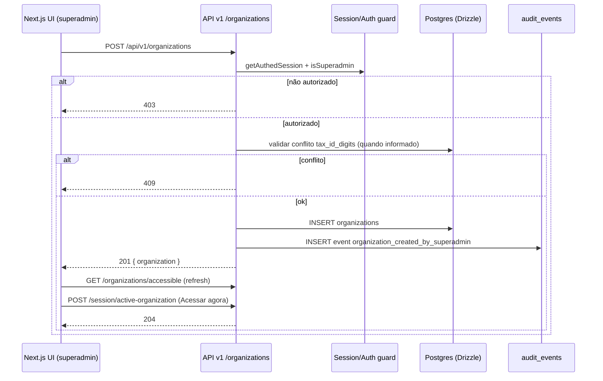

# Arquitetura técnica — Incremento: superadmin cria organizações e acessa toda a base

**Fontes:** `docs/prd-superadmin-cadastro-organizacoes-acesso-global.md` (FR41–FR50, NFR19–NFR23), `docs/front-end-spec-superadmin-cadastro-organizacoes-acesso-global.md`.  
**Base técnica existente:** `docs/architecture-login-empresas-roles.md`, `docs/architecture-dois-niveis-organizacao-vs-empresas-fiscais.md`, `packages/db/src/schema.ts`.

---

## 1. Resumo executivo

Este incremento introduz uma capacidade de **administração de plataforma**:

1. `superadmin` cria organizações via API/UI (`POST /api/v1/organizations`);
2. a organização criada fica imediatamente acessível ao `superadmin`;
3. o `superadmin` pode ativar o contexto dessa organização sem membership local;
4. todas as ações ficam auditáveis.

### Decisões arquiteturais principais

- **Domínio:** manter separação `organizations` (tenant) vs `companies` (empresa monitorada).
- **Autorização:** criação de organização restrita a `isSuperadmin = true`, validada no servidor.
- **Persistência:** reutilizar tabela `organizations` existente e adicionar regra de unicidade parcial para `tax_id_digits`.
- **Fluxo pós-criação:** reusar `POST /api/v1/session/active-organization` para “Acessar agora”.
- **Observabilidade:** evento de auditoria obrigatório em criação de organização.

---

## 2. Estado atual e gap

O projeto já possui:

- `organizations`, `organization_memberships` e `session.activeOrganizationId`;
- endpoint de listagem de organizações acessíveis;
- endpoint para definir organização ativa em sessão;
- lógica de `isSuperadmin` em `authz`.

Gap para este incremento:

- falta endpoint/handler de criação de organização para superadmin;
- falta especificação de transação, validação e códigos de erro para esse fluxo;
- falta padronizar o comportamento de frontend no sucesso (recarregar lista + “Acessar agora”).

---

## 3. Arquitetura alvo (alto nível)



---

## 4. Modelo de dados e constraints

### 4.1 Tabela `organizations`

Campos relevantes já existentes:

- `id` (UUID PK)
- `name` (obrigatório)
- `trade_name` (opcional)
- `tax_id_digits` (char(14), opcional)
- `active` (boolean)

### 4.2 Constraint recomendada para FR44

Adicionar índice único parcial para evitar duplicidade de CNPJ quando informado:

- `UNIQUE INDEX organizations_tax_id_digits_unique ON organizations (tax_id_digits) WHERE tax_id_digits IS NOT NULL`

Justificativa:

- atende FR44 sem impedir organizações sem CNPJ;
- evita lógica de deduplicação apenas na aplicação;
- reduz corrida entre requests simultâneos.

### 4.3 Auditoria

Evento mínimo:

- `event_type`: `organization_created_by_superadmin`
- `actor_user_id`
- `organization_id`
- `metadata`: `{ source: "admin_ui" | "api", taxIdProvided: boolean }`

---

## 5. API v1 (contrato técnico)

## 5.1 Criar organização

**Endpoint:** `POST /api/v1/organizations`

### Request body

```json
{
  "name": "string",
  "tradeName": "string | null",
  "taxIdDigits": "string | null"
}
```

### Regras de validação

- `name`: obrigatório, `trim().length > 0`
- `tradeName`: opcional
- `taxIdDigits`: opcional; quando presente, exatamente 14 dígitos

### Responses

- `201`: organização criada
- `400`: payload inválido
- `401`: sessão ausente/expirada
- `403`: usuário não é superadmin
- `409`: conflito de unicidade em `taxIdDigits`
- `500`: falha inesperada

### Response body (201)

```json
{
  "id": "uuid",
  "name": "string",
  "tradeName": "string | null",
  "taxIdMasked": "string | null",
  "createdAt": "iso-datetime",
  "localAdminLinked": true
}
```

### 5.1.1 Campo `localAdminLinked` (definição canónica — FR50)

- **`localAdminLinked === true`** quando existir **pelo menos uma** linha em `organization_memberships` para o `organization_id` criado com `org_role = 'admin'` (administrador local da organização ao nível do tenant).
- **`localAdminLinked === false`** quando essa condição não se verificar (incluindo organização recém-criada sem memberships).
- O valor é calculado **no servidor** após a persistência da organização (e na mesma transacção que a criação + auditoria, antes do commit), sem inferência exclusiva no cliente.

## 5.2 Fluxo “Acessar agora”

Reuso de endpoint existente:

- `POST /api/v1/session/active-organization` com `{ organizationId }`
- resposta esperada: `204`

---

## 6. Camadas de implementação

### 6.1 Backend (servidor/API)

Separação recomendada:

1. **Validação de entrada** (`@repo/shared`, Zod schema de criação);
2. **Handler HTTP** (autenticação, mapeamento de status code);
3. **Service de domínio** (criação transacional + auditoria);
4. **Repository/Drizzle** (queries e persistência).

### 6.2 Frontend (dashboard)

Componentes e fluxo:

- `OrganizationsAdminPage` (lista + busca + CTA)
- `CreateOrganizationDialog` (formulário)
- hook/mutation de criação (`useCreateOrganization`)
- ação pós-sucesso:
  - invalidar query de organizações acessíveis;
  - exibir toast;
  - oferecer CTA `Acessar agora` que chama endpoint de sessão ativa.

---

## 7. Autorização e segurança

### 7.1 Matriz de acesso

- `superadmin`: pode criar organização e acessar qualquer organização.
- `admin/user` de organização: não podem criar organização de plataforma.

### 7.2 Regras obrigatórias

1. Autorização sempre no servidor (nunca confiar só na UI).
2. Sanitização e validação de input antes de persistir.
3. Erros de conflito e permissão sem exposição de detalhes internos.
4. Operações sensíveis com auditoria obrigatória.

### 7.3 Política de códigos

Para este endpoint administrativo de plataforma:

- usar `403` para ausência de permissão;
- manter `409` para conflito de dado;
- manter `400` para validação.

---

## 8. Consistência, cache e concorrência

### 8.1 Consistência

- criação e auditoria na mesma unidade transacional sempre que possível;
- se auditoria falhar, operação deve falhar (evita criação sem rastro).

### 8.2 Cache/UI

- invalidar dados de `/organizations/accessible` após criação;
- ao trocar organização ativa, invalidar queries dependentes de `organizationId`.

### 8.3 Concorrência

- conflito de `taxIdDigits` resolvido no banco (índice único parcial);
- mapear violação de constraint para resposta `409`.

---

## 9. Observabilidade

Logs estruturados mínimos por request:

- `requestId`
- `userId`
- `isSuperadmin`
- `organizationId` (quando criado)
- `outcome` (`success`, `validation_error`, `forbidden`, `conflict`, `error`)

Métricas sugeridas:

- `organizations_create_total{status}`
- `organizations_create_latency_ms`
- `organizations_create_conflict_total`

---

## 10. Testes e validação

### 10.1 Integração (API)

1. superadmin cria organização (`201`);
2. admin/user tenta criar (`403`);
3. payload inválido (`400`);
4. conflito de CNPJ (`409`);
5. criação com `taxIdDigits` nulo (`201`).

### 10.2 E2E (UI)

1. abrir `Organizações` como superadmin;
2. criar organização;
3. ver item novo na lista;
4. clicar `Acessar agora`;
5. confirmar contexto ativo atualizado.

### 10.3 Regressão

- validar que endpoints existentes de organizações acessíveis e sessão ativa permanecem compatíveis.

---

## 11. Plano de entrega (incremental)

1. **Backend API**
   - schema Zod + handler `POST /organizations`;
   - mapeamento de erros (`400/403/409`).
2. **Banco**
   - migration de índice único parcial em `organizations.tax_id_digits`.
3. **Frontend**
   - tela administrativa + modal de criação + CTA pós-sucesso.
4. **Observabilidade**
   - evento de auditoria + logs estruturados.
5. **Testes**
   - integração + e2e do fluxo feliz e negativos.

---

## 12. Rastreio PRD -> arquitetura

| Requisito | Cobertura |
|----------|-----------|
| FR41 | Seções 5 e 6 |
| FR42 | Seções 5 e 4 |
| FR43 | Seção 7 |
| FR44 | Seção 4.2 e 8.3 |
| FR45 | Seções 5.1 e 8.2 |
| FR46 | Seção 5.2 |
| FR47 | Seções 6.2 e 10.2 |
| FR48 | Seções 4.3 e 9 |
| FR49 | Seção 7.1 |
| FR50 | Fluxo de UX suportado; sem bloqueio de criação por ausência de admin local |
| NFR19–NFR23 | Seções 7, 8, 9 e 10 |

---

## 13. Decisões pendentes

1. consolidar rota final de UI: `/organizacoes` vs `/admin/organizacoes`;
2. decidir se criação de organização deve sugerir ação imediata de “vincular admin local” no mesmo modal ou em etapa seguinte;
3. definir nomenclatura final do evento de auditoria em catálogo único de eventos.

---

— Aria (Architect) — AIOS; arquitetura técnica para implementação do incremento de superadmin.
