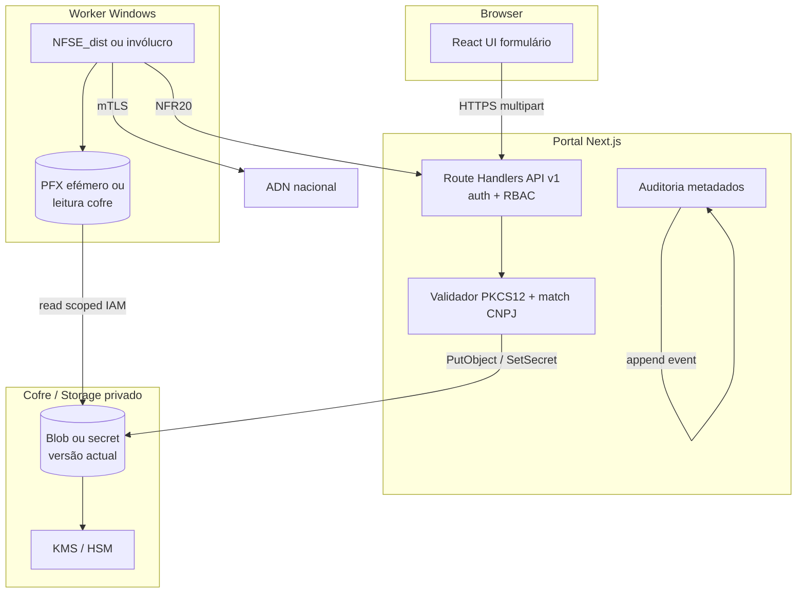

# Arquitectura técnica — Upload de certificado e-CNPJ pelo browser (cofre → worker)

**Fontes:** `docs/prd-upload-certificado-browser-edicao-empresa-monitorada.md` (**CE-BR\***, **BR-NFR\***), `docs/front-end-spec-upload-certificado-browser-edicao-empresa-monitorada.md`.  
**Documentos irmãos:** `docs/architecture-importacao-certificado-empresa-monitorada-adn.md` (MVP *sem* upload — **CE-NFR1**), `docs/architecture-integracao-nfse-dist-adn.md` (**NFR19**, **NFR20**), `docs/briefing-importacao-certificado-empresa-monitorada-adn.md`.  
**Referência externa:** [NFSE_dist](https://github.com/RafaelOliveiraCf/NFSE_dist).

**Normativa:** com a **feature de upload** **desactivada**, prevalece `docs/architecture-importacao-certificado-empresa-monitorada-adn.md` (UI não transporta bytes de certificado). Com a feature **activa** e **ADR** “browser → cofre → worker” **merged**, a fronteira de confiança passa a ser a descrita neste documento; o documento irmão deve ser actualizado com referência cruzada (ver PRD §10).

**Autor:** Aria (Architect / AIOS)  
**Data:** 2026-04-24  
**Versão:** 1.0

### Change log

| Data       | Versão | Descrição |
| ---------- | ------ | ---------- |
| 2026-04-24 | 1.0    | Arquitectura inicial: C4, API, cofre, validação CNPJ, worker, STRIDE, códigos de erro, feature flag. |

---

## 1. Resumo executivo

| Tópico | Decisão de referência (implementável; variante **B** exige ADR addendum) |
| ------ | -------------------------------------------------------------------------- |
| **Canal browser → portal** | **HTTPS** apenas; corpo **multipart/form-data** (`file` + `password`) para **Route Handler** autenticado (**opção A** do briefing de análise). |
| **Opção B (presigned)** | Alternativa válida para ficheiros grandes: API devolve URL de escrita curta; cliente faz `PUT` directo ao blob privado; portal regista metadados após callback/webhook — documentar quotas CORS e *virus scan* no ADR. |
| **Repouso do segredo** | Blob ou segredo em **cofre gerido** (ex.: AWS Secrets Manager, Azure Key Vault, GCP Secret Manager) **ou** object storage **privado** + **SSE-KMS**; **nunca** Postgres em claro; **nunca** `NEXT_PUBLIC_*`. |
| **Chave de armazenamento** | Identificador opaco por `(organizationId, companyId)` — ex.: `adn-cert/{orgId}/{companyId}/current` com versão interna para rotação (**CE-BR4**). |
| **Validação** | No **servidor** (Node runtime da função): abrir PKCS#12 com a senha, extrair certificado de *end entity*, validar cadeia mínima e **CNPJ** = `companies.cnpjDigits` (**CE-BR2**). |
| **Metadados em BD** | Tabela (ou colunas) **sem** PFX: `has_certificate`, `not_after`, `updated_at`, `updated_by_user_id`, `vault_ref` opaco, `status` (`pending_validation` \| `active` \| `revoked`). **CE-BR7:** auditoria em tabela separada sem corpo de ficheiro nem senha. |
| **Worker** | Continua NFSE_dist ou invólucro: **pull** periódico ou **evento** após upload bem sucedido materializa `certificates/<CNPJ>.pfx` em disco **efémero cifrado** ou injecta segredo via API do cofre no arranque — **detalhe de deploy** no ADR (**CE-BR3**). |
| **Feature flag** | `CERT_UPLOAD_UI_ENABLED` (UX spec) + **`CERT_UPLOAD_API_ENABLED`** no servidor (defesa em profundidade: UI off não basta se rota existir). |
| **FR48** | Inalterado; export não lê tabela de segredos (**CE-BR8**). |

---

## 2. Limites de confiança (C4 — contentor) — estado alvo

- **Fronteira nova:** `UI` **pode** enviar bytes **uma vez** por sessão autenticada; `RH` **não** persiste PFX em disco local da função além do **mínimo** necessário ao stream (preferir buffer com *zeroing* após escrita — **BR-NFR4**).  
- **Fronteira mantida:** `NEXT_PUBLIC_*` continua **sem** segredos; runbook URL inalterado (`getAdnCertRunbookUrl`).

---

## 3. Autorização e multi-tenant (**CE-BR6**, **BR-NFR5**)

1. **Sessão:** cookie de sessão ou mecanismo actual do portal (paridade com `handlePostMonitoredCompanies` / `canMutateCompanyBusinessData`).  
2. **Escopo:** todas as rotas incluem `organizationId` + `companyId` no path; **sempre** resolver `company.organization_id` na BD antes de qualquer escrita no cofre (**impedir** *path traversal* entre orgs).  
3. **403:** mesmo comportamento que UX §4.4 — não vazar existência de segredo se política de segurança o exigir (configurável; default **recomendado:** 403 genérico sem corpo discriminativo para enumeração).  
4. **Superadmin:** herdar regras existentes de mutação cross-org; se negado, não implementar bypass de cofre.

---

## 4. API HTTP (contrato de referência)

**Prefixo sugerido:** `/api/v1/organizations/:organizationId/monitored-companies/:companyId/certificate` (singular para recurso lógico único por empresa).

| Método | Finalidade | Corpo | Respostas |
| ------ | ----------- | ----- | ---------- |
| **GET** | Metadados para UI (**CE-BR3**): existe certificado activo?, `notAfter` (ISO date só dia), `status`, eventual `processing` | — | **200** JSON; **404** se empresa inexistente ou fora do tenant; **403** sem mutação **só** se decisão for ocultar existência — preferir **200** com `capabilities: { canUpload: false }` para leitores. |
| **POST** | Registo inicial ou **rotação** (**CE-BR4**) | `multipart/form-data`: `file` (.pfx/.p12), `password` (campo `password` — nunca logar) | **201** ou **204**; **202** se pipeline async (**BR-NFR8**); **400** validação; **413** tamanho; **429** rate limit (**BR-NFR6**). |
| **DELETE** | Revogação (**CE-BR5**) | — | **204**; idempotente se já revogado. |

**Cabeçalhos:** `Content-Type` obrigatório em POST; **proibido** ecoar `password` em qualquer resposta.

**Rate limiting:** chave composta `userId` + `companyId` (e opcionalmente `ip`) — valores por ambiente (ex.: **5** uploads / **15 min** / empresa em *staging*).

**Tamanho máximo:** default **5 MB** (ajustável por env `CERT_UPLOAD_MAX_BYTES`); validar **antes** de bufferizar ficheiro completo em memória se possível (*stream* para cofre quando SDK permitir).

---

## 5. Validação criptográfica (**CE-BR2**)

1. **Formato:** MIME `application/x-pkcs12` ou extensão `.pfx` / `.p12`; rejeitar outros.  
2. **Abertura:** usar biblioteca suportada em Node (ex.: `node-forge`, `pkcs12` via `openssl` subprocess **não** recomendado por superfície de comando; preferir lib mantida).  
3. **Senha:** em `string` de curta duração; após validação, **sobrescrever referência** e hint GC (não garantir em JS; limitar tempo de vida do scope).  
4. **CNPJ:** extrair do *Subject* ou SAN conforme regra ICP-Brasil (regex documentada no código + testes com certificados de homologação); normalizar para **14 dígitos** e comparar com `companies.cnpj_digits`.  
5. **Datas:** `notBefore` / `notAfter`; rejeitar expirado ou ainda não válido (política: **opcional** aviso “expira em N dias” na UI via GET).  
6. **Cadeia:** política mínima: certificado de *leaf* + verificação de emissor contra *trust store* do runtime **ou** “confiar no PKCS12” apenas para *leaf* + aviso em ADR se AC intermédia omitida.

**Erros mapeados** (alinhamento [spec UX §6](front-end-spec-upload-certificado-browser-edicao-empresa-monitorada.md)):

| `error_code` | HTTP | Uso |
| ------------- | ---- | --- |
| `CERT_UPLOAD_INVALID_FILE` | 400 | Corrupto / não PKCS12 |
| `CERT_UPLOAD_BAD_PASSWORD` | 400 | Senha errada |
| `CERT_UPLOAD_CNPJ_MISMATCH` | 400 | CNPJ ≠ empresa |
| `CERT_UPLOAD_FILE_TOO_LARGE` | 413 | BR-NFR6 |
| `CERT_UPLOAD_RATE_LIMITED` | 429 | BR-NFR6 |
| `CERT_UPLOAD_STORE_FAILED` | 502/503 | Cofre indisponível — mensagem genérica ao utilizador |

**Regra:** `message` na resposta JSON = copy aprovada; **nunca** incluir *stack*, path interno, nome original do ficheiro do utilizador + CNPJ (**BR-NFR3**).

---

## 6. Cofre e rotação (**CE-BR4**, **CE-BR5**)

- **Versão:** escrever nova versão com *suffix* `$version` ou usar **versioning** nativo do provider; marcar versão anterior como **deprecated** após POST bem sucedido.  
- **Revogação:** `DELETE` remove *current pointer* e opcionalmente agenda **purge** assíncrona do material (política de retenção legal — **BR-NFR7**).  
- **Backup:** backups do cofre apenas com políticas de cifra do cloud provider (**CE-NFR4** espelhado).  
- **IAM:** papel de runtime do Next.js **só** `PutObject`/`GetObject`/`DeleteObject` no prefixo `adn-cert/{orgId}/*` restrito ao *principal* da org **ou** papel único do portal com **condição KMS** por `organizationId` em *tag* do segredo (detalhe no ADR).

---

## 7. Worker — consumo (**épico 4** do PRD)

**Padrão recomendado:** o worker executa **job** (cron ou *watcher*) que:

1. Lista empresas com `status = active` e `vault_ref` alterado desde `last_sync_at`.  
2. Obtém PFX do cofre com credencial **da VM** (não do portal).  
3. Materializa em disco local **cifrado em repouso** (BitLocker / pasta com ACL) com nome `certificates/<CNPJ>.pfx` para paridade **NFSE_dist** **ou** escreve `senha_cert` + path temporário conforme **CE-FR1**.  
4. Sinaliza ao portal (opcional) `PATCH` interno **NFR20** com `certificate_material_version` para alinhar *readiness*.

**Alternativa:** extensão do worker para ler **thumbprint** após importação do PFX para a loja Windows (modalidade A) — decisão operacional, não obrigatória na v1.

---

## 8. Estados e *readiness* (**CE-BR3**)

| Estado BD / cofre | Comportamento `GET certificate-readiness` (existente) |
| ------------------- | -------------------------------------------------------- |
| Sem registo | Mantém fluxo actual (“pendente” / guia). |
| `pending_validation` | Novo: *processing* na UI (**BR-NFR8**); API readiness pode devolver nível intermédio acordado com **@po**. |
| `active` | Readiness pode subir para nível “pronto para verificação” após worker sincronizar — **evitar** falso positivo: opcionalmente exigir *heartbeat* do worker antes de **OK** final. |
| `revoked` | Equivalente a sem certificado para efeitos ADN. |

**Coordenação:** reutilizar `apps/web/src/lib/adn-certificate-readiness-logic.ts` com novos inputs derivados da tabela de metadados (sem expor `vault_ref` ao cliente).

---

## 9. Segurança — STRIDE (resumo)

| Ameaça | Mitigação |
| ------ | ---------- |
| **Spoofing** | Auth de sessão + CSRF token em POST se cookie-based; SameSite cookies. |
| **Tampering** | Validação CNPJ + integridade PKCS12; RBAC no path. |
| **Repudiation** | **CE-BR7** auditoria append-only (actor, resultado). |
| **Information disclosure** | Sem segredos em logs/respostas; **403** uniforme se aplicável. |
| **Denial of service** | Rate limit + tamanho máximo + *timeout* de parse. |
| **Elevation of privilege** | Checagem `organizationId` ↔ `companyId` na BD em todas as rotas. |

**Replay de upload:** POST idempotente opcional com header `Idempotency-Key` (UUID) por janela de 24h — recomendado para evitar duplicar escritas no cofre.

---

## 10. Variáveis de ambiente (servidor — não públicas)

| Variável | Obrigatório (com feature on) | Exemplo | Notas |
| -------- | ---------------------------- | ------- | ----- |
| `CERT_UPLOAD_API_ENABLED` | Sim | `true` | Espelho servidor da feature UI. |
| `CERT_UPLOAD_MAX_BYTES` | Não | `5242880` | 5 MB. |
| `CERT_UPLOAD_RATE_LIMIT_*` | Não | por env | Alinhar a middleware existente. |
| `CERT_VAULT_PROVIDER` | Sim | `aws-sm` \| `azure-kv` \| `gcp-sm` | ADR escolhe. |
| Credenciais do provider | Sim (runtime) | OIDC / role IAM | **Nunca** em `.env` commitado; Vercel *Integration* ou secrets CI. |

---

## 11. Implementação front-end (resumo técnico)

- **Feature flag:** `process.env.NEXT_PUBLIC_CERT_UPLOAD_UI_ENABLED` **apenas** booleano público (sem segredos).  
- **Chamadas:** `fetch` com `FormData`; **sem** `localStorage` para PFX/senha ([spec UX](front-end-spec-upload-certificado-browser-edicao-empresa-monitorada.md) §1).  
- **Componente:** extensão de `AdnCertificateReadinessCard` ou *wrapper* que *lazy-loads* o formulário quando flag **e** `canMutate`.  
- **Erros:** mapear `error_code` do JSON às strings do spec UX (tabela única partilhada com ADN worker errors pattern).

---

## 12. Testes e CI

- **Fixtures:** PKCS#12 gerado em *fixture* de teste com CNPJ conhecido **ou** mock do validador com interface injectável (**nunca** PFX real de produção no repositório).  
- **Integração:** cofre *emulator* (LocalStack, Azurite) ou *skip* condicional em CI sem secrets.  
- **Regressão:** com flags **off**, *suite* actual de **CE-NFR1** (sem campo upload) deve passar sem alteração de comportamento.

---

## 13. Rastreio PRD / UX → componentes

| ID | Componente / artefacto |
| -- | ------------------------ |
| **CE-BR1–CE-BR2** | Route Handler POST + módulo `lib/cert-upload-validate.ts` (nome ilustrativo) |
| **CE-BR3** | `GET` metadados + extensão readiness logic |
| **CE-BR4–CE-BR5** | POST (versão) + DELETE + cofre versioning |
| **CE-BR6** | Middleware RBAC reutilizado |
| **CE-BR7** | Tabela `company_certificate_audit` (nome ilustrativo) |
| **CE-BR8** | Garantir export handler não importa módulo de cofre |
| **BR-NFR1–BR-NFR4** | §2, §4, §5, logging §9 |
| **BR-NFR6** | Middleware rate limit + `CERT_UPLOAD_MAX_BYTES` |
| **UX §5.2** | `fieldset` / `Dialog` — implementação em TSX |

---

## 14. ADR obrigatório (conteúdo mínimo sugerido)

1. **Título:** “Browser → cofre → worker para certificado e-CNPJ (ADN)”.  
2. **Contexto:** conflito com **CE-NFR1** / **NFR19** e como este desenho o resolve.  
3. **Decisão:** opção **A** vs **B**; provider de cofre; política de retenção/purge.  
4. **Consequências:** actualização de `docs/architecture-importacao-certificado-empresa-monitorada-adn.md` §2 diagrama; custo cloud; obrigações LGPD (**BR-NFR7**).  
5. **Data e donos:** `@architect` + `@pm`.

---

## 15. Handoff

- **@data-engineer:** DDL para metadados + auditoria; **sem** coluna `pfx_bytes`.  
- **@dev:** rotas §4, validador §5, feature flags §10–11; CSP se novos domínios.  
- **@qa:** matriz §5 + STRIDE §9 + *tenant isolation*.  
- **@ux-design-expert:** alinhar `error_code` com tabela UX §6.

---

— **Aria (Architect / AIOS)** — arquitectura alinhada ao PRD e à spec de UX; **pendente ADR** para congelar opção A/B e provider.
