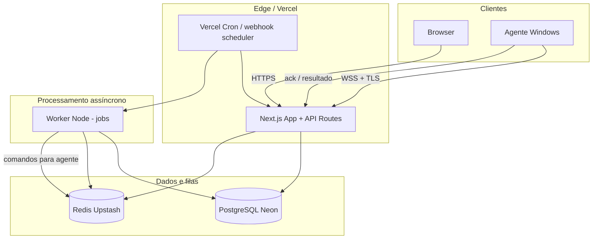
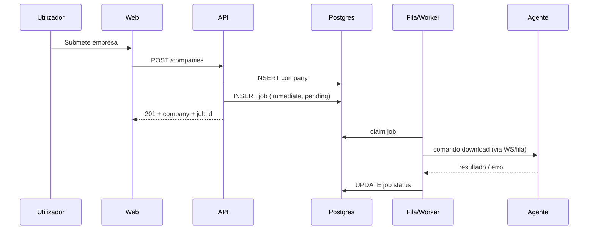
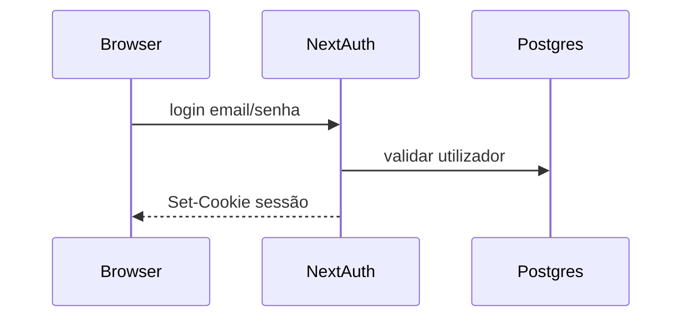

# Portal de Automação de Notas Fiscais (por empresa) — Arquitetura Fullstack

## Introdução

Este documento descreve a arquitetura técnica unificada (web, API, workers, agente desktop e infraestrutura) do **Portal de Automação de Notas Fiscais**, servindo como referência para implementação e revisão. Combina o que tradicionalmente seriam documentos separados de backend e frontend num único modelo adequado a equipas fullstack e agentes de IA.

**Documentos de entrada:** `docs/prd.md` (v0.1), `docs/front-end-spec.md` (v0.1).

### Starter Template ou Projeto Existente

**Estado:** *Greenfield* — sem repositório de aplicação pré-existente no workspace.  
**Recomendação de arranque:** monorepo **Turborepo** com app **Next.js** (App Router, TypeScript), pacotes partilhados e agente desktop em pacote separado (ou repositório irmão para releases do instalador Windows). O preset AIOS `nextjs-react` alinha com esta linha.

### Change Log

| Date       | Version | Description                                              | Author        |
| ---------- | ------- | -------------------------------------------------------- | ------------- |
| 2026-04-20 | 0.1     | Arquitetura inicial derivada do PRD e front-end-spec      | Architect (AIOS) |

---

## High Level Architecture

### Technical Summary

O sistema segue um modelo **web SaaS + cliente local**: a aplicação **Next.js** em **Vercel** expõe UI, API HTTP e health checks; **PostgreSQL** (Neon) persiste contas, empresas, jobs e estado de pairing; **Redis** (Upstash) suporta filas, rate limiting e locks leves; **workers** assíncronos (processos Node no mesmo deploy ou serviço dedicado) consomem filas e executam agendamentos com fuso **America/Sao_Paulo**. O **agente Windows** mantém ligação **WSS** autenticada ao backend, recebe comandos versionados para download e grava ficheiros em `{raiz}/{14 dígitos}/{codigo-sistema}/`. Esta separação cumpre FR6–FR13 e NFR1–NFR4: TLS em todo o tráfego, segredos fora do código, auditoria append-only para eventos sensíveis e correlação de logs por `request_id` / `job_id`.

### Platform and Infrastructure Choice

**Opções consideradas (resumo):**

| Opção | Prós | Contras |
| ----- | ---- | ------- |
| **A — Vercel + Neon + Upstash + workers Node** | Encaixa Next.js, escala por funções, Redis gerido barato para MVP | Workers longos podem precisar de **Fluid** ou serviço à parte se jobs > timeout serverless |
| **B — AWS (ECS + RDS + SQS)** | Controlo fino, enterprise | Mais custo operacional no MVP |
| **C — Supabase + Vercel** | Auth e DB rápidos; Realtime opcional | Filas/agendamento complexo ainda precisam de Inngest/Bull ou Edge Functions bem desenhadas |

**Decisão recomendada (MVP): Opção A**

- **Platform:** Vercel (frontend + API routes/server actions), Neon (Postgres serverless), Upstash (Redis), armazenamento de objetos **não obrigatório** no MVP (NF no disco local via agente).
- **Key services:** DNS e TLS via Vercel; secrets em **Vercel Environment** + rotação manual inicial; logs estruturados (Vercel + integração opcional Axiom/Datadog).
- **Regions:** API/UI — região primária **gru1** (São Paulo) na Vercel quando disponível para o projeto; Neon/Upstash na mesma área lógica para latência. Agendamento usa sempre TZ **America/Sao_Paulo** (FR11), independentemente da região do edge.

### Repository Structure

- **Structure:** **Monorepo** (PRD — repositório único para web, workers partilhados, pacotes `shared`).
- **Monorepo tool:** **Turborepo** + **pnpm** workspaces.
- **Package organization:**
  - `apps/web` — Next.js (UI + REST API / route handlers).
  - `apps/worker` *(opcional pacote separado)* — processo Node para consumo de fila e tarefas > 60s; no MVP pode ser o mesmo código invocado por cron HTTP ou fila.
  - `apps/agent` — cliente desktop (Tauri ou Electron — ver secção agente).
  - `packages/shared` — tipos TS, validadores (Zod), constantes de contrato agente.
  - `packages/config` — ESLint/TSConfig partilhados.

### High Level Architecture Diagram



*Nota:* o diagrama simplifica: na prática o worker pode publicar mensagens para o canal do agente via serviço de presença (Redis pub/sub ou DB de “comandos pendentes” lidos pelo agente após reconexão).

### Architectural Patterns

- **Modular monolith (web + worker no mesmo código):** reduz complexidade operacional no MVP; fronteiras claras por módulos (`/lib/domain`, `/lib/jobs`). *Rationale:* PRD NFR7 (dezenas de empresas).
- **API HTTP REST + JSON:** contratos estáveis para web e futuros clientes; versionamento `/v1`. *Rationale:* interoperabilidade e documentação OpenAPI.
- **Filas e agendamento:** padrão **outbox** ou job table + worker; retries com backoff exponencial (NFR9). *Rationale:* FR12, idempotência.
- **BFF implícito:** Route Handlers Next.js como fachada; sem expor Postgres ao cliente. *Rationale:* segurança e validação centralizada.
- **Component-based UI (React + shadcn/ui):** conforme `docs/front-end-spec.md`. *Rationale:* WCAG AA e velocidade.
- **Contrato agente versionado:** envelopes JSON com `schema_version` e assinatura HMAC opcional em fase 2. *Rationale:* PRD “contrato semântico”.

---

## Tech Stack

Tabela de referência para o MVP (versões a fixar no bootstrap do repositório).

| Category | Technology | Version (pin no lockfile) | Purpose | Rationale |
| -------- | ---------- | ------------------------- | ------- | --------- |
| Frontend Language | TypeScript | 5.x | Tipagem partilhada | Consistência com backend |
| Frontend Framework | Next.js | 15.x / 16.x | App Router, SSR, API | PRD + preset nextjs-react |
| UI Component Library | shadcn/ui + Radix | latest compatível | Acessível, tematização | front-end-spec |
| State Management | TanStack Query + React context mínimo | 5.x | Dados servidor; UI local | Evita store global desnecessário |
| Backend Language | TypeScript | 5.x | Mesma stack | DX e tipos partilhados |
| Backend Framework | Next.js Route Handlers + Node runtime | (mesmo app) | REST, auth, WS upgrade | Deploy unificado |
| API Style | REST (JSON) | OpenAPI 3 gerado ou manual | CRUD + jobs | Simplicidade e caching HTTP |
| Database | PostgreSQL (Neon) | 16+ | Relacional, ACID | Empresas, jobs, auditoria |
| Cache / Queue | Redis (Upstash) | 7.x API | Fila, rate limit, pub/sub leve | Baixo ops no MVP |
| File Storage | N/A MVP | — | NF locais via agente | PRD |
| Authentication | Auth.js (NextAuth v5) ou Better Auth | latest | Sessões, OAuth futuro | Email/senha MVP |
| Frontend Testing | Vitest + Testing Library | latest | Unit/component | Pirâmide PRD |
| Backend Testing | Vitest + supertest / hono fetch | latest | Integração API | — |
| E2E Testing | Playwright | latest | Smoke login → empresa → job | PRD testing |
| Build Tool | Turborepo + pnpm | latest | Monorepo | PRD monorepo |
| Bundler | Turbopack (Next) | integrado | Dev/build | Default Next |
| IaC Tool | Terraform ou Pulumi *(fase 2)* | — | Infra reprodutível | Opcional no MVP |
| CI/CD | GitHub Actions | — | Lint, test, deploy Vercel | Standard |
| Monitoring | Vercel Analytics + logs | — | Tráfego e erros | MVP |
| Logging | Pino ou consola estruturada + request_id | — | JSON correlacionado | NFR8 |
| CSS Framework | Tailwind CSS | 4.x | Utility-first | PRD / spec UX |

*Auth.js vs Better Auth:* escolher uma na implementação; ambas suportam credenciais com adapter Prisma/Drizzle.

---

## Data Models

### User (conta humana)

**Purpose:** identidade para isolamento multi-tenant (FR2).

**Key attributes:**

- `id` (uuid), `email` (unique), `password_hash` (se credenciais), `name`, `created_at`, `updated_at`.

**Relationships:** 1:N `Company`, 1:N `AgentDevice`, 1:N `AuditEvent`.

```typescript
export interface User {
  id: string;
  email: string;
  name: string | null;
  createdAt: string;
  updatedAt: string;
}
```

### Company (Empresa)

**Purpose:** CNPJ normalizado + código do sistema por conta (FR3–FR6, FR16–FR17).

**Key attributes:**

- `id`, `account_id`, `cnpj_digits` (char 14), `trade_name`, `system_code` (texto sanitizado na UI; persistido como texto), `active` (boolean), `created_at`, `updated_at`.
- Unique `(account_id, cnpj_digits, system_code)`.

```typescript
export interface Company {
  id: string;
  accountId: string;
  cnpjDigits: string; // 14
  tradeName: string | null;
  systemCode: string;
  active: boolean;
  createdAt: string;
  updatedAt: string;
}
```

### Job (execução de coleta)

**Purpose:** rastrear estado assíncrono (FR9, FR10, FR12, FR15).

**Key attributes:**

- `id`, `company_id`, `type` (`immediate` | `scheduled_monthly`), `status` (`pending` | `running` | `success` | `failed` | `cancelled`), `scheduled_for` (timestamptz), `started_at`, `finished_at`, `attempt_count`, `next_retry_at`, `error_code`, `error_message_public`, `idempotency_key` (unique por empresa+tipo+período quando aplicável).

**Relationships:** N:1 `Company`.

### AgentDevice

**Purpose:** pairing e revogação (FR8, NFR4).

**Key attributes:**

- `id`, `account_id`, `label`, `last_seen_at`, `revoked_at`, `public_key_fingerprint` *(fase 2)*.

### PairingSession

**Purpose:** códigos de curta duração para emparelhamento.

**Key attributes:**

- `id`, `account_id`, `code_hash`, `expires_at`, `consumed_at`, `device_id` (nullable até concluir).

### AuditEvent (append-only)

**Purpose:** NFR3/NFR4 — pairing, revogação, desativação de empresa.

**Key attributes:** `id`, `account_id`, `actor_user_id`, `action`, `metadata` (jsonb), `created_at`.

---

## API Specification

**Estilo:** REST JSON, autenticação **session cookie** (web) ou **Bearer** para agente após troca de token pós-pairing.

### REST (sumário OpenAPI — endpoints MVP)

```yaml
openapi: 3.0.0
info:
  title: NF Portal API
  version: 1.0.0
  description: API MVP — empresas, jobs, agente
servers:
  - url: https://api.example.com/v1
    description: Produção (placeholder)
paths:
  /health:
    get:
      summary: Liveness/readiness
      security: []
  /auth/register:
    post:
      summary: Registo (se aplicável)
  /auth/session:
    get:
      summary: Sessão atual
  /companies:
    get:
      summary: Listar empresas da conta
    post:
      summary: Criar empresa (dispara job imediato — FR9)
  /companies/{id}:
    get:
      summary: Detalhe + última execução agregada
    patch:
      summary: Atualizar nome fantasia / system_code / active
  /companies/{id}/jobs:
    get:
      summary: Histórico paginado de jobs
  /agent/pairing:
    post:
      summary: Gerar código de pairing
    delete:
      summary: Revogar dispositivos / sessão de pairing
  /agent/ws:
    get:
      summary: Upgrade WebSocket (documentado como /v1/agent/stream na implementação)
```

**Erros:** formato unificado (ver secção Error Handling). Códigos: `400` validação, `401` não autenticado, `403` tenant, `404`, `409` conflito CNPJ+código, `429` rate limit.

**Paginação:** `?cursor=` ou `?page=` + `limit` (default 20).

---

## Components

### Web Application (Next.js)

**Responsibility:** UI, Route Handlers, SSR, autenticação.

**Key interfaces:** HTTP JSON, cookies de sessão, upgrade WS (se hospedado no mesmo app).

**Dependencies:** Postgres, Redis, módulo de domínio partilhado.

### Job Orchestrator (worker)

**Responsibility:** transições de estado de `Job`, enfileirar retries, invocar **Connector** (MVP: stub ou integração única).

**Key interfaces:** fila Redis/BullMQ ou tabela + `SELECT FOR UPDATE SKIP LOCKED`.

**Dependencies:** Postgres, Redis, conector, serviço de notificação ao agente.

### Connector Service (MVP)

**Responsibility:** abstrair “origem” por `system_code` (FR14); implementação concreta plugável.

**Dependencies:** credenciais no cofre (env/DB cifrado), sem logs de segredo (NFR2).

### Agent Gateway

**Responsibility:** autenticar agente, manter presença, entregar comandos `DownloadAndStore` com paths relativos validados.

**Dependencies:** Redis para fila de mensagens por `device_id`, Postgres para auditoria.

### Audit Logger

**Responsibility:** escrever `AuditEvent` imutável.

**Technology:** inserções apenas via API interna; sem updates.

---

## External APIs

**Estado MVP:** integrações específicas por “sistema de NF” são **plugins** do Connector; podem não existir APIs públicas estáveis — documentar cada integração num ficheiro à parte.

**Placeholder:**

| API name | Purpose | Notes |
| -------- | ------- | ----- |
| Portal fiscal alvo (TBD) | Download NF | Termos de uso, anti-bot, credenciais em cofre |

Se não houver API oficial, o conector pode usar automação controlada **fora** do escopo deste documento de arquitetura (risco legal/técnico — PRD R1).

---

## Core Workflows

### Cadastro de empresa → job imediato



### Job mensal (dia 1, 06:00 America/Sao_Paulo)

```mermaid
sequenceDiagram
  participant CRON as Scheduler
  participant Q as Worker
  participant DB as Postgres
  participant AG as Agente

  CRON->>Q: tick (enfileirar por empresa ativa)
  Q->>DB: INSERT job scheduled_monthly idempotente
  Q->>AG: se online, entregar; senão pending + next_retry_at
```

---

## Database Schema

**PostgreSQL** — convenção `snake_case` nas tabelas.

```sql
CREATE TABLE users (
  id UUID PRIMARY KEY DEFAULT gen_random_uuid(),
  email TEXT NOT NULL UNIQUE,
  password_hash TEXT,
  name TEXT,
  created_at TIMESTAMPTZ NOT NULL DEFAULT now(),
  updated_at TIMESTAMPTZ NOT NULL DEFAULT now()
);

CREATE TABLE companies (
  id UUID PRIMARY KEY DEFAULT gen_random_uuid(),
  account_id UUID NOT NULL REFERENCES users(id) ON DELETE CASCADE,
  cnpj_digits CHAR(14) NOT NULL,
  trade_name TEXT,
  system_code TEXT NOT NULL,
  active BOOLEAN NOT NULL DEFAULT true,
  created_at TIMESTAMPTZ NOT NULL DEFAULT now(),
  updated_at TIMESTAMPTZ NOT NULL DEFAULT now(),
  UNIQUE (account_id, cnpj_digits, system_code)
);
CREATE INDEX idx_companies_account ON companies(account_id);

CREATE TYPE job_status AS ENUM ('pending','running','success','failed','cancelled');
CREATE TYPE job_type AS ENUM ('immediate','scheduled_monthly');

CREATE TABLE jobs (
  id UUID PRIMARY KEY DEFAULT gen_random_uuid(),
  company_id UUID NOT NULL REFERENCES companies(id) ON DELETE CASCADE,
  type job_type NOT NULL,
  status job_status NOT NULL DEFAULT 'pending',
  scheduled_for TIMESTAMPTZ,
  started_at TIMESTAMPTZ,
  finished_at TIMESTAMPTZ,
  attempt_count INT NOT NULL DEFAULT 0,
  next_retry_at TIMESTAMPTZ,
  error_code TEXT,
  error_message_public TEXT,
  idempotency_key TEXT NOT NULL UNIQUE
);
CREATE INDEX idx_jobs_company_created ON jobs(company_id, scheduled_for DESC);
CREATE INDEX idx_jobs_status_retry ON jobs(status, next_retry_at);

-- agent_devices, pairing_sessions, audit_events: estrutura análoga na implementação
```

*Índices adicionais* após primeiras queries reais. **RLS:** opcional se usar Supabase; com Neon + app único, **enforcar `account_id` na camada de serviço** e testes de integração.

---

## Frontend Architecture

### Component Organization

```
apps/web/src/
├── app/                    # App Router — rotas públicas e (dashboard)
├── components/
│   ├── ui/                 # shadcn
│   └── features/           # empresas, jobs, agente
├── lib/
│   ├── api-client.ts       # fetch com credenciais
│   ├── query-keys.ts
│   └── validators.ts       # CNPJ etc.
└── hooks/
```

### State Management

- **Server state:** TanStack Query (`companies`, `jobs`, `agentStatus`) com **staleTime** curto para lista (ex.: 15s) e refetch ao focar janela — alinha com “polling leve” da spec UX.
- **Client UI:** `useState` local; contexto só para **toaster** e tema.

### Routing

- Rotas públicas: `/login`, `/register`, `/forgot-password`.
- Rotas autenticadas: layout `(app)` com guard (middleware Next.js verificando sessão).
- **Middleware:** redirecionar não autenticados para `/login`; cookie HttpOnly + Secure + SameSite=Lax.

### Frontend Services Layer

```typescript
// Exemplo ilustrativo — api-client centralizado
export async function apiJson<T>(path: string, init?: RequestInit): Promise<T> {
  const res = await fetch(`${process.env.NEXT_PUBLIC_API_BASE}${path}`, {
    ...init,
    headers: { 'Content-Type': 'application/json', ...init?.headers },
    credentials: 'include',
  });
  if (!res.ok) throw await normalizeError(res);
  return res.json() as Promise<T>;
}
```

---

## Backend Architecture

### Service Architecture

- **Camada HTTP:** Route Handlers finos → chamam **serviços de domínio** (`CompanyService`, `JobService`, `AgentService`).
- **Worker:** mesmo pacote ou `apps/worker` com import dos serviços; execução via **cron HTTP protegido por secret** ou **BullMQ** consumindo Redis.
- **Agendamento mensal:** job criado por **query idempotente** “para cada empresa ativa, criar job se não existir para período YYYY-MM” ou scheduler dedicado (Inngest/Trigger.dev como alternativa gerida).

### Authentication and Authorization



- **Autorização:** todo handler obtém `session.user.id` e filtra por `account_id = user.id`.
- **Agente:** após pairing, token de **device** com TTL curto renovável; rota WS valida token e `device_id`.

### Agente — protocolo mínimo (contrato)

**Canal:** WebSocket `wss://.../v1/agent/connect?token=...` (detalhe de path a fixar).

**Mensagem envelope (JSON):**

```typescript
interface AgentEnvelopeV1 {
  schemaVersion: '1.0';
  messageId: string;
  kind: 'command' | 'ack' | 'event' | 'error';
  payload: DownloadCommandV1 | AckPayload | EventPayload;
}

interface DownloadCommandV1 {
  jobId: string;
  companyId: string;
  cnpjDigits: string;
  systemCodeSlug: string; // sanitizado
  relativeTargetPath: string; // validado no agente
  connectorKey: string;
}
```

**Segurança:** TLS obrigatório; **replay:** `messageId` único armazenado por janela temporal; rotação de token de device.

---

## Unified Project Structure

```
nf-portal/
├── apps/
│   ├── web/                 # Next.js
│   └── agent-desktop/       # Tauri (recomendado) ou Electron
├── packages/
│   ├── shared/              # types, zod schemas, agent contract
│   └── config/              # eslint, tsconfig
├── docs/
│   ├── prd.md
│   ├── front-end-spec.md
│   └── architecture.md
├── turbo.json
├── pnpm-workspace.yaml
└── README.md
```

---

## Development Workflow

### Prerequisites

```bash
# Node 22 LTS, pnpm 9+, Git
corepack enable && corepack prepare pnpm@latest --activate
```

### Initial Setup

```bash
pnpm install
cp apps/web/.env.example apps/web/.env.local
# Configurar DATABASE_URL, REDIS_URL, AUTH_SECRET
pnpm db:migrate   # prisma ou drizzle — a definir no bootstrap
```

### Development Commands

```bash
pnpm dev          # turborepo: web (+ worker local opcional)
pnpm --filter web dev
pnpm test
pnpm e2e
```

### Required Environment Variables

```bash
# apps/web/.env.local
DATABASE_URL=postgresql://...
REDIS_URL=redis://...
AUTH_SECRET=...
NEXT_PUBLIC_APP_URL=http://localhost:3000
AGENT_WS_SECRET=...
CRON_SECRET=...           # protege rotas de cron interno
```

---

## Deployment Architecture

**Frontend:** Vercel — build `apps/web`, output Next.

**Backend:** mesmo projeto; **serverless functions** para API; **cron** Vercel para tick diário (verificar jobs pendentes e january monthly enqueue) ou worker externo.

**Environments**

| Environment | Frontend URL | Backend URL | Purpose |
| ----------- | ------------ | ------------- | ------- |
| Development | http://localhost:3000 | idem | Dev local |
| Staging | `*.vercel.app` | idem | QA |
| Production | domínio próprio | idem API | Live |

**CI/CD:** GitHub Actions — `lint`, `typecheck`, `test`, `build`; deploy preview em PR; produção em merge para `main`.

---

## Security and Performance

### Security (resumo STRIDE)

| Ameaça | Mitigação |
| ------ | --------- |
| Spoofing | Auth sessão + tokens de device; HTTPS everywhere |
| Tampering | Validação Zod nos handlers; idempotência em jobs |
| Repudiation | `AuditEvent` para ações sensíveis |
| Information disclosure | Erros genéricos ao cliente; segredos só em env/vault |
| Denial of service | Rate limit (Redis) em login e pairing |
| Elevation | Autorização por `account_id`; sem IDs adivinháveis em URLs públicas |

**Headers:** CSP restritiva progressiva; `HSTS` em produção.

### Performance

- **Frontend:** code splitting por rota; imagens otimizadas; TanStack Query cache.
- **Backend:** índices em `jobs(company_id, …)`; evitar N+1 com joins explícitos; timeouts em chamadas ao conector.
- **Agente:** downloads em série ou paralelo limitado (config).

---

## Testing Strategy

```
        E2E (Playwright) — fluxo crítico
       /              \
  Integração API    Integração worker (DB+Redis testcontainers opcional)
     /                    \
Frontend unit (Vitest)   Backend unit (Vitest)
```

- **Smoke E2E:** registo/login → criar empresa → ver job `pending/running` (mock de agente ou ambiente de teste).

---

## Coding Standards (crítico para agentes)

- **Tipos partilhados:** importar de `packages/shared`; não duplicar interfaces de API.
- **Sem `process.env` espalhado:** objeto `env` validado com Zod em `lib/env.ts`.
- **Jobs:** sempre atualizar estado em transação quando ligado a `Company`.
- **Logs:** nunca logar corpo de credenciais nem tokens completos.
- **CNPJ:** validar no servidor mesmo que o cliente valide (defesa em profundidade).

### Naming Conventions

| Element | Frontend | Backend | Example |
| ------- | -------- | ------- | ------- |
| Components | PascalCase | — | `CompanyTable.tsx` |
| Hooks | useX | — | `useCompanies.ts` |
| API routes | — | kebab em URL | `/v1/companies` |
| DB tables | — | snake_case | `companies`, `job_status` |

---

## Error Handling Strategy

**Formato API:**

```typescript
interface ApiErrorBody {
  error: {
    code: string;
    message: string;
    details?: Record<string, unknown>;
    requestId: string;
    timestamp: string;
  };
}
```

**Frontend:** interceptor central mapeia `code` → toast; erros de validação por campo.

**Backend:** middleware único serializa exceções de domínio (`ConflictError` → 409).

---

## Monitoring and Observability

- **request_id** em cada request HTTP (header `x-request-id`).
- **Correlação:** `job_id`, `company_id`, `account_id` em todos os logs do worker.
- **Métricas:** taxa de jobs falhos, tempo médio até `success`, agentes online (heartbeat).

---

## Checklist Results Report

**Estado:** execução do `architect-checklist` **pendente** após bootstrap do repositório e primeira revisão humana.

---

## Próximos passos técnicos

1. Bootstrap do monorepo (Turborepo + Next + Drizzle/Prisma + Auth).  
2. Implementar esquema SQL e migrações; seed de desenvolvimento.  
3. Definir biblioteca de fila (BullMQ vs Inngest) e prova de agendamento mensal com TZ.  
4. Protótipo do agente: CLI Node local antes do Tauri, para validar contrato `AgentEnvelopeV1`.  
5. **@data-engineer:** rever índices e políticas de retenção; **@dev:** implementar épicos PRD 1–4.

---

— Aria (Architect). Documento alinhado ao template `fullstack-architecture-template-v2` (AIOS).
