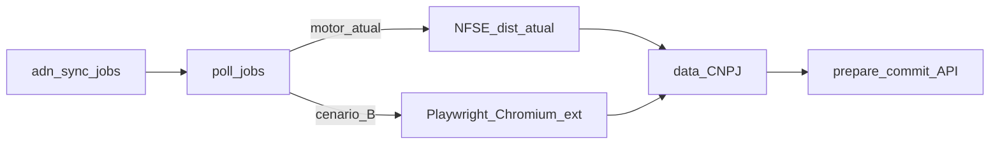

# Briefing: cenário B — recolha ADN via Playwright + extensão Chrome (Windows)

## 1. Objetivo

Documentar o **cenário B** de evolução do motor de download de NFS-e: em vez de depender apenas do cliente Python **[NFSE_dist](https://github.com/RafaelOliveiraCf/NFSE_dist)** (`run_download_workflow` em `third_party/NFSE_dist`), avaliar ou prototipar uma **segunda via** no mesmo **worker Windows** — automação de browser (ex. **Playwright** com **Chromium**) com **extensão Chrome** carregada, para acelerar ou contornar limites percebidos do fluxo `curl`/Schannel.

Este ficheiro é **somente briefing**: âmbito, riscos, variantes de integração e critérios de decisão. **Não** substitui PRD, story nem revisão jurídica sobre uso do Portal Nacional ou de extensões de terceiros.

**Contraste com o cenário A (importação manual):** no cenário A, o utilizador humano descarrega ficheiros (por exemplo com uma extensão) e o sistema **importa** de uma pasta monitorizada. No cenário B, o **script** tenta **reproduzir** o fluxo no browser (sessão, período, download), mantendo a natureza **automatizada** do job em fila.

---

## 2. Contexto no repositório actual

- **Fila e worker:** jobs `adn_sync_jobs` são consumidos por [`workers/nfse-portal-bridge/poll_jobs.py`](../workers/nfse-portal-bridge/poll_jobs.py). Em `process_one_job`, após materializar certificado e escrever `clients.json`, o ramo normal chama `run_download_workflow_once` em [`nfse_runner.py`](../workers/nfse-portal-bridge/nfse_runner.py), que importa `main` do NFSE_dist e executa `run_download_workflow()`.
- **Smoke / bypass:** `NFSE_BRIDGE_SKIP_NFSE_DIST=1` evita a recolha local e serve para testar fila + PATCH + uploads sem ADN.
- **Upload para o portal:** após ficheiros em disco sob `NFSE_dist/data/{cnpj}/`, o envio usa [`portal_artifacts.sync_data_directory`](../workers/nfse-portal-bridge/portal_artifacts.py): `POST /api/internal/v1/adn/uploads/prepare` → PUT para URL assinada → `POST .../adn/artifacts/commit`, com HMAC (`ADN_WORKER_HMAC_SECRET`) e os mesmos `organization_id`, `company_id`, `job_id`.
- **Playwright noutro âmbito:** o monorepo já usa Playwright para **E2E do frontend** (ver [`docs/qa/ci-pipeline-reproducao.md`](qa/ci-pipeline-reproducao.md)). O cenário B implica **dependência e pipeline novos no worker** — não confundir com os testes da app web.

Conclusão: o cenário B deve **reutilizar** a fase de **upload e espelho local** sempre que o layout de saída for compatível com o que `sync_data_directory` já espera (XML/PDF por CNPJ).

---

## 3. Definição do cenário B (motor)

| Elemento | Descrição |
|----------|-----------|
| **Onde corre** | Mesma VM Windows que hoje executa o `nfse-portal-bridge` (ou subprocesso lançado por ele). |
| **Browser** | Chromium controlado por Playwright (ou ferramenta equivalente), tipicamente com argumentos para **carregar extensão** (`--load-extension` / API Playwright `launchPersistentContext` + path da extensão empacotada). |
| **Extensão (exemplo ilustrativo)** | Extensões da Chrome Web Store automatizam downloads a partir do Portal Nacional quando o utilizador está autenticado — por exemplo [Baixar NFSe Nota Fiscal de Serviço Eletrônica Emitidas e Recebidas](https://chromewebstore.google.com/detail/baixar-nfse-nota-fiscal-d/enehmclajcndmgefbmjhecccoegbdgea). O briefing **não** recomenda um fornecedor específico; a escolha é decisão de produto e compliance. |
| **Saída** | Ficheiros XML/PDF (e estrutura de pastas) que possam ser mapeados para `NFSE_dist/data/{cnpj}/` **ou** para um directório configurável que o mesmo pipeline de upload consiga percorrer. |

---

## 4. Premissas e riscos

| Risco | Detalhe |
|-------|---------|
| **Sessão gov.br** | Cookies, MFA, expiração de sessão e alterações de UI quebram selectors; pode exigir perfil persistente e intervenção humana periódica. |
| **Extensão de terceiros** | Actualizações na loja alteram comportamento ou IDs de UI; termos de uso e suporte não são controláveis pelo produto. |
| **Headless vs headful** | Muitas extensões assumem janela visível; automação “invisível” pode ser bloqueada ou instável. |
| **Paralelismo** | Vários jobs simultâneos com vários browsers aumentam RAM e footprint; pode ser necessário **serializar** recolhas browser. |
| **Portal Nacional** | Limitações de taxa, mensagens de erro e mudanças de fluxo — sem garantia de estabilidade para automação. |
| **Segurança** | Perfil do browser com sessão activa é **superfície crítica**; política de disco, permissões e não commit de perfis em git. |

---

## 5. Direcção técnica — variantes (para decidir numa story)

### B1 — Flag no worker (troca só da fase de recolha)

- Nova variável de ambiente (ex. `ADN_DOWNLOAD_ENGINE=playwright_ext` ou `nfse_dist`), lida em `poll_jobs` / `nfse_runner`.
- O mesmo `job_id` e contexto de empresa; apenas o passo entre “certificado/config prontos” e “ficheiros em `data/`” é substituído.

### B2 — Subprocesso dedicado

- Processo à parte (Node + Playwright ou Python + Playwright) recebe parâmetros (CNPJ, intervalo de datas, caminho de saída, caminho da extensão) e devolve exit code + logs.
- O worker Python continua a orquestrar Postgres, HMAC e `sync_data_directory`.

### B3 — Protótipo incremental

- Validar primeiro **download humano** + pasta fixa (aproxima cenário A); depois introduzir Playwright só para etapas parciais (ex. abrir portal com perfil já logado).

---

## 6. Integração com jobs e metadados

- Manter vínculo **`organization_id`**, **`company_id`**, **`job_id`** no fluxo de upload actual.
- Opcional (story): estender `summary_json` do job com campos como `downloadEngine: "playwright_extension"`, duração da fase browser, contagem de timeouts; **screenshots** apenas em modo debug e nunca com dados pessoais em repositórios partilhados.

---

## 7. Segurança, compliance e auditoria

- Alinhar ao espírito de [`docs/architecture-integracao-nfse-dist-adn.md`](architecture-integracao-nfse-dist-adn.md): auditoria de jobs, sem segredos em logs públicos.
- Não registar HTML completo de páginas de login; truncar URLs se necessário.
- Perfil Chrome persistente: localização acordada com operations (pasta dedicada, permissões NTFS, backup **não** em partilha pública).

---

## 8. Critérios de sucesso e rollback

**Sucesso mínimo para avançar da espinha:**

1. Paridade de **ingestão** com o fluxo actual: mesmos tipos de artefactos aceites pelo `prepare`/`commit`, **idempotência** por chave de acesso onde aplicável (ver `portal_artifacts.upload_file`).
2. Job **observável** (estado, logs do worker) com falhas **classificáveis** (sessão, portal, extensão, I/O disco).

**Rollback:**

- Desactivar o motor B por env e voltar a `NFSE_dist` sem alterar o contrato com o portal.
- Documentar versão da extensão e do Chromium usados em cada release interna.

---

## 9. Não-objetivos deste briefing

- Certificar **conformidade** com políticas do governo federal, da Receita ou do autor da extensão — requer revisão explícita fora deste documento.
- Substituir o PRD ou definir preços / SLA comercial.
- Prescrever Playwright como única stack (Puppeteer ou outros drivers permanecem alternativas técnicas).

---

## 10. Diagrama de contexto (cenário B vs motor actual)

---

## 11. Handoff sugerido

- **@pm:** decisão go/no-go sobre dependência de extensão de terceiros e prioridade vs cenário A (importação de pasta).
- **@architect / @sm:** story com POC isolado (um CNPJ, um período), critérios de paridade e matriz de rollback; eventual variável de ambiente e subprocesso.

---

## 12. Referências

- Motor actual e upload: [`workers/nfse-portal-bridge/poll_jobs.py`](../workers/nfse-portal-bridge/poll_jobs.py), [`nfse_runner.py`](../workers/nfse-portal-bridge/nfse_runner.py), [`portal_artifacts.py`](../workers/nfse-portal-bridge/portal_artifacts.py).
- Briefing geral ADN / NFSE_dist: [`docs/briefing-integracao-nfse-dist-adn.md`](briefing-integracao-nfse-dist-adn.md).
- Arquitectura ADN: [`docs/architecture-integracao-nfse-dist-adn.md`](architecture-integracao-nfse-dist-adn.md).
- PRD motor alternativo (cenário B): [`docs/prd-cenario-b-adn-playwright-extensao-chrome.md`](prd-cenario-b-adn-playwright-extensao-chrome.md).

— Briefing cenário B (Playwright + extensão Chrome no Windows). Documento de apoio à decisão; não substitui implementação validada em staging.
