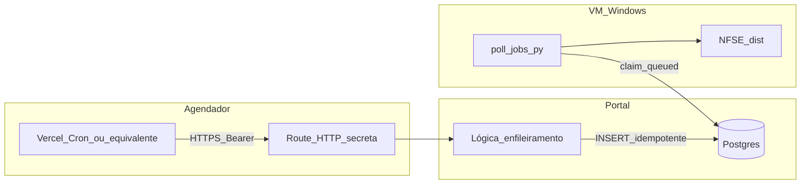

# Briefing — Coleta automática ADN no dia escolhido pelo utilizador

**Data:** 2026-04-30  
**Audiência:** produto, engenharia, operações  
**Objectivo:** descrever o **gap** entre a configuração do dia de coleta por empresa e a **execução automática** no calendário, e indicar **o quê** implementar (sem código neste documento) para a fila ADN ser preenchida sozinha no **dia D** em `America/Sao_Paulo`, alinhado ao modelo actual `adn_sync_jobs` e ao worker Windows.

**Normativa e histórico de produto:** [brief de actualização do agendamento por empresa](brief-atualizacao-agendamento-por-empresa.md) (regras de negócio; dia 1–28, idempotência). Arquitectura legada com tabela genérica `jobs` em [architecture.md](architecture.md) e [architecture-agendamento-por-empresa.md](architecture-agendamento-por-empresa.md) — **não** substituem o desenho da fila ADN; servem de contexto e de alinhamento de fuso/chave.

**Runbook operacional (referência):** [runbooks/agendamento-mensal-por-empresa.md](runbooks/agendamento-mensal-por-empresa.md).

---

## 1. Problema em linguagem simples

O utilizador **escolhe e grava** o dia do mês (1–28) em que a coleta recorrente deve ocorrer. Esse valor está na base de dados e na interface. O que **não existe** ainda é o equivalente a **ligar o despertador**: nada no servidor executa **uma vez por dia** a lógica “hoje, em São Paulo, é o dia D desta empresa? → enfileirar job”.

Hoje, a fila `adn_sync_jobs` **só** cresce quando alguém **pede** sincronização no painel (fluxo manual) ou casos derivados (ex.: retry de espelho). Por isso, o dia configurado **não dispara** sozinho a recolha.

---

## 2. Baseline técnica (factos do repositório)

| Tópico | Onde está | Nota |
|--------|-----------|------|
| Dia da coleta por empresa | Coluna / campo `monthlyRunDay` (1–28) | Validação partilhada: [packages/shared/src/monthly-run-day.ts](../packages/shared/src/monthly-run-day.ts) |
| Lógica pura de calendário, fuso SP, chave `sched_monthly:{companyId}:{YYYY-MM}` | [packages/scheduling/src/monthly-enqueue.ts](../packages/scheduling/src/monthly-enqueue.ts) | Inclui `decideMonthlyScheduledEnqueue`, testes em `monthly-enqueue.test.ts` |
| Criação de jobs ADN (actual) | [frontend/src/server/api/v1/handlers/adn-sync.ts](../frontend/src/server/api/v1/handlers/adn-sync.ts) | `trigger` usado: `"manual"`, `"retry"`; corpo com `fetchMode` |
| Fila e esquema | Tabela `adn_sync_jobs` em [packages/db/src/schema.ts](../packages/db/src/schema.ts) | `idempotency_key` opcional; adequar uso ao mensal |
| Worker que consome `queued` | [workers/nfse-portal-bridge/poll_jobs.py](../workers/nfse-portal-bridge/poll_jobs.py) | Exige `organizations.adn_sync_enabled = true` ao reclamar job |
| “Tipo” de execução no domínio portal | [packages/shared/src/portal-types.ts](../packages/shared/src/portal-types.ts) | `ExecutionTrigger` já inclui `"monthly"` |
| Cron no deploy | [backend/vercel.json](../backend/vercel.json) | Sem entrada `crons` — **não** há tick diário configurado no artefacto actual |

**Documentação antiga vs. código:** `architecture.md` descreve `jobs` + `scheduled_monthly` num modelo genérico. O produto **corrente** materializa trabalho em **`adn_sync_jobs`**. O implementador deve estender **esta** fila (e convenções de `trigger`), não assumir uma segunda tabela `jobs` sem reconciliação explícita.

---

## 3. Comportamento desejado (regras)

1. **Relógio de referência:** calendário civil e hora em **`America/Sao_Paulo`**, coerente com [packages/scheduling/src/monthly-enqueue.ts](../packages/scheduling/src/monthly-enqueue.ts) e com o runbook.
2. **Tick diário:** executar **uma vez por dia** após a janela nominal (ex.: 06:05 local, como na arquitectura de referência), via **HTTP protegido** (ex.: Vercel Cron + `Authorization: Bearer <CRON_SECRET>`) ou mecanismo equivalente no mesmo projecto.
3. **Para cada empresa** com `active = true` (ou equivalente no modelo), se o **dia civil em SP** for igual a `monthlyRunDay`, decidir enfileiramento com `decideMonthlyScheduledEnqueue` (passando chaves já existentes para o mês — ver runbook **#duplo-tick-mesmo-dia** e **#mudanca-intra-mes**).
4. **Uma execução por empresa por mês civil:** usar idempotência com chave do tipo `sched_monthly:{companyId}:{YYYY-MM}` persistida em `adn_sync_jobs.idempotency_key` (ou regra equivalente com `ON CONFLICT DO NOTHING` se houver constraint única).
5. **Estado do job:** `status: queued` para o worker existente processar; `summary_json` pode indicar fase `queued` e `fetchMode` alinhado ao manual (ex.: incremental), conforme produto.
6. **Trigger:** alinhar ao tipo **`monthly`** já previsto em [packages/shared/src/portal-types.ts](../packages/shared/src/portal-types.ts); evitar introduzir um terceiro nome sem actualizar UI e relatórios.

**Decisão em aberto (produto):** se organizações com `adn_sync_enabled = false` devem **ainda assim** receber linhas `queued` (o worker não as reclama — ver `poll_jobs.py`) ou se o tick **não deve inserir** nesses casos. Recomendação de operações: **não enfileirar** se a org não tiver ADN activo, para não inflar a fila morta.

**Decisão em aberto (modelo):** `requested_by_user_id` em jobs automáticos — `NULL` (actor sistema) vs. utilizador técnico; documentar na migração de permissões e auditoria.

---

## 4. Fluxo alvo

---

## 5. Componentes a implementar (checklist — sem código aqui)

1. **Route handler** (App Router, ex. `GET` ou `POST` sob `api/internal/...`) que só aceita pedidos com segredo partilhado (`CRON_SECRET` ou nome já usado no projecto).
2. **Variável de ambiente** no ambiente de deploy e em `.env.example` / documentação de ops.
3. **Entrada `crons`** em `vercel.json` do projecto que efectivamente deploya a API (frontend vs. backend — **decidir um único destino** para evitar dois ticks).
4. **Serviço de enfileiramento:** para cada empresa elegível, chamar `decideMonthlyScheduledEnqueue`; em caso `enqueue`, `INSERT` em `adn_sync_jobs` com `idempotency_key` única; telemetria opcional via [packages/scheduling/src/enqueue-telemetry.ts](../packages/scheduling/src/enqueue-telemetry.ts).
5. **Consulta de chaves existentes:** agregar por empresa os `idempotency_key` que começam por `sched_monthly:` para o período relevante (ou índice/constraint se introduzida).
6. **Consistência UX:** páginas que mapeiam `adn_sync_jobs.trigger` para “Execuções” devem mostrar execuções **mensais** quando `trigger === "monthly"` (ver [frontend/src/app/(dashboard)/execucoes/page.tsx](../frontend/src/app/(dashboard)/execucoes/page.tsx) e similares).

---

## 6. Critérios de aceite testáveis

1. Com relógio simulado “dia D em SP” e empresa activa com `monthlyRunDay = D`, o primeiro tick **cria** exactamente **um** job `queued` com chave `sched_monthly:{companyId}:{YYYY-MM}`.
2. Um segundo tick no **mesmo** dia civil **não** cria segunda linha (idempotência).
3. Empresa inactiva ou dia diferente de D → **nenhum** novo job desse tipo para esse período.
4. Com `adn_sync_enabled = false`, comportamento conforme decisão da secção 3 (fila vazia vs. jobs não reclamáveis — documentar o escolhido).
5. Worker existente, sem alteração obrigatória de contrato HMAC, **processa** o job `queued` criado pelo cron (desde que org + certificados + NFSE_dist continuem válidos).

---

## 7. Fora de âmbito deste briefing

- Alterar [third_party/NFSE_dist/main.py](../third_party/NFSE_dist/main.py) ou a lógica de distribuição fiscal **local** (o bridge já orquestra).
- Horário configurável **por empresa** (mantém-se horário global do tick; ver [brief-atualizacao-agendamento-por-empresa.md](brief-atualizacao-agendamento-por-empresa.md) — escopo OUT explícito no brief antigo).
- Novo PRD completo — pode bastar actualizar critérios no PRD existente após este briefing.

---

## 8. Próximos passos sugeridos (AIOS)

1. **@pm:** reflectir critérios de aceite e decisões em aberto (ADN desactivado, actor do job) no PRD.
2. **@architect / dev:** implementar route + cron + persistência idempotente; revisar unicidade em `adn_sync_jobs`.
3. **Ops:** configurar segredo e cron no painel Vercel (ou scheduler externo se o deploy não for Vercel em produção).

---

*Briefing de encaminhamento; não substitui migrações SQL nem revisão de segurança do endpoint interno.*
