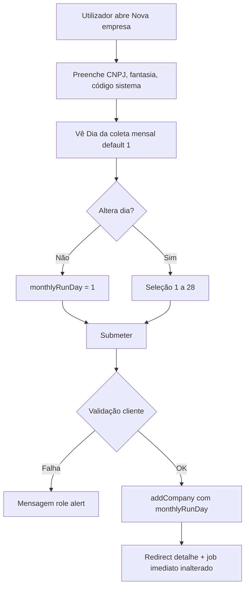
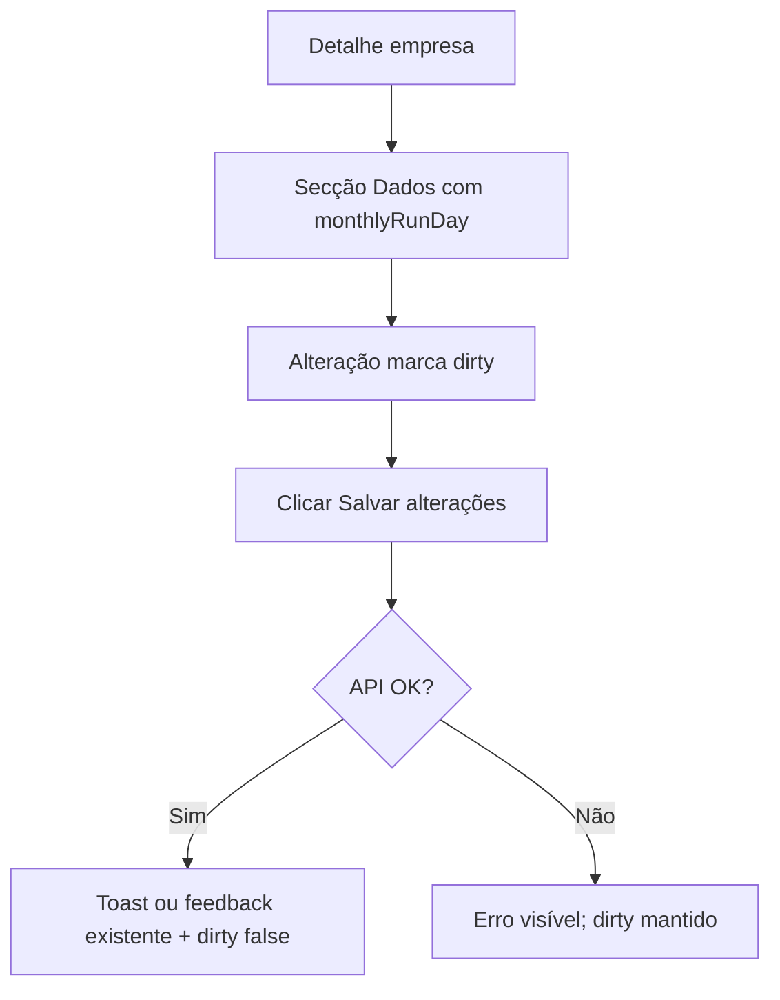

# UI/UX — Incremento: dia da automação mensal por empresa

**Produto:** Portal de Automação de Notas Fiscais (por empresa).  
**Fonte de produto:** `docs/prd-atualizacao-agendamento-por-empresa.md` e `docs/prd.md` v0.2 (Story **2.4**, **FR10**, **FR18**).  
**Especificação base do projeto:** `docs/front-end-spec.md` v0.1+ — este documento **complementa** a espec global; em conflito de copy ou padrões, alinhar primeiro à `front-end-spec.md` e depois ao PRD.

---

## 1. Introdução e âmbito

### 1.1 Objetivo do documento

Definir experiência, conteúdo, estados de interface, acessibilidade e contratos de dados **no front-end web** para o campo **dia do mês da coleta recorrente (1–28)** por empresa, em **cadastro** e **edição**, sem alterar o comportamento de **job imediato** após cadastro (apenas comunicação se necessário).

### 1.2 Fora de âmbito (UI)

- Escolha de **hora** ou **fuso** por empresa (permanecem globais; texto de ajuda referencia **FR11**).
- Dias 29–31 (não expor na UI).
- Agendador/cron (back-end); apenas **refletir** o valor guardado e erros da API.

### 1.3 Superfícies a alterar (código atual)

| Área | Ficheiro(s) |
|------|-------------|
| Cadastro | `apps/web/src/components/company-form.tsx` |
| Edição / detalhe | `apps/web/src/app/(dashboard)/empresas/[id]/page.tsx` |
| Modelo e persistência local | `packages/shared/src/portal-types.ts`, `apps/web/src/context/portal-provider.tsx` (`addCompany`, `updateCompany`, serialização `localStorage`) |
| Lista (opcional) | `apps/web/src/app/(dashboard)/empresas/page.tsx` — coluna ou hint “Dia X” se útil ao operador |

---

## 2. Objetivos de UX (incremento)

1. **Compreensão imediata:** o utilizador percebe que a coleta **mensal automática** corre num **dia fixo do mês** (1–28), distinto da **primeira coleta** ao guardar a empresa.
2. **Confiança temporal:** microcopy liga o conceito ao **fuso América/São Paulo** e ao **horário padrão (06:00)** sem obrigar o utilizador a configurar hora.
3. **Prevenção de erros:** valores fora de 1–28 impossíveis na UI (controlo restritivo); mensagens curtas se a API falhar.
4. **Continuidade:** valor por omissão **1** — utilizadores existentes não veem mudança de comportamento até editarem.

### Princípios aplicados (alinhados à spec global)

- **Clareza operacional** — rótulo e ajuda explicam “o quê” e “quando”, sem jargão de jobs.
- **Consistência** — mesmo padrão visual dos restantes campos (`label` xs medium, `input`/`select` com `ring-emerald-600/30`, espaçamento `space-y-5` / `mt-1.5`).
- **Acessibilidade (WCAG 2.2 AA)** — `label` + `htmlFor`, foco visível, `aria-describedby` para texto de ajuda, anúncio de erros com `role="alert"`.

---

## 3. Arquitetura da informação (delta)

Não há novas rotas. O campo integra-se em:

- **Nova empresa** — bloco de formulário existente, **após** “Código do sistema” (agrupa configuração de automação) **ou** antes dos botões de ação; recomendação: **depois do código do sistema**, antes dos erros globais e botões.
- **Detalhe / Dados da empresa** — secção “Dados”, junto de nome fantasia e código do sistema; participa no estado `dirty` e em **Salvar alterações**.

### Opcional (recomendado)

- **Resumo** no topo do detalhe (junto ao path da pasta): linha só de leitura, ex.:  
  **“Coleta automática mensal: dia 5, às 06:00 (América/São Paulo).”**  
  Atualiza quando `monthlyRunDay` muda após guardar.

---

## 4. Modelo de dados (front-end)

### 4.1 Campo sugerido

- **Nome TypeScript:** `monthlyRunDay: number`  
- **Intervalo:** inteiro **1–28** (inclusive).  
- **Default na criação:** `1` se o utilizador não alterar o controlo.  
- **Legado:** se `companies[]` em `localStorage` não tiver a propriedade, tratar como **`1`** na UI e na próxima gravação persistir explicitamente (evita ambiguidade).

### 4.2 Contrato API (orientador)

Quando existir API real:

- `POST/PATCH` corpo inclui `monthlyRunDay` (ou snake_case acordado no backend).  
- **400** com mensagem legível (ex.: “Dia inválido. Use um número entre 1 e 28.”) — mostrar no bloco de erro do formulário / secção Dados, como já acontece com CNPJ.

---

## 5. Fluxos de utilizador

### 5.1 Cadastro — definir dia antes de submeter

**Critérios de sucesso:** empresa criada com `monthlyRunDay` persistido; primeira execução continua disparada (comportamento de produto; copy na página `nova` pode referir “primeira coleta ao salvar” sem mencionar dia).

### 5.2 Edição — alterar dia e guardar

**Mudança intra-mês:** não cabe lógica extra na UI; opcionalmente, após guardar, mostrar texto neutro: **“Alterações aplicam-se aos próximos agendamentos, conforme política do sistema.”** (curto; detalhe em Story 4.3 no back-end).

### 5.3 Casos extremos

| Caso | Comportamento UI |
|------|-------------------|
| Valor guardado 1–28 fora do esperado (dados corrompidos) | Na hidratação, corrigir para **1** e opcionalmente logar em consola em dev. |
| Falha de rede no save | Mensagem genérica + retry; manter `dirty`. |
| Teclado apenas | `<select>` nativo ou Shadcn `Select` com foco e lista aberta por teclado. |

---

## 6. Wireframes de baixa fidelidade (descritivos)

### 6.1 Nova empresa — bloco “Coleta mensal automática”

**Ordem vertical sugerida:**

1. Rótulo: **Dia da coleta mensal** (ou **Dia do mês para coleta automática**).  
2. Controlo: `<select>` com opções “1” … “28” (tabular-nums); valor inicial **1**.  
3. Texto de ajuda (`
`), exemplo:  
   *“A cada mês, o sistema agenda a coleta neste dia, às **06:00** no horário de **América/São Paulo**. A primeira coleta continua a ser feita logo após guardar esta empresa.”*  
4. `aria-describedby` apontando ao `id` do parágrafo de ajuda.

**Interação:** alterar o select não dispara submit; não limpa erros de outros campos salvo reset explícito no `onSubmit`.

### 6.2 Detalhe empresa — secção Dados

- Mesmo rótulo, select e ajuda (pode encurtar a frase da “primeira coleta” no editar).  
- Incluir `monthlyRunDay` no `updateCompany` quando `dirty` e utilizador guarda.

### 6.3 Lista de empresas (opcional)

- Coluna secundária **“Dia mensal”** com valor numérico ou “—” se inativo (futuro); no MVP mínimo, pode omitir-se para reduzir ruído.

---

## 7. Componentes e design system

### 7.1 Abordagem

Reutilizar **átomos** existentes: tipografia de `label`, classes de `input` já usadas em `company-form.tsx`. Preferir **`<select>` nativo** estilizado com as mesmas classes do `input` (menos dependências, boa a11y). Se o projeto adotar Shadcn `Select`, manter o mesmo texto de ajuda e associar `Label` + descrição Radix.

### 7.2 Estados do controlo

| Estado | Tratamento visual |
|--------|-------------------|
| Default | Dia **1** selecionado |
| Focus | `ring-emerald-600/30` (igual aos inputs) |
| Disabled | Não aplicável no MVP (empresa inativa pode desativar secção inteira noutra story) |
| Erro (API) | `aria-invalid` no select; mensagem abaixo em vermelho com `role="alert"` |

### 7.3 Cópias (PT) — referência

| Chave | Texto |
|-------|--------|
| `label.monthlyRunDay` | Dia da coleta mensal |
| `help.monthlyRunDay.create` | A cada mês, o sistema agenda a coleta neste dia, às 06:00 (América/São Paulo). A primeira coleta é feita logo após guardar. |
| `help.monthlyRunDay.edit` | Coleta automática neste dia do mês, às 06:00 (América/São Paulo). |
| `error.monthlyRunDay.invalid` | Escolha um dia entre 1 e 28. |
| `error.monthlyRunDay.api` | Não foi possível guardar. Tente novamente. |

(Ajustar tom à voz do restante portal.)

---

## 8. Acessibilidade

- **1.3.4 / orientação:** não depender só de posição; labels explícitos.  
- **3.3.2 / rótulos:** `htmlFor="monthlyRunDay"` ↔ `id="monthlyRunDay"`.  
- **3.3.1 / identificação de erros:** mensagem próxima ao campo + `role="alert"`.  
- **2.4.7 / foco visível:** anel de foco já usado no projeto.  
- **4.1.2 nome acessível:** o `<select>` expõe o valor; se usar componente custom, garantir `aria-expanded` / lista com roles corretos.

---

## 9. Critérios de aceite UX (verificáveis)

1. Em **Nova empresa**, o utilizador vê o dia da coleta mensal com default **1** e texto que menciona **06:00** e **América/São Paulo**.  
2. Em **Detalhe > Dados**, o valor atual é visível e editável; **Salvar** persiste e limpa `dirty`.  
3. Não é possível submeter valor fora de 1–28 via UI (sem `input` livre sem máscara).  
4. Leitor de ecrã: rótulo + descrição lidos em sequência lógica (`aria-describedby`).  
5. Visual e espaçamento consistentes com `company-form.tsx` e secção Dados da página de detalhe.

---

## 10. Checklist de implementação (@dev)

- [ ] Estender tipo `Company` com `monthlyRunDay`.  
- [ ] Default `1` em `addCompany`; merge em `updateCompany` / hidratação para dados antigos.  
- [ ] `CompanyForm`: estado local ou derivado + validação antes de `addCompany`.  
- [ ] Página `[id]`: estado inicial a partir de `company.monthlyRunDay ?? 1`.  
- [ ] (Opcional) Resumo só leitura no detalhe.  
- [ ] Teste manual: criar com dia 15, recarregar, confirmar persistência em `localStorage`.

---

## Change Log

| Date       | Version | Description | Author |
| ---------- | ------- | ----------- | ------ |
| 2026-04-22 | 0.1     | Especificação UI/UX do incremento agendamento por empresa | UX (AIOS / Uma) |

---

— Uma, desenhando com empatia 💝
