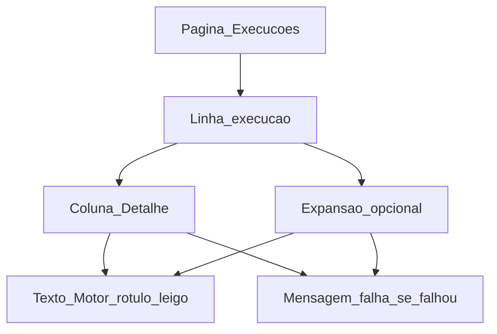

# UI/UX — Motor de recolha cenário B (transparência na execução ADN)

**Produto:** Portal de Automação de Notas Fiscais.  
**Fonte de produto:** [`prd-cenario-b-adn-playwright-extensao-chrome.md`](prd-cenario-b-adn-playwright-extensao-chrome.md) (**FR-ADN-B-04**, §6 UX, **NFR-ADN-B-02** / **NFR-ADN-B-03**), [`briefing-cenario-b-adn-playwright-extensao-chrome.md`](briefing-cenario-b-adn-playwright-extensao-chrome.md).  
**Especificações base:** [`front-end-spec.md`](front-end-spec.md), [`front-end-spec-integracao-nfse-dist-adn.md`](front-end-spec-integracao-nfse-dist-adn.md).  
**Contexto de implementação (referência):** [`frontend/src/app/(dashboard)/execucoes/page.tsx`](../frontend/src/app/(dashboard)/execucoes/page.tsx) — o presente documento descreve o **alvo** quando a API expuser `summary_json` (ou equivalente) nas execuções / jobs.

### Change log (este incremento)

| Data       | Versão | Descrição |
| ---------- | ------ | --------- |
| 2026-04-30 | 0.1    | Spec inicial: glossário motor, matriz de falhas, IA MVP/fase 2, a11y, mapeamento FR. |

---

## 1. Hierarquia normativa

1. Este ficheiro é **delta** de UX: **não** altera estados, botões nem **FR45** descritos em [`front-end-spec-integracao-nfse-dist-adn.md`](front-end-spec-integracao-nfse-dist-adn.md); acrescenta apenas **transparência** sobre **como** a recolha foi executada no worker (campo lógico `downloadEngine` e metadados em `summary_json` — **FR-ADN-B-04**).
2. Em conflito entre “mostrar mais detalhe” e **segurança** (**NFR19** / **NFR-ADN-B-02**), prevalece **ocultar** ou **generalizar** — nunca paths de servidor, cookies, HTML de login, nomes de extensões comerciais como garantia, nem ferramentas internas (“Playwright”, “Chromium”) na **UI pública** sem aprovação de produto/compliance.
3. O **utilizador final** não configura o motor: isso é **operação** (env / runbook). A UI só **reflecte** o que a API devolver de forma segura.

---

## 2. Objectivos de UX

1. **Confiança:** o operador percebe **qual modo de recolha** foi usado na execução (rótulo leigo), alinhado a **O3** do PRD.
2. **Diagnóstico sem culpa:** falhas mostram **categoria útil** (sessão, portal ocupado, automatização, disco, tempo esgotado) **sem** insinuar erro do utilizador quando o problema é infraestrutura ou terceiros.
3. **Continuidade:** a lista **Execuções** permanece escaneável; o motor é **detalhe secundário**, não coluna gritante.
4. **Suporte:** mensagens compatíveis com **FR47** / auditoria — texto estável, sem dados sensíveis.

---

## 3. Fora de âmbito (UI)

- Formulários para **`ADN_DOWNLOAD_ENGINE`** ou paths de extensão/perfil Chrome — apenas **documentação ops** / runbook.
- Check-list **O5** / **FR-ADN-B-08** (compliance antes de produção com extensão de terceiros): pode permanecer **ferramenta interna** ou ticketing; **não** obrigatório no MVP de UI pública.
- Qualquer **screenshot** ou trace de debug na UI — **NFR-ADN-B-03** reserva isso a modo diagnóstico fora do portal ou flags internas não expostas ao tenant.

---

## 4. Glossário de interface (pt-BR)

Valores possíveis de **`downloadEngine`** (API) → **rótulo na UI** (sugestão; validar com produto):

| Valor API (`downloadEngine`) | Rótulo curto (lista / badge) | Texto auxiliar (opcional, tooltip ou linha secundária) |
| ---------------------------- | ------------------------------ | -------------------------------------------------------- |
| `nfse_dist` (ou omissão quando legado) | **Recolha padrão** | “Ligação segura ao Ambiente Nacional pelo serviço de automação.” |
| `playwright_extension` | **Recolha automatizada** | “Recolha feita com navegação controlada pelo serviço.” |

**Evitar na UI pública:** “Playwright”, “Chrome”, “extensão [marca]”, “NFSE_dist”, “worker”, “curl”.  
**Se** produto/compliance aprovar menção explícita a um produto terceiro, tratar como **excepção** documentada — não é padrão deste spec.

---

## 5. Matriz de falhas (FR-ADN-B-04)

Categorias técnicas esperadas em `summary_json` → **copy** sugerida para o utilizador (detalhe da execução ou toast). Ajustar conforme política de suporte.

| Categoria (API interna) | Título curto | Mensagem útil (corpo) | Evitar |
| ----------------------- | -------------- | ---------------------- | ------ |
| `session` | **Acesso ao portal nacional** | “A sessão de acesso ao serviço nacional não está disponível ou precisa de renovação. A equipa pode repetir a sincronização mais tarde ou seguir o procedimento interno.” | Pedidos diretos “entre no gov.br” se o produto **não** oferecer esse fluxo na UI. |
| `portal` | **Serviço nacional temporariamente indisponível** | “O portal oficial está ocupado ou em manutenção. Tentámos novamente; pode verificar mais tarde.” | “503”, “429”, inglês técnico. |
| `extension` | **Automatização interrompida** | “A recolha automatizada não foi concluída. O incidente foi registado para análise.” | Nome da extensão; culpar o utilizador. |
| `disk` | **Armazenamento no servidor de automação** | “Não foi possível guardar os documentos no ambiente de automação. Contacte o suporte se persistir.” | Paths UNC, letras de disco. |
| `timeout` | **Tempo limite excedido** | “A operação demorou mais do que o permitido e foi interrompida. Pode tentar novamente mais tarde.” | Segundos exactos de timeout internos como única informação. |

**Fallback:** se `failureCategory` ou mensagem estiverem ausentes, mostrar apenas estado global (**FR41**) com texto neutro já definido no spec ADN base (“Não foi possível concluir…”), sem inventar detalhe.

---

## 6. Arquitetura da informação

### 6.1 MVP (mínimo viável de UX)

- **Lista Execuções** ([`execucoes/page.tsx`](../frontend/src/app/(dashboard)/execucoes/page.tsx)): na coluna **Detalhe**, quando existirem dados do job:
  - **Linha primária:** mantém o comportamento actual (resumo / contagem de ficheiros).
  - **Linha secundária** (texto `text-xs`, tom mais baixo): **Motor:** [rótulo do glossário §4].
  - Opcional: **`title`** no `<tr>` ou num botão “Ver detalhes” com **Motor** + duração (“Recolha: cerca de 4 min”) **só** se o backend enviar duração arredondada — evitar falsa precisão (**NFR-ADN-B-02**: não vazar métricas internas desnecessárias).

### 6.2 Fase 2 (opcional)

- **Detalhe da empresa monitorada** — secção **Sincronização ADN** (ver §3.1 de [`front-end-spec-integracao-nfse-dist-adn.md`](front-end-spec-integracao-nfse-dist-adn.md)): bloco **“Última execução”** com o mesmo par **Motor** + estado, alinhado a **FR42** (última sincronização).
- Só implementar se a API fornecer agregado por empresa **sem** N+1 pesado; caso contrário manter **só** a rota **Execuções**.

---

## 7. Componentes e padrões visuais

- **Motor:** preferir **texto secundário** + semibold no rótulo (“**Motor:** Recolha padrão”); evitar **badge** colorido competindo com **Status** (suc./falha). Se badge for usado, variante **outline** / neutro (`border`, sem cor de semântica de alerta).
- **Duração da fase browser:** prefixo humano “Cerca de …” ou intervalo; não mostrar milissegundos.
- **Falha:** reutilizar hierarquia de erro do spec ADN — mensagem da §5 **substitui** ou **complementa** o detalhe genérico; **nunca** `stack`, **nunca** JSON bruto.

---

## 8. Fluxos de utilizador

### 8.1 Consultar uma execução concluída com sucesso

1. Utilizador abre **Execuções**.
2. Identifica linha com status **Concluído** (ou equivalente).
3. Lê **Motor:** Recolha padrão / Recolha automatizada e, se existir, número de ficheiros já mostrado pela linha.

### 8.2 Consultar uma execução falhada

1. Utilizador abre **Execuções**.
2. Vê status **Falhou** e **Detalhe** com mensagem da §5.
3. Opcional (Admin): **Sincronizar novamente** conforme spec ADN — **sem** prometer que mudar o motor resolve.

### 8.3 Papéis

- **User / Operador:** mesma vista; sem campos administrativos extra.
- **Admin / Suporte:** mesma UI no MVP; ferramentas internas para logs ficam **fora** deste spec.

---

## 9. Estados vazios, carregamento e erro

| Situação | Comportamento |
| -------- | ------------- |
| API sem `summary_json` / sem `downloadEngine` | Não mostrar linha **Motor**; não inferir “padrão” na UI sem dados — evitar mentira por omissão mal dados legacy existam. |
| Carregamento da lista | Skeleton ou texto “A carregar…” alinhado ao spec global; não mostrar placeholder “Motor: —” antes dos dados. |
| Erro ao carregar execuções | Mensagem genérica recuperável + repetir; não misturar com categorias §5. |

---

## 10. Acessibilidade (WCAG 2.2 AA)

- **Motor** e mensagem de falha: se a linha tiver **expansão**, usar `aria-expanded` e `id` + `aria-controls` entre gatilho e painel.
- Anunciar em leitores de ecrã: “Motor: [rótulo]” como frase completa, não só o rótulo solto.
- Contraste: texto secundário `text-black/60` (ou token equivalente) **mínimo** 4.5:1 sobre fundo; badges neutros com borda visível no foco de teclado.
- Não depender **só** de cor do badge de **Status** para significado — manter texto (“Concluído”, “Falhou”) como hoje.

---

## 11. Mapeamento de requisitos (PRD → UI)

| Requisito | Decisão de UI neste spec |
| --------- | ------------------------ |
| **FR-ADN-B-04** | Expor **downloadEngine** (glossário §4), duração opcional, **failureCategory** via copy §5. |
| **§6 PRD (UX mínima)** | MVP: coluna **Detalhe** em **Execuções**; fase 2: bloco opcional no detalhe da empresa §6.2. |
| **NFR-ADN-B-02** | Proibições de conteúdo de log na UI pública; §5 e §3. |
| **NFR-ADN-B-03** | Sem traces/screenshots na UI; §3. |

---

## 12. Diagrama (fluxo de consulta)

---

## 13. Referências

- [`prd-cenario-b-adn-playwright-extensao-chrome.md`](prd-cenario-b-adn-playwright-extensao-chrome.md)  
- [`architecture-cenario-b-adn-playwright-extensao-chrome.md`](architecture-cenario-b-adn-playwright-extensao-chrome.md) — contrato API `summary_json`, env do worker.  
- [`front-end-spec-integracao-nfse-dist-adn.md`](front-end-spec-integracao-nfse-dist-adn.md)  
- [`front-end-spec.md`](front-end-spec.md)

— **Uma (UX) / AIOS** — delta de interface para transparência do motor cenário B; implementação sujeita a contrato de API com `summary_json`.
