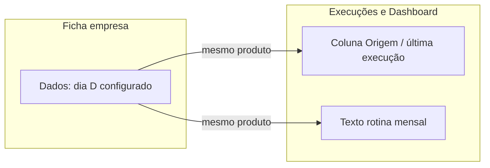

# Especificação de front-end e UX — Coleta mensal ADN (dia configurável, copy e consistência)

**Produto:** Portal de Automação de Notas Fiscais (por empresa).  
**Fonte de produto:** [`prd-coleta-mensal-adn-dia-configuravel.md`](prd-coleta-mensal-adn-dia-configuravel.md) (**FR-ADN-MONTHLY-07** e critério de aceite 5 da secção 6).  
**Especificação global:** [`front-end-spec.md`](front-end-spec.md) — este documento **complementa** a espec base e o incremento do campo dia ([`front-end-spec-agendamento-por-empresa.md`](front-end-spec-agendamento-por-empresa.md)); em conflito de vocabulário sobre **rotina mensal**, prevalece este delta alinhado ao PRD de enfileiramento automático.

**Change log**

| Data       | Versão | Descrição |
| ---------- | ------ | --------- |
| 2026-04-30 | 1.0    | Especificação inicial: superfícies, copy, v1 vs v2, a11y, rastreio PRD. |

---

## 1. Introdução e âmbito

### 1.1 Objetivo do documento

Definir **experiência**, **conteúdo (copy)** e **consistência entre ecrãs** para que a interface **não contradiga** o dia da coleta automática **configurável por empresa** (`monthlyRunDay`, 1–28) quando o utilizador vê **origem** de execuções ou texto sobre **rotina mensal**. O back-end que enfileira jobs no dia D (cron, segredo, `adn_sync_jobs`) está **fora do âmbito deste spec**; a UI apenas comunica de forma **honesta** e **coerente** com a ficha da empresa.

### 1.2 Âmbito UI (positivo)

| ID produto | Âmbito neste spec |
| ---------- | ----------------- |
| **FR-ADN-MONTHLY-07** | Rótulos de **origem** (`trigger`) e textos do **dashboard** que hoje implicam **“dia 1º”** fixo; alinhamento com o utilizador que já escolheu outro dia na ficha. |

### 1.3 Fora de âmbito (UI)

- Configuração do **cron**, segredo `CRON_SECRET`, ou painel de operações.
- Alterações ao **worker** Python ou ao fluxo HMAC de ingestão.
- Novo ecrã dedicado só a “histórico de agendador” (não exigido pelo PRD).

---

## 2. Contexto brownfield (implementação actual)

| Observação | Onde |
| ---------- | ---- |
| `triggerLabel` duplicada; `monthly` → **“Agendada (dia 1º)”** | [`../frontend/src/app/(dashboard)/execucoes/page.tsx`](../frontend/src/app/%28dashboard%29/execucoes/page.tsx), [`../frontend/src/app/(dashboard)/dashboard/page.tsx`](../frontend/src/app/%28dashboard%29/dashboard/page.tsx) |
| Resumo correcto do dia na ficha: **“Coleta automática mensal: dia X…”** | [`../frontend/src/app/(dashboard)/empresas/[id]/page.tsx`](../frontend/src/app/%28dashboard%29/empresas/%5Bid%5D/page.tsx) |
| Secção **“Rotina mensal (dia 1º)”** no dashboard afirma coleta no dia 1 | [`../frontend/src/app/(dashboard)/dashboard/page.tsx`](../frontend/src/app/%28dashboard%29/dashboard/page.tsx) (~linhas 124–129) |
| Tipo `Execution` / `ExecutionTrigger` (`monthly` sem dia embutido) | [`../packages/shared/src/portal-types.ts`](../packages/shared/src/portal-types.ts) |
| Execuções demonstração em `localStorage` | [`../frontend/src/context/portal-provider.tsx`](../frontend/src/context/portal-provider.tsx) |

**Implicação:** a coluna **Origem** e o bloco **Rotina mensal** podem **mentir** ao utilizador relativamente ao dia D guardado na empresa; este spec corrige a **intenção de copy** e o **comportamento v1**.

---

## 3. Objectivos de UX

1. **Coerência temporal:** o utilizador que configurou **dia 15** não vê “dia 1º” como rótulo genérico da mesma funcionalidade **mensal automática** noutro ecrã.
2. **Linguagem operacional:** preferir termos já usados na ficha (**coleta automática mensal**, **América/São Paulo**) quando se actualizar parágrafos do dashboard.
3. **Confiança:** reduzir chamadas de suporte do tipo “configurei o dia X mas o portal diz dia 1”.
4. **Evolutividade:** permitir **v2** com “dia N” na coluna Origem quando o **modelo de dados** ou a API de execuções expuser o dia agendado.

---

## 4. Arquitectura da informação (superfícies)

### 4.1 Inventário

| Superfície | Rota / componente | Delta UX |
| ---------- | ----------------- | -------- |
| Lista de execuções | `/execucoes` — [`execucoes/page.tsx`](../frontend/src/app/%28dashboard%29/execucoes/page.tsx) | Coluna **Origem:** deixar de associar `monthly` exclusivamente ao “dia 1º”. |
| Dashboard | `/dashboard` — [`dashboard/page.tsx`](../frontend/src/app/%28dashboard%29/dashboard/page.tsx) | **Última execução** (mesmo `triggerLabel`); secção **Rotina mensal:** título e parágrafo **sem** afirmar dia 1 fixo; referência ao dia configurável **por empresa** e ao fuso em linha com [`front-end-spec-agendamento-por-empresa.md`](front-end-spec-agendamento-por-empresa.md). |
| Ficha empresa (opcional recomendado) | `/empresas/[id]` — [`adn-sync-panel.tsx`](../frontend/src/app/%28dashboard%29/empresas/%5Bid%5D/adn-sync-panel.tsx) | **Uma** frase curta (ajuda ou nota) a explicitar que a **automação mensal na fila ADN** só ocorre se a organização tiver **sincronização ADN activa** e o **worker** estiver a correr — **sem** duplicar o bloco inteiro “Coleta automática mensal” da secção Dados (já na mesma página). |

### 4.2 Diagrama de fluxo (leitura)

---

## 5. Regras de copy (normativas)

### 5.1 Tabela `trigger` → texto em português (UI)

| `ExecutionTrigger` | Copy **v1** (mínimo para cumprir PRD) | Copy **v2** (quando existir `scheduledDay` ou `monthlyRunDay` na execução) |
| ------------------- | ------------------------------------- | -------------------------------------------------------------------------- |
| `signup` | **“Pós-cadastro”** (manter) | Inalterado |
| `monthly` | **“Agendada (mensal)”** **ou** **“Automática (mensal)”** — **proibido** o texto fixo **“dia 1º”** como sinónimo genérico | **“Agendada — dia {N}”** com N ∈ 1–28 |
| `manual` | **“Manual”** (manter) | Inalterado |

**Nota:** escolher **uma** formulação v1 (`Agendada` vs `Automática`) em todo o produto para `monthly`, para consistência com [`front-end-spec.md`](front-end-spec.md) (termos estáveis).

### 5.2 Dashboard — secção “Rotina mensal”

Substituir o enquadramento **“dia 1º”** no **título** e no **corpo** por linguagem que reflecta **dia D por empresa**, por exemplo:

- **Título (proposta):** “Rotina mensal (por empresa)” ou “Coleta automática mensal”.
- **Corpo (proposta):** indicar que cada empresa tem um **dia do mês** definido na **ficha** (1–28), fuso **América/São Paulo**, e que em produção o **portal** pode **enfileirar** a sincronização ADN nesse dia quando a organização tiver ADN activo — **sem** prometer “sempre dia 1” nem repetir o horário se já estiver na ficha (ver PRD principal **FR11** / spec agendamento).

### 5.3 Execuções — cabeçalho de tabela

Manter **“Origem”**; opcional futuro: tooltip ou texto de ajuda curto (“Inclui pedidos manuais e execuções agendadas pelo portal.”) — **fora do mínimo v1**.

---

## 6. Modelo de dados (front-end) — evolução v2

- **`Execution`** ([`portal-types.ts`](../packages/shared/src/portal-types.ts)): hoje não inclui dia agendado.  
- **Recomendação:** campo opcional futuro, por exemplo `scheduledMonthlyDay?: number`, preenchido quando a API / job corresponder a `trigger === "monthly"` e o backend enviar o **D** da empresa ou metadata do job.  
- Até lá, **v1** usa apenas copy neutra na coluna Origem (secção 5.1).

---

## 7. Consistência de implementação (recomendação técnica)

Extrair **`triggerLabel`** (e, se desejado, **`statusLabel`**) para um único módulo partilhado, por exemplo [`../frontend/src/lib/execution-display.ts`](../frontend/src/lib/execution-display.ts), importado por **dashboard** e **execuções**, para evitar nova divergência. A função pode aceitar `(trigger, options?: { scheduledMonthlyDay?: number })` para **v2**.

---

## 8. Acessibilidade

- O significado da **Origem** não deve depender de cor; texto completo na célula (já é o caso).
- Se **v2** mostrar “dia N”, o número faz parte do texto visível (leitores de ecrã leem o dígito).
- Mensagens dinâmicas noutros fluxos: seguir padrões globais de [`front-end-spec.md`](front-end-spec.md) (`aria-live` onde aplicável); este incremento não introduz novo modal.

---

## 9. Mapeamento PRD → aceite UX

| PRD | Evidência na UI |
| --- | ---------------- |
| **FR-ADN-MONTHLY-07** | Não há “dia 1º” hardcoded para `monthly` na Origem; dashboard não contradiz o dia D configurável. |
| **Critério de aceite 5** (secção 6 do PRD) | Revisão copy em `/execucoes` e `/dashboard`; opcional verificação na ficha / ADN conforme secção 4.1. |

---

## 10. Critérios de aceite (teste UX / revisão)

1. Com empresa configurada para **dia ≠ 1**, o utilizador **não** vê na lista de execuções nem no dashboard a expressão **“Agendada (dia 1º)”** para execuções `monthly` (v1: rótulo neutro).
2. O parágrafo **Rotina mensal** no dashboard **não** afirma que todas as empresas recebem coleta **no dia 1**.
3. A ficha da empresa continua a ser a **fonte de verdade** explícita do número do dia (“Coleta automática mensal: dia **X**…”).
4. (v2, quando implementado) Execução `monthly` mostra **“Agendada — dia N”** coerente com o **N** da empresa ou metadata.

---

## 11. Referências

- [`prd-coleta-mensal-adn-dia-configuravel.md`](prd-coleta-mensal-adn-dia-configuravel.md)  
- [`briefing-coleta-mensal-adn-dia-configuravel.md`](briefing-coleta-mensal-adn-dia-configuravel.md)  
- [`prd-atualizacao-agendamento-por-empresa.md`](prd-atualizacao-agendamento-por-empresa.md) / [`front-end-spec-agendamento-por-empresa.md`](front-end-spec-agendamento-por-empresa.md)  
- [`runbooks/agendamento-mensal-por-empresa.md`](runbooks/agendamento-mensal-por-empresa.md)

---

*Documento de UX/UI — AIOS; implementação React segue priorização da equipa.*
