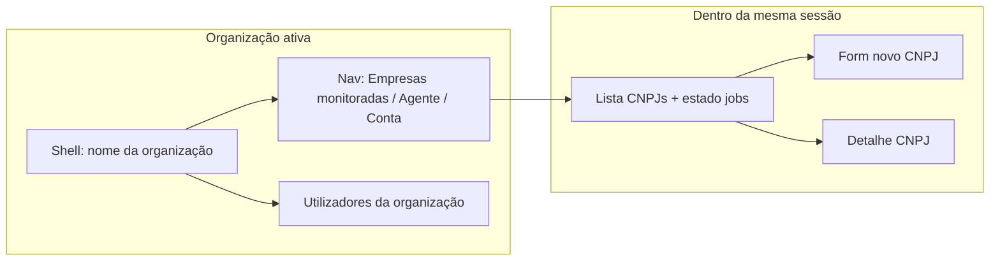
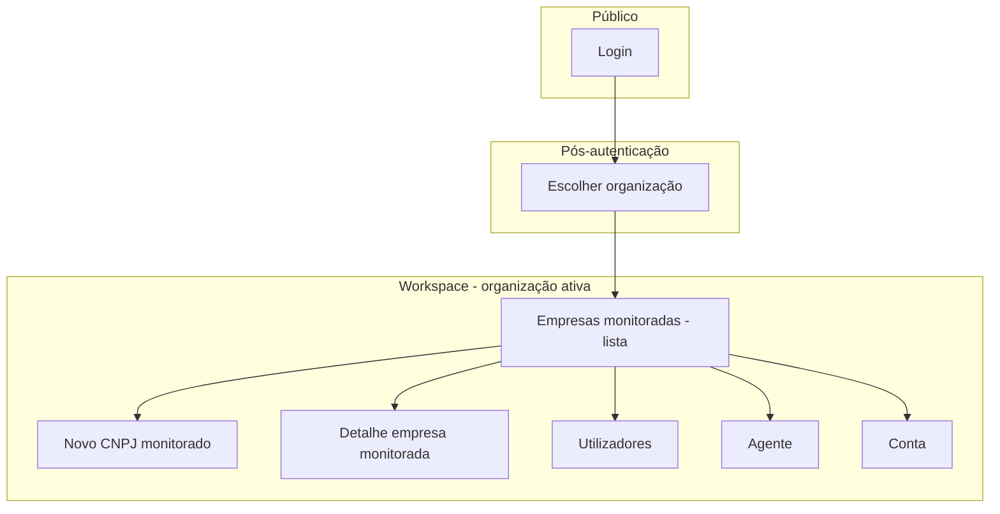
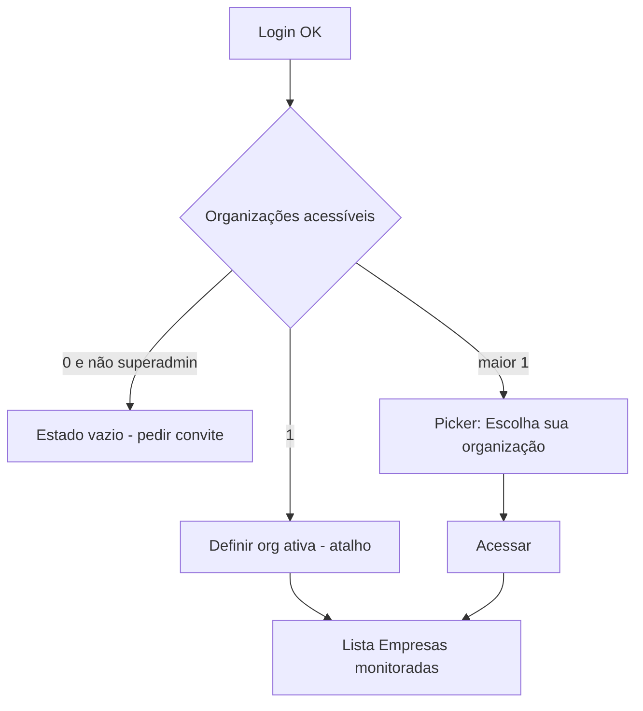

# UI/UX — Incremento: organização (tenant) vs. empresas monitoradas (automação fiscal)

**Produto:** Portal de Automação de Notas Fiscais.  
**Fonte de produto:** `docs/prd-atualizacao-dois-niveis-organizacao-vs-empresas-fiscais.md` (**FR33–FR40**, **NFR16–NFR18**), `docs/briefing-atualizacao-dois-niveis-organizacao-vs-empresas-fiscais.md`.  
**Especificações base:** `docs/front-end-spec.md`, `docs/front-end-spec-login-empresas-roles.md`.

### Hierarquia normativa

1. Este documento define **copy**, **IA**, **fluxos** e **componentes** para o **modelo mental de dois níveis**.  
2. O incremento de **login / picker / utilizadores** continua válido em layout e padrões (**WCAG**, shadcn, dark shell); onde a copy diz “empresa” no sentido de **tenant**, **substitui-se** pela terminologia abaixo (**FR39**, **NFR16**).  
3. Em conflito de cor ou espaçamento, prevalecem `front-end-spec.md` e tokens do projeto.

### Change log (este incremento)

| Data       | Versão | Descrição |
| ---------- | ------ | ---------- |
| 2026-04-22 | 1.0    | Spec inicial: glossário UI, IA delta, fluxos, shell, lista fiscal, superadmin, matriz de estados, tipos cliente, rastreio FR. |

---

## 1. Introdução e âmbito

### 1.1 Objetivo do documento

Eliminar ambiguidade na interface entre:

- **Organização** — cliente B2B do portal; contexto de sessão após o picker; onde vivem **membros** e **papéis** (Admin/User).  
- **Empresa monitorada** — CNPJ + código do sistema + agendamento; alvo da **automação de NF** e dos **jobs**.

### 1.2 Fora de âmbito (UI)

- Definição de preços ou limites por plano.  
- Redesign completo do design system (cores, tipografia) além do mapeamento a tokens existentes.  
- Rotas obrigatórias `/organizacoes` — **URLs** podem manter `/empresas` se a **semântica** for clara via títulos, breadcrumbs e menu (**secção 11**).

### 1.3 Objetivos de UX (incremento)

1. **Orientação espacial dupla:** o utilizador vê **em que organização trabalha** (shell) e, nas vistas fiscais, que está a gerir **CNPJs monitorados**, não o tenant em si.  
2. **Zero “empresa” ambígua:** evitar o termo isolado quando possível; quando inevitável (legado), **subtítulo ou tooltip** liga ao glossário (**FR38**).  
3. **Continuidade com login:** o picker pós-login passa a comunicar **organização** sem alterar a eficiência do fluxo 0/1/N.  
4. **Superadmin:** separação visual clara entre **lista de organizações** e **drill-down** de empresas monitoradas.

---

## 2. Glossário de interface (pt-BR canónico)

| Conceito | Rótulo curto (menu / `h1`) | Rótulo longo / tooltip | Evitar |
| -------- | -------------------------- | ---------------------- | ------ |
| Nível 1 (tenant) | **Organização** | “A organização onde está a trabalhar nesta sessão.” | “Empresa” sozinha para o picker ou shell. |
| Nível 2 (CNPJ automação) | **Empresas monitoradas** | “CNPJs cuja nota fiscal é recolhida pela automação.” | “Empresas” sem qualificador na área fiscal. |
| Ação de entrar no workspace | **Acessar** (mantém-se) | — | “Entrar na empresa” (ambiguidade). |
| Gestão de membros | **Utilizadores** (ou **Equipa**) | “Quem pode aceder a esta **organização**.” | “Utilizadores da empresa” sem contexto de org. |

**Nota de implementação:** nomes de props/API (`activeCompanyId`, `CompanySummary`) podem permanecer legados até refactor; a **UI** e comentários de produto devem usar **organização** / **empresa monitorada**.

---

## 3. Arquitetura da informação (delta)

### 3.1 Modelo mental (diagrama)



### 3.2 Site map (extensão do login)



- **Picker:** lista **organizações** acessíveis (não CNPJs).  
- **Destino pós-“Acessar”:** por defeito **Empresas monitoradas** (lista), salvo `next` ou preferência guardada.  
- **Rota legada `/empresas`:** pode mapear para **lista de empresas monitoradas** **desde que** o shell mostre a **organização ativa** e o `h1` seja qualificado (**FR38**).

### 3.3 Navegação primária (shell autenticado)

| Item | Destino semântico | Visibilidade |
| ---- | ----------------- | ------------- |
| **Empresas monitoradas** | Lista CNPJs + última execução | Sempre (membro da org). |
| **Agente** | Pairing / estado | Igual ao PRD principal. |
| **Conta** | Perfil / sessão | Igual. |
| **Utilizadores** | Membros da **organização** | `canManageUsers` (admin na org ou superadmin). |
| **Trocar organização** | Volta ao picker | Texto do controlo: preferir **“Trocar organização”**. |

### 3.4 Breadcrumb (recomendado)

| Vista | Breadcrumb ou cabeçalho |
| ----- | ------------------------ |
| Lista fiscal | `Organização: [Nome]` como subtítulo **ou** linha no shell; `h1` **“Empresas monitoradas”**. |
| Novo CNPJ | `Empresas monitoradas` (link) → **Novo cadastro** |
| Detalhe CNPJ | `Empresas monitoradas` → **[Fantasia ou CNPJ mascarado]** |
| Utilizadores | `h1` **“Utilizadores”** + subtítulo **“Organização: [Nome]”** |

---

## 4. Fluxos de utilizador

### 4.1 Login → escolher organização → lista fiscal



### 4.2 Trocar organização

1. Clicar **Trocar organização**.  
2. Ir ao picker (página dedicada recomendada — igual ao incremento de login).  
3. Ao confirmar: invalidar queries cuja chave inclua `organizationId` **e** qualquer lista de empresas monitoradas; redirecionar para **lista fiscal** da nova org.

### 4.3 Criar empresa monitorada

1. A partir da lista → **Novo cadastro** / **Adicionar CNPJ**.  
2. Cabeçalho da página: `h1` **“Novo CNPJ monitorado”** ou **“Nova empresa monitorada”**; subtítulo **“Os ficheiros serão organizados por CNPJ e código do sistema na pasta do agente.”**  
3. Após sucesso: toast **“Cadastro criado. A primeira coleta foi agendada.”** (alinhado FR9); navegação para detalhe ou lista.

### 4.4 Superadmin

1. **Vista global:** tabela ou cards de **organizações** (nome, estado, n.º de membros, n.º de CNPJs monitorados — se API disponível).  
2. **Drill-down:** ao **Aceder** a uma organização, o utilizador entra no **mesmo shell** que um membro, com badge opcional **“Vista de plataforma”** (ambiente interno — política com PM).  
3. Lista **Empresas monitoradas** dentro da org: mesma UI que membro; respeitar restrição de mutação fiscal sem papel `admin` (**banner** já definido no spec de login, com substituição “empresa” → “organização” onde fizer sentido).

---

## 5. Ecrãs e layouts

### 5.1 Picker pós-login (**FR39**)

| Elemento | Especificação |
| -------- | -------------- |
| `h1` | **“Escolha sua organização”** |
| Busca | `aria-label` / label: **“Buscar organizações”**; placeholder **“Buscar por nome ou CNPJ da organização…”** (se CNPJ da org existir; caso contrário só nome). |
| Cards | Nome da **organização**; membros; estado ATIVA/INATIVA; **não** mostrar CNPJs monitorados neste ecrã (evita ruído). |
| Botões | **Acessar**; **Admin** quando aplicável (gestão de utilizadores da **organização**). |

### 5.2 Shell (layout autenticado)

| Elemento | Especificação |
| -------- | -------------- |
| Contexto | Linha ou chip: **“Organização: [Nome truncado]”** + tooltip com nome completo. |
| Troca | Link ou botão **“Trocar organização”**. |
| `aria-live` opcional | Anunciar mudança de organização apenas se a troca não for navegação de página completa (política a11y com `@dev`). |

### 5.3 Lista — empresas monitoradas (**FR38**)

| Elemento | Especificação |
| -------- | -------------- |
| `h1` | **“Empresas monitoradas”** |
| Subtítulo | **“CNPJs incluídos na automação de notas desta organização.”** |
| Toolbar | **Adicionar CNPJ** (primário); busca por fantasia/CNPJ; filtros de estado (ativas/inativas) se já existirem no produto. |
| Tabela / cards | Colunas alinhadas ao PRD principal: CNPJ mascarado, fantasia, código do sistema, dia mensal, última execução, estado. |
| Estado vazio | Ilustração ou ícone neutro + **“Ainda não há CNPJs monitorados.”** + CTA **Adicionar CNPJ**. |

### 5.4 Formulário CNPJ (criar / editar)

- Bloco introdutório curto (1–2 linhas): **“Cadastro na automação”**.  
- Campos: iguais ao MVP (CNPJ, fantasia, código do sistema, dia 1–28, ativo) — ver `front-end-spec.md` e `front-end-spec-agendamento-por-empresa.md`.  
- Ajuda do dia mensal: manter texto de fuso **América/São Paulo**.

### 5.5 Primeira visita após release (mitigação rota `/empresas`)

Se a URL continuar `/empresas`:

- **Banner dismissível** (sessão ou `localStorage` chave `org-fiscal-copy-v1`):  
  **“Esta área lista os CNPJs da automação. A organização em que está a trabalhar aparece no topo.”**  
- Botão **Entendi** fecha o banner e foca o primeiro elemento da lista.

---

## 6. Estados e erros (matriz)

| Contexto | Estado | Tratamento UI |
| -------- | ------ | -------------- |
| Lista empresas monitoradas | Loading | Skeleton tabela/cards |
| Lista | Erro rede | `role="alert"` + **Tentar novamente** |
| Lista | 403 | Página “Sem permissão” (neutra) |
| Criar CNPJ | Duplicidade org+CNPJ+sistema | Erro inline + resumo da regra |
| Trocar org | Loading no picker | Botão **Acessar** com estado pendente |
| Query com `organizationId` errado | 403 da API | Toast + redirect à lista acessível |

---

## 7. Modelo de dados (cliente)

Tipos orientadores (alinhar ao contrato API; nomes internos negociáveis com `@architect`):

```typescript
/** Organização = tenant da sessão (FR33) */
interface OrganizationSummary {
  id: string;
  displayName: string;
  active: boolean;
  memberCount: number;
  /** CNPJ jurídico da org, se existir — mascarado na UI; opcional */
  organizationTaxIdMasked?: string | null;
  canOpenOrgAdmin: boolean;
  canManageUsers: boolean;
}

/** Empresa monitorada = linha fiscal (FR34–FR36) */
interface MonitoredCompanySummary {
  id: string;
  organizationId: string;
  tradeName: string | null;
  cnpjMasked: string;
  systemCode: string;
  monthlyRunDay: number;
  active: boolean;
  lastExecutionStatus?: "success" | "failed" | "pending" | "running";
  lastExecutionAt?: string | null;
}

interface SessionContext {
  user: SessionUser; // ver spec login
  activeOrganizationId: string;
  activeOrganizationName: string;
}
```

**Chaves de cache (TanStack Query / equivalente):** incluir sempre `['monitored-companies', organizationId]` e nunca reutilizar dados de `organizationId` anterior após troca.

---

## 8. Componentes (Atomic Design — delta)

| Nível | Novo / evoluído | Notas |
| ----- | ----------------| ------ |
| Organismo | `OrganizationPickerGrid` | Evolução semântica de `CompanyPickerGrid` (copy + labels). |
| Organismo | `AppHeaderOrganizationContext` | Chip organização + troca. |
| Página | `MonitoredCompaniesListPage` | `h1` qualificado; pode servir rota `/empresas`. |
| Molécula | `FirstVisitFiscalBanner` | Dismissível; texto secção 5.5. |

---

## 9. Acessibilidade (checklist incremento)

- [ ] Picker: um `h1` **“Escolha sua organização”**; não reutilizar “Escolha sua Empresa” em strings visíveis.  
- [ ] Lista fiscal: `h1` **“Empresas monitoradas”**; landmark `main` com título único.  
- [ ] Shell: organização ativa com `aria-label` compreensível, ex.: **“Organização ativa: Silva Contabilidade”**.  
- [ ] Banner: `role="region"` + `aria-labelledby` apontando ao título do banner.  
- [ ] Manter requisitos **WCAG 2.2 AA** do spec global e do incremento de login (contraste em `slate-950`, foco, alertas).

---

## 10. Copy deck (strings canónicas)

Substituições face ao `front-end-spec-login-empresas-roles.md` §10 onde aplicável.

| ID | Texto |
| ---- | ----- |
| org.pick.title | Escolha sua organização |
| org.pick.search.label | Buscar organizações |
| org.pick.search.placeholder | Buscar por nome… |
| org.pick.empty.none | Ainda não está associado a nenhuma organização. Peça a um administrador que o convide. |
| org.pick.empty.filter | Nenhuma organização corresponde à pesquisa. |
| org.pick.cta.access | Acessar |
| org.shell.context | Organização: {name} |
| org.shell.switch | Trocar organização |
| fiscal.list.title | Empresas monitoradas |
| fiscal.list.subtitle | CNPJs incluídos na automação de notas desta organização. |
| fiscal.list.add | Adicionar CNPJ |
| fiscal.list.empty | Ainda não há CNPJs monitorados. |
| fiscal.new.title | Nova empresa monitorada |
| fiscal.new.subtitle | Cadastro na automação — pastas por CNPJ e código do sistema no agente. |
| users.subtitle | Gerir quem acede à organização {organizationName}. |
| banner.route.hint | Esta área lista os CNPJs da automação. A organização em que trabalha aparece no topo. |
| banner.route.cta | Entendi |

---

## 11. Rotas e compatibilidade

| Rota legada | Comportamento UX esperado |
| ----------- | --------------------------- |
| `/empresas` (picker antigo) | Conteúdo = **organizações**; título **org.pick.title**. |
| `/empresas` (lista pós-contexto) | Se produto unificar URL: lista = **empresas monitoradas** + **banner** 5.5 até o utilizador dismissar. **Preferido:** separar rotas (`/organizacoes` vs `/automacao` ou `/cnpjs`) na implementação para eliminar ambiguidade estrutural — decisão conjunta com `@architect`. |
| `/empresas/[id]/usuarios` | `id` = **organizationId**; subtítulo confirma organização. |

---

## 12. Rastreio PRD → UX

| FR | Cobertura nesta spec |
| -- | -------------------- |
| FR33 | Sec. 3, 7 — org como primeiro nível na IA e tipos. |
| FR34 | Sec. 7 — `organizationId` em empresa monitorada. |
| FR35 | Sec. 4.2, 6, 7 — scope de listas/forms à org ativa. |
| FR36 | Sec. 5.3 — coluna última execução na lista fiscal. |
| FR37 | Sem UI obrigatória; opcional ID visível só em modo suporte (fora MVP UI). |
| FR38 | Sec. 3.4, 5.3, 9 |
| FR39 | Sec. 5.1, 10 (`org.pick.*`) |
| FR40 | Sec. 5.5, 11 — banner pós-migração; notas de rota. |
| NFR16 | Sec. 2, 10, picker + lista + shell |
| NFR17 | Apenas telemetria; sem requisito visual além de correlacionar IDs em devtools se necessário. |
| NFR18 | Sec. 6 — tratamento 403; testes e2e descritos no PRD. |

---

## 13. Próximos passos

1. **`@architect`** — alinhar rotas, nomes de cookie/sessão (`activeOrganizationId`) e payloads de lista.  
2. **`@dev`** — implementar shell + picker copy + lista + banner; refatorar chaves de query.  
3. **`@po`** — validar copy com utilizador de escritório contábil (pt-BR).  
4. Atualizar **`docs/front-end-spec-login-empresas-roles.md`** §5.1 e §10 para referenciar este documento como **fonte de verdade de nomenclatura** quando ambos incrementos estiverem ativos.

---

— Uma (UX) — AIOS; alinhado a `docs/prd-atualizacao-dois-niveis-organizacao-vs-empresas-fiscais.md`, `docs/front-end-spec.md` e `docs/front-end-spec-login-empresas-roles.md`.
