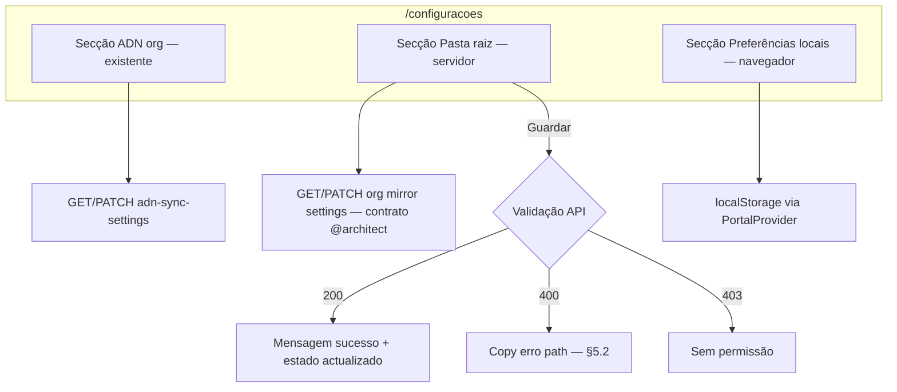

# UI/UX — Espelho local XML/PDF (pasta raiz Windows, servidor + worker)

**Produto:** Portal NF.  
**Fonte de produto:** `docs/prd-download-automatico-xml-pdf-pasta-raiz-windows.md` (**FR58–FR63**, **NFR30–NFR34**, épicos **LM-01**, **LM-02**).  
**Briefing:** `docs/briefing-download-automatico-xml-pdf-pasta-raiz-windows.md`.  
**Especificações base:** `docs/front-end-spec.md`, `docs/front-end-spec-dois-niveis-organizacao-vs-empresas-fiscais.md`, `docs/prd-integracao-nfse-dist-adn.md` (contexto ADN).

### Hierarquia normativa

1. Este documento define **copy**, **layout**, **estados**, **fluxos**, **a11y** e **mapeamento de erros API** para a **persistência da pasta raiz no servidor** e **mensagens FR63** no âmbito **LM-01** (UI + API).  
2. O comportamento do **worker** ao gravar disco (**LM-02**) é **fora da UI**; a UI apenas **reflecte** contagens ou estados quando o produto expuser `summaryJson` na ficha de sync (**§7 — extensão opcional**).  
3. O formulário actual de **Configurações** mistura preferências **só `localStorage`** (fuso, e-mail) com campos que o PRD passa a tratar como **servidor** (`local_download_root`). **Prevalece este spec** quanto à **separação visual e copy** entre bloco **«Servidor»** e bloco **«Neste navegador»** após implementação.

### Change log (este incremento)

| Data       | Versão | Descrição |
| ---------- | ------ | --------- |
| 2026-04-24 | 1.0    | Spec inicial: IA em `/configuracoes`, dashboard, copy FR63, estados API, deck de mensagens, a11y, rastreio FR. |

---

## 1. Introdução e âmbito

### 1.1 Objetivo do documento

Garantir que o utilizador **não assuma** que o browser grava em disco; que a **pasta raiz** configurada para o **worker** esteja claramente associada ao **servidor** e à **máquina onde corre a recolha ADN**; e que **administradores** consigam **ler, editar e guardar** esse valor com feedback explícito (**FR60**, **FR63**).

### 1.2 Fora de âmbito (UI — fase 1)

- Instalador ou ecrãs do **agente desktop** (épico **LM-03** / **FR8**).  
- Listagem de ficheiros no disco a partir do browser.  
- Editor de caminho com picker de pastas nativo do SO (não existe na web); entrada **texto livre** + validação servidor (**NFR30**).  
- Alteração do fluxo **POST …/adn/sync** ou do **AdnSyncPanel** além do **opcional** em **§7**.

### 1.3 Objetivos de UX

1. **Expectativa correcta:** distinguir **«guardado no servidor»** de **«guardado neste navegador»**.  
2. **Confiança:** admin vê o valor actual do servidor após reload (**FR59**, **FR60**).  
3. **Erros acionáveis:** respostas **400** traduzidas em linguagem de operador, sem stack trace (**NFR30**, PRD §8).  
4. **Acessibilidade:** campo de caminho com **nome**, **descrição** e **associação** explícitos (WCAG 2.x — ver **§6**).

---

## 2. Arquitectura da informação e fluxos

### 2.1 Diagrama (alto nível)

### 2.2 Mapa de superfícies

| Superfície | Alteração |
| ---------- | --------- |
| **`/configuracoes`** | Reorganizar conteúdo em **três** blocos lógicos (podem ser **duas** `section` se C for mantida num único `form` com nota de rodapé — ver **§3.1**). |
| **`/dashboard`** | Actualizar bloco **«Agente no computador»** (**§4**). |
| **`/empresas/[id]`** *(opcional LM-01.x)* | Faixa informativa **só leitura** com pasta raiz do servidor para admins — **§7**. |

---

## 3. Layout e estrutura — `/configuracoes`

### 3.1 Ordem recomendada (topo → fundo)

1. **Cabeçalho da página** — inalterado (`h1` + parágrafo intro); opcionalmente acrescentar **uma linha** no parágrafo: *«As definições marcadas como servidor aplicam-se à organização activa.»*  
2. **Secção «Sincronização ADN (organização activa)»** — **existente** (toggle + Guardar ADN); manter estilos `max-w-lg`, `rounded-xl`, `border`.  
3. **Nova secção «Pasta raiz no disco (servidor)»** — **LM-01** (ver **§3.2**).  
4. **Secção «Preferências neste navegador»** — fuso horário + notificação e-mail + botão que **só** persiste `localStorage` (comportamento actual do form, renomeado para clareza).

**Regra de ouro:** o botão **«Guardar pasta no servidor»** (rótulo canónico sugerido) **não** deve submeter o mesmo `form` que o fuso/e-mail, para evitar ambiguidade. Preferir **dois** `<form>` ou um form servidor e controlos órfãos com `type="button"` + acção explícita — decisão de implementação, desde que a **semântica** de **§3.3** seja preservada.

### 3.2 Secção «Pasta raiz no disco (servidor)»

| Elemento | Especificação |
| -------- | --------------- |
| **`h2`** | Texto: **«Pasta raiz no disco (servidor)»** (ou **«Pasta raiz para o worker de recolha»** se PO preferir tom mais técnico). |
| **Parágrafo intro** | `text-xs text-black/55 dark:text-white/50`, 2–3 frases obrigatórias (ver **§5.1 — bloco A**). |
| **`label`** visível | Associado a `input#local-download-root` (id estável para testes). Rótulo curto: **«Caminho absoluto na máquina do worker»**. |
| **`input`** | `type="text"`, `font-mono text-sm`, `autoComplete="off"`, `spellCheck={false}`, `maxLength` alinhado ao limite API (ex.: 512 — fechar com backend). **Placeholder** opcional: `C:\NFs` (não substituir valor real). |
| **Texto de apoio (helper)** | Segundo parágrafo com árvore: `{pasta}\{CNPJ 14 dígitos}\{código-do-sistema}\` + exemplo de ficheiro `{chave}.xml` / `.pdf` em `code` inline (mesmo padrão visual que o helper actual da pasta raiz). |
| **Estado «sem org activa»** | Reutilizar padrão da secção ADN: mensagem âmbar *«Escolha uma organização…»* e campos **desactivados** ou secção colapsada. |
| **Estado «sem permissão»** | `local_download_root` em **só leitura** (`readOnly`) ou texto estático `font-mono` + frase *«Apenas administradores da organização podem alterar este caminho.»* (**FR59**). |
| **Botão primário** | **«Guardar pasta no servidor»** — `rounded-lg bg-[var(--foreground)] …`, `disabled` durante `fetch`. |
| **Feedback sucesso** | `text-xs text-emerald-700 dark:text-emerald-400`, **«Caminho guardado no servidor.»** (distinto de *«Preferências salvas neste navegador.»*). |
| **Feedback erro rede** | `role="alert"`, tom vermelho suave, texto genérico + **«Tente novamente.»**. |

### 3.3 Secção «Preferências neste navegador»

| Elemento | Especificação |
| -------- | --------------- |
| **`h2`** | **«Preferências neste navegador»**. |
| **Nota** | `text-xs`: *«Fuso horário e alertas abaixo aplicam-se apenas a este dispositivo e não são enviados ao servidor.»* (até existir API dedicada). |
| **Botão** | **«Guardar preferências locais»** (evitar o genérico **«Salvar»** se coexistir com guardar servidor). |
| **Sucesso** | *«Preferências salvas neste navegador.»* (manter copy actual ou alinhar a este rótulo). |

### 3.4 Densidade e tokens visuais

- Reutilizar **contentor** `max-w-lg rounded-xl border border-black/5 bg-black/[0.02] p-6 dark:border-white/10 dark:bg-white/[0.03]` por secção, **paridade** com secção ADN existente.  
- Não introduzir novas cores fora da paleta **emerald** / **âmbar** / **vermelho** já usadas em Configurações.

---

## 4. Dashboard — bloco «Agente no computador»

**Ficheiro referência:** `apps/web/src/app/(dashboard)/dashboard/page.tsx`.

### 4.1 Objectivo

Reforçar **FR63** sem exigir que o utilizador abra Configurações.

### 4.2 Copy proposta (substituir parágrafo actual)

- **Manter** `h2`: «Agente no computador».  
- **Corpo** (sugestão literal para implementação):

> O site orquestra cadastros e agendamentos. A **gravação automática de XML e PDF** no seu disco — por exemplo em **`{caminho}`** — ocorre na **mesma máquina Windows** onde está instalado o **worker de recolha ADN** (com o certificado). O caminho absoluto deve estar definido em **Configurações** → **Pasta raiz no disco (servidor)**. Para arquivo noutro PC, será necessário o **agente local** (fase posterior).

Onde **`{caminho}`**:

- **Prioridade 1:** valor vindo do **servidor** (novo hook ou extensão de `useAppSession` + fetch), quando disponível.  
- **Prioridade 2 (fallback):** `settings.localRootPath` do `PortalProvider` **até** a API estar disponível, com um ícone ou sufixo *«(último valor local)»* opcional — **apenas** se PO aceitar transição; caso contrário, mostrar só texto genérico sem caminho até haver GET.

### 4.3 Link

- Manter **Link** para `/configuracoes` com classes actuais (`text-emerald-700`, `hover:underline`).

---

## 5. Copy deck e erros API

### 5.1 Textos obrigatórios (FR63)

| ID | Onde | Texto (PT) |
| -- | ---- | ------------ |
| **A** | Helper secção pasta servidor | **«Este caminho não é validado pelo site: o servidor guarda o texto para o worker usar. O worker só consegue escrever em pastas do computador onde ele está instalado (em geral, o mesmo onde está o certificado e-CNPJ).»** |
| **B** | Mesma secção, segunda frase opcional | **«Se o worker correr noutro ambiente (cloud), defina aqui o caminho **nessa** máquina ou deixe vazio e use o agente local quando estiver disponível.»** |
| **C** | Tooltip ou `details` expansível *(opcional)* | Título: **«O que é o worker?»** — uma frase + link `docs/qa/adn-staging-setup.md` ou runbook interno. |

### 5.2 Mapeamento HTTP → UI (NFR30, PRD §8)

| Código | `error_code` (se existir) | Mensagem ao utilizador |
| ------ | ------------------------- | ------------------------ |
| **400** | `LOCAL_PATH_TOO_LONG` | *«O caminho é demasiado longo. Use um caminho mais curto ou uma letra de unidade mais próxima da raiz.»* |
| **400** | `LOCAL_PATH_INVALID_CHARS` | *«O caminho contém caracteres não permitidos. Use letras, números e separadores `\` válidos no Windows.»* |
| **400** | `LOCAL_PATH_EMPTY` | *«Para desactivar o espelho no worker, limpe o campo e guarde — confirmar com equipa técnica.»* *(ajustar se o produto usar `null` vs string vazia)* |
| **403** | — | *«Não tem permissão para alterar esta definição.»* |
| **500** | — | *«Não foi possível guardar. Tente mais tarde ou contacte o suporte.»* |

Mensagens **sem** caminhos completos de outros tenants em erros genéricos.

---

## 6. Acessibilidade (a11y)

| Requisito | Implementação |
| --------- | ------------- |
| **Rótulo** | `label htmlFor="local-download-root"` + `input id="local-download-root"`. |
| **Descrição longa** | `aria-describedby` apontando para o `id` do parágrafo helper **A** (e **B** se existir). |
| **Erro de campo** | Se a API devolver erro por campo, região `role="alert"` **ou** `aria-live="polite"` no texto de erro abaixo do input. |
| **Estado a guardar** | Botão com `aria-busy={true}` durante `fetch` ou texto **«A guardar…»** visível (já padrão na secção ADN). |
| **Secções** | `section` com `aria-labelledby` apontando para o `id` do `h2` de cada bloco. |

---

## 7. Extensão opcional — ficha da empresa (`/empresas/[id]`)

**Épico:** LM-01.x (não bloqueante para LM-01).

- **Quem vê:** apenas utilizador com mesmo nível que `adnCanManage` na config ADN.  
- **O quê:** `aside` ou `p` `text-xs` no bloco **Sincronização ADN** ou no **AdnSyncPanel**: *«Pasta raiz no servidor: `C:\…`»* (valor mascarado: mostrar últimos 24 caracteres + prefixo `…` se comprimento > 40, **NFR32** espírito em UI).  
- **Objectivo:** correlacionar falhas de espelho com o caminho sem voltar a Configurações.

Quando **LM-02** expuser `mirrorWritten` / `mirrorFailed` no `lastJob.summary`:

- Uma linha extra sob o estado do job: *«Espelho local: N ficheiros gravados, M falhas.»* com link **«Saiba mais»** → `details` ou doc.

---

## 8. Responsividade

- **Mobile:** `input` de caminho em **largura total** (`w-full`); helper em **várias linhas** (`leading-relaxed`); botão **largura total** `sm:w-auto` se quebrar linha feia.  
- **Desktop:** manter `max-w-lg` no contentor; botão alinhado à esquerda com feedback à direita na mesma `flex` row (`flex-wrap gap-3`).

---

## 9. Rastreio de requisitos (matriz)

| FR / NFR | Secção(es) |
| -------- | ----------- |
| **FR58** | Impl backend; UI assume valor nullable (campo vazio = sem espelho, se produto fechar assim). |
| **FR59** | **§3.2** — só leitura / oculto sem permissão. |
| **FR60** | **§2.1**, **§3.1–3.2** — GET ao abrir com `activeOrgId`. |
| **FR61** | Worker — **fora deste spec**; UI opcional **§7**. |
| **FR62** | **§7** — resumo no último job. |
| **FR63** | **§3.2**, **§4**, **§5.1**. |
| **NFR30** | **§5.2**. |
| **NFR31** | Testes QA — nunca mostrar path de outra org. |
| **NFR32** | **§7** — mascaramento na ficha. |
| **NFR33–NFR34** | Sem requisito UI directo na fase 1. |

---

## 10. Checklist de QA (smoke UX)

1. Com org activa e admin: alterar path → **Guardar** → reload da página → valor **persiste** (servidor).  
2. Sem permissão: campo **não** editável; sem vazamento de path de outro papel (teste com dois utilizadores).  
3. Resposta **400** simulada: mensagem **§5.2** visível, sem consola exposta ao utilizador.  
4. **Lighthouse / axe:** `label` + `aria-describedby` no campo servidor.  
5. **Dashboard:** texto **§4.2** não contradiz o estado real (servidor vs local).

---

## 11. Referências cruzadas

- `docs/prd-download-automatico-xml-pdf-pasta-raiz-windows.md`  
- `apps/web/src/app/(dashboard)/configuracoes/page.tsx`  
- `apps/web/src/app/(dashboard)/dashboard/page.tsx`  
- `apps/web/src/context/portal-provider.tsx`

---

*Especificação de UX/front-end para implementação LM-01; contratos API exactos em documento de arquitectura ou OpenAPI quando existirem.*

— **Uma (UX)** — especificação para handoff a **@dev**.
