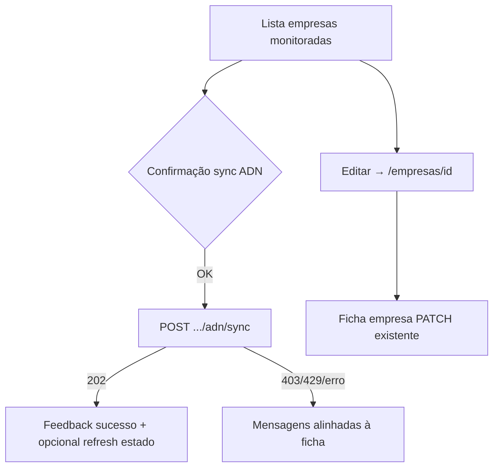

# UI/UX — Incremento: Empresas monitoradas — edição explícita e sincronização ADN na lista

**Produto:** Portal NF.  
**Fonte de produto:** `docs/prd-empresas-monitoradas-editar-e-forcar-automacao.md` (**FR53–FR57**, **NFR26–NFR29**, épico **EM-01**).  
**Briefing:** `docs/briefing-empresas-monitoradas-editar-e-forcar-automacao.md`.  
**Especificações base:** `docs/front-end-spec.md`, `docs/front-end-spec-dois-niveis-organizacao-vs-empresas-fiscais.md`, `docs/front-end-spec-nav-sidebar-empresas-monitoradas.md`.

### Hierarquia normativa

1. Este documento define **layout da lista**, **acções por linha**, **estados ADN**, **fluxos**, **copy** e **a11y** para o incremento **EM-01**.  
2. Onde o spec NAV (`front-end-spec-nav-sidebar-empresas-monitoradas.md` §4.2) ainda descreve **pills** com **`runSync`** («Job mensal · CNPJ»), **prevalece este documento** após merge do incremento EM-01 — actualizar o spec NAV para **v1.1** com nota de supersessão (tarefa de documentação no PR ou story EM-01.x).  
3. **Terminologia** e **rótulos canónicos** de organização vs empresas seguem o spec de **dois níveis**; mensagens de erro/sucesso ADN devem permanecer **literais iguais** à ficha (`AdnSyncPanel`) salvo harmonização explícita no PR (**NFR27**).

### Change log (este incremento)

| Data       | Versão | Descrição |
| ---------- | ------ | ---------- |
| 2026-04-24 | 1.0    | Spec inicial: lista em linhas, CTAs Editar + Pedir sincronização ADN, estados, fluxos, copy deck, rastreio FR, responsividade. |

---

## 1. Introdução e âmbito

### 1.1 Objetivo do documento

Garantir que a **lista de empresas monitoradas** (rota **`/empresas-monitoradas`** e bloco homónimo no **Painel**) comunique de forma **inequívoca**:

- **Edição** dos dados da empresa (atalho para a ficha canónica).  
- **Pedido de sincronização ADN** no servidor (fila real), **sem** usar o mock `runSync` do `PortalProvider` nesta lista.

### 1.2 Fora de âmbito (UI)

- Modal ou gaveta de edição na lista.  
- Coluna **estado do último job ADN** por linha — **fase 1.1** opcional; o MVP pode omitir ou mostrar apenas feedback **após** acção (**§5.3**).  
- Toolbar de pesquisa/filtros além do que a API `GET monitored-companies` já suporta via query (se existir no hook; manter comportamento actual).  
- Alteração visual do **`DashboardShell`** fora do que já está no spec NAV.

### 1.3 Objetivos de UX

1. **Separar intenções:** «alterar cadastro» ≠ «pedir job na fila».  
2. **Paridade semântica com a ficha:** mesmo texto de confirmação, mesmas mensagens pós-`POST`, mesmo tratamento de **403** / **429** / **202**.  
3. **Previsibilidade no teclado:** duas tab stops distintas por linha (Editar, Sincronizar) — **FR57**.  
4. **Não induzir falso sucesso:** sem botão de sincronização quando ADN está indisponível (**FR55**).

---

## 2. Arquitectura da informação e fluxos

### 2.1 Diagrama de fluxo (alto nível)

### 2.2 Mapa de superfícies

| Superfície | Conteúdo |
| ---------- | --------- |
| **`/empresas-monitoradas`** | `h1` + subtítulo (inalterados — spec NAV §4.1) + **lista em linhas** com acções. |
| **Painel** — secção Empresas monitoradas | **Mesmo organismo** que a página dedicada (**paridade EM-01**), ou documentar divergência intencional no PR (desaconselhado). |
| **`/empresas/[id]`** | Continua a ser a **única** vista de edição completa no MVP. |

---

## 3. Layout e estrutura visual

### 3.1 Padrão de lista: **tabela responsiva** (recomendado)

| Zona | Conteúdo mínimo |
| ---- | ----------------- |
| **Identificação** | **Nome comercial** (`tradeName`) em `font-medium`; linha secundária ou sufixo com **código do sistema** (`systemCode`) e **CNPJ mascarado** (`cnpjMasked`), `text-xs` / cor secundária (`text-black/55` `dark:text-white/50`). |
| **Acções** | Grupo alinhado à direita em desktop (`text-right`, `flex justify-end gap-2`); em **viewport estreita**, empilhar **abaixo** da identificação com `flex-col sm:flex-row` para não comprimir CTAs. |

**Alternativa aceite:** lista semântica `<ul>` com `<li class="flex flex-col gap-3 border-b ...">` — mesma hierarquia visual que a tabela.

### 3.2 Contentor

- Manter **`section`** com `rounded-xl border border-black/5 p-6 dark:border-white/10` (paridade com `MonitoredCompaniesSection` actual e spec NAV §4.3).  
- **`aria-busy`** no contentor durante **reload** da lista (`loading` do hook), como hoje.

### 3.3 Densidade e hierarquia

- Altura mínima confortável por linha (**44px** área clicável recomendada — WCAG 2.5.5 alvo, sem ser obrigatório AAA).  
- Acções como **botões** de tamanho `text-sm` / `py-2` / `px-3` alinhados ao botão **«Pedir sincronização ADN»** da ficha (`rounded-lg`).

---

## 4. Acções por linha

### 4.1 Editar (**FR53**)

| Atributo | Especificação |
| -------- | -------------- |
| **Componente** | `Link` (Next.js) com `href={/empresas/${id}}` **ou** `button` + `router.push` — preferir **`Link`** para crawlable + abrir em novo separador. |
| **Rótulo visível** | **«Editar»** (PT-BR). |
| **Estilo** | Secundário: `rounded-lg border border-black/10 px-3 py-2 text-sm dark:border-white/15` (coerente com **«Actualizar»** do painel ADN). |
| **`aria-label`** | **«Editar empresa [nome comercial ou código] — CNPJ [mascarado]»** — usar nome truncado se necessário; incluir CNPJ para disambiguar linhas iguais. |

### 4.2 Pedir sincronização ADN (**FR54**, **NFR27**)

| Atributo | Especificação |
| -------- | -------------- |
| **Rótulo visível** | **«Pedir sincronização ADN»** — **igual** ao botão principal do `AdnSyncPanel` (evitar «Executar agora» genérico no MVP). |
| **Estilo** | Primário na linha: mesmo tratamento visual que na ficha (`bg-[var(--foreground)]` … `text-[var(--background)]`) **ou** variante `emerald` já usada noutros CTAs do portal — **uma** escolha por PR; manter **contraste** AA. |
| **Confirmação** | Antes do `POST`, mostrar o **mesmo** texto que `window.confirm` na ficha: **«Pedir sincronização ADN agora? (fila no portal)»**. Se @qa exigir alternativa acessível ao `confirm` nativo, substituir por **diálogo modal** com os mesmos verbetes **Cancelar** / **Pedir sincronização**. |
| **`aria-label`** | **«Pedir sincronização ADN para CNPJ [mascarado]»** (complementar ao texto visível se a linha usar só ícone numa iteração futura). |
| **`disabled`** | `true` enquanto `busy` (pedido em curso) para essa linha; não desactivar **Editar** durante o `POST` (permite sair). |

### 4.3 Estados em que o botão de sync **não** aparece (**FR55**)

Reutilizar a **mesma** matriz conceptual do `AdnSyncPanel` (`access`):

| Estado | UI na linha |
| ------ | ----------- |
| `feature_off` (404 no GET) | **Ocultar** botão «Pedir sincronização ADN». Opcional: ícone informativo `title` ou texto `text-xs` **uma vez por secção** (não repetir por cada linha) — *recomendado* para não poluir. |
| `forbidden` | **Ocultar** botão ou mostrar **desactivado** com `aria-label` explicando **«Sem permissão para pedir sincronização ADN nesta empresa»**; preferir **ocultar** + mensagem única ao pé da lista se todas as linhas forem `forbidden`. |
| `loading` (por linha) | Skeleton ou espaço reservado no lugar do botão sync; **Editar** permanece disponível. |
| `error` (GET) | Botão sync **oculto**; mensagem de linha ou secção: alinhar ao copy da ficha para erro de carga ADN. |
| `active` | Botão **visível** e clicável (sujeito a confirmação). |

**Nota de implementação (NFR26):** o estado `access` por empresa deve vir de lógica **partilhada** com a ficha. Para **N** empresas, evitar **N** pedidos simultâneos sem limite: documentar na story **pool de concorrência** (ex.: 2–3 `GET` em paralel) ou **lazy** ao entrar no viewport (`IntersectionObserver`) — decisão técnica, não bloqueante para este spec visual.

### 4.4 Utilizador sem papel de admin (**EM-01.3**)

- **Paridade com ficha:** se o `GET` devolver equivalente a **403** / `forbidden`, **não** apresentar CTA que sugira sucesso após clique.  
- **Mensagem curta** (opcional, uma vez por lista): *«Apenas administradores da organização podem pedir sincronização ADN.»* — reutilizar verso já usado no painel ADN após **403** no `POST` (**coerência**).

---

## 5. Estados da secção e feedback

### 5.1 Lista (`GET monitored-companies`) — **FR56**

| Estado | Tratamento |
| ------ | ---------- |
| Loading | Skeleton ou `aria-busy` (mantém spec NAV). |
| Erro | `role="alert"`, retry **«Tentar novamente»**. |
| Vazio | Inalterado: copy + link **«Nova empresa monitorada»** (`/empresas/nova`) — `fiscal.new.title` / `fiscal.list.empty` conforme spec dois níveis. |

### 5.2 Após `POST` bem-sucedido (**202**)

- Mensagem **inline** na linha ou toast: **«Pedido aceite. O job foi enfileirado.»** (igual à ficha).  
- **`aria-live="polite"`** na região de mensagens da linha ou secção.

### 5.3 Opcional fase 1.1 — coluna «Último job»

- Se a equipa reutilizar `GET .../adn/sync` sem custo inaceitável: mostrar **status** + **data** numa terceira coluna, tipografia `font-mono text-xs` como na ficha.  
- Caso contrário, **omitir** no MVP.

---

## 6. Fluxos detalhados

### 6.1 Editar a partir da lista

1. Utilizador foca **«Editar»** na linha.  
2. Ativação: navegação para `/empresas/{id}`.  
3. Ficha carrega com dados actuais (fluxo existente).

### 6.2 Pedir sincronização ADN a partir da lista

1. Utilizador foca **«Pedir sincronização ADN»** (só visível em estado `active`).  
2. Confirmação (nativa ou modal acessível).  
3. `POST` com `Content-Type: application/json`, corpo `{}`, cabeçalho **`Idempotency-Key`** (UUID).  
4. Feedback conforme status HTTP (**§5.2** e tabela abaixo).

| HTTP | Comportamento UI |
| ---- | ----------------- |
| **202** | Mensagem de sucesso + refresh opcional do estado ADN dessa linha. |
| **403** | **«Apenas administradores da organização podem pedir sincronização ADN.»** |
| **429** | Mensagem de serviço ocupado + **Retry-After** se existir (igual à ficha). |
| Outros | **«Não foi possível pedir a sincronização.»** ou `message` do JSON. |

### 6.3 Teclado e leitor de ecrã (**FR57**)

- Ordem de tab na linha: **Editar** → **Pedir sincronização ADN** (esquerda → direita em LTR).  
- **Não** envolver a linha inteira num único `<button>`.  
- Se a lista for **`<table>`**, usar `<th scope="col">` para cabeçalhos; primeira coluna pode ser **«Empresa»**, segunda **«Acções»** com `sr-only` ou texto visível conforme densidade.

---

## 7. Copy deck (strings — PT-BR)

| ID | Texto | Onde |
| ---- | ----- | ---- |
| `monitored.row.edit` | Editar | Botão/link |
| `monitored.row.edit.aria` | Editar empresa {nome} — CNPJ {mascarado} | `aria-label` |
| `monitored.row.adn` | Pedir sincronização ADN | Botão (visível) |
| `monitored.row.adn.aria` | Pedir sincronização ADN para CNPJ {mascarado} | `aria-label` |
| `monitored.adn.confirm` | Pedir sincronização ADN agora? (fila no portal) | Confirmação pré-POST |
| `monitored.adn.success` | Pedido aceite. O job foi enfileirado. | Pós-202 |
| `monitored.adn.forbiddenPost` | Apenas administradores da organização podem pedir sincronização ADN. | Pós-403 |
| `monitored.adn.rateLimited` | (servidor + Retry-After) | Pós-429 — **literal alinhado à ficha** |
| `monitored.adn.genericError` | Não foi possível pedir a sincronização. | Fallback |

**Reutilizar sem alteração** os parágrafos de estado do `AdnSyncPanel` para **feature_off**, **forbidden** (vista), **error** (GET), quando esses estados forem mostrados ao nível da secção.

---

## 8. Responsividade

| Breakpoint | Comportamento |
| ---------- | -------------- |
| **≥ sm** | Tabela ou linha com identificação à esquerda e acções à direita na mesma linha. |
| **< sm** | Acções em linha própria por baixo, largura total ou `flex-wrap`, botões **stack** ou lado a lado com `min-h` confortável. |

---

## 9. Acessibilidade (WCAG 2.2 AA — delta)

| Requisito | Implementação |
| --------- | --------------- |
| **FR57** | Cada CTA com nome acessível único; ver §4. |
| **Mensagens dinâmicas** | `aria-live="polite"` na zona de feedback da acção ADN. |
| **Foco** | Após fechar `confirm` nativo, foco regressa ao botão disparador (comportamento por defeito do browser); se modal custom, **gestão de foco** explícita (trap + return focus). |
| **Contraste** | Botão primário e secundário: verificar **4.5:1** mínimo para texto. |

---

## 10. Rastreio PRD → UX

| ID | Cobertura |
| -- | --------- |
| **FR53** | §4.1, §6.1 |
| **FR54** | §4.2, §6.2, §7 |
| **FR55** | §4.3 |
| **FR56** | §5.1 |
| **FR57** | §6.3, §9 |
| **NFR26** | §4.3 nota técnica |
| **NFR27** | §1 hierarquia, §7 |
| **NFR28** | §6.2 tabela 429 |
| **NFR29** | Implícito (sem mudança de rota org; mesma API listagem) |

---

## 11. Próximos passos

1. **`@dev`** — Refactor `MonitoredCompaniesSection`; extrair hook ADN partilhado com `AdnSyncPanel`; implementar layout §3–§4.  
2. **`@qa`** — Matriz: admin vs não-admin; org sem ADN (404); 429 simulado; tab order; leitor de ecrã nos CTAs.  
3. **`@sm` / docs** — Actualizar `docs/front-end-spec-nav-sidebar-empresas-monitoradas.md` §4.2 (paridade lista) para **v1.1** após EM-01.

---

*Spec UX/UI — AIOS (ux-design-expert — Uma); alinhado a `docs/prd-empresas-monitoradas-editar-e-forcar-automacao.md`.*
