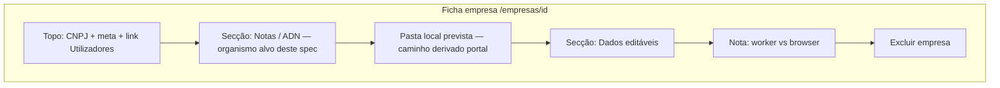
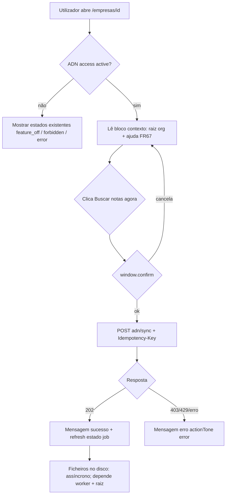

# Especificação de front-end e UX — Forçar busca de notas (ficha da empresa)

**Documento:** UI/UX derivado de `docs/prd-forcar-busca-notas-ficha-empresa.md` (**FR64–FR68**, **NFR35–NFR38**, épico **BNF-01**).  
**Âmbito:** rota **`/empresas/[id]`**, com foco no organismo **Sincronização ADN / notas** e blocos adjacentes na mesma página.

**Change log**

| Data       | Versão | Descrição |
| ---------- | ------ | --------- |
| 2026-04-24 | 1.0    | Especificação inicial: IA, fluxos, layout, componentes, a11y, responsividade. |

---

## 1. Introdução e propósito

Este documento define **experiência de utilizador**, **arquitectura de informação na página**, **fluxos**, **layout alvo**, **estados de UI**, **acessibilidade** e **reutilização de padrões visuais** para cumprir o PRD sem contradizer a realidade técnica (pedido na web **≠** gravação instantânea no disco).

**Implementação de referência (brownfield):**

- `apps/web/src/app/(dashboard)/empresas/[id]/adn-sync-panel.tsx`
- `apps/web/src/hooks/use-adn-sync-for-company.ts`
- `apps/web/src/app/(dashboard)/empresas/[id]/page.tsx` (ordem: **AdnSyncPanel** → **Pasta local prevista** → **Dados** → nota explicativa)

---

## 2. Objectivos de UX e princípios

### 2.1 Personas (do PRD)

1. **Administrador da organização** — pode enfileirar sync; precisa de linguagem orientada a **notas** e de perceber **fila + disco**.
2. **Operador fiscal** — pode não ter permissão de sync; precisa de **estado da pasta raiz** (configurada ou não) sem jargão excessivo.
3. **Utilizador ocasional** — precisa de **uma** acção clara e texto que evite a expectativa “o site gravou no meu `C:\`”.

### 2.2 Objectivos de usabilidade

| Objectivo | Indicador de sucesso |
| --------- | -------------------- |
| Clareza do resultado do clique | Utilizador cita “fila” ou “job” após ler a mensagem de sucesso (teste moderado ou inquérito leve). |
| Gestão de expectativa de disco | Com raiz vazia, utilizador vê **aviso persistente** antes de assumir ficheiros locais (**FR65**). |
| Eficiência | Um fluxo principal: **um CTA primário** de “buscar notas” na área ADN activa (**recomendação UX v1** abaixo). |
| Prevenção de erros | Confirmação antes do `POST` (paridade com hook actual); **429** com mensagem clara, sem double-submit. |

### 2.3 Princípios de desenho (3–5)

1. **Transparência primeiro** — nunca implicar download directo pelo browser para path arbitrário (**FR67**).
2. **Um herói por secção** — evitar dois botões primários com o mesmo efeito; se coexistirem na v1, hierarquia visual clara (**secção 6**).
3. **Paridade com o existente** — mesmas classes de feedback (`actionMsg`, `actionTone`) e padrões de botão já usados em `AdnSyncPanel`.
4. **Acessibilidade mínima WCAG 2.2 AA** — foco visível, `aria-live` para mensagens, rótulos distintos (**FR68**).
5. **Consistência PT-BR** — alinhar vocabulário a `NFR36` e ao diálogo “Como funciona?” actual.

---

## 3. Arquitectura de informação (página)

### 3.1 Inventário do ecrã `/empresas/[id]`

### 3.2 Navegação e âncoras

- **Primária:** shell do dashboard (inalterada).
- **Secundária na página:** link `← Empresas`, link para utilizadores da empresa.
- **Ligação crítica para este incremento:** da secção ADN / contexto de disco para **`/configuracoes`** (definição de `localDownloadRoot`). Se existir âncora estável (ex. `#adn` ou `#pasta-raiz`), usar na URL; caso contrário, link simples com copy “Abrir Configurações”.

### 3.3 Recomendação de **reordenação opcional** (para @architect + @dev)

Para reduzir saltos cognitivos entre **“pedir notas”** e **“onde grava no PC”**:

- **Opção A (mínima):** manter ordem actual; inserir **bloco de contexto de raiz org** *dentro* ou *imediatamente abaixo* do `AdnSyncPanel` (antes de “Pasta local prevista” se o bloco org for distinto do path `pathForCompany`).
- **Opção B (ideal UX):** fundir visualmente **ADN + estado `localDownloadRoot` + CTA** num único cartão com subsecções (“Estado da fila”, “Arquivo no seu computador”, “Acções”).

O PRD não obriga B; a story pode escolher A para menor risco.

---

## 4. Fluxos de utilizador

### 4.1 Fluxo principal — Buscar notas agora (autorizado, ADN activo)

**Objectivo:** Enfileirar recolha ADN e alinhar expectativa de ficheiros no disco.

**Pontos de entrada:** Ficha da empresa com `access === "active"` no hook de sync.

**Critérios de sucesso:** `POST` aceite (202), mensagem de sucesso conforme **FR64** + copy que mencione fila e, quando aplicável, espelho local (**PRD sec. 3**).

**Casos extremos**

- **429:** mostrar mensagem existente do cliente; **sem** retry automático agressivo (**NFR37**).
- **Duplo clique:** botão `disabled={busy}` durante pedido (**FR68**).
- **`local_download_root` vazio:** aviso **persistente** visível; **não** bloquear o fluxo de sync por omissão (**FR65**).

### 4.2 Fluxo — Raiz de download não configurada

**Objectivo:** Informar que o espelho em disco pode falhar ou não ocorrer até configurar a raiz.

- Mostrar **callout** (não só toast): estilo `amber` ou `border` + ícone opcional, texto + link “Configurar pasta raiz” → `/configuracoes`.
- O CTA “Buscar notas agora” permanece disponível se ADN activo e utilizador autorizado.

### 4.3 Fluxo — Raiz configurada

- Mostrar **linha de estado positiva** (ex.: texto `text-emerald-800` / `dark:text-emerald-300` alinhado ao padrão de sucesso existente) + link “Alterar em Configurações”.
- **Path completo vs mascarado:** default da spec = **não** mostrar path completo na ficha se o mesmo ecrã for partilhado em contextos sensíveis; mostrar **últimos segmentos** ou apenas “Pasta raiz configurada”. Decisão final **@po / @qa** (PRD **FR66**).

### 4.4 Fluxo — Sem permissão para `POST`

- **Paridade** `AdnSyncPanel`: CTA **desactivado** ou **oculto** + mensagem curta (reutilizar ou extrair constante partilhada).

---

## 5. Wireframes e layout (baixa fidelidade)

**Ficheiros de design:** não há Figma obrigatório; este bloco serve de referência para implementação. Opcional: exportar para Figma depois.

### 5.1 Secção alvo — estrutura vertical (Opção A)

Ordem sugerida **dentro** do cartão ADN (ou bloco imediatamente associado):

1. **Título** — Preferência: **“Notas e sincronização”** ou manter **“Sincronização ADN”** com subtítulo *“Buscar notas no Ambiente Nacional”* (decisão de copy @po).
2. **Texto de ajuda (FR67)** — `text-xs text-black/55 dark:text-white/50`, 1–3 frases, acima dos callouts.
3. **Callout raiz org** — um de:
   - *Aviso* (raiz ausente): `border-amber-200 bg-amber-50/...` (ou padrão neutro + `role="status"`).
   - *Sucesso informativo* (raiz definida): estilo discreto, não competir com mensagem de `actionMsg` após POST.
4. **Estado do último job** — manter bloco `aria-live="polite"` existente.
5. **Zona de acções** — `flex flex-wrap gap-2` (igual ao actual):
   - **Primário:** “Buscar notas agora” (novo rótulo recomendado).
   - **Secundário:** “Actualizar” (inalterado).
   - **Terciário:** “Como funciona?” (inalterado).
6. **`actionMsg`** — abaixo dos botões, como hoje.

**Decisão de produto sobre dois CTAs (PRD):**

| Variante | Descrição |
| -------- | --------- |
| **V1-recomendada** | **Um** botão primário: renomear **“Pedir sincronização ADN”** → **“Buscar notas agora”**; subtítulo ou primeira frase do help explica ADN. |
| **V1-alternativa** | Dois botões: primário “Buscar notas agora” + secundário outline “Pedir sincronização ADN (avançado)” **proibido** — mesmo efeito confunde; não usar. |
| **V1-transição** | Primário “Buscar notas agora” + link de texto “Termos técnicos ADN” que abre o mesmo `dialog` de ajuda — aceitável. |

### 5.2 Copy sugerida (rascunho para @po)

- **Confirmação (`window.confirm`):**  
  *“Pedir a busca de notas agora? O pedido entra na fila no portal; os ficheiros no disco dependem da pasta raiz da organização e do worker.”*
- **Sucesso (extensão à mensagem actual):**  
  acrescentar *“Quando o job concluir, os XML/PDF podem ser espelhados na pasta raiz configurada (se aplicável ao seu ambiente).”*
- **Aviso raiz vazia:**  
  *“A pasta raiz de download da organização não está definida. As notas podem ficar só no portal até configurar a pasta em Configurações.”*

(Ajustar tom e comprimento após revisão legal/produto.)

---

## 6. Biblioteca de componentes / sistema de desenho

**Abordagem:** manter **Tailwind utility-first** e tokens CSS já usados (`var(--foreground)`, `var(--background)`), **sem** novo design system.

| Peça | Uso neste incremento |
| ---- | -------------------- |
| **Cartão de secção** | Reutilizar `rounded-xl border border-black/5 bg-black/[0.02] p-6 dark:...` do `AdnSyncPanel`. |
| **Botão primário** | Mesmas classes do botão “Pedir sincronização ADN” actual (`bg-[var(--foreground)]` …). |
| **Botão secundário** | Borda neutra existente para “Actualizar”. |
| **Link texto / ajuda** | Padrão `emerald` + `underline` do “Como funciona?”. |
| **Callout** | Novo **molecule**: `LocalDownloadRootCallout` — props: `variant: "missing" \| "configured"`, `settingsHref`, `pathPreview?: string`. Evita duplicar markup entre estados. |
| **Texto de ajuda FR67** | Opcionalmente `AdnNotesExplainer` — parágrafo estático ou props mínimas; conteúdo validado por produto. |

**NFR35:** o segundo CTA **não** deve duplicar `postAdnSyncRequest`; partilhar `requestSync` do mesmo hook ou extrair handler único.

---

## 7. Identidade visual e estilo (resumo)

Não alterar paleta global. Referência rápida alinhada ao código actual:

| Uso | Classes / tokens típicos |
| --- | ------------------------- |
| Texto principal | `text-sm` / `text-black/75 dark:text-white/70` |
| Texto secundário | `text-xs text-black/55 dark:text-white/50` |
| Sucesso | `text-emerald-800 dark:text-emerald-300` |
| Aviso | `text-amber-800 dark:text-amber-200` ou fundo `amber` suave |
| Erro | `text-red-800 dark:text-red-300` (já usado em `access === "error"`) |

Tipografia: herdada do layout da app (sem nova família).

---

## 8. Acessibilidade (WCAG 2.2 nível AA — alvo)

| Requisito | Especificação |
| --------- | ------------- |
| **Nome acessível** | Botão primário: rótulo visível “Buscar notas agora”; `aria-label` pode igualar o visível ou acrescentar contexto *“para esta empresa”* se houver ambiguidade em ecrãs densos. |
| **Estado ocupado** | `disabled={busy}` **e** `aria-busy={busy}` no botão primário durante `POST`. |
| **Mensagens dinâmicas** | Manter `aria-live="polite"` no bloco do último job; `actionMsg` com `role="status"` ou `role="alert"` conforme `actionTone` (já implementado). |
| **Callouts** | `role="status"` para informativos; não usar `alert` para aviso não crítico de raiz vazia (evita interrupção agressiva). |
| **Foco** | Ordem de tab: ajuda FR67 → callout (link interno) → estado job → primário → secundário → “Como funciona?”. |
| **Contraste** | Novos fundos de callout devem manter contraste mínimo 4.5:1 para texto normal. |
| **Diálogo “Como funciona?”** | Manter padrão `dialog` + `aria-labelledby` existente; actualizar bullets se o copy mencionar espelho local (**FR67** alinhado ao diálogo). |

**Testes sugeridos:** smoke com leitor de ecrã (NVDA/VoiceOver) no fluxo confirmar → sucesso; teclado só, sem rato.

---

## 9. Responsividade

- **Mobile primeiro:** `flex-wrap gap-2` nos botões já suporta telemóvel; garantir que callouts **não** ultrapassam `100%` da viewport (`max-w-full`, `break-words` se path preview existir).
- **Desktop:** largura máxima confortável alinhada à página (`max-w-xl` na nota explicativa abaixo — opcional harmonizar largura do cartão ADN com `max-w-2xl` apenas se o design system da app usar; **não** obrigatório neste incremento).

---

## 10. Animação e micro-interacções

- **Sem** novas animações obrigatórias.
- Transição de `disabled` já implícita via `opacity-50`; opcional `transition-opacity` 150ms se já for padrão noutros botões da app.

---

## 11. Performance e dados

- **Uma** chamada adicional máxima recomendada por carga de página: `GET .../organization-adn-sync-settings` (ou equivalente) para `localDownloadRoot` + `canManage`, com **cache** alinhado à página de Configurações (React Query / SWR / memoização — decisão @architect).
- Evitar re-fetch em cada render; invalidar após guardar raiz em Configurações (evento de navegação `router.refresh` ou invalidação de query se partilhado).

---

## 12. Dados de interface (contrato UX → front)

| Campo | Origem API (prevista) | UI |
| ----- | ----------------------| --- |
| `localDownloadRoot` | `GET organization-adn-sync-settings` (ou consolidado) | Callout missing / configured |
| `canManage` | mesma API | pode condicionar **visibilidade** do path mascarado (“só admin vê detalhe”) |
| Sync | existente `useAdnSyncForCompany` | sem alteração de contrato HTTP |

---

## 13. Próximos passos e decisões em aberto

1. **@po:** fechar rótulos finais (título da secção, `confirm`, sucesso, aviso raiz).  
2. **@architect:** origem única de `localDownloadRoot` na ficha + estratégia de cache (**NFR38**).  
3. **@dev:** implementar conforme **Opção A** ou **B** (secção 3.3); extrair `LocalDownloadRootCallout` se útil.  
4. **@qa:** matriz do PRD sec. 10 + verificação WCAG da secção 8.

### Checklist de handoff de desenho

- [ ] Fluxos principais e de erro documentados  
- [ ] Layout baixa fidelidade e hierarquia de CTAs decidida  
- [ ] Callouts FR65/FR66 especificados  
- [ ] A11y: `aria-busy`, `aria-live`, roles dos callouts  
- [ ] Dependência de API e performance descritas  
- [ ] Copy marcada como rascunho até aprovação @po  

---

## 14. Rastreio PRD → secções deste documento

| PRD | Cobertura |
| --- | --------- |
| **FR64** | Sec. 4.1, 5.1, 6, 12 |
| **FR65** | Sec. 4.2, 5.1, 8 |
| **FR66** | Sec. 4.3, 5.1, 12 |
| **FR67** | Sec. 2.3, 4.1, 5.2, diálogo “Como funciona?” |
| **FR68** | Sec. 8 |
| **NFR35–NFR38** | Sec. 6, 11, 12 |
