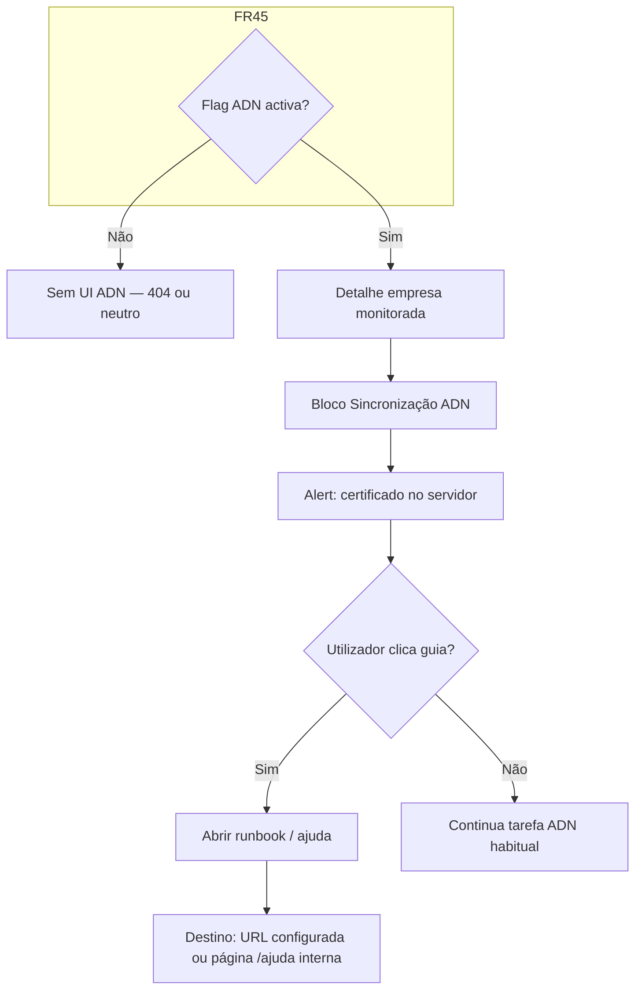

# UI/UX — Certificado e-CNPJ e recolha ADN (empresa monitorada)

**Produto:** Portal de Automação de Notas Fiscais.  
**Fonte de produto:** `docs/prd-importacao-certificado-empresa-monitorada-adn.md` (**CE-FR9**, **CE-FR10**, **CE-NFR1**, épicos 1–2).  
**Especificações base:** `docs/front-end-spec.md`, `docs/front-end-spec-integracao-nfse-dist-adn.md`, `docs/briefing-importacao-certificado-empresa-monitorada-adn.md`.

### Hierarquia normativa

1. Este documento é um **delta** de UX/UI sobre o bloco **Sincronização ADN** já definido no [spec ADN](front-end-spec-integracao-nfse-dist-adn.md): **não** duplica FR41–FR48 nem fluxos de notas/falhas, excepto onde **explicitamente** se sobrepõe.  
2. **CE-NFR1 / NFR19:** **proibido** campo de upload de PFX, campo de thumbprint, ou qualquer entrada de segredo criptográfico na UI pública.  
3. Em conflito de copy ou tokens, prevalecem `docs/front-end-spec.md` e o [spec ADN](front-end-spec-integracao-nfse-dist-adn.md).

### Change log

| Data       | Versão | Descrição |
| ---------- | ------ | ---------- |
| 2026-04-24 | 1.0    | Spec inicial: objectivos UX, IA, fluxos, organismo “Certificado no servidor”, copy CE-FR10, a11y, rastreio CE-FR/CE-NFR. |

---

## 1. Introdução e âmbito

### 1.1 Objetivo de UX

1. **Expectativa correcta:** o **Admin** (e, em leitura, o **User**) percebe em **≤ 30 segundos** que o **certificado digital da empresa** é instalado **apenas no servidor / worker** de recolha, **não** no browser (**CE-FR9**, **CE-NFR1**).  
2. **Descoberta do guia:** existe caminho visível e acessível desde a secção ADN até ao **runbook** (documentação técnica) **sem** sugerir arrastar ficheiros sensíveis para o site.  
3. **Coerência com export JSON:** reforçar mentalmente a diferença entre **lista para automação** (**FR48** — sem segredos) e **configuração com certificado** (fora do portal) — **CE-FR8**.  
4. **Suporte a diagnóstico:** quando o produto optar por mostrar categorias de falha “ligadas a certificado / infra” (mapeamento API → código), usar **apenas** as frases da matriz **CE-FR10** (secção 6), nunca texto bruto de worker ou stack.

### 1.2 Fora de âmbito (UI)

- Formulários de **provisionamento** de PFX, thumbprint ou cofre.  
- **Wizard** multi-passo de instalação no browser.  
- Visualização de **logs** de `execucao.log` ou caminhos `certificates/` no portal (operador usa runbook ou ferramenta interna).

---

## 2. Personas, metas de usabilidade e princípios

### 2.1 Personas (resumo)

| Persona | Meta neste incremento |
| -------- | ---------------------- |
| **Admin da organização** | Saber *onde* o certificado vive e *quem* contactar (TI) com link objectivo. |
| **User com leitura** | Opcionalmente ler o mesmo aviso informativo (sem CTAs de configuração se ACL não permitir). |
| **Operador de infra** | Consumir o **markdown** em `docs/`; a UI do portal só **aponta** para esse conteúdo ou espelho publicado. |

### 2.2 Metas de usabilidade

- **Clareza:** zero referências obrigatórias a “mTLS”, “Schannel”, “curl” na copy **primária** (secundário / runbook apenas).  
- **Confiança:** linguagem calma; **Alert** informativo (não `destructive`) para o bloco de certificado.  
- **Errar à prova de balas:** nenhum empty state sugere “carregue o certificado aqui”.

### 2.3 Princípios de desenho (3–5)

1. **Segredo fora do browser** — toda a acção sensível é “no servidor da sua organização / parceiro”.  
2. **Progressive disclosure** — resumo visível (2 frases); detalhe no runbook ou modal “Saber mais”.  
3. **Um link canónico** — um único destino aprovado por produto para o guia técnico (evitar links duplicados com URLs diferentes).  
4. **Acessível por defeito** — WCAG 2.2 AA no `Alert` + ligação.  
5. **Alinhamento ao spec ADN** — mesma secção física (`Sincronização ADN`), sem competir com CTAs primários (**Sincronizar agora**).

---

## 3. Arquitectura da informação (delta)

### 3.1 Onde vive

- **Dentro** do organismo **Sincronização ADN** no **detalhe da empresa monitorada** (mesmo `h2` e região que o [spec ADN §5.1](front-end-spec-integracao-nfse-dist-adn.md)).  
- **Ordem vertical sugerida:** (1) estado / última sync / CTAs ADN existentes; (2) **Alert** “Certificado e servidor de recolha”; (3) restantes links (Ver notas, Exportar lista, …).  
- **Não** criar separador de nível superior só para certificado no MVP.

### 3.2 Diagrama — descoberta do guia (CE-FR9)



### 3.3 Breadcrumb

Sem alteração face ao [spec ADN §3.3](front-end-spec-integracao-nfse-dist-adn.md): o alerta é **âncora** na mesma página.

---

## 4. Fluxos de utilizador

### 4.1 Ler aviso e abrir guia (Admin / User com acesso à secção)

**Objectivo:** Cumprir **CE-FR9** com mínimo de atrito.

1. Utilizador com org activa correcta abre **detalhe da empresa monitorada** com **FR45** activo.  
2. Na secção **Sincronização ADN**, vê o **Alert** (secção 5) com duas frases + ligação **“Como configurar o certificado no servidor de recolha”** (rótulo exacto recomendado; variantes aceitáveis: *“Guia para a equipa técnica”* desde que o `title` do link descreva o destino).  
3. Ao activar o link: **nova aba** se URL **externa** (site de docs, GitHub interno); **mesma aba** se rota interna `/ajuda/...` — preferência de produto: **externa + `rel="noopener noreferrer"`** quando não for same-origin.  
4. **Sucesso:** o utilizador reconhece que **não** há passo de upload no portal.

**Critérios de sucesso:** link com `href` não vazio em ambientes onde o guia está configurado; em dev sem URL, ver secção 5.4 (empty config).

### 4.2 Cruzamento com “Exportar lista (automação)” (**FR48**, **CE-FR8**)

1. Após **Exportar lista** (fluxo já no spec ADN), se o utilizador **voltar** ao bloco ADN, o **Alert** de certificado permanece visível (não esconder após export).  
2. **Não** adicionar segundo aviso redundante no modal de export; opcionalmente **uma linha** no `Alert` informativo: *“O ficheiro exportado não inclui certificados — a instalação do certificado segue o guia técnico.”* (aceite se PM aprovar densidade de texto).

### 4.3 Estados de erro “categoria certificado” (opcional, se API expuser código)

**Pré-condição:** `@architect` + `@pm` definirem códigos `error_code` seguros mapeáveis às linhas da secção 6.

1. Banner ou `Alert` `variant="destructive"` **subordinado** ao bloco ADN (não toast isolado se a falha for persistente).  
2. Copy **apenas** da matriz §6; botão secundário **“Ver guia técnico”** repetindo o mesmo `href` do alerta informativo.

---

## 5. Ecrãs e componentes (delta)

### 5.1 Organismo — **Alert “Certificado e servidor de recolha”**

| Atributo | Especificação |
| -------- | -------------- |
| Componente base | `Alert` + `AlertTitle` + `AlertDescription` (shadcn), **varianta `default`** ou token equivalente “informação” (não usar `destructive` para o estado normal). |
| `role` | Herdado do `Alert`; garantir `aria-live="polite"` **não** actualizado a cada poll de sync (evitar spam): conteúdo estático após montagem. |
| Título (`AlertTitle`) | **Certificado digital** (curto; máx. ~40 caracteres). |
| Corpo (`AlertDescription`) | **Exactamente duas frases** (PRD §14): (1) *“A ligação ao Ambiente Nacional usa o certificado da empresa instalado no servidor de recolha — não nesta página.”* (2) *“A sua equipa técnica pode seguir o guia oficial para instalar ou renovar o certificado.”* — ajuste fino de pt-BR permitido desde que preserve significado **CE-NFR1**. |
| Ligação | `Button variant="link"` ou `<a className="...">` com estilo de link, **sublinhado** ou indicador visual de hiperligação (WCAG 2.4.4). Texto: **“Como configurar o certificado no servidor de recolha”**. |
| Ícone | `Info` ou `Shield` (Lucide) com `aria-hidden="true"`; o significado fica no texto. |
| Permissões | Visível a **todos** os papéis que veem o bloco ADN (Admin e User leitor). **Sem** CTA extra só para admin neste MVP, salvo decisão PM de ocultar a User. |

### 5.2 Configuração do URL do guia (**CE-FR9**)

| Ambiente | Comportamento |
| -------- | -------------- |
| **Produção** | `NEXT_PUBLIC_ADN_CERT_RUNBOOK_URL` (ou nome acordado com `@architect`) aponta para o destino **aprovado** (site de ajuda, Confluence, ou ficheiro estático publicado). |
| **Desenvolvimento** | Se variável **ausente**: mostrar `Alert` com mesmas duas frases + texto **“Ligação ao guia técnico ainda não configurada neste ambiente.”** em `text-muted-foreground` **sem** `href` quebrado; opcionalmente `Link` para path relativo `/docs/...` **só** se o Next servir essa rota (evitar 404 silencioso). |

### 5.3 Modal “Como funciona?” (actualização do spec ADN §5.1)

Integrar **terceiro bullet** obrigatório quando este incremento estiver activo:

- *“O certificado digital da empresa é tratado pela infraestrutura de recolha. Saiba mais no guia para equipas técnicas.”* — a palavra **“guia”** é o mesmo link do `Alert` (mesmo `href`).

### 5.4 Wireframes (baixa fidelidade — texto)

```
┌─ Sincronização ADN ─────────────────────────────┐
│ [Badge] Última sincronização …                   │
│ [Sincronizar agora]  [Ver notas recebidas]       │
├──────────────────────────────────────────────────┤
│ ℹ Certificado digital                            │
│ A ligação ao Ambiente Nacional usa o certificado │
│ da empresa no servidor de recolha — não aqui.  │
│ [Como configurar o certificado no servidor…] →  │
└──────────────────────────────────────────────────┘
```

**Ficheiros de design:** Figma opcional; até lá, este bloco ASCII + spec ADN servem de referência para `@dev`.

---

## 6. Matriz de mensagens (CE-FR10) — copy de produto

Utilização: **runbook** +, se existir mapeamento API → UI, **mensagens apresentadas no portal** (banner/alert/toast). **Nunca** mostrar thumbprint, caminho de PFX, nem saída de `curl`.

| Categoria técnica (interno) | Copy ao utilizador (pt-BR) | Acção sugerida na UI |
| ----------------------------- | --------------------------- | --------------------- |
| Certificado não encontrado (worker) | **“Não foi possível validar o certificado da empresa no servidor de recolha.”** | Link **Ver guia técnico** + (admin) **Contactar suporte** se existir. |
| PFX inexistente ou senha incorrecta | **“A configuração do certificado no servidor está incompleta ou incorrecta.”** | Idem. |
| Thumbprint inválido | **“Os dados do certificado no servidor precisam de ser actualizados.”** | Idem. |
| `curl.exe` ausente / ambiente | **“O servidor de recolha não está preparado para ligar ao Ambiente Nacional.”** | Idem + suporte. |
| Loja incorrecta (CurrentUser vs serviço) | **“O certificado não está acessível ao serviço de recolha. Verifique a instalação.”** | Idem. |

**Nota:** códigos HTTP crus (**429**, **503**) continuam mapeados para **“Serviço nacional ocupado”** conforme [glossário ADN](front-end-spec-integracao-nfse-dist-adn.md), não nesta matriz.

---

## 7. Acessibilidade (WCAG 2.2 AA)

- **Contraste:** texto do `Alert` e do link sobre fundo do `Alert` ≥ **4.5:1**.  
- **Foco:** link recebível por teclado; ordem de tab: estado ADN → CTAs primários → link do guia → restantes.  
- **Nome do link:** descritivo (evitar “clique aqui”).  
- **Leitor de ecrã:** `AlertTitle` + descrição; ícone decorativo `aria-hidden`.  
- **Não** usar `role="alert"` para conteúdo estático informativo (evitar interrupção agressiva); preferir padrão do componente `Alert` do shadcn sem `assertive`, salvo erro **destructive** em §4.3.

---

## 8. Responsividade

- **Mobile:** `AlertDescription` pode quebrar linha; link em linha própria se largura `< 360px` para área de toque mínima **44×44** px (WCAG 2.5.5 alvo, ou mínimo 24px conforme stack).  
- **Desktop:** largura máxima do texto alinhada ao `Card` do bloco ADN existente.

---

## 9. Animação e performance

- **Sem** animação obrigatória no `Alert`; `fade-in` opcional ≤ **200 ms** se já for padrão global.  
- **Sem** fetch adicional para renderizar o alerta (só env + props estáticas).

---

## 10. Rastreio de requisitos (PRD)

| Requisito | Onde na UI / UX |
| --------- | ---------------- |
| **CE-FR9** | `Alert` + link guia; bullet extra no modal “Como funciona?” |
| **CE-FR10** | Secção 6 + banners opcionais §4.3 |
| **CE-NFR1** | Ausência total de inputs de segredo; copy das duas frases |
| **CE-FR8** | Linha opcional no `Alert` ou proximidade visual ao botão export |
| **CE-NFR5** | UI não mostra thumbprint; se debug interno existir, fora deste spec |

---

## 11. Handoff

- **@dev:** implementar `Alert` no layout do bloco ADN; env `NEXT_PUBLIC_ADN_CERT_RUNBOOK_URL`; actualizar modal “Como funciona?” conforme §5.3.  
- **@architect:** definir fonte única de URL e política same-origin vs externa.  
- **@qa:** casos — flag off (sem alerta), URL vazio (dev), link abre destino correcto, teclado, contraste.  
- **@pm:** aprovar variante final das duas frases e da matriz §6 antes de *release*.

— **Uma (UX) / AIOS** — especificação alinhada a `docs/prd-importacao-certificado-empresa-monitorada-adn.md`.
