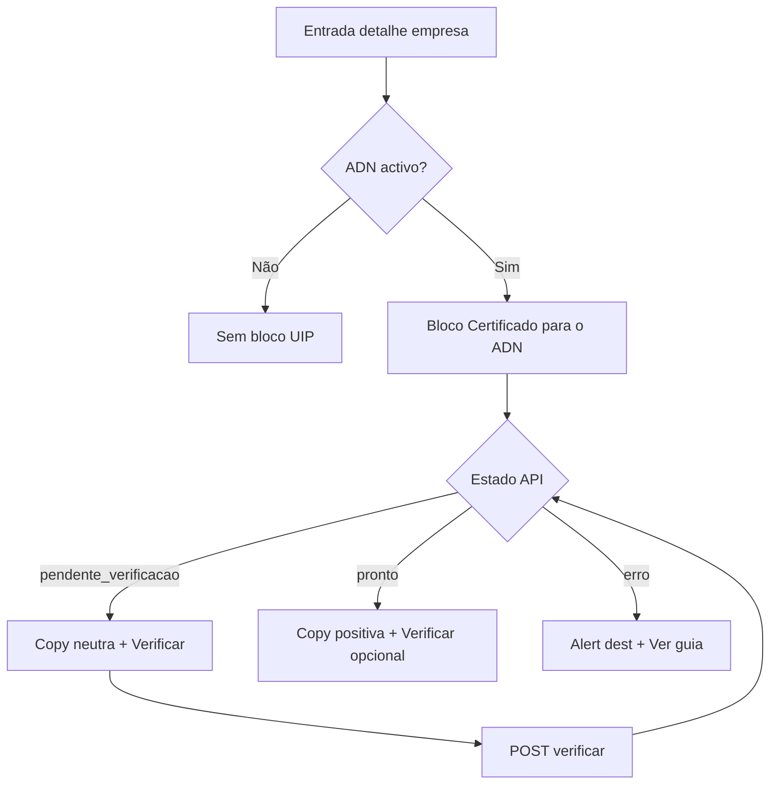
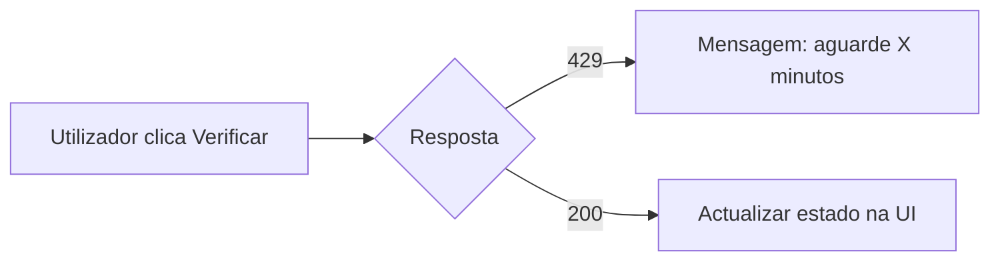

# UI/UX — Estado e verificação do certificado ADN (utilizador × empresa monitorada)

**Produto:** Portal de Automação de Notas Fiscais  
**Fonte de produto:** [`docs/prd-instalacao-certificado-empresa-monitorada-utilizador.md`](prd-instalacao-certificado-empresa-monitorada-utilizador.md) (**UIP-FR1–5**, **UIP-NFR1–4**; Fase 1 / Trilho A).  
**Especificações base:** [`docs/front-end-spec.md`](front-end-spec.md), [`docs/front-end-spec-integracao-nfse-dist-adn.md`](front-end-spec-integracao-nfse-dist-adn.md), [`docs/front-end-spec-importacao-certificado-empresa-monitorada-adn.md`](front-end-spec-importacao-certificado-empresa-monitorada-adn.md).

### Hierarquia normativa

1. Este documento é o **delta UIP** sobre o organismo **Sincronização ADN** no detalhe da empresa monitorada: **estende** o [spec certificado CER](front-end-spec-importacao-certificado-empresa-monitorada-adn.md) com **estado**, **verificação on-demand** e **copy dependente de estado**, mantendo **CE-NFR1** e **NFR19** (sem upload de PFX na **Fase 1**).  
2. Quando **UIP-1** estiver activo no sprint, a **ordem vertical** da secção ADN segue **§3.1 deste documento** (substitui a ordem “CTAs antes do Alert” do spec CER **§3.1** apenas para o que diz respeito à colocação do bloco certificado vs. linha de jobs).  
3. Matriz **CE-FR10** e regras de **CE-NFR5** permanecem canónicas para mensagens de erro; este spec adiciona **mapeamento estado → superfície visual**.

### Change log

| Data       | Versão | Descrição |
| ---------- | ------ | ---------- |
| 2026-04-24 | 1.0    | Spec inicial Fase 1: organismo “Certificado para o ADN”, estados, fluxos, a11y, placeholders Fase 2–4. |

---

## 1. Objetivos de UX (Fase 1)

1. **Clareza em ≤ 20 s:** o admin percebe **se** o servidor de recolha está **preparado** para autenticar o ADN com o CNPJ desta empresa — sem abrir o runbook.  
2. **Acção útil:** pode **pedir uma nova verificação** após a equipa técnica alterar o worker, com **feedback** de carregamento, sucesso e erro **seguro**.  
3. **Continuidade CER:** o **link canónico** para o guia técnico mantém-se (**UIP-FR3**, **CE-FR9**); nenhum campo de segredo na UI.  
4. **Confiança:** distinção explícita entre **“verificar preparação”** (portal → API) e **“instalar certificado”** (servidor; runbook).  
5. **Suporte:** erros apresentam copy alinhada a **CE-FR10** / códigos **CER-05**, sem paths nem thumbprints.

---

## 2. Personas e princípios

### 2.1 Personas

| Persona | Meta |
| ------- | ---- |
| **Admin org** | Ver estado, disparar verificação, partilhar link do guia com TI. |
| **User leitor** | Ver estado e copy (sem CTA **Verificar** se ACL não permitir — ver §7.2). |
| **Operador infra** | Continuar a usar o runbook markdown; o portal **reflecte** o resultado do healthcheck. |

### 2.2 Princípios (Sally + sistema)

1. **Verdade operacional** — o estado `pronto` só aparece quando o **contrato API** (definido por `@architect`) indicar critérios objectivos; a UI **não** promete “TLS OK” com linguagem técnica na superfície.  
2. **Sem falsos convites** — nunca “Carregue o certificado aqui” na Fase 1.  
3. **Progressive disclosure** — detalhe técnico no runbook; no portal: **badge + uma frase + acções**.  
4. **WCAG 2.1 AA** mínimo (**UIP-NFR2**).  
5. **Resiliência a rate limit** — mensagem calma, não culpabilizar (**UIP-NFR3**).

---

## 3. Arquitectura da informação

### 3.1 Localização e ordem vertical (Fase 1)

**Página:** detalhe da empresa monitorada (`/empresas/[id]`), secção **Sincronização ADN**, quando **FR45** / acesso ADN equivalente estiver **activo** (mesmo critério que o painel actual).

**Ordem recomendada (UIP):**

1. **Organismo “Certificado para o ADN”** (este incremento) — *primeiro*, para resposta à pergunta “posso confiar na sincronização?”  
2. **Estado do último job** + CTAs **Pedir sincronização ADN** / **Actualizar** (comportamento existente).  
3. **Modal “Como funciona?”** e restantes links (export, notas, etc.) — inalterados salvo copy cruzada em §8.

**Racional:** reduz pedidos de sync quando o certificado ainda não está preparado; alinha ao PRD §9.1.

### 3.2 Diagrama — fluxo feliz



### 3.3 Diagrama — rate limit (429)



---

## 4. Estados e modelo mental

### 4.1 Chaves de estado (API → UI)

| Chave API | Rótulo UI (pt-BR) | Cor / variante sugerida |
| --------- | ------------------ | ------------------------ |
| `pendente_verificacao` | **A verificar** ou **Configuração pendente** | Neutro (`muted` / borda suave) |
| `pronto` | **Pronto para o ADN** | Sucesso (`emerald` / ícone check) |
| `erro` | **Não configurado** ou **Problema na configuração** | Atenção (`amber`) ou erro (`destructive`) conforme severidade acordada com backend |

**Nota:** o rótulo exacto pode ser A/B com `@po`; a **chave** é estável para telemetria.

### 4.2 Sub-estados de UI (apenas cliente)

| Sub-estado | Quando | Comportamento |
| ---------- | ------ | ------------- |
| `checking` | Após clicar **Verificar de novo** até resposta | Botão com `aria-busy`, spinner ou texto “A verificar…”; desactivar botão para evitar double-submit. |
| `stale` | Resposta com cabeçalho `Age` / `checkedAt` antigo (se API expuser) | Opcional: texto *“Última verificação: …”* em `text-xs muted`. |

---

## 5. Organismo — **“Certificado para o ADN”**

### 5.1 Estrutura (átomos → molécula)

| # | Peça | Tipo | Especificação |
| - | ---- | ---- | ------------- |
| 1 | **Cabeçalho** | Texto `h3` ou `div` com `role="group"` + `aria-labelledby` | Título: **Certificado para o ADN** (ou **Preparação do certificado** se PM preferir tom mais operacional). |
| 2 | **Badge de estado** | `Badge` ou `span` com `data-state` | Ligado ao estado API; incluir `aria-label` completo, ex.: *“Estado do certificado: pronto para o Ambiente Nacional.”* |
| 3 | **Descrição** | `p` | **Uma frase** dependente do estado (tabela §5.3). |
| 4 | **CTA primário do bloco** | `Button` `variant="secondary"` ou `outline` | **“Verificar de novo”** — dispara **UIP-FR2**; ícone opcional `RefreshCw` com `aria-hidden`. |
| 5 | **Ligação guia** | `<a>` | Mesmo contrato que [`getAdnCertRunbookUrl`](front-end-spec-importacao-certificado-empresa-monitorada-adn.md): texto **“Como configurar o certificado no servidor de recolha”**; `title` descritivo; `target`/`rel` conforme same-origin (lógica já em `runbookAnchorProps`). |
| 6 | **Nota de segurança** | `p` `text-xs` muted | *“O certificado não é instalado nesta página — apenas no servidor de recolha da organização.”* (equivalente **CE-NFR1** em linguagem de produto). |

**Componente composto:** preferir **um** `Card` com `border` suave ou reutilizar o `section` actual com sub-`div` delimitada visualmente (não dois `Alert` empilhados que competem por atenção).

### 5.2 Copy por estado (descrição — frase única)

| Estado | Copy sugerida (pt-BR) |
| ------ | ---------------------- |
| `pendente_verificacao` | *“Ainda não confirmámos se o servidor de recolha está preparado para o certificado desta empresa. Peça à equipa técnica que siga o guia ou clique em Verificar após a configuração.”* |
| `pronto` | *“O servidor de recolha parece preparado para autenticar pedidos ao Ambiente Nacional para este CNPJ.”* |
| `erro` | Usar **apenas** frase da matriz **CE-FR10** mapeada ao `error_code` devolvido; se código desconhecido: *“Não foi possível validar a configuração do certificado. Consulte o guia técnico ou o suporte.”* |

### 5.3 Erro persistente (molécula extra)

Quando `estado === erro`:

- Inserir **sub-bloco** `Alert` `variant="destructive"` **abaixo** da descrição, **acima** dos CTAs, com:  
  - **Título:** *“Configuração do certificado”*  
  - **Corpo:** copy **CE-FR10** (sem dados sensíveis).  
  - **Acção secundária:** link texto **“Ver guia técnico”** (mesmo `href` do runbook).  
- **Não** duplicar `role="alert"` na descrição geral se o `Alert` destructivo já o tiver.

### 5.4 Wireframe textual (baixa fidelidade)

```
┌─ Sincronização ADN ─────────────────────────────────────────┐
│                                                               │
│  ┌─ Certificado para o ADN ──────────────────────────────┐  │
│  │ [Pronto para o ADN]  (badge)                           │  │
│  │ O servidor de recolha parece preparado…                │  │
│  │ [ Verificar de novo ]   Como configurar… (link)        │  │
│  │ O certificado não é instalado nesta página…           │  │
│  └──────────────────────────────────────────────────────┘  │
│                                                               │
│  Último job: …                                                │
│  [ Pedir sincronização ADN ]  [ Actualizar ]                 │
│  … (resto inalterado)                                         │
└──────────────────────────────────────────────────────────────┘
```

---

## 6. Fluxos de utilizador

### 6.1 Consulta inicial (carregamento da página)

1. Utilizador abre detalhe da empresa; secção ADN monta-se.  
2. Cliente chama **GET** estado certificado (rota exacta: `@architect`; UX assume `GET …/certificate-status` ou campo embutido em recurso existente).  
3. **Loading:** skeleton ou linha *“A carregar estado do certificado…”* com `role="status"`.  
4. **Sucesso:** renderizar organismo §5 com estado actual.  
5. **Erro de rede:** `Alert` inline *“Não foi possível obter o estado do certificado.”* + botão **Tentar de novo** (re-fetch apenas do bloco).

### 6.2 Verificação on-demand (**UIP-FR2**)

1. Utilizador activa **Verificar de novo**.  
2. UI entra em `checking`; foco permanece no botão ou move para `aria-live` **polite** com resultado.  
3. **200:** actualizar badge + descrição + `checkedAt` se existir.  
4. **429:** mensagem *“Verificou demasiadas vezes. Aguarde alguns minutos antes de tentar novamente.”* (ajustar copy ao `Retry-After` se API enviar).  
5. **403:** *“Não tem permissão para verificar o certificado.”* (ocultar botão se preferir fail-closed).  
6. **5xx:** *“Serviço temporariamente indisponível. Tente mais tarde.”*

### 6.3 Cruzamento com “Pedir sincronização ADN”

- **Opcional (recomendado):** se estado ≠ `pronto`, mostrar **banner** `variant="outline"` **acima** do botão **Pedir sincronização ADN**: *“A sincronização pode falhar enquanto o certificado não estiver preparado.”* — ou desactivar o botão primário com `aria-describedby` apontando para o bloco certificado (**preferir não desactivar** sem acção clara: admin pode querer forçar teste; usar aviso em vez de bloqueio, salvo `@po` decidir bloqueio).

### 6.4 Export lista (**FR48**, **UIP-FR5**)

- Manter regra do [spec certificado §4.2](front-end-spec-importacao-certificado-empresa-monitorada-adn.md): **não** sugerir que o export substitui `clients.local.json`.  
- Opcional: linha muted sob o bloco UIP: *“O export da lista não inclui certificados.”*

---

## 7. Acessibilidade (**UIP-NFR2**)

| Critério | Implementação |
| -------- | --------------- |
| **1.3.1 Info e relações** | Agrupar bloco com `aria-labelledby` no título; badge com texto visível **e** `aria-label` redundante se for só cor. |
| **2.4.3 Ordem de foco** | Título (se focável) → **Verificar** → link guia → sair do bloco → botões ADN existentes. |
| **2.4.7 Foco visível** | Anel de foco nos botões e no link (Tailwind `focus-visible:` alinhado ao design system). |
| **3.3.1 Identificação de erros** | Em `erro`, mensagem próxima ao campo de acção que causou verificação; `Alert` com título. |
| **4.1.3 Mensagens de estado** | Região `aria-live="polite"` **só** para mudanças de estado **após** verificação (não em cada poll de job ADN — **UIP-NFR4** / anti-spam alinhado ao spec CER §5.1). |
| **Toque** | Área mínima **44×44** px para **Verificar** em viewports móveis (ou 24px mínimo + padding se stack actual for mais compacta — documentar excepção com `@qa`). |

### 7.1 Leitor de ecrã — anúncio de mudança de estado

Após POST bem sucedido, actualizar uma região:

```html
<!-- Exemplo conceitual -->
<div aria-live="polite" aria-atomic="true" class="sr-only">
  Estado do certificado actualizado: pronto para o ADN.
</div>
```

*(Classe `sr-only` só se a mensagem for redundante ao texto visível; caso contrário usar `aria-live` na própria `Badge`+descrição visível.)*

### 7.2 Permissões

- Se apenas **admin** pode verificar: **User** vê estado em **modo leitura** (sem botão **Verificar** ou botão `disabled` com tooltip *“Apenas administradores podem verificar.”*).  
- Alinhar com regras de `AdnSyncPanel` / hook existente (`useAdnSyncForCompany`).

---

## 8. Copy — modal “Como funciona?” (actualização)

Acrescentar **bullet** (ou frase inicial) quando UIP estiver activo:

- *“O estado ‘Pronto para o ADN’ resulta de uma verificação automática no servidor de recolha — não significa que existam notas novas.”*

Manter bullets existentes do [spec certificado §5.3](front-end-spec-importacao-certificado-empresa-monitorada-adn.md).

---

## 9. Responsividade e performance

- **Mobile:** CTAs em coluna se `< 400px`; link do guia em linha completa.  
- **Cache / TTL:** se API devolver `nextCheckAfter`, mostrar *“Próxima verificação sugerida após …”* (opcional Fase 1.1).  
- **Sem** polling agressivo: estado na **entrada** + após **Verificar** + opcionalmente após **sync ADN** concluído (revalidação — story técnica).

---

## 10. Fase 2–4 — placeholders UX (gated)

**Fase 2 (Trilho B — upload cofre):** wizard mínimo: passo 1 aviso legal + checkbox confirmação; passo 2 `input type="file"` **accept** restrito; passo 3 feedback; **nunca** preview de conteúdo binário; progress bar. Detalhar quando ADR **5.2** do PRD UIP estiver assinado.

**Fase 3 (Trilho D):** botão **Solicitar instalação** → modal com resumo do pedido + referência de ticket.

**Fase 4 (Trilho C):** fora de âmbito até PRD AC.

---

## 11. Contrato UX ↔ API (rascunho para `@architect`)

Campos esperados pelo front (nomes indicativos):

| Campo | Tipo | Uso na UI |
| ----- | ---- | --------- |
| `certificateReadiness` | `"pendente_verificacao" \| "pronto" \| "erro"` | Badge + copy |
| `lastCheckedAt` | `ISO8601` opcional | Texto auxiliar |
| `userMessage` | `string` opcional | Corpo do `Alert` erro (já sanitizado pelo backend) |
| `errorCode` | `string` opcional | Telemetria; mapeamento interno a CE-FR10 |
| `retryAfterSeconds` | `number` opcional | Mensagem 429 |

**POST verificar:** idempotente do ponto de vista UX; resposta espelha o mesmo shape do GET.

---

## 12. Rastreio PRD → UI

| Requisito | Onde |
| --------- | ---- |
| **UIP-FR1** | Badge + descrição §5.2 |
| **UIP-FR2** | Botão **Verificar de novo** + fluxo §6.2 |
| **UIP-FR3** | Link runbook §5.1 item 5 |
| **UIP-FR4** | `Alert` §5.3 + regras CE-FR10 |
| **UIP-FR5** | §6.4 |
| **UIP-NFR1** | Sempre `organizationId` + `companyId` na rota; não confiar em query ambígua |
| **UIP-NFR2** | §7 |
| **UIP-NFR3** | §6.2 resposta 429 |
| **UIP-NFR4** | §7.1 anti-spam `aria-live` |

---

## 13. Handoff

| Agente | Entrega |
| ------- | ------- |
| **@architect** | Rotas GET/POST, semântica de `pronto`, integração worker, headers 429. |
| **@dev** | Refactor `AdnSyncPanel` ou extrair `AdnCertificateReadinessCard`; testes de integração UI; env vars existentes para runbook. |
| **@qa** | Matriz: três estados × permissões × 429 × offline; regressão ordem de tab e spec CER. |
| **@po** | Aprovar rótulos de badge e decisão **aviso vs. bloqueio** no sync (§6.3). |

---

— **Uma (UX / AIOS)** — especificação alinhada ao PRD UIP Fase 1; evolução coordenada com o spec CER existente.
