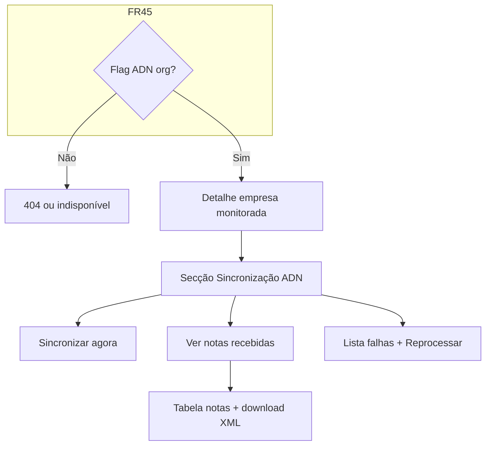

# UI/UX — Integração ADN: sincronização NFS-e (worker + portal)

**Produto:** Portal de Automação de Notas Fiscais.  
**Fonte de produto:** `docs/prd-integracao-nfse-dist-adn.md` (**FR41–FR48**, **NFR19–NFR23**), `docs/briefing-integracao-nfse-dist-adn.md`.  
**Especificações base:** `docs/front-end-spec.md`, `docs/front-end-spec-dois-niveis-organizacao-vs-empresas-fiscais.md`, `docs/front-end-spec-login-empresas-roles.md`.

### Hierarquia normativa

1. Este documento define **copy**, **IA**, **fluxos**, **estados**, **tabelas** e **acessibilidade** para a **recolha via Ambiente Nacional (ADN)** na UI pública do portal.  
2. **Nunca** solicitar ou mostrar **certificado e-CNPJ**, PFX, thumbprint ou segredos de worker na UI — **FR45** / **NFR19**; qualquer configuração de infraestrutura fica **fora deste spec** ou em ferramenta interna acordada com `@architect`.  
3. Terminologia **organização** vs **empresa monitorada** mantém-se canónica (**spec dois níveis**); a secção ADN vive **no detalhe da empresa monitorada**.  
4. Em conflito visual, prevalecem tokens e padrões em `docs/front-end-spec.md`.

### Change log (este incremento)

| Data       | Versão | Descrição |
| ---------- | ------ | ---------- |
| 2026-04-22 | 1.0    | Spec inicial: glossário ADN, IA, fluxos, ecrãs, matriz de estados, copy segura, a11y, mapeamento FR. |

---

## 1. Introdução e âmbito

### 1.1 Objetivo de UX

1. **Confiança em processo assíncrono:** o utilizador percebe **em que estado** está a sincronização com o ADN (**FR41**) sem jargão de filas internas.  
2. **Transparência sem exposição de risco:** mostrar **última sincronização** e contagens (**FR42**) **sem** mencionar caminhos de servidor, nomes de bucket ou variáveis do worker.  
3. **Recuperação:** falhas administráveis têm caminho claro (**Reprocessar** — **FR46**) com confirmação e feedback.  
4. **Progressão MVP → PDF:** na fase MVP predominam **XML**; PDF (1b) aparece só quando produto e API o suportarem, com **CTA secundário** ou coluna “PDF” em *pendente / disponível*.

### 1.2 Fora de âmbito (UI)

- Ecrãs de **provisionamento do worker** ou upload de PFX (se existirem, são **consola interna** / runbook — não parte do MVP de utilizador fiscal).  
- **Dashboard de métricas** operador NOC completo (**NFR22**): a UI pode mostrar apenas **resumo amigável** na mesma secção ADN; métricas finas ficam para ferramenta interna ou épico futuro.

### 1.3 Feature flag por organização (**FR45**)

| Flag | Comportamento na UI |
| ---- | ------------------- |
| **Desactivada** | **Não** renderizar separador “Sincronização ADN”, links “Notas ADN” nem CTAs relacionados; deep-links devem mostrar página **404** ou **Funcionalidade indisponível** (copy neutra, sem revelar existência de outros tenants). Preferência de produto: **404** se já for padrão de segurança do app. |
| **Activada** | Secção completa conforme este documento; utilizador **User** vê leitura + download conforme ACL; **Admin** vê também sincronizar agora / reprocessar se API permitir. |

---

## 2. Glossário de interface (pt-BR)

| Conceito | Rótulo curto | Tooltip / texto de ajuda | Evitar |
| -------- | ------------ | ------------------------- | ------ |
| Pipeline cloud ADN | **Sincronização ADN** | “Recolha de documentos fiscais no Ambiente Nacional, feita de forma segura pelo nosso serviço.” | “NFSE_dist”, “worker Windows”, “curl”. |
| Job de sync | **Última sincronização** | Data/hora + resumo (“12 documentos XML recebidos”). | “Job ID” visível a utilizador final (opcional só em modo suporte interno). |
| Lista fiscal ADN | **Notas recebidas** ou **Documentos fiscais (ADN)** | Escolher **um** termo por release; manter consistente no `h2` e no menu. | “DF-e” sozinho sem contexto para leigos. |
| Falha recuperável | **Pendente de novo envio** | “Pode tentar novamente; não altera notas já recebidas com sucesso.” | Stack trace, código HTTP cru (“429”). |
| Limite ADN | **Serviço nacional ocupado** | “Estamos a tentar novamente automaticamente. Pode voltar mais tarde.” | “Too Many Requests”. |
| Export config worker (**FR48**) | **Lista para automação (JSON)** | “Apenas CNPJs e nomes visíveis ao utilizador. **Não** inclui certificados.” | “clients.json” no título visível ao operador leigo (pode ir só na descrição técnica secundária). |

---

## 3. Arquitetura da informação (delta)

### 3.1 Onde vive na app

- **Ponto de entrada principal:** **Detalhe da empresa monitorada** (`Empresas monitoradas` → linha → detalhe), como **separador** ou **secção dobrável** abaixo de “Resumo / Agendamento”, com `h2` **Sincronização ADN**.  
- **Secundário (opcional MVP+):** atalho na **lista de empresas monitoradas** — coluna **“ADN”** com ícone de estado (sucesso / a correr / atenção) **apenas** se flag activa; tooltip com **Última sincronização** resumida (**FR42**).

### 3.2 Diagrama de fluxo (MVP)



### 3.3 Breadcrumb

| Vista | Breadcrumb |
| ----- | ----------- |
| Detalhe + ADN | `Empresas monitoradas` → **[Fantasia ou CNPJ mascarado]** (mantém spec dois níveis); **não** duplicar “ADN” no trail a menos que haja sub-rota dedicada. |
| Lista “Notas” (se rota própria) | `Empresas monitoradas` → **[CNPJ]** → **Notas recebidas** |

---

## 4. Fluxos de utilizador

### 4.1 Consultar estado e última sync

1. Utilizador abre **detalhe da empresa monitorada** (org activa correcta).  
2. Vê bloco **Sincronização ADN** com: **estado actual** (badge), **Última sincronização** (data relativa + absoluta em `title` ou texto secundário), contagem **“X XML”** se API fornecer.  
3. Se **A correr:** mostrar **progresso indeterminado** (spinner ou `role="progressbar"` indeterminado) + texto **“A sincronizar com o Ambiente Nacional…”**; **polling** a intervalo moderado (detalhe em arquitetura; não bloquear UI).

### 4.2 Sincronizar agora (**Admin** + política API)

1. Botão primário **Sincronizar agora** visível só com permissão e flag.  
2. Ao clicar: **modal** ou **drawer** de confirmação curta: *“Será pedida uma nova recolha ao Ambiente Nacional para este CNPJ. Continuar?”* — botões **Cancelar** / **Confirmar**.  
3. Sucesso: toast **“Sincronização pedida.”** + estado passa a **Agendado** ou **A correr**.  
4. Erro **rate limit / ADN ocupado** (**NFR21**): toast ou banner **não técnico** (glossário); manter botão desactivado **cooldown** opcional (ex.: 60 s) se API indicar `retry_after`.

### 4.3 Listar e descarregar XML (**FR43**, **FR44**)

1. Link **Ver notas recebidas** ou separador **Notas**.  
2. Tabela com filtros mínimos: **intervalo de datas** (date range), opcional **tipo** (XML; PDF desactivado ou “Em breve” na fase MVP).  
3. Linha: data emissão, identificador resumido (últimos N dígitos da chave + `…`), tipo **XML**, acção **Descarregar**.  
4. **Descarregar:** abre fluxo de **URL assinada** (nova janela ou download nativo); se expirar, mensagem **“Ligação expirada. Tente descarregar novamente.”** + sem expor URL longa na UI (apenas no `href` temporário).

### 4.4 Falhas e reprocessar (**FR46**)

1. Secção **“Ficheiros em falta”** ou **“Atenção necessária”** abaixo da tabela ou em separador **Falhas**.  
2. Cada linha: data da tentativa, **mensagem segura** mapeada a partir de código servidor (nunca texto bruto da excepção).  
3. **Reprocessar** (por linha): confirmação *“Repetir apenas este documento?”*; **Reprocessar todos** (toolbar): confirmação mais forte com número de itens.  
4. Após acção: toast + invalidar queries `['adn-artifacts', companyId]` / chaves acordadas.

### 4.5 Exportar lista JSON (**FR48**, **Admin**)

1. Acção secundária **Exportar lista (automação)** no bloco ADN ou menu “…” da empresa.  
2. Download `.json` com nome sugerido `empresa-monitorada-[id]-lista.json` (sem dados sensíveis).  
3. **Alert** informativo antes do download: **“Este ficheiro não contém certificados. Guarde-o com segurança.”**

---

## 5. Ecrãs e componentes

### 5.1 Bloco — Sincronização ADN (organismo)

| Elemento | Especificação |
| -------- | -------------- |
| `h2` | **Sincronização ADN** |
| Badge de estado | Mapeamento visual **FR41**: cores semânticas a tokens (`success`, `warning`, `destructive`, `secondary` para Agendado/A correr). |
| Texto de estado | Frase completa: ex. **“Concluída — 12 XML recebidos”**, **“A correr…”**, **“Parcial — 10 de 12”** com link **Ver detalhes** para falhas. |
| Última sync | `time` com `dateTime` ISO; apresentação **relativa** (“há 2 horas”) + tooltip **data absoluta**. |
| CTA | **Sincronizar agora** (admin); **Ver notas recebidas** (todos com permissão de leitura). |
| Ajuda | `Collapsible` ou link **“Como funciona?”** → modal com 3 bullets: certificado na infraestrutura; ligação ao ADN; possível atraso quando o serviço nacional está ocupado. |

### 5.2 Tabela — Notas recebidas

| Coluna | Notas |
| ------ | ----- |
| Data de emissão | Ordenação por defeito **desc**. |
| Identificador | Chave **mascarada** (prefixo + `…` + sufixo); `title` com opção “copiar” apenas se produto quiser (**FR47** auditoria de cópia — alinhar PM). |
| Tipo | Chip **XML**; **PDF** *disabled* ou “—” até 1b. |
| Estado | **Disponível** / **Em processamento** / **Falhou** (ícone + texto). |
| Acções | **Descarregar** (`Button` `variant="outline"`), **Reprocessar** só em falha e papel admin. |

**Vazio:** *“Ainda não há documentos recebidos do Ambiente Nacional neste período.”* + CTA secundário **Alterar filtros** ou **Sincronizar agora** (admin).

### 5.3 Lista — Falhas / dead-letter (UI)

- Card com `role="region"` + `aria-labelledby` apontando ao `h3` **Ficheiros em falta**.  
- Máximo **altura** com scroll interno (ex.: 240px) para não empurrar o rodapé.  
- **Bulk:** checkbox + **Reprocessar selecionados** na toolbar da tabela (admin).

---

## 6. Matriz de estados e erros (UI)

| Estado API / domínio | Badge | Copy principal | Acções |
| -------------------- | ----- | -------------- | ------ |
| `scheduled` | Secundário / neutro | **Na fila** | — |
| `running` | Info | **A sincronizar…** | — |
| `completed` | Sucesso | **Concluída** | Ver notas |
| `partial` | Aviso | **Parcial** — “Alguns documentos falharam.” | Ver falhas |
| `failed` | Erro | **Falhou** — mensagem segura | Sincronizar agora, Ver falhas |
| Erro rede | — | **Não foi possível carregar o estado.** | Tentar novamente |
| 403 | — | **Sem permissão** | Voltar à lista |
| Rate limit (NFR21) | — | **Serviço nacional ocupado** | Cooldown / Tentar mais tarde |
| URL download expirada | — | **Ligação expirada** | Descarregar novamente |

**Leitor de ecrã:** quando o estado mudar por polling, **anúncio** `aria-live="polite"` com frase curta (ex.: “Sincronização concluída”).

---

## 7. Acessibilidade e padrões (**NFR13**, WCAG 2.2 AA)

- Todos os botões com **nome acessível** explícito (evitar só “ícone de refresh”).  
- Tabelas: `caption` visualmente oculto ou `aria-label` na tabela **“Notas recebidas do Ambiente Nacional para [empresa]”**.  
- Modais de confirmação: **foco preso**, **Fechar** e ESC, retorno de foco ao disparador.  
- Contraste de badges de estado ≥ **4.5:1** sobre fundo do tema.  
- **Não** usar apenas cor para falha — sempre ícone + texto.

---

## 8. Modelo de dados (cliente — orientador)

Nomes negociáveis com `@architect`; tipos ilustrativos:

```typescript
type AdnSyncJobStatus =
  | "scheduled"
  | "running"
  | "completed"
  | "partial"
  | "failed";

interface AdnSyncJobSummary {
  id: string;
  monitoredCompanyId: string;
  status: AdnSyncJobStatus;
  startedAt: string | null;
  completedAt: string | null;
  /** Resumo amigável */
  summaryLine: string;
  xmlCount?: number;
  pdfCount?: number;
  failedCount?: number;
}

interface AdnArtifactRow {
  id: string;
  /** Chave de acesso ou identificador — já mascarado pela API */
  accessKeyDisplay: string;
  issuedAt: string;
  kind: "xml" | "pdf";
  availability: "available" | "processing" | "failed";
  downloadUrl?: string; // TTL curto; opcionalmente obtido só no clique
}

interface AdnFailureRow {
  id: string;
  attemptedAt: string;
  /** Mensagem já sanitizada pela API */
  userMessage: string;
  canRetry: boolean;
}
```

**Chaves de cache (TanStack Query):** `['adn-sync', organizationId, monitoredCompanyId]`, `['adn-artifacts', organizationId, monitoredCompanyId, from, to]`, `['adn-failures', …]` — invalidar todas após **trocar organização** (**spec dois níveis**).

---

## 9. Rastreio de requisitos (FR / NFR)

| Requisito | Onde na UI |
| --------- | ----------- |
| **FR41** | Badge + texto + histórico opcional (últimas N execuções — épico futuro). |
| **FR42** | Linha **Última sincronização** no bloco ADN (+ coluna lista se implementada). |
| **FR43** | Tabela notas + filtros. |
| **FR44** | Acção Descarregar + tratamento URL expirada. |
| **FR45** | Ausência total de UI quando flag off. |
| **FR46** | Falhas + reprocessar linha/bulk. |
| **FR47** | Downloads e reprocessar disparam acções auditadas no servidor; UI não precisa mostrar `job_id` ao operador. |
| **FR48** | Botão export JSON + aviso de segurança. |
| **NFR19** | Copy de ajuda que reforça “certificado tratado pela infraestrutura”. |
| **NFR21** | Copy **Serviço nacional ocupado** + cooldown UX. |
| **NFR23** | Link **Política de retenção** (se existir página legal) no rodapé do bloco ADN — opcional MVP. |

---

## 10. Fase 1b — PDF (preview UX)

- Coluna **PDF**: valores **Em breve** (tooltip: *“Disponível numa próxima versão.”*) **ou** botão **Obter PDF** que dispara job on-demand com estado **A processar**.  
- **Nunca** prometer prazo; mostrar **estimativa vaga** apenas se produto aprovar (“pode demorar alguns minutos”).

---

## 11. Handoff

- **@dev:** implementar rotas, componentes shadcn (Card, Table, Badge, Alert, Dialog), hooks com query keys acima.  
- **@architect:** contratos de API, códigos de erro → mapa `userMessage`.  
- **@qa:** casos **flag off**, **403 entre orgs**, **expiração de URL**, **polling** sem anúncios excessivos (`aria-live`).

— **Uma (UX) / AIOS** — alinhado ao PRD `docs/prd-integracao-nfse-dist-adn.md`.
