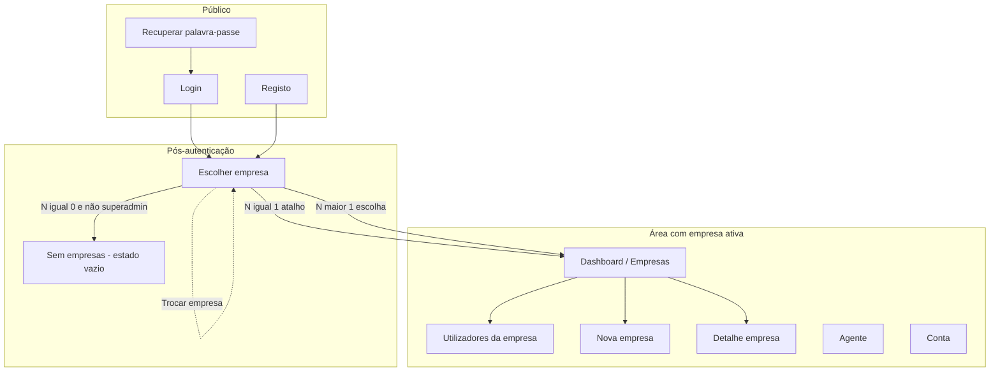
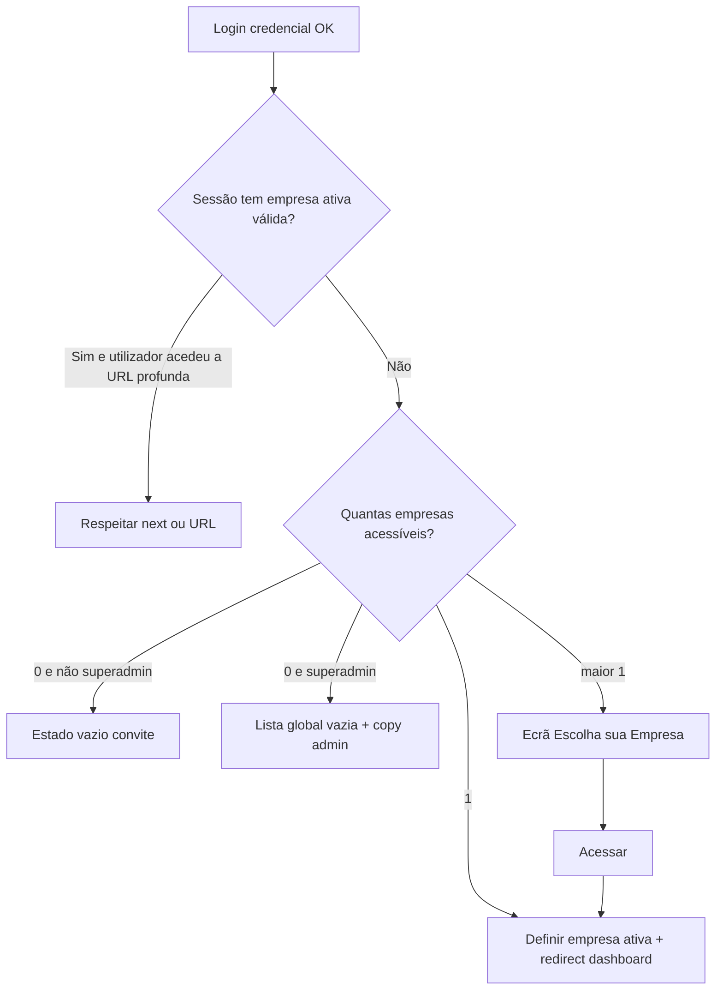

# UI/UX — Incremento: login, seleção de empresa e papéis (Superadmin / Admin / User)

**Produto:** Portal de Automação de Notas Fiscais (por empresa).  
**Fonte de produto:** `docs/prd-atualizacao-login-empresas-roles.md` (**FR19–FR32**, **NFR11–NFR14**), `docs/briefing-atualizacao-login-empresas-roles.md` (referência visual).  
**Especificação base:** `docs/front-end-spec.md` — este documento **complementa** a spec global; em conflito de padrões ou copy genérica, prevalece primeiro `front-end-spec.md`, depois o PRD do incremento.

---

## 1. Introdução e âmbito

### 1.1 Objetivo do documento

Definir **experiência**, **arquitetura da informação**, **fluxos**, **estados de interface**, **acessibilidade**, **conteúdo (copy)** e **contratos de dados no cliente** para:

- Autenticação **real** (substitui mock em `PortalProvider`).
- **Escolha de empresa** (0 / 1 / N memberships) e **empresa ativa** na sessão.
- **Papéis** refletidos na UI (`User`, `Admin` por empresa, `Superadmin` global).
- **Gestão de utilizadores** por empresa (tabela, vincular, criar, editar, remover vínculo).

### 1.2 Fora de âmbito (UI deste incremento)

- SSO, MFA, fluxo de eliminação global de conta.
- Permissões granulares por módulo fiscal.
- Modo “suporte” avançado para Superadmin além do descrito no PRD (gestão de utilizadores + leitura onde aplicável).

### 1.3 Superfícies previstas (código / rotas alvo)

| Área | Rota sugerida | Notas |
|------|---------------|--------|
| Seleção de empresas | `/empresas` ou `/selecionar-empresa` | Após login se N>1 ou ao “Trocar empresa”; pode coincidir com lista se produto unificar (**FR16** / PRD). |
| Workspace existente | `(dashboard)/empresas/...` | Exige **empresa ativa** válida na sessão antes de dados de negócio. |
| Utilizadores por empresa | `/empresas/[id]/usuarios` | Só Admin na empresa ou Superadmin; guard server-side (**FR31**). |
| Login / registo / recuperar | `/login`, `/registo`, `/recuperar` | Alinhar a **FR19** e Story 1.2 do PRD principal. |
| Shell autenticado | `(dashboard)/layout.tsx` | Incluir **empresa ativa** (nome truncado), **Trocar empresa**, **Sair**; indicador opcional “Superadmin” só em ambientes internos se política o exigir. |

Ficheiros atuais a evoluir (brownfield): `apps/web/src/context/portal-provider.tsx`, `apps/web/src/components/auth-gate.tsx`, `apps/web/src/app/login/page.tsx`, layouts do dashboard.

---

## 2. Objetivos de UX (incremento)

1. **Orientação espacial:** o utilizador sabe sempre **em que empresa** está a trabalhar (empresa ativa visível no shell).
2. **Confiança de acesso:** botão **Admin** e entradas de gestão só aparecem quando o servidor/autorização permitem — **nunca** “botão morto” sem explicação; usar **ocultação** preferencialmente a “desativado”, exceto quando política pedir disabled + tooltip (**FR25**).
3. **Eficiência multi-empresa:** busca rápida na seleção (**FR23**); atalho **1 empresa** evita passo extra após login.
4. **Segurança percebida:** mensagens neutras em **403** (ex.: “Não tem permissão”) sem revelar existência de recursos alheios se arquitetura optar por **404** (**FR31**).
5. **Ações destrutivas claras:** remover vínculo explica que a **conta global** permanece (**FR30**).

### Princípios (alinhados à spec global)

- **WCAG 2.2 AA** (**NFR12**): labels visíveis, foco, contraste, erros com `role="alert"`.
- **Estados assíncronos honestos** (**NFR13**): skeleton na grid/tabela, erro com retry onde fizer sentido.
- **Consistência com dark mode** já usado no projeto; referência cromática do briefing como **guia**, mapeada a tokens Tailwind/shadcn (evitar hex soltos em JSX quando existir token).

---

## 3. Arquitetura da informação (delta)

### 3.1 Site map (extensão)



### 3.2 Navegação primária (delta)

- Após estabelecer **empresa ativa**, o destino por defeito continua a ser o **dashboard de empresas** (ou rota home acordada), com breadcrumb ou subtítulo **“Empresa: [nome]”**.
- Nova entrada **Utilizadores** na navegação secundária ou menu de contexto da empresa **apenas** se `canManageUsers === true` (derivado de membership `admin` ou `isSuperadmin`).

### 3.3 Breadcrumb (recomendado)

- `Empresas` → `Utilizadores` (quando em `/empresas/[id]/usuarios`), com nome da empresa no subtítulo da página (evitar breadcrumb longo com CNPJ completo; usar fantasia + tooltip com CNPJ mascarado).

---

## 4. Fluxos de utilizador

### 4.1 Login → resolução de destino



### 4.2 Trocar empresa (shell)

1. Utilizador clica **Trocar empresa**.
2. Navega para ecrã de seleção **ou** drawer/modal com mesma lista (decisão de implementação: **página dedicada** simplifica deep links e refresh).
3. Ao confirmar nova empresa: **invalidar** queries TanStack Query com chave que inclua `companyId`; redirecionar para dashboard da nova empresa.

### 4.3 Admin → Utilizadores

1. Na seleção ou no dashboard, **Admin** → `/empresas/[id]/usuarios`.
2. Se **403**: página dedicada “Sem permissão” + link “Voltar às empresas”.

### 4.4 Vincular utilizador (**FR27**)

1. Clicar **Vincular utilizador** → modal ou página com campo **Email**, botão **Procurar**.
2. Se não existir: mensagem **“Não encontrámos uma conta com este email. Convide a criar registo primeiro ou use Criar utilizador.”**
3. Se existir: mostrar resumo (nome, email), select **Papel na empresa** (`user` default, `admin` se permitido), **Confirmar**.
4. Sucesso: fechar modal, atualizar tabela, toast **“Utilizador adicionado à empresa.”**

### 4.5 Criar utilizador (**FR28**)

- Form: email (obrigatório), nome, papel, cargo, departamento, telefone (opcionais conforme API).
- Submissão: loading no botão; erro email duplicado com `role="alert"`.
- Pós-sucesso: mesma política que vincular (toast + lista).

### 4.6 Remover vínculo (**FR30**)

- Ação **Remover** abre **modal de confirmação** com texto obrigatório:  
  **“Isto remove [nome] desta empresa. A conta de utilizador continua a existir.”**  
- Checkbox opcional **“Compreendo”** apenas se política de produto exigir (MVP: botões **Cancelar** / **Remover vínculo** são suficientes se copy for clara).

---

## 5. Ecrãs e layouts

### 5.1 Escolha da empresa (referência visual briefing)

| Elemento | Comportamento |
|----------|----------------|
| Título | **“Escolha sua Empresa”** (nível `h1`, único por página). |
| Busca | `Input` com ícone à esquerda, `aria-label` ou `<label class="sr-only">` “Buscar empresas”, placeholder **“Buscar empresas…”**; filtro **cliente** opcional se lista pequena; **servidor** para listas grandes (**FR23**). |
| Grid | `grid` responsivo: 1 col mobile, 2 tablet, 3 desktop (ajustável); `gap` consistente com dashboard. |
| Card | Avatar/iniciais (contraste AA com fundo), nome (1 linha + `title` tooltip), linha secundária: ícone pessoas + **“N membros”**, badge **ATIVA** / **INATIVA** (cor: sucesso / neutro-aviso). |
| Ações | **Admin** (`variant="secondary"` ou ghost + ícone engrenagem) — **omitir** se não `canAdminCompany`. **Acessar** (`variant="default"` primário). |
| Estado vazio busca | Mensagem **“Nenhuma empresa corresponde à pesquisa.”** + link **Limpar filtro**. |
| Loading | Skeleton cards (3–6) **NFR13**. |
| Erro | `role="alert"` + botão **Tentar novamente**. |

**Cores guia (mapear a tokens):** fundo página `bg-slate-950` ou equivalente (`#020617`); primário ações principais `sky-500` / cyan próximo de `#00a3ff`; badge ativa verde (`emerald` alinhado ao restante portal).

### 5.2 Utilizadores por empresa (**FR26**)

| Elemento | Comportamento |
|----------|----------------|
| Cabeçalho | `h1` **“Usuários”** + ícone opcional; subtítulo **“Gerir utilizadores da empresa [Nome legal ou fantasia].”** |
| Toolbar | À direita (stack em mobile): botão **Vincular utilizador** (outline), **Criar utilizador** (primário), chip **“Total: N utilizadores”** (atualiza com busca: **“N de M”** quando filtrado). |
| Busca | Label visível ou sr-only **“Buscar por nome ou email”**, placeholder igual ao briefing. |
| Tabela | Colunas: **Utilizador**, **Cargo** (`job_title`), **Departamento**, **Contato** (email + telefone com `tel:` link), **Criado em** (data localizada pt-BR), **Ações** (ícone editar, ícone remover). |
| Responsivo | `overflow-x-auto` + cabeçalhos `scope="col"`; em mobile estreito considerar **cards empilhados** em iteração futura — MVP: scroll horizontal com área tocável mínima **44px** (**front-end-spec.md**). |
| Linha vazia | **“Ainda não há utilizadores nesta empresa.”** + CTA criar/vincular. |

### 5.3 Superadmin (notas UX)

- Lista de empresas pode ser **maior** que a de um utilizador normal; manter **busca** e paginação (infinite scroll ou páginas — preferir **paginação numerada** para acessibilidade e deep link).
- Ao abrir empresa **sem** membership de negócio: mostrar **banner informativo** discreto no detalhe da empresa (se aplicável):  
  **“Tem permissões de administrador de plataforma. Para alterar dados fiscais ou executar coletas, precisa de papel de administrador nesta empresa.”**  
  (Copy sujeita a revisão legal/comunicação.)

---

## 6. Estados e erros (matriz)

| Contexto | Estado | Tratamento UI |
|----------|--------|----------------|
| Lista empresas | Loading | Skeleton grid |
| Lista empresas | Erro rede | Alert + retry |
| Lista empresas | 403 | Página “Sem permissão” |
| Definir empresa ativa | Loading | Desabilitar botão **Acessar** com spinner |
| Utilizadores | Loading | Skeleton tabela |
| Utilizadores | Erro | Alert acima da tabela |
| Vincular | Email inválido | Erro inline no campo |
| Vincular | Utilizador já membro | Mensagem clara da API |
| Remover vínculo | Erro | Manter modal aberto + mensagem |
| Sessão expirada | 401 | Redirect login com `?next=` |

---

## 7. Modelo de dados (cliente)

Tipos orientadores (alinhar a contrato API final):

```typescript
/** Papel RBAC na empresa (PRD FR20) */
type CompanyRole = "user" | "admin";

interface SessionUser {
  id: string;
  email: string;
  name: string | null;
  avatarUrl: string | null;
  isSuperadmin: boolean;
}

interface CompanySummary {
  id: string;
  displayName: string;
  cnpjMasked: string;
  active: boolean;
  memberCount: number;
  /** true se pode abrir rotas /admin desta empresa */
  canOpenCompanyAdmin: boolean;
  /** true se membership admin OU superadmin */
  canManageUsers: boolean;
}

interface CompanyMembershipRow {
  userId: string;
  email: string;
  name: string | null;
  avatarUrl: string | null;
  jobTitle: string | null;
  department: string | null;
  phone: string | null;
  companyRole: CompanyRole;
  createdAt: string; // ISO
}
```

**Empresa ativa:** preferir leitura a partir de **sessão/cookie** (servidor) com eco para UI via hook (`useActiveCompany()`); evitar segunda fonte de verdade em `localStorage` para autorização (**FR19**).

---

## 8. Componentes (Atomic Design)

| Nível | Exemplos | Notas |
|-------|----------|--------|
| Átomo | `Button`, `Input`, `Badge`, `Avatar`, `Skeleton` | shadcn/ui existente. |
| Molécula | `CompanySearchField`, `UserTableRow`, `ConfirmDialog` | Composição Radix Dialog + botões. |
| Organismo | `CompanyPickerGrid`, `UsersTable`, `AppHeaderContext` | Header com empresa + trocar. |
| Template | `AuthShell`, `DashboardCompanyShell` | Layouts. |
| Página | `SelectCompanyPage`, `CompanyUsersPage` | Rotas Next.js App Router. |

---

## 9. Acessibilidade (checklist incremento)

- [ ] Um único `h1` por vista de página.
- [ ] Busca com label associado (`htmlFor` / `aria-label`).
- [ ] Botões **Admin** / **Acessar** com nome acessível (texto visível; não só ícone).
- [ ] Tabela: `th` com `scope="col"`; ordenação futura com `aria-sort` se implementada.
- [ ] Modais: foco preso, `aria-modal`, retorno de foco ao fechar.
- [ ] Anúncio de erros globais: `role="alert"` **live region** onde aplicável.
- [ ] Contraste de badges e botão primário sobre `slate-950` verificado (AA).

---

## 10. Copy sugerido (pt-PT / pt-BR)

| ID | Texto |
|----|--------|
| pick.title | Escolha sua Empresa |
| pick.search.placeholder | Buscar empresas… |
| pick.empty.none | Ainda não está associado a nenhuma empresa. Peça a um administrador que o adicione à organização, ou contacte o suporte. |
| pick.empty.filter | Nenhuma empresa corresponde à pesquisa. |
| pick.cta.access | Acessar |
| pick.cta.admin | Admin |
| users.title | Usuários |
| users.subtitle | Gerir utilizadores da empresa {companyName}. |
| users.link | Vincular utilizador |
| users.create | Criar utilizador |
| users.total | Total: {n} utilizadores |
| users.search.placeholder | Buscar por nome ou email… |
| users.remove.confirm | Remover vínculo com {name}? A conta do utilizador não será eliminada. |
| forbidden.title | Sem permissão |
| forbidden.body | Não tem acesso a esta área. |
| session.expired | A sua sessão terminou. Inicie sessão novamente. |

---

## 11. Rastreio PRD → UX

| FR | Cobertura nesta spec |
|----|----------------------|
| FR19 | Sec. 1, 4.1, 7 — sessão real; não usar localStorage para auth. |
| FR20–FR21 | Sec. 7 — tipos; UI não expõe flag superadmin sem necessidade. |
| FR22–FR23 | Sec. 5.1, 4.1 |
| FR24 | Sec. 3, 4.2, 7 |
| FR25 | Sec. 5.1, 2 |
| FR26–FR30 | Sec. 5.2, 4.3–4.6 |
| FR31 | Sec. 4.3, 6 |
| FR32 | Sem UI obrigatória; opcional toast “Ação registada” em ambientes internos (não recomendado em prod sem necessidade). |
| NFR11–NFR14 | Sec. 2, 6, 9 |

---

## 12. Próximos passos

1. **`@architect`** — contratos API, cookies, middleware Next, política 403 vs 404.  
2. **`@dev`** — implementação incremental: auth → picker → users table.  
3. Atualizar **`docs/front-end-spec.md`** (mapa do site e fluxo “pós-login”) quando o incremento estiver merged.

---

— Uma (UX) — AIOS; alinhado a `docs/prd-atualizacao-login-empresas-roles.md` e `docs/front-end-spec.md`.
