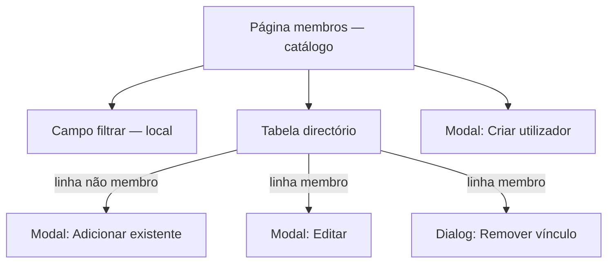

# UI/UX — Catálogo global de utilizadores em Membros e filtro dinâmico (superadmin)

**Produto:** Portal de Automação de Notas Fiscais (multi-organização).  
**Fonte de produto:** `docs/prd-membros-catalogo-utilizadores-filtro-dinamico.md` (**FR111–FR116**, **NFR36–NFR41**).  
**Especificações base:** `docs/front-end-spec-superadmin-aba-organizacoes-gestao-membros.md` (SMEM), `docs/front-end-spec.md`, `docs/briefing-membros-catalogo-utilizadores-filtro-dinamico.md`.

Este documento é um **delta de UX/UI**: altera a superfície **`/admin/organizacoes/[organizationId]/membros`** e os contratos de leitura da lista; **mantém** modais, fluxos de mutação, regra do último admin e copy de erros já definidos na spec SMEM, salvo onde se indica substituição de chaves de copy.

---

## 1. Relação com a spec SMEM (gestão de membros)

### 1.1 O que permanece igual (referência cruzada)

- Rota, breadcrumb, `h1` **Membros**, subtítulo com nome da organização, toolbar com **Adicionar membro existente** e **Criar utilizador e adicionar** (§5.2 da spec SMEM).  
- Modais **Adicionar membro existente**, **Criar utilizador**, **Editar**, **Remover vínculo** — estrutura, validação, foco, `Escape`, e matriz de erros **§6** da spec SMEM.  
- Fluxos **4.2–4.7** da spec SMEM para mutações via `.../members`.  
- Checklist **§9** (WCAG AA) da spec SMEM; este documento **acrescenta** itens em §8.

### 1.2 O que esta spec **substitui** na página Membros

| Tópico na spec SMEM | Alteração |
| ------------------- | --------- |
| §1.2 «Listagem global… fora de âmbito» | **Revogado para esta rota:** a listagem passa a ser **catálogo global de utilizadores** visível ao superadmin no contexto Membros (**FR113**), alinhado ao PRD §13. |
| §5.2 «Busca» com debounce + botão | **Substituído** por **filtro local ao digitar** sem botão «Buscar» (**FR114**). |
| §5.2 «Tabela» só membros | **Substituído** por tabela de **directório** (todas as contas + coluna de vínculo à org). |
| §5.2 «Paginação» só API `members` | **Duplo nível:** fetch paginado de `system-users` no cliente até cobrir `total`; **paginação visual** sobre o resultado **filtrado** (§5). |
| §7 modelo só `OrganizationMemberRow` | **Estendido** com tipo de linha **catálogo** (`OrganizationDirectoryUserItem`) em §7. |

### 1.3 Fora de âmbito (UI deste delta)

- Pesquisa **servidor** com `q` em `system-users` (evolução **NFR38**).  
- Exportação CSV / relatórios.  
- Colunas editáveis na grelha (edição continua **só** nos modais).  
- Alteração do flag superadmin na linha.

---

## 2. Objetivos de UX (delta)

1. **Scan cognitivo:** o operador distingue rapidamente **quem existe na plataforma** vs **quem já pertence à org** (coluna dedicada + papel).  
2. **Resposta imediata ao filtro:** feedback visual em **menos de 100 ms** percetível após digitação (filtro em memória; sem round-trip).  
3. **Menos passos para vincular:** de **linha não membro** → **Adicionar à organização** → modal com e-mail já preenchido (**FR115**).  
4. **Confiança em dados frescos:** após qualquer mutação bem-sucedida, a tabela **reflete** membro / não membro sem reload manual da página (**FR116**).  
5. **Transparência de carga (opcional mas recomendado):** quando existirem múltiplas páginas de `system-users`, indicar progresso discreto (§6) para reduzir ansiedade em tenants grandes (**NFR37**).

---

## 3. Arquitectura da informação



- **Uma** tabela principal; **não** introduzir tabs «Todos | Só membros» no MVP (evita duplicar mental model; o filtro resolve recorte).  
- **Ordem de tabulação:** toolbar (CTAs) → campo filtrar → primeira linha da tabela → paginação.

---

## 4. Fluxos de utilizador (delta e extensões)

### 4.1 Abrir página e carregar catálogo

1. Superadmin entra em **Membros** (fluxo SMEM §4.1).  
2. A UI dispara **uma ou mais** chamadas `GET .../system-users?page=&pageSize=100` até cobrir `total` ou atingir teto de páginas (**NFR37**).  
3. Enquanto **nenhum** item foi recebido: estado **loading inicial** (skeleton SMEM §5.2).  
4. Opcional (recomendado): se `total > 100`, mostrar linha de estado **não bloqueante** sob a toolbar, ex.: «A carregar utilizadores… (N de M)» ou barra de progresso indeterminada até concluir — **não** substituir a tabela por spinner fullscreen após a primeira página, para permitir leitura antecipada se o produto implementar streaming de páginas.

### 4.2 Filtrar ao digitar (**FR114**)

1. Utilizador escreve no campo **Filtrar por nome ou e-mail**.  
2. A tabela mostra **subconjunto** instantâneo (nome **ou** e-mail, case-insensitive).  
3. A **paginação da vista** reinicia para **página 1** sempre que o texto do filtro mudar (evita página vazia após filtro apertado).  
4. **Sem** botão «Buscar»; **sem** chamada API por tecla.

### 4.3 Adicionar não membro a partir da linha (**FR115**)

1. Na linha em que **Nesta organização** ≠ membro, acção **Adicionar à organização**.  
2. Abre o mesmo modal **Adicionar membro existente** com campo e-mail **pré-preenchido** com o valor da linha; utilizador pode corrigir.  
3. Resto igual a SMEM §4.2.

### 4.4 Editar / remover membro

- Igual a SMEM §4.4–4.5; gatilhos apenas em linhas com vínculo.

### 4.5 Pós-mutação (**FR116**)

1. Após **201/204** (ou sucesso equivalente) em qualquer modal de `.../members`.  
2. Fechar modal e **refetch completo** do catálogo (`system-users` multi-página) **ou** invalidação optimista alinhada com `@dev` desde que o estado final seja consistente com a API.  
3. **Preferência UX:** refetch simples (menos risco de divergência) aceitável mesmo com pequeno flash de loading na região da tabela.

### 4.6 Estados vazios distintos (**FR113**)

| Condição | Copy (ver §10) |
| -------- | -------------- |
| Catálogo carregado, `total === 0` no sistema | `mem.catalog.empty.system` |
| Catálogo carregado, filtro sem correspondências | `mem.catalog.empty.filter` |
| Erro ao carregar catálogo | Manter padrão SMEM §6 (alert + Voltar às organizações) |

---

## 5. Ecrã: regiões e layout (página Membros)

| Região | Conteúdo | Notas de implementação |
| ------ | --------- | ------------------------ |
| **Toolbar** | Inalterada vs SMEM: **Adicionar membro existente** (outline) \| **Criar utilizador e adicionar** (primário). | Ao abrir «Adicionar existente» pela toolbar, **não** pré-preencher e-mail (contrasta com §4.3). |
| **Filtro** | `Label` + `Input` full width na stack `sm` (largura máx. confortável `max-w-md` opcional). **Sem** botão adjacente de submissão. | `autoComplete="off"`; `id` estável para `aria-controls` opcional. |
| **Tabela** | Ver **§5.1** colunas. | `min-width` da tabela ≥ **720px** com scroll horizontal em viewport estreito (SMEM §2.2 paridade móvel). |
| **Paginação** | «Anterior» \| texto central \| «Seguinte». | Aplica-se ao **conjunto filtrado**; `pageSize` de vista **50** (alinhado à implementação de referência). Texto central: ver **§10** `mem.catalog.pagination.status`. |
| **Loading** | Primeira carga: skeleton SMEM. Recargas pós-mutação: `aria-busy="true"` na `table` ou wrapper. | |

### 5.1 Colunas da tabela (ordem fixa MVP)

| # | Coluna | Conteúdo | Largura / notas |
| --- | ------ | --------- | ----------------- |
| 1 | **Utilizador** | Linha 1: `displayName` ou «—»; linha 2: `email` (`text-xs` secundário). | Primária para scan. |
| 2 | **Superadmin** | «Sim» / «Não» conforme `isSuperadmin`. | Evitar só cor; texto sempre presente (**NFR40**). |
| 3 | **Nesta organização** | «Membro» se `member != null`; senão «—». | Reforço cognitivo antes do papel. |
| 4 | **Papel** | Se membro: label humano admin/user; senão «—». | Reutilizar tokens de copy SMEM `mem.role.*`. |
| 5 | **Cargo** | `member.jobTitle` ou «—». | |
| 6 | **Departamento** | `member.department` ou «—». | |
| 7 | **Contato** | `member.phone` ou «—». | |
| 8 | **Acções** | Se membro: **Editar** \| **Remover vínculo**; senão: **Adicionar à organização** (único link primário de linha). | Estilos SMEM §5.2 (editar esmeralda; remover vermelho suave). |

**Cabeçalhos:** usar textos de **§10** `mem.catalog.table.*` para consistência com i18n futuro; até lá, espelhar strings PT-BR da implementação.

---

## 6. Estados e erros (matriz — extensão §6 SMEM)

| Contexto | Estado | Tratamento UI |
| -------- | ------ | -------------- |
| Catálogo | Loading inicial (0 itens) | Skeleton na área da tabela (**NFR40** `aria-busy`) |
| Catálogo | Fetch multi-página em curso (já há dados) | Opcional: texto de progresso discreto; **não** bloquear edição do filtro |
| Catálogo | Erro rede / 5xx em `system-users` | Igual SMEM — alert + **Tentar novamente** (refetch catálogo) |
| Catálogo | 404 org | Igual SMEM |
| Filtro | Subconjunto vazio | Copy `mem.catalog.empty.filter` |
| Filtro | Utilizador limpa o campo | Mostrar de novo todas as linhas carregadas; paginação recalculada |
| Catálogo | Teto **NFR37** atingido (truncamento) | `role="alert"` persistente até dismiss: ex. «Lista truncada: mostrados os primeiros 10 000 utilizadores. Contacte suporte ou refine processos.» (copy final em **§10**) |
| Mutações | Sucesso | **§4.5** refetch |
| Mutações | Demais | Matriz SMEM §6 inalterada |

---

## 7. Modelo de dados no cliente (referência)

```typescript
import type { OrganizationDirectoryUserItem, OrganizationMemberListItem } from "@repo/shared";

/** Linha da tabela — espelha API GET .../system-users items[] */
type CatalogRow = OrganizationDirectoryUserItem;

interface SystemUsersListResponse {
  items: CatalogRow[];
  page: number;
  pageSize: number;
  total: number;
}

/** Derivação UI */
interface MemberActionsRow {
  catalog: CatalogRow;
  member: OrganizationMemberListItem | null;
}
```

- Modais de edição/remoção continuam a receber **`OrganizationMemberListItem`** quando `member != null`.  
- `POST .../members` inalterado no corpo (modo `link` / `create`).

---

## 8. Acessibilidade (checklist — NFR40 + SMEM §9)

Reutilizar todos os itens de **SMEM §9** e acrescentar:

- [ ] Campo de filtro com **`label` explícito** (`htmlFor` ↔ `id`); placeholder **não** substitui label.  
- [ ] Tabela: cada `<th scope="col">` com texto único; ordem igual ao visual §5.1.  
- [ ] **Acções por linha:** `aria-label` inclui e-mail ou nome, ex. `aria-label="Adicionar à organização, utilizador maria@exemplo.pt"`.  
- [ ] Ao mudar o filtro, opcional: `aria-live="polite"` num elemento **sr-only** com «N resultados» (evitar spam: debounce 300 ms só para o **announcer**, não para o filtro visual).  
- [ ] Se implementado progresso multi-página: região `role="status"` com actualizações espaçadas.  
- [ ] Contraste dos textos «Sim/Não» e «Membro/—» em ambos os temas.

---

## 9. Componentes (Atomic Design — delta)

| Nível | Componentes | Observações |
| ----- | ------------- | ------------ |
| Moléculas | `CatalogFilterField` | `Label` + `Input`; sem botão; pode encapsular `useMemo` no pai. |
| Organismos | `OrganizationUserDirectoryTable` | Nome sugerido; pode ser evolução de `OrganizationMembersTable` no código. |
| Página | `OrganizationMembersPage` | Mantém estado de modais + **catálogo** + `filterText` + `page` (vista). |

---

## 10. Copy PT-BR (chaves — delta)

Substituições face às chaves SMEM §10 **apenas** onde indicado; o resto permanece.

| ID | Texto |
| ---- | ------ |
| mem.list.search.label | **Filtrar por nome ou e-mail** |
| mem.list.search.placeholder | **Filtra à medida que escreve…** |
| mem.catalog.table.superadmin | Superadmin |
| mem.catalog.table.inOrg | Nesta organização |
| mem.catalog.table.inOrgYes | Membro |
| mem.catalog.table.inOrgNo | — |
| mem.row.addToOrg | Adicionar à organização |
| mem.catalog.empty.system | Ainda não há utilizadores no sistema. |
| mem.catalog.empty.filter | Nenhum utilizador corresponde ao filtro. |
| mem.catalog.pagination.status | Página {page} · {visibleTotal} utilizador(es) visíveis |
| mem.catalog.truncation.warning | Lista truncada: foram carregados no máximo {maxLoaded} utilizadores. Refine operações ou contacte suporte. |
| mem.catalog.liveRegion.results | {count} resultados |

**Superadmin Sim/Não:** podem permanecer literais na primeira entrega se não houver i18n; para consistência futura, preferir chaves `mem.catalog.superadmin.yes` / `.no`.

---

## 11. Rastreio PRD → UX

| Requisito | Cobertura nesta spec |
| --------- | -------------------- |
| **FR111** | §4.1, §7, integração técnica implícita na página |
| **FR112** | Coberto por gate global SMEM + API; UI: erro 403 igual §6 SMEM |
| **FR113** | §5, §5.1, §4.6 |
| **FR114** | §2, §4.2, §5 filtro, §10 labels |
| **FR115** | §4.3, toolbar vs linha |
| **FR116** | §4.5 |
| **NFR36** | SMEM + sem exposição no cliente de «falso» superadmin |
| **NFR37** | §4.1, §6, §10 `truncation.warning` |
| **NFR38** | §1.3 fora de âmbito; nota de roadmap apenas |
| **NFR39** | SMEM §6 |
| **NFR40** | §8 |
| **NFR41** | Entrega técnica; sem requisito visual directo |

---

## 12. Próximos passos (handoff)

1. **`@dev`** — Garantir paridade com §5.1 e §10; `aria-label` nas acções; refetch §4.5.  
2. **`@qa`** — Casos: filtro + paginação (página 2 → filtrar → volta p1); pré-fill modal; truncamento **NFR37** se simulável.  
3. **`@sm`** — AC para **SMEM-10** / **SMEM-11** referenciando §4–§8 e §10 deste documento.  
4. **Manutenção documental** — Actualizar **§5.2** da spec SMEM com nota de rodapé: «Para catálogo global e filtro local, ver `docs/front-end-spec-membros-catalogo-utilizadores-filtro-dinamico.md`.»

---

## 13. Change log

| Data | Versão | Descrição | Autor |
| ---- | ------ | --------- | ----- |
| 2026-04-27 | 1.0 | Especificação UX/UI derivada do PRD FR111–FR116; delta sobre spec SMEM Membros. | UX (Uma / AIOS) |

---

— Uma (UX) — AIOS; alinhado a `docs/prd-membros-catalogo-utilizadores-filtro-dinamico.md` e `docs/front-end-spec-superadmin-aba-organizacoes-gestao-membros.md`.
