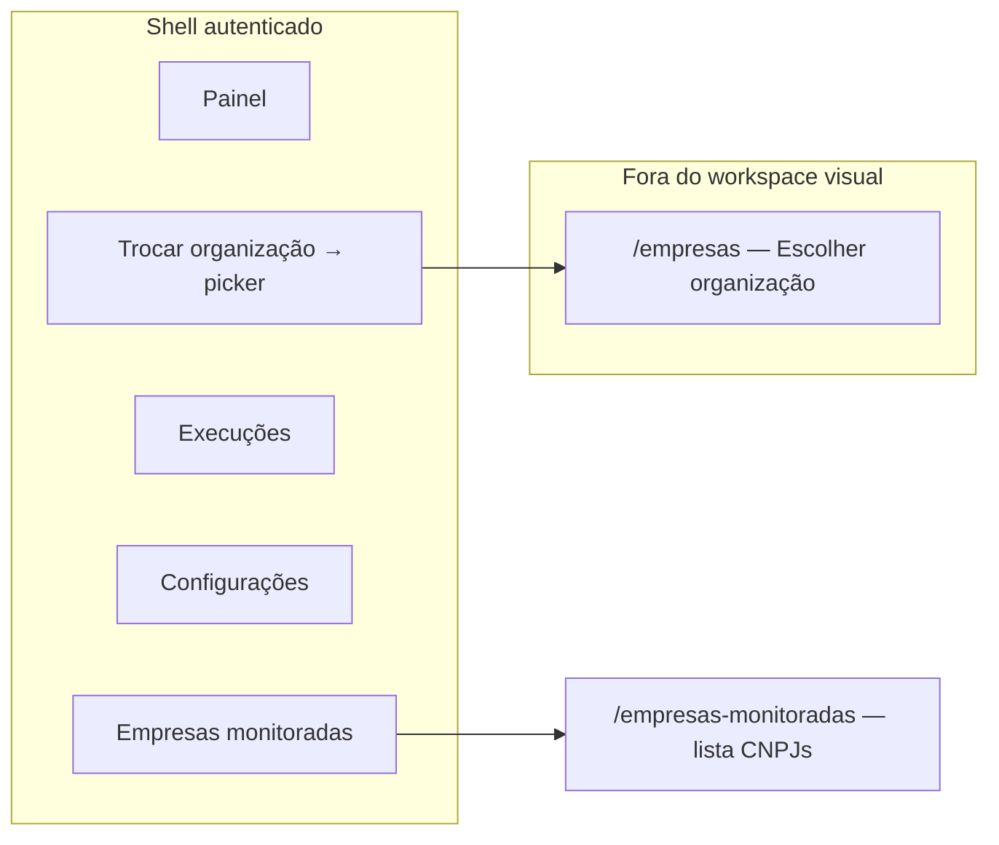

# UI/UX — Incremento: navegação shell — «Empresas monitoradas» na sidebar

**Produto:** Portal NF (Portal de Automação de Notas Fiscais).  
**Fonte de produto:** `docs/prd-nav-sidebar-empresas-monitoradas.md` (**FR49–FR52**, **NFR24–NFR25**), `docs/briefing-nav-sidebar-empresas-monitoradas.md`.  
**Especificações base:** `docs/front-end-spec.md`, `docs/front-end-spec-dois-niveis-organizacao-vs-empresas-fiscais.md` (glossário, copy deck `fiscal.list.*`, shell), `docs/front-end-spec-login-empresas-roles.md` (quando aplicável ao picker).

### Hierarquia normativa

1. Este documento detalha **IA**, **navegação**, **ecrã `/empresas-monitoradas`**, **estados activos** e **a11y** para o incremento NAV.  
2. **Terminologia** e **rótulos canónicos** de organização vs empresas monitoradas seguem o spec de **dois níveis**; em conflito de frase curta, prevalece a tabela de copy deste incremento onde o PRD NAV for mais específico.  
3. **Cores, espaçamento e tokens** seguem `docs/front-end-spec.md` e o código actual do `DashboardShell` (realce `emerald`, tipografia `text-sm` no `nav`).

### Change log (este incremento)

| Data       | Versão | Descrição |
| ---------- | ------ | ---------- |
| 2026-04-24 | 1.0    | Spec inicial: shell, rota dedicada, paridade com Painel, regras de estado activo, a11y, rastreio FR. |
| 2026-04-24 | 1.1    | §4.2 actualizada: paridade de lista alinhada a **EM-01** (linhas + Editar + ADN); detalhe UX em `docs/front-end-spec-empresas-monitoradas-editar-e-forcar-automacao.md`. |

---

## 1. Introdução e âmbito

### 1.1 Objetivo do documento

Garantir que:

- O **segundo item** da navegação principal do dashboard (**desktop sidebar** e **header móvel**) comunique **lista de CNPJs monitorados** da **organização ativa**, e não o picker de tenant.  
- O atalho **«Trocar organização»** permaneça o caminho explícito para o picker (`/empresas`).  
- A nova vista **`/empresas-monitoradas`** tenha **paridade funcional e de copy mínima** com a secção homónima do Painel, evoluindo gradualmente para o copy deck global (`fiscal.list.*`) onde o código ainda diverge.

### 1.2 Fora de âmbito (UI)

- Redesenho do Painel além do necessário para **extrair componente partilhado** (opcional na mesma entrega).  
- Alteração de conteúdo ou layout do picker em `/empresas` (mantém-se `org.pick.*`).  
- Nova toolbar de busca/filtros na lista — **fase posterior** alinhada a `front-end-spec-dois-niveis` §5.3, salvo já existir no Painel.

### 1.3 Objetivos de UX

1. **Clareza mental:** «Organização» no menu **não** leva ao picker; **«Trocar organização»** sim.  
2. **URL partilhável:** `/empresas-monitoradas` como destino do item de menu (decisão PRD §3).  
3. **Estado activo sem falsos positivos:** realce verde **só** no item correcto quando o utilizador está em `/empresas/nova`, `/empresas/[id]`, `/empresas-monitoradas` ou `/dashboard` (**secção 4**).  
4. **Acessibilidade:** navegação com `aria-current` no destino actual (**NFR24**).

---

## 2. Arquitetura da informação

### 2.1 Fluxo mental (diagrama)

### 2.2 Mapa de navegação primária (actualização)

| Item do `nav` | Rota | Papel |
| ------------- | ---- | ----- |
| **Painel** | `/dashboard` | Visão geral (métricas + secção resumida de monitoradas + execuções). |
| **Empresas monitoradas** | `/empresas-monitoradas` | **Foco** na lista e acções por CNPJ (paridade §5). |
| **Execuções** | `/execucoes` | Inalterado. |
| **Configurações** | `/configuracoes` | Inalterado. |
| *(fora do array `nav`)* **Trocar organização** | `/empresas` | Picker de organizações (**FR50**). |

**Nota:** rotas `/empresas/nova` e `/empresas/[id]` **não** são itens do `nav`; são alcançadas por CTAs e deep links. O realce do `nav` **não** deve assumir `pathname.startsWith("/empresas")` para o item «Empresas monitoradas» (**risco PRD §10**).

---

## 3. Shell (`DashboardShell`)

### 3.1 Item de menu «Empresas monitoradas»

| Elemento | Especificação |
| -------- | -------------- |
| **Rótulo** | **«Empresas monitoradas»** (texto completo em desktop e móvel por defeito). |
| **Destino** | `href="/empresas-monitoradas"`. |
| **Estilo inactivo** | Manter classes existentes de itens não activos (`text-black/70`, hover, dark). |
| **Estilo activo** | Manter padrão actual (`bg-emerald-600/15`, `font-medium`, cores emerald no texto). |
| **Viewport muito estreita** | Se o pill móvel truncar o texto, **opção** «Monitoradas» só com **aprovação explícita** no PR (PRD §3); preferir `whitespace-nowrap` + scroll horizontal já usado no header móvel. |

### 3.2 Regra de estado activo (vinculativa para QA)

Cada item `nav` define `active` assim:

| Item | `active === true` quando |
| ---- | ------------------------- |
| Painel | `pathname === "/dashboard"` **exclusivamente** (não incluir `/dashboard` quando outro item deve brilhar — hoje só o Painel usa igualdade estrita). |
| Empresas monitoradas | `pathname === "/empresas-monitoradas"` **ou** `pathname.startsWith("/empresas-monitoradas/")` se no futuro existirem sub-rotas. **Proibido** usar `pathname.startsWith("/empresas")` para este item (colide com `/empresas`, `/empresas/nova`, `/empresas/[id]`). |
| Execuções | `pathname.startsWith("/execucoes")` (mantém padrão actual se já existir). |
| Configurações | `pathname.startsWith("/configuracoes")` (idem). |

**Consequência:** em `/empresas/nova` ou `/empresas/[id]`, **nenhum** dos quatro itens principais fica no estado «activo» do realce verde **salvo** decisão de produto futura de sublinhar «Empresas monitoradas» como secção pai — **fora do MVP** deste incremento; documentar como melhoria opcional.

### 3.3 «Trocar organização»

| Elemento | Especificação |
| -------- | -------------- |
| Copy | **«Trocar organização»** (`org.shell.switch`). |
| Destino | `/empresas` (query `?next=` preservada se o código já a passar). |
| Estilo | Manter link discreto verde (`text-emerald-700` / `dark:text-emerald-400`, `text-xs`). |
| Ordem visual | Permanece **abaixo** do contexto «Organização: …» no aside. |

### 3.4 Contexto de organização no aside

| Elemento | Especificação |
| -------- | -------------- |
| Linha de contexto | **«Organização: [nome]»** — truncar com `truncate`; nome completo em `title` nativo do elemento (tooltip do browser). |
| **Melhoria a11y (recomendada)** | Envolver ou complementar com texto acessível: **«Organização ativa: [nome completo]»** via `aria-label` no contentor, sem duplicar visualmente (alinhar a §9 e ao spec dois níveis §9). |

---

## 4. Página `/empresas-monitoradas`

### 4.1 Hierarquia de títulos

| Elemento | Conteúdo canónico | Notas |
| -------- | ------------------ | ----- |
| `h1` | **Empresas monitoradas** (`fiscal.list.title`) | Único `h1` na página. |
| Subtítulo | **CNPJs incluídos na automação de notas desta organização.** (`fiscal.list.subtitle`) | Parágrafo `text-sm` abaixo do `h1`; substitui a frase mais curta do Painel («CNPJs da organização ativa…») **nesta rota** para alinhar ao copy deck global. |

### 4.2 Paridade mínima com o Painel (MVP)

Referência de comportamento: secção «Empresas monitoradas» em `apps/web/src/app/(dashboard)/dashboard/page.tsx` e `MonitoredCompaniesSection` (lista em linhas com identificação, **Editar** → `/empresas/{id}`, **Pedir sincronização ADN** quando o estado ADN estiver activo).

**Detalhe de copy, estados ADN e a11y por linha:** `docs/front-end-spec-empresas-monitoradas-editar-e-forcar-automacao.md` (**EM-01**).

| Funcionalidade | Comportamento |
| -------------- | -------------- |
| Fonte de dados | Mesmo hook + `organizationId` efectivo que o Painel (`useMonitoredCompanies`, `useMeSummary` / equivalente). |
| Lista vazia | Mensagem equivalente à do Painel; preferir alinhamento a **`fiscal.list.empty`**: **«Ainda não há CNPJs monitorados.»** + CTA **ligação** para `/empresas/nova` com texto **«Nova empresa monitorada»** (`fiscal.new.title`) ou **«Adicionar CNPJ»** (`fiscal.list.add`) — **uma** variante por PR após revisão de copy. |
| Cada empresa | Linha com `tradeName` / `systemCode` / `cnpjMasked`; **Editar** (ligação); **Pedir sincronização ADN** com o mesmo contrato que a ficha (`POST .../adn/sync`, confirmação, mensagens **NFR27**/**NFR28**). **Supersedido:** botão «Job mensal · {cnpjMasked}» + `runSync` na lista (**histórico NAV-02 AC5** → **EM-01**). |
| CTA secundário | Ligação visível **«Cadastrar empresa»** ou **«Nova empresa monitorada»** coerente com o Painel (`/empresas/nova`). |

### 4.3 Layout e componentes

- **Organismo:** `main` com `max-w-4xl` herdado do shell (já aplicado ao `children`).  
- **Estrutura sugerida:** bloco de cabeçalho (`h1` + subtítulo) → `section` com `rounded-xl border` **igual** ao cartão da lista no Painel (consistência visual).  
- **Opcional MVP+:** link texto **«Ir ao painel»** (`Link` para `/dashboard`) no canto superior direito do cabeçalho da página — PRD §6 opcional.

### 4.4 Estados (matriz)

| Estado | Tratamento UI |
| ------ | -------------- |
| Loading inicial | Skeleton ou `aria-busy="true"` no contentor da lista (paridade com picker/listas do produto). |
| Erro de rede / API | `role="alert"`, mensagem legível, botão **«Tentar novamente»** (reutilizar padrão de `dashboard` ou picker). |
| Lista vazia | Ver §4.2. |
| Sem `organizationId` efectivo | Reutilizar o mesmo padrão que outras páginas do dashboard (redirect silencioso, mensagem ou loader) — registar decisão na story (**PRD §6**). |

---

## 5. Fluxos

### 5.1 Operador abre a lista a partir do menu

1. Utilizador clica **«Empresas monitoradas»** no aside ou no scroll horizontal móvel.  
2. Navega para `/empresas-monitoradas`.  
3. Vê `h1` + lista; pode disparar teste ou ir a **Nova empresa monitorada**.

### 5.2 Operador troca de organização

1. Clicar **«Trocar organização»**.  
2. Picker em `/empresas`.  
3. Após **Acessar**, invalidar caches com `organizationId` (já exigido no spec dois níveis §7).  
4. Redireccionamento pós-picker mantém-se conforme implementação actual (`next` ou `/dashboard`); **não** obrigar aterrissagem em `/empresas-monitoradas` neste incremento.

---

## 6. Acessibilidade (WCAG 2.2 AA — delta)

| Requisito | Implementação |
| --------- | --------------- |
| **NFR24 — Item activo** | No `Link` cujo destino corresponde à página actual, definir **`aria-current="page"`**. Nos restantes itens do `nav`, **omitir** o atributo ou `aria-current={undefined}`. |
| Landmarks | Uma única região `main` por página (já fornecida pelo shell). |
| Lista de empresas | Cada controlo de disparo de job deve ter **nome acessível** claro, ex.: **«Disparar job mensal de teste para CNPJ [mascarado]»** via `aria-label` no `button`, pois o texto visível é curto. |
| Foco | Ordem de tab: logo → email → contexto org → Trocar organização → itens `nav` → conteúdo `main`. Não retirar outline de foco. |
| Contraste | Manter tokens existentes (emerald sobre fundo claro/escuro já usados). |

---

## 7. Copy deck (strings deste incremento)

| ID | Texto | Onde |
| ---- | ----- | ---- |
| nav.item.monitored | Empresas monitoradas | `nav` label |
| nav.item.monitored.short | Monitoradas | Só se aprovado por PR (móvel). |
| page.monitored.title | Empresas monitoradas | `h1` `/empresas-monitoradas` |
| page.monitored.subtitle | CNPJs incluídos na automação de notas desta organização. | Subtítulo |
| page.monitored.back | Ir ao painel | Opcional |

**Reutilizar do spec dois níveis:** `fiscal.list.empty`, `fiscal.list.add`, `fiscal.new.title`, `org.shell.context`, `org.shell.switch`.

---

## 8. Rastreio PRD → UX

| ID | Cobertura |
| -- | --------- |
| **FR49** | §2.2, §3.1 |
| **FR50** | §3.3 |
| **FR51** | §4 (página completa) |
| **FR52** | §3.2 |
| **NFR24** | §6 |
| **NFR25** | §2, §4.1, §7 |

---

## 9. Alternativa técnica (âncora no Painel)

Se a equipa implementar a **alternativa** do PRD (`/dashboard#empresas-monitoradas`) em vez da rota dedicada:

1. Adicionar `id="empresas-monitoradas"` à secção correspondente do Painel.  
2. Item do menu aponta para essa URL com hash.  
3. **Estado activo:** documentar escolha explícita: (A) só **Painel** activo quando `pathname === "/dashboard"`, ou (B) **Painel** e **Empresas monitoradas** com realce especial — **(B) não recomendado**; preferir **(A)** + scroll para a secção.  
4. Actualizar este documento para **v1.1** com a decisão e remover divergências da secção 4 se a rota dedicada for abandonada.

---

## 10. Próximos passos

1. **`@dev`** — Implementar `nav`, rota, `aria-current`, regra de `active` da §3.2; extrair organismo partilhado da lista se reduzir drift.  
2. **`@qa`** — Casos: `/empresas-monitoradas` (activo em Empresas monitoradas); `/empresas`, `/empresas/nova`, `/empresas/uuid` (nenhum realce incorrecto em «Empresas monitoradas»); tab + leitor de ecrã no `nav`.  
3. **`@po`** — Validar subtítulo `page.monitored.subtitle` vs copy do Painel para consistência eventual numa única string partilhada.

---

*Spec UX/UI — AIOS (ux-design-expert); alinhado a `docs/prd-nav-sidebar-empresas-monitoradas.md` e `docs/front-end-spec-dois-niveis-organizacao-vs-empresas-fiscais.md`.*
