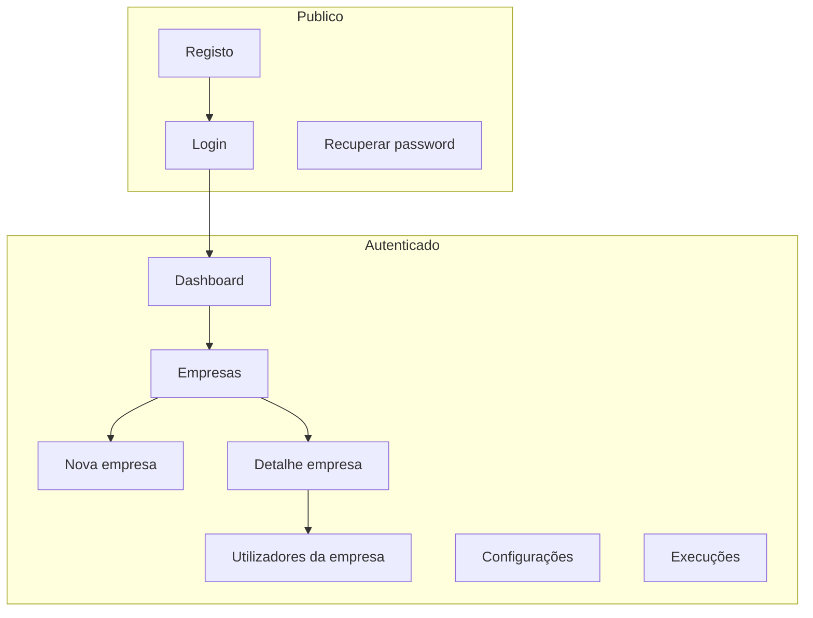
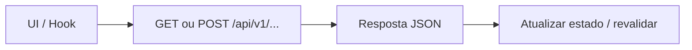

# Especificação de front-end e UX — Supabase, ambiente e separação FE/BE

**Produto:** Portal de automação de notas fiscais (por empresa).  
**PRD de referência:** [prd-atualizacao-supabase-separacao-fe-be.md](prd-atualizacao-supabase-separacao-fe-be.md)  
**Briefing técnico:** [briefing-atualizacao-supabase-separacao-fe-be.md](briefing-atualizacao-supabase-separacao-fe-be.md)  
**Versão:** 1.0 · **Data:** 2026-04-22 · **Autor:** UX (Uma) / fluxo AIOS

---

## 1. Introdução e âmbito

Este documento traduz o PRD de infraestrutura e camadas em **requisitos de experiência**, **padrões de interface**, **fluxos com estados de erro** e **diretrizes para implementação front-end**, sem alterar a proposta de valor do MVP.

**Âmbito UX desta iniciativa**

- **In scope:** continuidade visual e de interação dos fluxos existentes; mensagens quando APIs falham; padrões de chamada à API a partir de UI e hooks; acessibilidade e consistência ao introduzir ou refatorar camadas; eventual superfície mínima se o health check for exposto à UI.
- **Out of scope:** novo design system completo; substituição de Better Auth por UI do Supabase Auth; ecrãs de administração de base de dados para utilizadores finais (salvo decisão futura de produto).

**Relação PRD → UX (rastreio)**

| PRD | Implicação UX / FE |
|-----|---------------------|
| FR2, FR7 | Documentação para humanos (README/docs); a UI não precisa expor variáveis de ambiente, mas **desenvolvedores** beneficiam de mensagens claras em logs e de checklists. |
| FR3, NFR4 | Falhas de configuração ou indisponibilidade da base devem refletir-se na UI como **erro recuperável ou página de indisponibilidade**, não como ecrã em branco. |
| FR4, FR5, NFR5 | Front-end **não** acede à base; hooks e componentes cliente usam **apenas** `fetch`/wrappers para `/api/...` ou dados injetados por Server Components. |
| FR6 | Mesmos contratos de API: **sem mudança** de copy ou estrutura de formulários salvo alinhamento explícito. |
| FR8 (opcional) | Se `supabase-js` entrar no browser, definir **onde** o utilizador vê atualizações em tempo real e garantir que não há fuga de dados por UI mal desenhada (depende de RLS). |

---

## 2. Metas de UX e princípios

### 2.1 Personas (resumo a partir do [brief](brief.md))

1. **Operador fiscal / financeiro (multi-empresa):** prioriza previsibilidade, confiança nos dados e mensagens claras quando algo falha (rede, sessão, servidor).
2. **Microempresa / MEI:** precisa de linguagem simples e poucos passos; erros genéricos sem ação aumentam abandono.

### 2.2 Metas de usabilidade (iniciativa + produto)

| Meta | Indicador comportamental |
|------|---------------------------|
| **Confiança** | Em falha de servidor, o utilizador vê **explicação curta** + **retry** ou “tentar mais tarde”, nunca consola técnica. |
| **Continuidade** | Após deploy com Supabase, fluxos de login, lista de empresas e membros **comportam-se** como antes (mesmos passos). |
| **Prevenção de erro** | Formulários continuam com validação inline; erros de API mapeados com `messageFromApiJson` (ou equivalente) para texto legível. |
| **Memorabilidade** | Navegação e labels existentes mantidos; mudanças estruturais só com comunicação na release. |

### 2.3 Princípios de design (3–5)

1. **Clareza em falhas:** distinguir “sem ligação / servidor” de “sessão expirada” quando a API o permitir (códigos HTTP + corpo).
2. **Uma fonte de verdade por ecrã:** dados de negócio vêm da API ou de props de servidor; evitar estado duplicado inconsistente.
3. **Progressive disclosure:** detalhes técnicos (IDs, stack) apenas em ambiente de desenvolvimento ou logs, nunca como mensagem principal ao utilizador final.
4. **Acessível por defeito:** foco visível, contraste, e anúncios para leitores de ecrã em erros globais.
5. **Consistência com o design system atual:** reutilizar `Alert`, `Toast`, `Button`, `Skeleton` e padrões já usados no dashboard.

---

## 3. Arquitetura de informação

Esta iniciativa **não** altera o mapa principal do produto. Inventário lógico (alto nível):

**Navegação:** manter primária existente (shell do dashboard). **Breadcrumbs:** onde já existirem, sem alteração obrigatória.

**Opcional (Epic 1 / NFR4):** se o health for consumido pela UI interna ou por página técnica, pode existir rota `/_internal/health` ou similar **não listada** na navegação principal — apenas se produto o aprovar.

---

## 4. Fluxos de utilizador

### 4.1 Fluxo feliz — dados via API (padrão alvo)

**Objetivo:** Utilizador autenticado consulta ou altera dados sem perceber a origem (Supabase vs local).

**Critérios de sucesso:** latência aceitável; loading visível em operações >300 ms; sucesso confirmado por toast ou feedback inline conforme padrão atual.

### 4.2 Fluxo — falha de API / serviço indisponível

**Objetivo:** Comunicar indisponibilidade sem expor `DATABASE_URL` ou stack.

**Pontos de entrada:** qualquer página que chame API.

**Passos:**

1. Utilizador dispara ação ou carrega página dependente da API.
2. Resposta `5xx` ou rede offline.
3. Mostrar **banner ou toast persistente** (consoante gravidade) com copy do tipo: “Não foi possível ligar ao serviço. Tente novamente dentro de instantes.”
4. Botão **Tentar novamente** (refetch) onde fizer sentido; em listagens, manter **skeleton** até erro, depois estado vazio com mensagem.

**Casos extremos**

| Situação | Comportamento UX |
|----------|-------------------|
| Timeout | Mesma família de copy que indisponibilidade; opcional contador de retry. |
| 401 / sessão | Redirecionar para login com mensagem breve (“Sessão expirada”). |
| 403 | Mensagem de permissão insuficiente; sem detalhes de política interna. |
| Corpo JSON com `message` | Priorizar `messageFromApiJson` para texto amigável. |

### 4.3 Fluxo — desenvolvimento / arranque inválido (FR3)

**Objetivo:** Quem corre o projeto localmente vê falha **explícita** (terminal / overlay Next), não “site partido” sem explicação.

**Nota UX:** Isto é sobretudo **DX**; a UI pública em produção assume env correto. Se existir middleware que bloqueie tráfego sem DB, a página de fallback deve ser **genérica** (“Em manutenção”) sem variáveis sensíveis.

### 4.4 Fluxo condicional — Realtime (FR8)

Se **Nível B** for aprovado: documentar numa sub-tarefa o **componente** que subscreve canais (ex.: badge “A atualizar…” ou lista em tempo real), com **estado desligado** quando não autenticado e **cleanup** de subscrição ao desmontar. Até lá, **não** adicionar subscrições na shell global.

---

## 5. Wireframes e ficheiros de design

- **Ficheiros de design primários:** inexistentes para esta iniciativa; alterações são comportamentais e de camada.
- **Layouts-chave (descrição textual):**
  - **Listagem / formulários existentes:** sem mudança de wireframe obrigatória.
  - **Estado de erro global (novo ou reutilizado):** região abaixo do header ou `Alert` full-width com ícone, título curto, descrição uma linha, ação primária “Tentar novamente”.
  - **Loading:** manter skeletons já adotados no dashboard.

---

## 6. Biblioteca de componentes / design system

**Abordagem:** manter **shadcn/ui + Tailwind** já presentes no projeto.

| Componente / padrão | Uso nesta iniciativa |
|---------------------|----------------------|
| `Alert` / `AlertDescription` | Erros de API persistentes em página. |
| `Sonner` / toast (se existir) | Confirmações e erros transitórios. |
| `Button` + estado `loading` | Ações que refetch ou reenviam pedido. |
| `Skeleton` | Carregamento de listas antes da primeira resposta. |

**Novos átomos:** evitar; preferir composição de existentes. Se for criado um **wrapper** `ApiErrorBanner`, deve aceitar `message: string`, `onRetry?: () => void`, `role="alert"` para acessibilidade.

---

## 7. Identidade visual e estilo

**Referência:** paleta e tipografia já definidas na app (ver [front-end-spec.md](front-end-spec.md) global se existir secção de tokens).

| Tipo | Uso nesta iniciativa |
|------|----------------------|
| Cor de erro | Mensagens de falha de serviço (tokens `destructive` / equivalente). |
| Cor de aviso | Opcional para “degradado” ou retry limitado. |
| Tipografia | Corpo para mensagens; sem novos tamanhos arbitrários. |

---

## 8. Acessibilidade (WCAG 2.2 AA alvo)

- **Anúncios:** regiões de erro com `role="alert"` ou `aria-live="polite"` para atualizações após submit.
- **Foco:** botão “Tentar novamente” recebe foco após erro em fluxo modal ou secção destacada.
- **Contraste:** texto de erro sobre fundo claro/escuro conforme tema — usar tokens semânticos.
- **Teclado:** retry e fechar banners acessíveis sem rato.

**Testes:** smoke manual com teclado + uma passagem com leitor de ecrã nas páginas onde o tratamento de erro for alterado.

---

## 9. Responsividade

Manter breakpoints Tailwind existentes. Mensagens de erro devem **quebrar linha** bem em viewports estreitas; botões de ação em coluna em mobile se estiverem em grupo.

---

## 10. Animação e micro-interações

- **Transições:** discretas (150–200 ms) em aparecimento de `Alert`; evitar animações que atrasem o retry.
- **Loading:** spinners apenas em botões com ação em curso, coerente com o resto da app.

---

## 11. Performance (impacto UX)

- **Evitar** N+1 de pedidos na montagem: hooks existentes devem continuar a consolidar chamadas quando possível.
- **Não** bloquear renderização global à espera de health salvo requisito explícito de produto.
- Se Realtime (FR8): limitar número de subscrições simultâneas e desligar fora do ecrã relevante.

---

## 12. Próximos passos e decisões em aberto

1. **Revisão com PM / @architect:** confirmar se haverá página pública de “indisponível” vs apenas erros por secção.
2. **@dev:** implementar ou extrair `ApiErrorBanner` apenas se hoje os erros estiverem inconsistentes entre páginas.
3. **Se FR8 sim:** anexo curto a este spec com lista de ecrãs que usam Realtime e copy associada.

### Checklist de handoff design → desenvolvimento

- [ ] Fluxos de erro alinhados com códigos HTTP reais da API.
- [ ] Nenhum segredo ou URL interna de pooler na UI.
- [ ] Padrão de chamadas: apenas `/api/...` / Server Components nos caminhos de dados.
- [ ] Acessibilidade verificada nos estados novos ou alterados.

---

## 13. Changelog

| Data | Versão | Descrição | Autor |
|------|--------|-----------|--------|
| 2026-04-22 | 1.0 | Especificação inicial derivada do PRD Supabase/FE-BE | UX |

---

— Uma, desenhando com empatia
