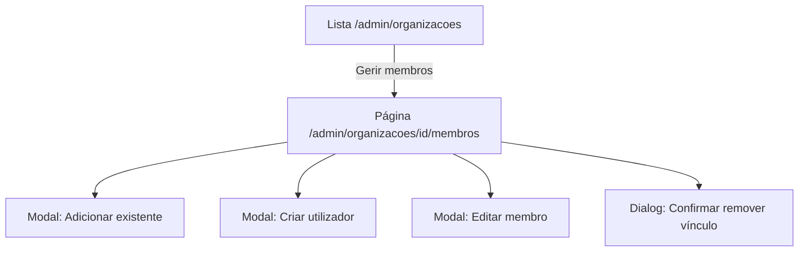

# UI/UX — Incremento: aba «Organizações» reforçada e gestão de membros (superadmin)

**Produto:** Portal de Automação de Notas Fiscais (multi-organização).  
**Fonte de produto:** `docs/prd-superadmin-aba-organizacoes-gestao-membros.md` (**FR100–FR110**, **NFR30–NFR35**).  
**Especificações base:** `docs/front-end-spec.md`, `docs/front-end-spec-login-empresas-roles.md`, `docs/front-end-spec-superadmin-cadastro-organizacoes-acesso-global.md`. Este documento define o **delta** de UX/UI sobre a área administrativa já existente (`/admin/organizacoes`, `DashboardShell`, `OrganizationsAdminPage`).

---

## 1. Introdução e âmbito

### 1.1 Objetivo do documento

Definir experiência, arquitectura da informação, fluxos, ecrãs, estados, componentes, acessibilidade e **copy em PT-BR** para:

1. **Reforço de acesso (FR101):** utilizador autenticado sem superadmin não deve ver HTML com dados sensíveis ao aceder a `/admin/*` (comportamento definido em conjunto com `@architect`: 403 vs redirecção — a UI documenta **ambos** os destinos possíveis).
2. **Gestão de membros da organização (FR102–FR110):** listar, pesquisar, paginar, adicionar vínculo, criar utilizador + vínculo, editar membership, remover vínculo — sempre no âmbito de **uma** `organizationId` escolhida.
3. **Regra do último admin (FR108):** mensagens e desactivação proactiva de controlos quando aplicável.
4. **Consistência** com tokens visuais do dashboard (realce `emerald`, tipografia `text-sm`, modo escuro).

### 1.2 Fora de âmbito (UI deste incremento)

- Gestão de membros ao nível de **empresa fiscal** (`company_memberships`).
- Alteração do flag **superadmin** na conta.
- Fluxos de convite por e-mail **ricos** (ilustração de estados de degradação apenas, se a API não enviar e-mail).
- Listagem global de utilizadores da plataforma fora do contexto da organização seleccionada.

### 1.3 Superfícies e rotas alvo

| Área | Rota | Notas |
|------|------|--------|
| Lista de organizações (existente) | `/admin/organizacoes` | Acrescentar CTA **Gerir membros** (ou equivalente) por organização; manter busca, cards e «Nova organização». |
| Gestão de membros | **`/admin/organizacoes/[organizationId]/membros`** (recomendado) | Página dedicada: cabeçalho com contexto da org + tabela + toolbar. Permite paginação, URL partilhável e **gate servidor** na mesma árvore `/admin`. |
| Alternativa aceite (MVP apertado) | Painel **modal** ou **drawer** sobre a lista | Só se `@architect`/`@dev` optarem por entrega incremental; documentar limitações: paginação compacta, sem deep link. |

**Decisão de UX recomendada:** rota dedicada **`/admin/organizacoes/[organizationId]/membros`** como padrão — melhor para **NFR35** (tabela semântica), teclado e leitores de ecrã em listas longas.

---

## 2. Objetivos de UX e princípios

### 2.1 Objetivos

1. **Eficiência operacional:** da lista de organizações à acção sobre um membro em **no máximo 2 cliques** (abrir membros → acção primária).
2. **Segurança percebida:** não-superadmin nunca vê dados de outras organizações; mensagens de bloqueio claras.
3. **Prevenção de erros:** confirmação obrigatória para **remover vínculo**; desactivar ou explicar proactivamente operações que violam **FR108**.
4. **Recuperação:** erros de rede e 5xx com **Tentar novamente**; erros 409 com texto accionável (ex.: «Promova outro administrador antes de remover este.»).
5. **Continuidade com SORG:** pós-criação de organização, aviso **admin local** e fluxos existentes permanecem; a nova UI **facilita** corrigir membros.

### 2.2 Princípios de desenho

- **Clareza sobre «remover vínculo»:** nunca usar só «Eliminar»; preferir **«Remover vínculo com esta organização»** no título do diálogo e botão de confirmação.
- **Progressive disclosure:** formulário «Criar utilizador» mostra apenas campos mínimos; campos opcionais de membership em secção colapsável ou segundo passo (decisão `@dev` com paridade de usabilidade).
- **WCAG 2.2 AA (NFR35):** foco visível, `aria-live` para feedback global, modais com **focus trap** e retorno de foco ao gatilho.
- **Paridade desktop / móvel:** mesmas capacidades; tabela pode rolar horizontalmente em `sm` com cabeçalhos `sticky` opcional.

---

## 3. Arquitectura da informação (delta)



### 3.1 Navegação e breadcrumbs

- Na página de membros: **breadcrumb** ou linha de contexto: `Organizações` (link) → **{Nome da organização}** → `Membros` (texto actual, sem link).
- `h1` da sub-página: **Membros** (ou **Membros da organização**); nome da organização em `subtitle` / `p` com classe de texto secundário — evitar dois `h1`.

### 3.2 Navegação primária (shell)

- Item **«Organizações»** permanece **apenas** com `isSuperadmin` (FR100); estado activo quando `pathname` começa por `/admin/organizacoes`.

---

## 4. Fluxos de utilizador

### 4.1 Fluxo feliz — abrir gestão de membros

1. Superadmin está em **Organizações**.
2. Localiza a organização (busca opcional).
3. Clica **Gerir membros** no card (ou linha).
4. Navega para `/admin/organizacoes/[organizationId]/membros`.
5. Vê tabela carregada com primeira página; pode pesquisar e paginar.

### 4.2 Fluxo feliz — adicionar membro existente

1. Na página de membros, clica **Adicionar membro existente**.
2. Modal: campo **E-mail** ou **ID do utilizador** (conforme contrato API), selector **Papel** (`Utilizador da organização` / `Administrador da organização` — mapear para `user` / `admin`).
3. **Adicionar** com estado de loading no botão.
4. Sucesso: fechar modal, `role="status"` ou toast discreto «Membro adicionado.», lista invalidada (refetch).

### 4.3 Fluxo feliz — criar utilizador e vincular

1. Clica **Criar utilizador e adicionar**.
2. Modal/stepper: nome (se aplicável), e-mail, palavra-passe ou fluxo de convite (conforme arquitectura), papel, opcionais (`Cargo`, `Departamento`, `Telefone`).
3. Submeter; sucesso igual a 4.2.

### 4.4 Fluxo feliz — editar papel / metadados

1. Na linha, **Editar** abre modal ou **painel inline** (preferência: modal para consistência com criar).
2. Altera papel ou campos opcionais; **Guardar** com loading.
3. Sucesso: feedback e linha actualizada.

### 4.5 Fluxo — remover vínculo

1. Clica **Remover vínculo** na linha.
2. **Dialog** de confirmação (não reversível ao nível de vínculo): corpo a explicar que a **conta global não é apagada**.
3. Confirmar → API `DELETE`; sucesso → remover linha ou refetch; se era último membro visível na página, ajustar paginação.

### 4.6 Fluxo bloqueado — último administrador (FR108)

1. Utilizador tenta **Remover vínculo** ou **rebaixar** o único `admin`.
2. API responde `409` (ou `400` + código).
3. UI: **alerta** inline ou no modal com copy da secção 10; botão de confirmação **desactivado** se a UI conseguir inferir estado local (opcional); caso contrário, confiar na mensagem da API após tentativa.

### 4.7 Fluxo — duplicidade de membership (409)

1. Adicionar e-mail já vinculado.
2. Mostrar erro no modal (`role="alert"`) com copy **mem.error.duplicate**.

### 4.8 Fluxo — sem permissão (FR101 / FR107)

1. Utilizador sem superadmin acede a `/admin/organizacoes` ou API de membros.
2. **Servidor:** 403 ou redirect — sem dados na resposta HTML inicial.
3. **Cliente (fallback):** se algum conteúdo hidratado, manter padrão actual: alerta âmbar «Acesso negado» + link **Voltar ao painel** (`/dashboard`).

### 4.9 Fluxo — sessão expirada

1. Qualquer `401` nas chamadas.
2. Redireccionar para `/login?next=` com URL actual codificada (igual ao padrão de `OrganizationsAdminPage`).

---

## 5. Ecrãs e layouts

### 5.1 Delta na lista `/admin/organizacoes` (cards existentes)

| Elemento | Comportamento |
|----------|----------------|
| CTA secundária por card | **Gerir membros** — `Link` ou `button` estilizado como link secundário (`text-sm font-medium text-emerald-800` / dark variant), navega para `/admin/organizacoes/[id]/membros`. |
| Ordem visual | Colocar abaixo da contagem «X membro(s)» ou na mesma linha de acções futuras; **não** competir visualmente com «Nova organização» (primário global da página). |
| `aria-label` | `Gerir membros de {nome da organização}` para botão só ícone (se alguma variante usar ícone). |

### 5.2 Página `/admin/organizacoes/[organizationId]/membros`

| Região | Conteúdo |
|--------|----------|
| **Toolbar** | Título área + botões **Adicionar membro existente** (secundário/outline) e **Criar utilizador e adicionar** (primário — `bg-[var(--foreground)] text-[var(--background)]` alinhado ao botão «Nova organização»). |
| **Busca** | `Input` com label «Buscar por nome ou e-mail»; debounce sugerido 300 ms; estado vazio de busca distinto de «sem membros». |
| **Tabela** | Colunas mínimas: **Utilizador** (nome + e-mail empilhados ou duas linhas), **Papel**, **Cargo**, **Departamento**, **Contato**, **Acções**. |
| **Acções por linha** | **Editar** | **Remover vínculo** (estilo destrutivo discreto: texto vermelho suave, não botão sólido vermelho por defeito). |
| **Paginação** | Controles no rodapé: «Anterior / Seguinte» + indicador «Página X de Y»; **page size** alinhado à API (defeito sugerido 50). |
| **Loading** | Skeleton de linhas (3–5) ou `aria-busy="true"` na região da tabela. |
| **Estado vazio** | Copy **mem.list.empty**; CTA para criar ou adicionar. |
| **Erro** | `role="alert"` + **Tentar novamente**. |

### 5.3 Modal «Adicionar membro existente»

- Campos: identificador (e-mail ou user id), **Papel** (`Select`).
- Rodapé: Cancelar | Adicionar.
- Validação: formato de e-mail se modo e-mail; mensagens por campo.

### 5.4 Modal «Criar utilizador e adicionar»

- Campos mínimos acordados com API (ex.: nome, e-mail, senha ou convite).
- Papel + opcionais de membership.
- Texto de ajuda curto (1–2 frases): «A conta permanece na plataforma; este passo apenas associa à organização.»

### 5.5 Modal «Editar membro»

- Papel editável com aviso se for **único admin** (tooltip ou texto de ajuda).
- Campos opcionais editáveis.
- **Guardar** e **Cancelar**.

### 5.6 Dialog «Confirmar remover vínculo»

- **Título:** «Remover vínculo com esta organização?»
- **Corpo:** explicar que o utilizador deixa de ter acesso a esta organização; **não** apaga a conta global.
- **Botões:** Cancelar (primário foco inicial) | Remover vínculo (destrutivo). Opcional: checkbox «Compreendo» apenas se compliance exigir (fora do MVP por defeito).

---

## 6. Estados e erros (matriz)

| Contexto | Estado | Tratamento UI |
|----------|--------|----------------|
| Lista de membros | Loading inicial | Skeleton ou spinner na região da tabela |
| Lista de membros | Erro de rede | Alert + **Tentar novamente** |
| Lista de membros | 403 | Mensagem de acesso + link painel (fallback) |
| Lista de membros | 404 org | «Organização não encontrada.» + link voltar à lista |
| Busca | Sem resultados | «Nenhum membro corresponde à pesquisa.» + limpar |
| Adicionar / Criar | Submetendo | Botão primário disabled + texto «A guardar…» |
| Adicionar | 409 duplicado | Erro no modal, manter dados |
| Criar | 409 e-mail existente | Copy específica + sugerir «Adicionar membro existente» |
| Editar / Remover | 409 último admin | Alert + copy **mem.error.lastAdmin** |
| Remover | A confirmar | Focus no «Cancelar» ou primeiro botão seguro (decisão: foco em **Cancelar** para prevenir duplo Enter acidental) |
| Qualquer mutação | 401 | Redirect login com `next` |
| Qualquer mutação | 5xx | Toast ou alert genérico recuperável |

---

## 7. Modelo de dados no cliente (referência)

> Tipos finais vêm do pacote partilhado / OpenAPI; abaixo serve para alinhar UI e QA.

```typescript
/** Papel ao nível da organização — espelhar enum da API */
type OrganizationRole = "user" | "admin";

interface OrganizationMemberRow {
  membershipId: string;
  userId: string;
  displayName: string | null;
  email: string;
  orgRole: OrganizationRole;
  jobTitle: string | null;
  department: string | null;
  phone: string | null;
  createdAt: string; // ISO
  updatedAt?: string;
}

interface MembersListResponse {
  items: OrganizationMemberRow[];
  page: number;
  pageSize: number;
  total: number;
}

interface AddExistingMemberInput {
  email?: string;
  userId?: string;
  orgRole: OrganizationRole;
}

interface CreateUserAndMemberInput {
  email: string;
  name?: string;
  password?: string; // se fluxo com senha
  orgRole: OrganizationRole;
  jobTitle?: string | null;
  department?: string | null;
  phone?: string | null;
}

interface PatchMemberInput {
  orgRole?: OrganizationRole;
  jobTitle?: string | null;
  department?: string | null;
  phone?: string | null;
}
```

---

## 8. Componentes (Atomic Design)

| Nível | Componentes sugeridos | Observações |
|-------|------------------------|-------------|
| Átomos | `Button`, `Input`, `Label`, `Select`, `Badge`, `Dialog`, `AlertDialog` | Reutilizar padrões do projecto (ex.: shadcn); badge para papel **Admin** vs **Utilizador**. |
| Moléculas | `MemberSearchField`, `RoleSelect`, `MemberFormFields`, `ConfirmRemoveMemberDialog` | `RoleSelect` com labels humanos PT-BR. |
| Organismos | `OrganizationMembersTable`, `AddExistingMemberDialog`, `CreateUserMemberDialog`, `EditMemberDialog` | Tabela com acções por linha; diálogos controlados por estado na página. |
| Templates | `AdminOrganizationMembersTemplate` | Toolbar + conteúdo + paginação. |
| Página | `AdminOrganizationMembersPage` | Rota `.../[organizationId]/membros`; pode ser Server Component wrapper + filho cliente para dados. |

---

## 9. Acessibilidade (checklist — NFR35)

- [ ] Um único `h1` por vista (lista org vs página membros).
- [ ] Tabela com `<th scope="col">` e legenda implícita ou `aria-labelledby` apontando ao título da secção.
- [ ] Botões de acção por linha com **rótulo acessível** distinto (evitar vários «Editar» sem contexto — usar `aria-label="Editar membro {email}"`).
- [ ] Modais: foco preso, `Escape` fecha, foco regressa ao botão que abriu.
- [ ] Mensagens de erro globais com `role="alert"`; erros de campo com `aria-describedby`.
- [ ] Estados de loading com `aria-busy` na região afectada.
- [ ] Contraste AA em textos de erro, links e botões primários (modo claro e escuro).
- [ ] Navegação por teclado na paginação (botões focáveis, ordem lógica).

---

## 10. Copy sugerido (PT-BR)

| ID | Texto |
|----|--------|
| mem.list.title | Membros |
| mem.list.subtitle | Organização: {organizationName} |
| mem.list.cta.manageFromList | Gerir membros |
| mem.list.cta.addExisting | Adicionar membro existente |
| mem.list.cta.createUser | Criar utilizador e adicionar |
| mem.list.search.label | Buscar por nome ou e-mail |
| mem.list.search.placeholder | Buscar membros… |
| mem.list.empty | Ainda não há membros nesta organização. |
| mem.list.empty.search | Nenhum membro corresponde à pesquisa. |
| mem.role.admin | Administrador da organização |
| mem.role.user | Utilizador da organização |
| mem.table.user | Utilizador |
| mem.table.role | Papel |
| mem.table.jobTitle | Cargo |
| mem.table.department | Departamento |
| mem.table.phone | Contato |
| mem.table.actions | Acções |
| mem.row.edit | Editar |
| mem.row.remove | Remover vínculo |
| mem.addExisting.title | Adicionar membro existente |
| mem.addExisting.submit | Adicionar à organização |
| mem.createUser.title | Criar utilizador e adicionar |
| mem.createUser.submit | Criar e associar |
| mem.edit.title | Editar membro |
| mem.edit.submit | Guardar alterações |
| mem.remove.confirmTitle | Remover vínculo com esta organização? |
| mem.remove.confirmBody | O utilizador deixa de ter acesso a esta organização. A conta global não é eliminada. |
| mem.remove.confirmCta | Remover vínculo |
| mem.success.added | Membro adicionado. |
| mem.success.created | Utilizador criado e associado à organização. |
| mem.success.updated | Alterações guardadas. |
| mem.success.removed | Vínculo removido. |
| mem.error.duplicate | Este utilizador já é membro desta organização. |
| mem.error.lastAdmin | É necessário pelo menos um administrador da organização. Promova outro membro a administrador antes de continuar. |
| mem.error.generic | Não foi possível concluir a operação. Tente novamente. |
| mem.network.retry | Tentar novamente |
| mem.backToOrganizations | Voltar às organizações |

---

## 11. Rastreio PRD → UX

| Requisito | Cobertura nesta spec |
|-----------|----------------------|
| **FR100** | §3.2, §1.3 |
| **FR101** | §1.1, §4.8, §6 |
| **FR102** | §5.2, §4.1, §7 |
| **FR103** | §4.2, §5.3, §10 |
| **FR104** | §4.3, §5.4, §10 |
| **FR105** | §4.4, §5.5 |
| **FR106** | §4.5, §5.6, §10 |
| **FR107** | §4.8, §6 |
| **FR108** | §4.6, §5.5, §6, §10 |
| **FR109** | Impacto indirecto (telemetria/auditoria sem UI obrigatória); mensagens sem expor metadata interna |
| **FR110** | §5.1, §5.2, §4.* |
| **NFR30** | §4.8, copy sem prometer permissões falsas |
| **NFR31–NFR33** | §6, mensagens genéricas 5xx |
| **NFR34** | §2.1, §5.1 (não remover fluxos SORG) |
| **NFR35** | §9 completo |

---

## 12. Próximos passos (handoff)

1. **`@architect`** — Fechar paths REST, schema Zod, códigos de erro estáveis para **FR108** e duplicidade; confirmar **403 vs redirect** para FR101.
2. **`@dev`** — Implementar rota, página, diálogos e integração TanStack Query (ou padrão actual do repo); reutilizar classes Tailwind do `OrganizationsAdminPage`.
3. **`@qa`** — Matriz de testes manuais a11y + fluxos §4; validar paridade mobile.
4. **`@sm`** — Histórias **SMEM-07** (e dependentes) com AC referenciando secções §5–§9 deste documento.

---

## 13. Change log

| Data | Versão | Descrição | Autor |
|------|--------|-----------|-------|
| 2026-04-27 | 1.0 | Especificação inicial de UX/UI derivada do PRD FR100–FR110. | UX (Uma / AIOS) |

---

— Uma (UX) — AIOS; alinhado a `docs/prd-superadmin-aba-organizacoes-gestao-membros.md` e `docs/front-end-spec-superadmin-cadastro-organizacoes-acesso-global.md`.
