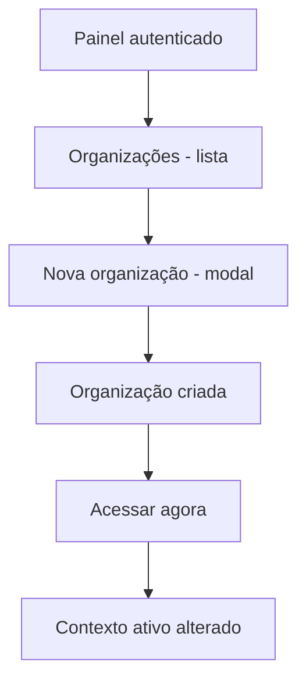

# UI/UX — Incremento: superadmin cria organizações e acessa toda a base

**Produto:** Portal de Automação de Notas Fiscais (multi-organização).  
**Fonte de produto:** `docs/prd-superadmin-cadastro-organizacoes-acesso-global.md` (**FR41–FR50**, **NFR19–NFR23**).  
**Especificação base:** `docs/front-end-spec.md` e `docs/front-end-spec-login-empresas-roles.md`. Este documento complementa as specs globais e define o delta específico do fluxo administrativo de criação de organização.

---

## 1. Introdução e âmbito

### 1.1 Objetivo do documento

Definir experiência, fluxos, componentes, estados e copy para:

- listagem administrativa de organizações para superadmin;
- criação de nova organização (formulário + validações);
- pós-criação com CTA de troca de contexto (`Acessar agora`);
- mensagens e estados de erro para autorização, conflito e falhas de rede;
- reforço de isolamento para não-superadmin.

### 1.2 Fora de âmbito (UI deste incremento)

- exclusão de organização;
- gestão comercial (planos, limites e billing);
- fluxo completo de convite por e-mail do primeiro admin local;
- alterações de permissões fiscais além do que já existe em specs anteriores.

### 1.3 Superfícies e rotas alvo

| Área | Rota sugerida | Notas |
|------|---------------|-------|
| Lista de organizações (superadmin) | `/organizacoes` ou `/admin/organizacoes` | Apenas superadmin; deve suportar busca e paginação. |
| Criação de organização | modal em `/organizacoes` ou rota `/organizacoes/nova` | Preferência MVP: modal para reduzir navegação. |
| Seleção de organização ativa | já existente (`/api/v1/session/active-organization`) | Reuso do fluxo atual após criação com CTA “Acessar agora”. |

---

## 2. Objetivos de UX (incremento)

1. **Eficiência operacional:** superadmin cria uma organização em poucos passos, com feedback imediato.
2. **Confiança e clareza:** mensagens de sucesso/erro objetivas, sem linguagem ambígua.
3. **Controle de acesso transparente:** não-superadmin não vê CTA de criação e recebe resposta consistente ao tentar acesso direto.
4. **Continuidade de fluxo:** após criação, usuário pode entrar imediatamente no contexto da nova organização.
5. **Governança visível:** UX comunica pendência de “admin local ainda não vinculado” sem bloquear o onboarding.

### Princípios

- **Acessibilidade WCAG 2.2 AA:** foco visível, labels explícitas, alertas legíveis.
- **Estados assíncronos claros:** loading, erro recuperável e confirmação.
- **Consistência visual:** manter tokens/estilo do dashboard existente e padrão dark mode quando aplicável.

---

## 3. Arquitetura da informação (delta)



### Navegação primária

- item de navegação `Organizações` visível apenas para `isSuperadmin`;
- na lista: ações por linha (`Acessar`, futuras ações administrativas);
- CTA primária da página: `Nova organização`.

---

## 4. Fluxos de utilizador

### 4.1 Fluxo feliz — criar e acessar

1. Superadmin abre `Organizações`.
2. Clica em `Nova organização`.
3. Preenche formulário (`name`, `tradeName`, `taxIdDigits` opcional).
4. Submete com loading no botão.
5. Recebe sucesso e vê nova organização na lista.
6. Clica em `Acessar agora`.
7. Sistema define organização ativa e redireciona para dashboard.

### 4.2 Fluxo sem permissão

1. Admin/User tenta abrir rota administrativa via URL direta.
2. Guard server-side retorna `403` (ou `404`, conforme arquitetura de segurança).
3. UI mostra tela de acesso negado com CTA de retorno.

### 4.3 Fluxo de conflito de CNPJ

1. Superadmin informa `taxIdDigits` já existente (quando regra de unicidade estiver ativa).
2. API retorna `409`.
3. Formulário mostra erro claro no campo e mantém valores para correção.

### 4.4 Fluxo com organização sem admin local

1. Organização é criada sem vínculo inicial de admin.
2. UI mostra banner/aviso não bloqueante:
   - `Organização criada sem administrador local vinculado. Vincule um admin para concluir o onboarding.`
3. Superadmin pode seguir com acesso imediato.

---

## 5. Ecrãs e layouts

### 5.1 Página de organizações (superadmin)

| Elemento | Comportamento |
|----------|----------------|
| Título | `Organizações` (`h1` único). |
| Busca | placeholder `Buscar organizações...`; filtro por nome e, opcionalmente, identificador fiscal mascarado. |
| Lista/tabela | colunas mínimas: Nome, Nome fantasia, CNPJ (mascarado), Membros, Status, Ações. |
| CTA primária | `Nova organização` (visível só para superadmin). |
| Ação por linha | `Acessar` para definir organização ativa. |
| Paginação | obrigatória se volume > 100 registros; manter estado em query string quando viável. |

### 5.2 Modal/página “Nova organização”

Campos:

- `Nome da organização` (obrigatório);
- `Nome fantasia` (opcional);
- `CNPJ` (opcional no MVP, validar 14 dígitos se preenchido).

Ações:

- `Cancelar`;
- `Criar organização` (primária, com spinner em submissão).

Validações:

- inline por campo + resumo de erro no topo (`role="alert"`).

### 5.3 Feedback pós-criação

- toast/alerta de sucesso: `Organização criada com sucesso.`;
- ações no feedback:
  - `Acessar agora`;
  - `Continuar na lista`.

---

## 6. Estados e erros (matriz)

| Contexto | Estado | Tratamento UI |
|----------|--------|----------------|
| Lista de organizações | Loading | Skeleton tabela/lista |
| Lista de organizações | Erro de rede | Alert + botão `Tentar novamente` |
| Lista de organizações | Sem resultados | Mensagem `Nenhuma organização encontrada.` + limpar busca |
| Criação | Submetendo | Botão primário desabilitado com spinner |
| Criação | 400 validação | Erro por campo e resumo no topo |
| Criação | 403 | Mensagem de permissão + fechar fluxo |
| Criação | 409 conflito | Erro destacado no `CNPJ` |
| Criação | 500 | Mensagem genérica recuperável |
| Acessar agora | Loading | desabilitar botão + spinner |
| Sessão expirada | 401 | redirecionar login com retorno (`next`) |

---

## 7. Modelo de dados no cliente

```typescript
interface OrganizationListItem {
  id: string;
  name: string;
  tradeName: string | null;
  taxIdMasked: string | null;
  memberCount: number;
  active: boolean;
}

interface CreateOrganizationInput {
  name: string;
  tradeName?: string | null;
  taxIdDigits?: string | null;
}

interface CreateOrganizationResponse {
  id: string;
  name: string;
  tradeName: string | null;
  taxIdMasked: string | null;
  createdAt: string; // ISO
}
```

Notas:

- não usar `localStorage` para autorização;
- estado de organização ativa deve continuar vindo da sessão de servidor;
- após criação ou troca de contexto, invalidar cache de organizações acessíveis.

---

## 8. Componentes (Atomic Design)

| Nível | Componentes sugeridos | Observações |
|------|------------------------|-------------|
| Átomos | `Button`, `Input`, `Label`, `Badge`, `Spinner`, `Alert` | Preferir componentes existentes (shadcn/ui). |
| Moléculas | `OrganizationSearchField`, `CreateOrganizationForm`, `EmptyStateCard` | Reuso em página e modal. |
| Organismos | `OrganizationsAdminTable`, `CreateOrganizationDialog` | Núcleo deste incremento. |
| Templates | `AdminOrganizationsTemplate` | Define cabeçalho + toolbar + conteúdo. |
| Página | `OrganizationsAdminPage` | Rota protegida para superadmin. |

---

## 9. Acessibilidade (checklist incremento)

- [ ] `h1` único na página de organizações.
- [ ] Formulário com labels explícitos (`Nome da organização`, `Nome fantasia`, `CNPJ`).
- [ ] Mensagens de erro com `role="alert"` e associação ao campo (`aria-describedby`).
- [ ] Modal com foco preso e retorno de foco para o gatilho ao fechar.
- [ ] Botões com texto visível (não somente ícone).
- [ ] Contraste AA em botões primários, badges e alertas.
- [ ] Teclado completo para abrir/fechar modal e submeter formulário.

---

## 10. Copy sugerido

| ID | Texto |
|----|-------|
| org.list.title | Organizações |
| org.list.search.placeholder | Buscar organizações... |
| org.list.empty | Nenhuma organização encontrada. |
| org.list.cta.new | Nova organização |
| org.list.cta.access | Acessar |
| org.create.title | Nova organização |
| org.create.name.label | Nome da organização |
| org.create.tradeName.label | Nome fantasia |
| org.create.taxId.label | CNPJ (opcional) |
| org.create.cta.submit | Criar organização |
| org.create.success | Organização criada com sucesso. |
| org.create.success.accessNow | Acessar agora |
| org.create.warning.noAdmin | Organização criada sem administrador local vinculado. |
| org.create.error.duplicateTaxId | Já existe uma organização com este identificador fiscal. |
| org.forbidden.title | Sem permissão |
| org.forbidden.body | Você não tem permissão para acessar esta área. |

---

## 11. Rastreio PRD -> UX

| Requisito | Cobertura nesta spec |
|----------|-----------------------|
| FR41 | Seções 4.1, 5.2 |
| FR42 | Seções 5.2, 6 |
| FR43 | Seções 4.2, 6 |
| FR44 | Seções 4.3, 6 |
| FR45 | Seções 4.1, 6, 7 |
| FR46 | Seções 4.1, 6 |
| FR47 | Seções 4.1, 5.3 |
| FR48 | Impacto indireto (sem UI obrigatória); manter mensagens sem expor dados sensíveis |
| FR49 | Seções 2, 4.2 |
| FR50 | Seções 4.4, 5.3 |
| NFR19–NFR23 | Seções 2, 6, 9, 10 |

---

## 12. Próximos passos

1. `@architect` — fechar rota final (`/organizacoes` vs `/admin/organizacoes`) e política `403` vs `404`.
2. `@dev` — implementar `OrganizationsAdminPage` + `CreateOrganizationDialog` com guards e estados definidos.
3. `@qa` — cobrir cenários de autorização, conflito e pós-criação (`Acessar agora`).
4. atualizar `docs/front-end-spec.md` após merge, para incluir o novo módulo administrativo no mapa geral.

---

— Uma (UX) — AIOS; alinhado a `docs/prd-superadmin-cadastro-organizacoes-acesso-global.md`.
