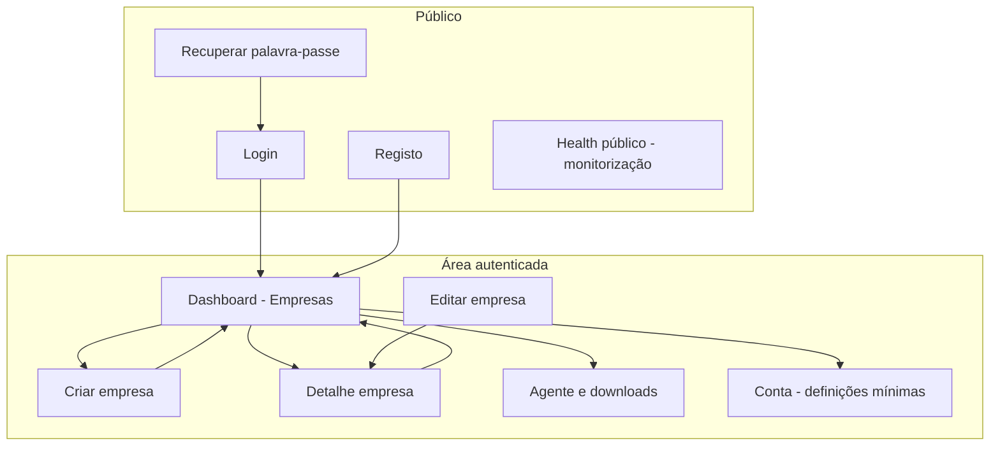
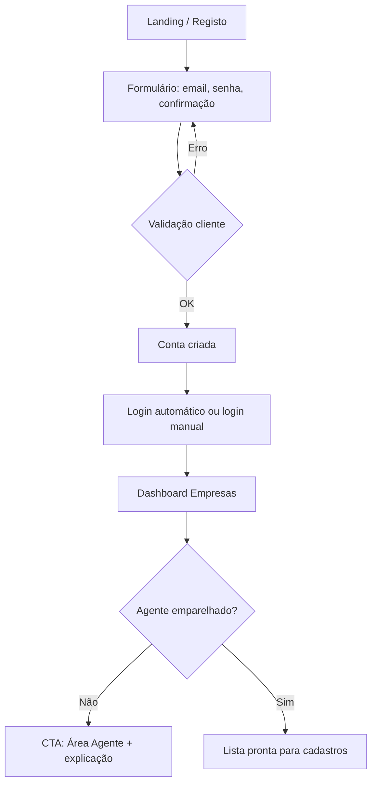
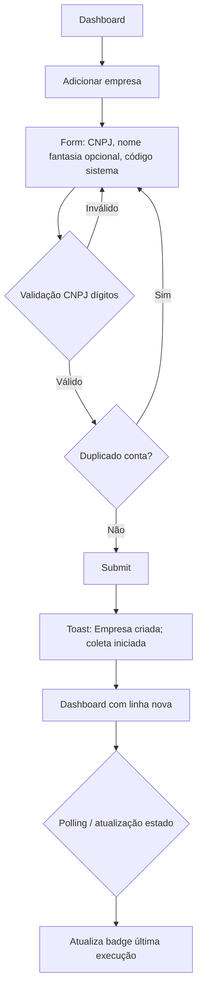
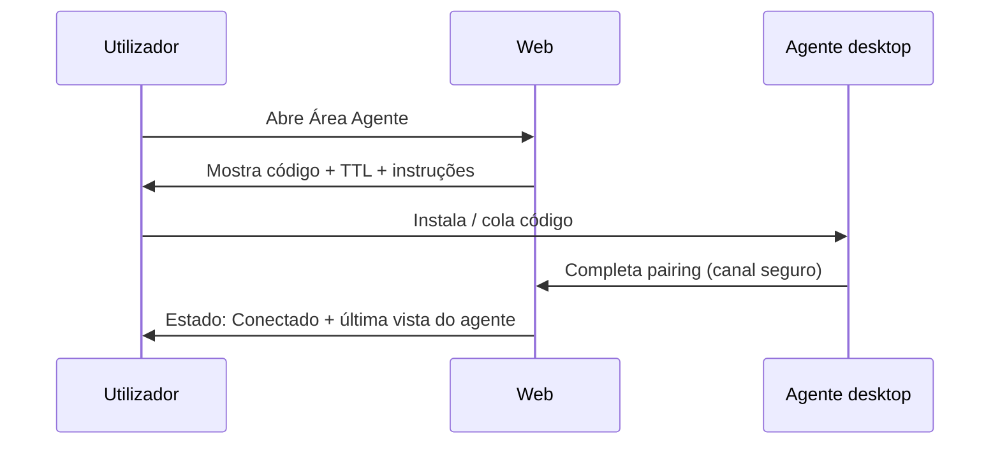
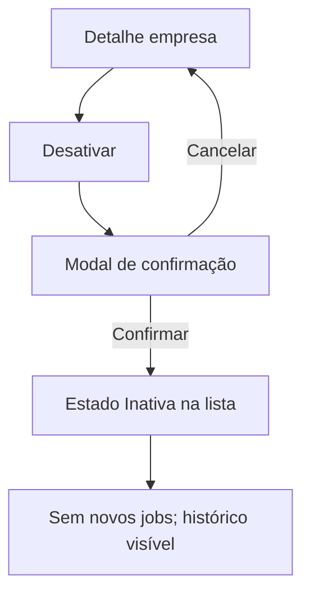

# Portal de Automação de Notas Fiscais (por empresa) — Especificação de UI/UX

## Introdução

Este documento define objetivos de experiência, arquitetura da informação, fluxos principais, wireframes conceituais, sistema de componentes e guia visual para a interface do **Portal de Automação de Notas Fiscais**. Serve de base para design visual e desenvolvimento front-end (Next.js / React / TypeScript / Tailwind, conforme PRD), garantindo experiência coesa e centrada no operador fiscal/financeiro.

**Fonte de verdade de produto:** `docs/prd.md` (**v0.2+**; agendamento mensal por empresa).  
**Incremento UI/UX (dia 1–28 por empresa):** `docs/front-end-spec-agendamento-por-empresa.md`.

**Escopo UX web:** autenticação, gestão de empresas, status de execuções e área de agente/pairing. **Escopo agente desktop (Windows):** fluxos mínimos descritos em secção dedicada; detalhes de implementação nativa ficam para o arquiteto/`@dev`.

---

## Overall UX Goals & Principles

### Target User Personas

1. **Operador fiscal multi-empresa (primário)**  
   - Perfil: contador, analista fiscal ou financeiro que consolida NF de **vários CNPJs** e **várias origens**.  
   - Necessidades: nomenclatura previsível, separação clara por empresa, visão rápida de **última execução** e de **falhas** sem jargon técnico.  
   - Comportamento: sessões curtas e frequentes; valoriza lista escaneável e filtros mínimos no MVP.

2. **Gestor / MEI com um CNPJ (secundário)**  
   - Perfil: pouca familiaridade com automação; quer **menos cliques** e confiança de que “está na pasta certa”.  
   - Necessidades: onboarding guiado (conta + agente), mensagens tranquilizadoras quando algo está **pendente** (PC desligado, agente offline).

3. **Administrador da própria conta (implícito no MVP)**  
   - Perfil: mesmo usuário que cuida de **sessão**, **pairing do agente** e eventual **revogação**.  
   - Necessidades: segurança perceptível (sem expor segredos), ações destrutivas com confirmação clara.

### Usability Goals

- **Facilidade de aprendizado:** um novo usuário consegue criar conta, cadastrar a primeira empresa e localizar o status da coleta **em uma sessão** sem documentação externa (com ajuda contextual na própria UI).
- **Eficiência:** na lista de empresas, o utilizador identifica em **≤ 5 segundos** quais linhas precisam de atenção (badge de estado: sucesso, em andamento, pendente, falha).
- **Prevenção de erros:** CNPJ com validação **inline** e bloqueio de duplicidade **antes** do submit; desativar empresa exige confirmação explícita.
- **Memorabilidade:** termos estáveis — **CNPJ**, **código do sistema**, **última execução**, **agente**, **fuso América/São Paulo** — repetidos em lista, detalhe e ajuda.
- **Confiança em processos assíncronos:** após salvar empresa, feedback imediato (“Coleta iniciada”) **sem bloquear** a navegação; estado atualizado por **polling leve** ou equivalente (detalhe técnico na arquitetura front-end).

### Design Principles

1. **Clareza operacional** — Priorizar leitura rápida de estado (tabelas, badges, timestamps) em detrimento de “marketing visual”.
2. **Progressão em duas frentes** — Deixar explícito que o produto é **site + agente**; nunca esconder a dependência do cliente local para arquivos no disco.
3. **Feedback assíncrono honesto** — Mostrar *pendente / aguardando cliente* quando aplicável (FR12), com texto que educa (ex.: “O computador com o agente precisou estar ligado”).
4. **Consistência fiscal** — CNPJ **mascarado** na UI; armazenamento normalizado só referenciado na ajuda, não no título da linha.
5. **Acessibilidade por defeito** — WCAG 2.2 AA em componentes web; foco visível, contraste e anúncios para leitores de ecrã em formulários e estados de job.

### Change Log

| Date       | Version | Description                                                         | Author        |
| ---------- | ------- | ------------------------------------------------------------------- | ------------- |
| 2026-04-22 | 0.2     | Referência ao incremento **agendamento por empresa** (`front-end-spec-agendamento-por-empresa.md`) e PRD v0.2 | UX (AIOS/Uma) |
| 2026-04-20 | 0.1     | Especificação inicial a partir do PRD e template front-end-spec v2 | UX (AIOS/Uma) |

---

## Information Architecture (IA)

### Site Map / Screen Inventory

### Navigation Structure

**Primary Navigation (área logada):** barra superior ou lateral colapsável com: **Empresas** (dashboard), **Agente**, **Conta**, **Sair**. No MVP, **Empresas** é o destino por defeito após login.

**Secondary Navigation:** dentro de **Detalhe da empresa** — separadores ou âncoras: **Resumo** | **Histórico de execuções** (lista resumida). Em **Agente** — **Estado da ligação** | **Como emparelhar** | **Transferir agente** (link para download se aplicável).

**Breadcrumb Strategy:**  
- Dashboard: sem breadcrumb ou apenas “Início”.  
- `Empresas > [Nome fantasia ou CNPJ mascarado] > Editar` quando fluxo for profundo.  
- Evitar breadcrumbs profundos no MVP; preferir botão “Voltar à lista” com etiqueta clara.

---

## User Flows

### Fluxo 1 — Registo e primeira sessão

**Objetivo do utilizador:** criar conta e aceder ao dashboard com sensação de “próximo passo” claro (instalar/conectar agente).

**Pontos de entrada:** landing futura, link direto para `/registo`, convite (fase posterior).

**Critérios de sucesso:** sessão válida; redirecionamento para dashboard; **banner ou cartão** opcional “Conecte o agente” se pairing ainda não existir.

**Edge cases e erros:**

- Email já registado: mensagem específica e link para login.  
- Senha fraca: critérios visíveis **antes** do submit (comprimento mínimo + regra simples).  
- Falha de rede: toast persistente + retry.

**Notas:** Alinhar com FR1; recuperação de palavra-passe pode ser MVP mínimo (email de reset) — UI com estados *email enviado* e *token inválido/expirado*.

---

### Fluxo 2 — Cadastrar empresa e disparo de coleta

**Objetivo:** registar CNPJ + código do sistema e perceber que a coleta **começou** sem bloquear.

**Entrada:** botão “Adicionar empresa” no dashboard.

**Sucesso:** empresa aparece na lista; estado de última execução **em andamento** ou **pendente** conforme backend/agente; utilizador pode navegar.

**Edge cases:**

- Conflito 409 duplicidade: mensagem com **CNPJ já existente com este código do sistema** e sugestão de editar.  
- Erro ao enfileirar job: estado explícito “Falha ao agendar” na linha + CTA “Tentar novamente” (se FR permitir ação manual posterior).  
- CNPJ colado com máscara: aceitar input e **normalizar** visualmente (máscara dinâmica).

**Notas:** Mapeia FR3, FR4, FR9, FR15.

---

### Fluxo 3 — Emparelhar agente (web + desktop)

**Objetivo:** associar o agente Windows à conta com código de curta duração e estado visível **Aguardando… / Conectado**.

**Entrada:** menu **Agente**, ou banner no dashboard se não pareado.

**Edge cases:**

- Código expirado: botão “Gerar novo código”.  
- Revogação na web: agente mostra **desligado**; na web estado **revogado** com instrução para novo pairing.  
- Utilizador sem permissão de instalação no Windows: link para requisitos e suporte (texto, não só erro genérico).

**Notas:** Mapeia FR8; copy deve evitar termos como “WebSocket” no utilizador final.

---

### Fluxo 4 — Acompanhar execução e falhas

**Objetivo:** ver **última execução** na lista e detalhe com mensagem de erro **legível** (FR15).

**Entrada:** linha da tabela ou página de detalhe.

**Sucesso:** utilizador distingue **pendente** (aguardando cliente) de **falha** (ação necessária) de **sucesso**.

**Edge cases:**

- Job mensal no dia 1º às 06:00 America/São_Paulo — mostrar label “Próxima: dia 1, 06:00 (São Paulo)” na área de detalhe ou tooltip.  
- Após 7 dias de retentativas (NFR9): estado **falha** com mensagem orientadora (“Verifique agente e rede”).

---

### Fluxo 5 — Desativar empresa

**Objetivo:** parar agendamentos futuros sem apagar histórico (FR17).

**Edge cases:** reativação (se existir no MVP) — mesma página com estado “Inativa” e botão “Reativar” com confirmação.

---

## Wireframes & Mockups

### Ficheiros de design

**Ferramenta recomendada:** Figma (equipa) — criar ficheiro único “NF Portal — MVP” com frames nomeados por rota. Até lá, esta especificação usa **layouts textuais** e estrutura de componentes para implementação.

**Primary Design Files:** *a criar* — placeholder: `figma://` ou URL quando existir.

### Key Screen Layouts

#### Tela — Login / Registo

- **Propósito:** autenticação com mínimo de distracções.  
- **Elementos-chave:** logo/nome produto, formulário (email, senha), link recuperação, alternância Registo/Login, mensagens de erro inline + `aria-live`.  
- **Interação:** submit com estado *loading* no botão; foco no primeiro campo inválido.  
- **Referência de frame:** *Figma: Auth — Login*.

#### Tela — Dashboard (lista de empresas)

- **Propósito:** visão operacional principal (PRD “Core Screens”).  
- **Elementos-chave:**  
  - Cabeçalho com título “Empresas” + botão primário **Adicionar empresa**.  
  - **Banner** opcional: agente não conectado (nível warning).  
  - **Tabela ou lista densa:** colunas — CNPJ (mascarado), Nome fantasia, Código do sistema, **Estado da empresa** (Ativa/Inativa), **Última execução** (data/hora relativa + badge de estado do job).  
  - Linha clicável → detalhe.  
- **Interação:** ordenação simples por “Última execução” (fase 1.5 se não no MVP). Empty state com ilustração leve + CTA.  
- **Referência:** *Figma: Dashboard — Empresas*.

#### Tela — Criar / Editar empresa

- **Propósito:** formulário com validação CNPJ e unicidade.  
- **Elementos-chave:**  
  - CNPJ com máscara e validação; ajuda: “Apenas números são usados nas pastas.”  
  - Nome fantasia (opcional).  
  - Código do sistema — texto curto; ajuda: “Identifica a origem no disco: `.../CNPJ/código/`.”  
  - Em edição: aviso se mudança de código implicar pasta nova (copy a validar com produto).  
- **Interação:** desativar submit até válido; mostrar erro de duplicidade no campo CNPJ ou código conforme API.  
- **Referência:** *Figma: Form — Empresa*.

#### Tela — Detalhe da empresa

- **Propósito:** dados cadastrais + histórico resumido de execuções.  
- **Elementos-chave:**  
  - Cabeçalho: nome ou CNPJ + menu de ações (Editar, Desativar).  
  - Cartão **Próximo job mensal:** “Dia 1 de cada mês, 06:00 (horário de Brasília)”.  
  - Tabela **Histórico:** data/hora, estado, mensagem curta, link “copiar ID do job” (*opcional* para suporte).  
- **Interação:** estados vazios; erro expansível (detalhe técnico colapsado).  
- **Referência:** *Figma: Empresa — Detalhe*.

#### Tela — Agente e downloads

- **Propósito:** pairing, estado da ligação, download do instalador Windows.  
- **Elementos-chave:**  
  - Estado: **Desconectado / A aguardar código / Conectado** (badge).  
  - Código de emparelhamento com **contagem regressiva** de TTL.  
  - Instruções numeradas (1–4).  
  - Link **Descarregar agente para Windows**.  
  - Secção **Revogar ligações** (confirmação).  
- **Interação:** gerar novo código; toast de sucesso na ligação.  
- **Referência:** *Figma: Agente*.

#### Tela — Conta (definições mínimas)

- **Propósito:** nome, email, sessão, política de privacidade (NFR3).  
- **Elementos-chave:** formulário simples; link para logout global; texto legal.  
- **Referência:** *Figma: Conta*.

---

## Component Library / Design System

### Design System Approach

**Abordagem:** sistema baseado em **Radix UI Primitives** + **shadcn/ui** (Tailwind), alinhado ao preset **nextjs-react** do projeto. Tokens semânticos via CSS variables (tema claro por defeito; tema escuro opcional no backlog).

Evitar estilos ad-hoc por ecrã; componentes novos compõem-se a partir dos **atoms** existentes.

### Core Components

#### Button

- **Propósito:** ações primárias, secundárias e destrutivas.  
- **Variantes:** primary, secondary, outline, ghost, destructive, link.  
- **Estados:** default, hover, focus-visible, active, disabled, loading (spinner + texto).  
- **Uso:** um primário por vista; destrutivo só em modais de confirmação.

#### Input, Label, FieldError

- **Propósito:** formulários acessíveis com associação explícita `label` + `htmlFor` + `aria-describedby` para erros.  
- **Variantes:** default, com ícone (CNPJ).  
- **Estados:** idle, focus, invalid, disabled.  
- **Uso:** erros sempre visíveis e anunciados; nunca só cor vermelha.

#### DataTable / List row (empresas)

- **Propósito:** lista densa com estados de job.  
- **Variantes:** tabela desktop; cards empilhados em mobile.  
- **Estados:** linha hover, linha selecionada (opcional), skeleton loading.  
- **Uso:** coluna de estado com **Badge** sem depender só da cor (ícone + texto).

#### Badge (status de job)

- **Propósito:** comunicar estado do job (FR15).  
- **Variantes mapeadas:**  
  - `sucesso` — verde neutro  
  - `em_execução` — azul + ícone de progresso  
  - `pendente` — âmbar + texto “Aguardando agente” quando aplicável  
  - `falha` — vermelho + ícone de alerta  
- **Estados:** sempre com texto; modo alto contraste compatível.

#### Toast / InlineAlert

- **Propósito:** feedback de criação de empresa e erros globais.  
- **Variantes:** success, warning, error, info.  
- **Uso:** toasts não bloqueantes para sucesso; alert persistente para falhas de sistema.

#### Modal / Dialog

- **Propósito:** confirmar desativar empresa, revogar agente.  
- **Estados:** foco preso, fecho com Esc, botão destrutivo à direita em fluxos perigosos.

#### EmptyState

- **Propósito:** lista sem empresas; histórico vazio.  
- **Uso:** CTA único + uma frase de valor.

---

## Branding & Style Guide

### Visual Identity

**Brand Guidelines:** sem marca corporativa fechada no PRD — identidade **neutra B2B**: confiança, precisão fiscal, sem estética lúdica.

### Color Palette

| Color Type | Hex (sugerido) | Usage |
| ---------- | ---------------- | ----- |
| Primary    | `#0F172A` (slate-900) | Botões primários, títulos fortes |
| Secondary  | `#334155` (slate-700) | Texto secundário |
| Accent     | `#2563EB` (blue-600)  | Links, foco, estados informativos |
| Success    | `#15803D` (green-700) | Job sucesso, confirmações |
| Warning    | `#B45309` (amber-700) | Pendente, avisos |
| Error      | `#B91C1C` (red-700)   | Falhas, validação |
| Neutral    | `#F8FAFC` / `#E2E8F0` | Fundos, bordas, divisores |

> Tokens finais devem ser variáveis CSS (`--primary`, `--destructive`, etc.) para tema e contraste WCAG.

### Typography

#### Font Families

- **Primary:** `Inter` ou `Geist Sans` (Next.js) — leitura de dados e tabelas.  
- **Secondary:** igual à primary no MVP (evitar fontes desnecessárias).  
- **Monospace:** `ui-monospace` / `Geist Mono` para IDs de job e paths **opcionais** em modo detalhe técnico.

#### Type Scale

| Element | Size | Weight | Line Height |
| ------- | ---- | ------ | ----------- |
| H1      | 1.875rem (30px) | 600 | 1.2 |
| H2      | 1.5rem (24px)   | 600 | 1.25 |
| H3      | 1.25rem (20px)  | 600 | 1.3 |
| Body    | 1rem (16px)     | 400 | 1.5 |
| Small   | 0.875rem (14px) | 400 | 1.45 |

**Mínimo de texto:** 16px para inputs (evitar zoom iOS); `small` apenas para meta informação, não para erros críticos.

### Iconography

**Icon Library:** `lucide-react` (coerente com shadcn).

**Usage Guidelines:** ícones sempre acompanhados de texto em estados de job e ações críticas; tamanho mínimo tocável 24×24px (área de toque 44×44 onde aplicável).

### Spacing & Layout

**Grid System:** content max-width **1280px** com padding horizontal **16px** (mobile) → **24px** (desktop).

**Spacing Scale:** base **4px** — usar múltiplos (4, 8, 12, 16, 24, 32) para ritmo vertical consistente entre cartões de dashboard.

---

## Accessibility Requirements

### Compliance Target

**Standard:** WCAG **2.2 nível AA** (componentes web), conforme PRD.

### Key Requirements

**Visual:**

- Contraste de texto: mínimo **4.5:1** para texto normal; **3:1** para texto grande; gráficos/ícones críticos não só por cor.  
- Indicadores de foco: `:focus-visible` com anel de **2px** e offset; nunca `outline: none` sem substituto.  
- Texto: permitir zoom até 200% sem perda de funcionalidade em layouts principais.

**Interaction:**

- Todas as ações via teclado: tab order lógico, escape fecha modais, Enter ativa botão primário em formulários válidos.  
- Leitores de ecrã: landmarks (`header`, `main`, `nav`), regiões com `aria-label` para tabela de empresas e histórico de jobs.  
- Alvos de toque: mínimo **44×44px** em controles primários em viewport estreita.

**Content:**

- Texto alternativo apenas para ícones decorativos `aria-hidden`; informativos com `aria-label`.  
- Hierarquia de cabeçalhos: um `h1` por página; subsecções `h2`/`h3` sem saltos.  
- Formulários: cada input com label visível; erros com `role="alert"` ou associação `aria-describedby`.

### Testing Strategy

- **Automático:** axe-core em CI nos fluxos críticos (login, dashboard, form empresa).  
- **Manual:** checklist WCAG rápido por release; teste com teclado só + VoiceOver/NVDA nas mesmas rotas.  
- **Regressão:** componentes shadcn não devem remover roles de primitivos Radix.

---

## Responsiveness Strategy

### Breakpoints

| Breakpoint | Min Width | Max Width | Target Devices |
| ---------- | --------- | --------- | -------------- |
| Mobile     | 0         | 639px     | Telefones (uso ocasional) |
| Tablet     | 640px     | 1023px    | Tablets em landscape |
| Desktop    | 1024px    | 1439px    | Laptops — **prioridade MVP** |
| Wide       | 1440px    | —         | Monitores amplos / contabilidade dual screen |

### Adaptation Patterns

**Layout Changes:** dashboard usa **tabela** em desktop/tablet; abaixo de `md` converter para **cards empilhados** com mesma informação (CNPJ, estado, última execução no topo do card).

**Navigation Changes:** sidebar colapsa para **ícones + rail** ou **top bar** com menu “hamburger” mantendo mesma ordem de itens.

**Content Priority:** em mobile, **estado do job** e **última execução** aparecem antes do nome fantasia se espaço escasso (validar com teste rápido).

**Interaction Changes:** modais fullscreen em mobile pequeno; date/time em formato localizado curto (`dd/MM/yyyy HH:mm` com timezone explícito na ajuda).

---

## Animation & Micro-interactions

### Motion Principles

- **Úteis, não decorativas:** realçar mudança de estado (job de pendente → sucesso), não animar gratuitamente.  
- **Respeitar `prefers-reduced-motion`:** animações opcionais desligadas ou substituídas por fade instantâneo.  
- **Duração:** 150–200ms para hovers e toasts; evitar > 300ms em feedback crítico.

### Key Animations

- **Toast de sucesso:** slide-in suave (Duration: **200ms**, Easing: `cubic-bezier(0.2, 0.8, 0.2, 1)`).  
- **Badge de job em execução:** pulse **subtil** no ícone (Duration: **1.5s**, loop) — respeitar reduced motion.  
- **Skeleton da tabela:** shimmer discreto durante carregamento inicial (Duration: **1.2s**).  
- **Modal:** fade + scale **0.98 → 1** (Duration: **150ms**).

---

## Performance Considerations

### Performance Goals

- **Page Load:** First Contentful Paint alvo **< 1,8s** em 4G rápido no dashboard (sem bloquear por dados pesados — dados via API após shell).  
- **Interaction Response:** feedback de clique **< 100ms** perceptível; submit com estado loading explícito.  
- **Animation FPS:** 60fps em máquinas médias; evitar sombras pesadas em listas longas.

### Design Strategies

- Paginação ou “load more” para histórico de execuções quando > 50 linhas.  
- Evitar gráficos pesados no MVP; preferir texto e badges.  
- Imagens: formato moderno (WebP/AVIF), dimensões explícitas para evitar CLS.  
- Polling de estado: intervalos conservadores na UI (ex.: 10–30s quando há jobs ativos) — detalhe a cruzar com arquitetura (SSE futuro).

---

## Next Steps

### Immediate Actions

1. Criar ficheiro Figma com frames listados e biblioteca ligada a tokens (ou importar UI kit shadcn como referência).  
2. Revisão com stakeholders (contabilidade/financeiro) do vocabulário: **código do sistema**, mensagens de **pendente**.  
3. Handoff para **@architect**: rotas, contratos de dados de job, estratégia de atualização em tempo real vs polling.  
4. Protótipo clicável do fluxo **Adicionar empresa** + **Agente** para teste moderado (2–3 utilizadores).  
5. Definir **copy final** de erros da API (mapa código HTTP → mensagem humana).

### Design Handoff Checklist

- [x] Fluxos de utilizador documentados (incluindo erros e assíncronos)  
- [x] Inventário de componentes e abordagem de design system  
- [x] Requisitos de acessibilidade definidos (WCAG 2.2 AA)  
- [x] Estratégia responsiva e breakpoints  
- [x] Diretrizes de marca/cor/tipo (neutro profissional até brand book)  
- [x] Metas de performance UX-relevantes  

### Open Questions

- **Edição do código do sistema:** impacto em pastas já criadas — mensagem legal/UX a fechar com produto.  
- **Lista de conectores:** quando existir mais de um, UI de seleção (dropdown) vs campo texto livre.  
- **Notificações por email (pós-MVP):** placeholders de preferências na Conta podem ser adiados.

---

## Checklist Results

**Estado:** checklist formal de UI/UX do AIOS **não executado** nesta entrega; recomenda-se correr `pattern-audit-checklist` / revisão de pares após Figma existir.

---

## Rastreabilidade PRD → UX

| PRD | Cobertura nesta especificação |
| --- | ------------------------------ |
| FR1–FR4, FR16–FR17 | Fluxos auth, formulário empresa, lista, desativar |
| FR5–FR7 | Copy CNPJ/máscara; ajuda sobre pastas; não expor path completo desnecessariamente |
| FR8–FR9, FR12–FR15 | Área Agente, estados assíncronos, badges, pendente |
| FR10–FR11 | Detalhe empresa — próximo job mensal + fuso |
| NFR3 | Conta — privacidade; linguagem humana em erros |
| NFR6 | Secção Performance |

---

— Uma (UX), Atomic Design + tokens semânticos. Documento alinhado ao template `frontend-spec-template-v2` (AIOS).
