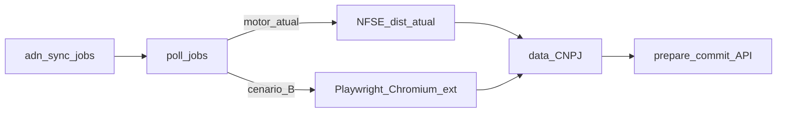

# PRD — Motor alternativo cenário B (Playwright + extensão Chrome no worker Windows)

**Documento:** requisitos de produto derivados de [`briefing-cenario-b-adn-playwright-extensao-chrome.md`](briefing-cenario-b-adn-playwright-extensao-chrome.md).  
**Data:** 2026-04-30  
**Audiência:** produto, engenharia, operações, compliance.

**Relação com normativa existente:** este PRD **especializa** o worker que já satisfaz [`prd-integracao-nfse-dist-adn.md`](prd-integracao-nfse-dist-adn.md) (**FR41–FR48**, **NFR19–NFR23**): o **portal**, a fila **`adn_sync_jobs`** e o contrato de ingestão (**`prepare` → PUT → `commit`**) permanecem; apenas o **motor local de descarga** (antes exclusivamente **NFSE_dist** / `run_download_workflow`) pode ser **opcionalmente** substituído ou complementado por automação de browser com extensão.

**Em caso de conflito** entre segurança de certificado, auditoria ou ingestão multi-tenant do PRD ADN base e este documento sobre **Playwright / extensão / perfil de sessão**, **prevalece** [`prd-integracao-nfse-dist-adn.md`](prd-integracao-nfse-dist-adn.md) até harmonização explícita. O cenário B é **opt-in por configuração** e **desactivável** sem novo deploy do portal (rollback para NFSE_dist).

**Change log:**

| Data       | Versão | Descrição |
| ---------- | ------ | --------- |
| 2026-04-30 | 0.1    | PRD inicial: FR-ADN-B-*, NFR-ADN-B-*, UX mínima, riscos, épicos sugeridos. |

---

## 1. Problema e contexto

O motor actual [**NFSE_dist**](https://github.com/RafaelOliveiraCf/NFSE_dist) (`curl.exe` / Schannel, certificado no worker) é o caminho suportado em [`nfse_runner.run_download_workflow_once`](../workers/nfse-portal-bridge/nfse_runner.py). Alguns cenários operacionais ou expectativas de **tempo de recolha** podem tornar desejável uma **segunda via** no **mesmo Windows**: **Chromium** controlado (ex. **Playwright**) com **extensão** orientada ao Portal Nacional, reproduzindo fluxos que utilizadores humanos já fazem no browser.

**Cenário A (importação manual):** ficheiros obtidos fora do worker (utilizador + extensão ou outro meio) e **importação** por pasta — briefing separado se existir produto.

**Cenário B (este PRD):** o **job em fila** continua automático; o worker tenta **automatizar** o browser como alternativa ao fluxo baseado **apenas** em NFSE_dist.

**Problema:** dependência de **sessão gov.br**, **extensão de terceiros**, **fragilidade de selectors** e **superfície de segurança** do perfil Chrome — sem gestão de produto explícita há risco de incidentes, expectativa errada do cliente ou bloqueio legal.

---

## 2. Objectivos de produto

| ID | Objectivo |
|----|-----------|
| **O1** | Permitir **configurar** o worker para usar o **motor cenário B** (Playwright + extensão) **sem** alterar o contrato de ingestão com o portal ([`portal_artifacts.sync_data_directory`](../workers/nfse-portal-bridge/portal_artifacts.py)). |
| **O2** | Garantir **paridade mínima de ingestão**: mesmos tipos de artefactos aceites por **`prepare`/`commit`**, mesma idempotência por chave de acesso onde aplicável. |
| **O3** | Tornar o motor **observável**: tipo de motor, duração da fase browser, classificação de falha (sessão, portal, extensão, I/O), sem expor segredos. |
| **O4** | **Rollback operacional:** desactivar o motor B **apenas com configuração** (variáveis de ambiente ou equivalente documentado) e voltar ao NFSE_dist **sem** obrigar alteração de código do portal. |
| **O5** | **Gate de compliance:** antes de uso em produção com extensão de terceiros, registo explícito de **revisão** (legal/produto) ou **waivo** documentado por stakeholder — não automatizar silenciosamente dependências não controladas. |

---

## 3. Fora de âmbito

- Fixar no PRD um **fornecedor oficial** de extensão Chrome (a escolha é decisão de produto/compliance por tenant ou global).
- Substituir **NFSE_dist** como **default** em todos os ambientes sem decisão de release e sem POC bem-sucedido.
- Reimplementar telas do **Portal Nacional** dentro do produto.
- Alterar **FR41–FR48** no significado de job multi-tenant; este incremento **não** cria novos estados de job além do que `summary_json` já permite estender.
- Incluir neste texto **certificação** de conformidade com políticas do governo federal ou da extensão — apenas **gate** documental (**O5**).

---

## 4. Requisitos funcionais

| ID | Descrição |
|----|-----------|
| **FR-ADN-B-01** | O worker **deve** suportar **selecção do motor de descarga** por configuração implantável (ex.: variável de ambiente `ADN_DOWNLOAD_ENGINE` ou nome acordado na story), com valor por defeito **`nfse_dist`** (comportamento actual). Valores alternativos activam o ramo **cenário B** conforme desenho técnico (B1 no briefing). |
| **FR-ADN-B-02** | Quando o motor B estiver activo, o worker **deve** produzir ficheiros em disco num layout **compatível** com o consumo por [`sync_data_directory`](../workers/nfse-portal-bridge/portal_artifacts.py) — no mínimo equivalente a `NFSE_dist/data/{cnpj}/` com XML/PDF esperados, **ou** caminho configurável explicitamente mapeado na implementação. |
| **FR-ADN-B-03** | Após a fase de descarga (motor B), o fluxo **deve** continuar com **upload** via as mesmas rotas internas (`/api/internal/v1/adn/uploads/prepare`, PUT, `/api/internal/v1/adn/artifacts/commit`) e **HMAC**, preservando `organization_id`, `company_id`, `job_id`. |
| **FR-ADN-B-04** | O sistema **deve** persistir em `summary_json` do job (ou campo equivalente acordado) pelo menos: **`downloadEngine`** (ex.: `nfse_dist` \| `playwright_extension`), **duração** da fase browser quando aplicável, e **categoria de falha** quando o job falhar no motor B (sessão, portal, extensão, disco, timeout). |
| **FR-ADN-B-05** | Se a implementação seguir a variante **B2** (subprocesso dedicado), o contrato **deve** incluir: argumentos mínimos (CNPJ, intervalo de datas, caminhos de saída e de extensão), **exit code** sem ambiguidade, e logs **redigidos** (sem cookies, sem HTML completo de login). Detalhe na story. |
| **FR-ADN-B-06** | A variante **B3** (protótipo incremental: humano + pasta, depois automação parcial) **pode** ser usada em POC; **não** é critério obrigatório de MVP deste PRD — apenas documentação de caminho em runbook ou story. |
| **FR-ADN-B-07** | **Smoke:** `NFSE_BRIDGE_SKIP_NFSE_DIST=1` (existente) **continua** a aplicar-se ao motor de descarga; combinação com motor B **deve** estar documentada no runbook para evitar confusão operacional (comportamento exacto na story). |
| **FR-ADN-B-08** | Antes de marcar **produção** com motor B e extensão de terceiros, **deve** existir **evidência** de **gate O5** (aprovação ou waivo registado com data e responsável). |

---

## 5. Requisitos não funcionais

| ID | Descrição |
|----|-----------|
| **NFR-ADN-B-01** | **Segurança do perfil:** perfis Chrome persistentes, cookies ou dados de sessão **proibidos** em repositório git; localização em disco **documentada** com permissões restritas (NTFS / política ops). |
| **NFR-ADN-B-02** | **Logs:** não registar HTML completo de páginas de login; truncar URLs sensíveis quando necessário; alinhar espírito de **FR47** / auditoria do PRD ADN base. |
| **NFR-ADN-B-03** | **Screenshots / traces** de debug: apenas com **flag explícita** de diagnóstico; **proibido** por defeito em CI artefactos públicos; sem dados pessoais em anexos partilhados. |
| **NFR-ADN-B-04** | **Capacidade:** se múltiplos jobs browser comprometerem RAM ou estabilidade, o desenho **deve** permitir **serialização** ou limite de concorrência documentado (runbook). |
| **NFR-ADN-B-05** | **Reprodutibilidade:** runbook **deve** referenciar versões de **Chromium/Playwright** e, quando aplicável, **identificador de versão da extensão** testada (não obriga pin na loja, mas exige rastreio). |
| **NFR-ADN-B-06** | **Autenticação worker ↔ portal:** inalterada — **NFR20** do PRD ADN base; motor B **não** enfraquece o canal HMAC. |

---

## 6. UX e transparência

- **MVP deste incremento:** exposição do **motor** e métricas mínimas onde o produto já mostrar detalhe de job / execução (`summary_json`), **ou** visibilidade equivalente para **suporte** via logs estruturados — decisão fina na story para não bloquear POC.
- **Princípio:** utilizador final **nunca** vê segredos de sessão; mensagens de falha **seguras** (sem stack trace bruto), alinhadas ao espírito do [`prd-integracao-nfse-dist-adn.md`](prd-integracao-nfse-dist-adn.md) §8.

---

## 7. Dependências documentais

| Documento | Relação |
| --------- | ------- |
| [`briefing-cenario-b-adn-playwright-extensao-chrome.md`](briefing-cenario-b-adn-playwright-extensao-chrome.md) | Briefing fonte; variantes B1–B3 e diagrama. |
| [`prd-integracao-nfse-dist-adn.md`](prd-integracao-nfse-dist-adn.md) | Requisitos de portal, jobs e ingestão; precedência em conflito. |
| [`architecture-integracao-nfse-dist-adn.md`](architecture-integracao-nfse-dist-adn.md) | Modelo ADN, auditoria, storage. |
| [`architecture-cenario-b-adn-playwright-extensao-chrome.md`](architecture-cenario-b-adn-playwright-extensao-chrome.md) | Arquitectura técnica do motor B: env, `summary_json`, subprocesso, concorrência. |
| [`workers/nfse-portal-bridge/poll_jobs.py`](../workers/nfse-portal-bridge/poll_jobs.py) | Orquestração do job. |
| [`workers/nfse-portal-bridge/nfse_runner.py`](../workers/nfse-portal-bridge/nfse_runner.py) | Ponto de troca conceptual do motor de descarga. |
| [`workers/nfse-portal-bridge/portal_artifacts.py`](../workers/nfse-portal-bridge/portal_artifacts.py) | Contrato `prepare`/`commit`. |

---

## 8. Diagrama de contexto

---

## 9. Critérios de aceite globais

1. **Paridade:** com motor B activo em ambiente de teste, artefactos ingeridos passam pelo mesmo fluxo `prepare`/`commit` sem alteração do portal **ou** com alterações já cobertas pelo PRD ADN base.
2. **Rollback:** alteração de configuração restaura **apenas NFSE_dist** e jobs subsequentes **não** invocam Playwright.
3. **POC documentado:** pelo menos **um** CNPJ e **uma** janela de datas em ambiente controlado, com resultado registado (sucesso ou falha classificada).
4. **Gate O5:** evidência de revisão/waivo antes de produção com extensão de terceiros (**FR-ADN-B-08**).

---

## 10. Riscos e mitigações

| Risco | Mitigação |
| ----- | ---------- |
| Sessão gov.br / MFA | Perfil persistente + procedimento de reautenticação; falhas classificadas (**FR-ADN-B-04**); não prometer disponibilidade 24/7 sem teste. |
| Actualização da extensão na loja | Pin de versão em runbook (**NFR-ADN-B-05**); testes de regressão antes de upgrade; rollback motor para NFSE_dist. |
| Headless vs headful | Documentar modo suportado no POC; headless pode ser inviável — aceitar headful + VM dedicada na estratégia ops. |
| Paralelismo / RAM | **NFR-ADN-B-04** serialização ou limite de jobs browser. |
| Compliance / ToS | **O5** / **FR-ADN-B-08** antes de produção; não afirmar afiliação ao governo nem à extensão no produto sem texto aprovado. |

---

## 11. Épicos e histórias sugeridas (para @sm / @architect)

1. **POC técnico:** Playwright + Chromium + carregamento de extensão num Windows de staging; mapear saída para `data/{cnpj}/`.
2. **Integração worker:** `ADN_DOWNLOAD_ENGINE` (ou equivalente) em [`poll_jobs.py`](../workers/nfse-portal-bridge/poll_jobs.py) / [`nfse_runner.py`](../workers/nfse-portal-bridge/nfse_runner.py); testes smoke com `NFSE_BRIDGE_SKIP_NFSE_DIST` documentados.
3. **Observabilidade:** `summary_json` com **FR-ADN-B-04**; logs estruturados sem segredos (**NFR-ADN-B-02**).
4. **Runbook ops:** versões, rollback, localização do perfil, limites de concorrência.
5. **Compliance:** checklist **FR-ADN-B-08** com owner nomeado.

---

## 12. Próximos passos de produto

1. Decisão **go/no-go** sobre dependência de extensão de terceiros vs investimento no cenário A (importação de pasta).
2. Após implementação validada, considerar referência a este ficheiro em [`docs/prd.md`](prd.md) (tabela de incrementos) numa PR dedicada.

---

— **Morgan (PM) / AIOS** — documento derivado do briefing [`briefing-cenario-b-adn-playwright-extensao-chrome.md`](briefing-cenario-b-adn-playwright-extensao-chrome.md).
