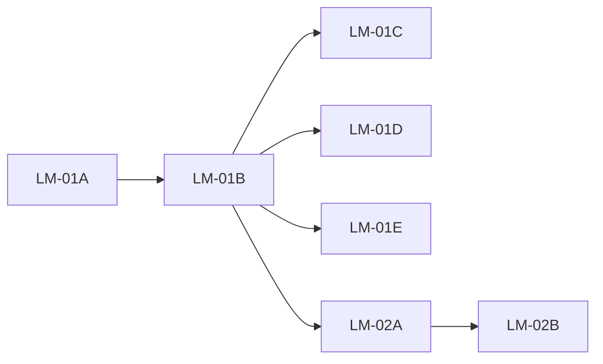

# User stories — Incremento: espelho local XML/PDF (`local_download_root`)

**Produto:** Portal NF  
**Fontes:** `docs/prd-download-automatico-xml-pdf-pasta-raiz-windows.md`, `docs/architecture-download-automatico-xml-pdf-pasta-raiz-windows.md`, `docs/front-end-spec-download-automatico-xml-pdf-pasta-raiz-windows.md`, `docs/briefing-download-automatico-xml-pdf-pasta-raiz-windows.md`  
**Pré-requisito:** ADN operacional (jobs, `adn-sync-settings`, worker `nfse-portal-bridge`); coluna `organizations.local_download_root` no schema Drizzle (confirmar migração aplicada em staging).  
**Autor:** SM (River / AIOS)  
**Data:** 2026-04-24  
**Versão do conjunto:** **1.3** — refinamento pós-feedback PO v1.2 (nota **9,5/10** → DoD **LM-01E** espelha **AC1**).  
**Estado do conjunto:** **Draft** — DoR para `@dev`; **decisões PO §0** fechadas para reduzir ambiguidade no PR.

### Refino 1.1 (critérios @po incorporados)

| Feedback PO | Tratamento neste documento |
| ------------- | --------------------------- |
| Visibilidade `localDownloadRoot` no GET | **§0 — Decisão D1** (quem vê o path). |
| `completed` vs `partial` quando espelho falha | **§0 — Decisão D2** + **LM-02B** AC explícitos. |
| LM-01A AC2 ambíguo (doc só em LM-02B) | **§0 — Decisão D3** + **LM-01A** AC2 reescrito. |
| Persona LM-01D vs ACL do path | **LM-01D** user story e AC2 alinhados a **D1**. |
| Superadmin | **§0 — Decisão D4** + **LM-01B** AC7. |
| Migração `localStorage` → servidor (FR60) | **§ «Fora de âmbito MVP»** — backlog explícito. |
| UAT curto ausente | Secção **«UAT mínimo»** + item no DoD macro. |

### Refino 1.2 (feedback PO pós-1.1, nota 9/10)

| Feedback PO | Tratamento neste documento |
| ------------- | --------------------------- |
| Tipo de evento de auditoria pouco operacional | **LM-01B** AC6 + Dev notes: literal `organization_local_download_root_updated` + metadata **§8** arquitectura LM. |
| UAT §7 «403/404 conforme actual» | **UAT mínimo** passo 7: fixar resultado esperado no teste + nota de paridade com handler. |
| `canManage` vs `canManageUsers` (LM-01E) | **LM-01E** AC1 + Dev notes + índice: paridade **LM-01B AC5**. |

### Refino 1.3 (feedback PO pós-1.2, nota 9,5/10)

| Feedback PO | Tratamento neste documento |
| ------------- | --------------------------- |
| DoD **LM-01E** genérico («só visível com permissão») vs **AC1** detalhado | Tabela **DoD por fatia** — linha **LM-01E** reescrita para espelhar **AC1–AC3** (ACL + mascaramento + sem cross-org). |

---

## 0. Decisões de produto fechadas (implementação obrigatória)

Estas decisões **substituem** «fechar no PR» onde havia ambiguidade; **@dev** segue literalmente salvo escalamento a `@po`.

| ID | Decisão |
| -- | -------- |
| **D1 — GET `localDownloadRoot`** | O campo `localDownloadRoot` no **GET** `…/adn-sync-settings` é devolvido a **todo** utilizador que já tenha permissão para **GET** actual da rota (acesso à organização conforme handler existente). **Não** ocultar o path a membros não-admin: o valor é operacional, não é segredo criptográfico. *(Se no futuro houver requisito de ocultação, nova story + ADR.)* |
| **D2 — Estado do job quando o espelho falha** | Se a ingestão ao **Storage** do job concluiu com sucesso no conjunto tratado pelo worker, o estado final do job permanece **`completed`**. Falhas de espelho em disco **não** mudam o estado para `partial` neste incremento. O `summaryJson` do `PATCH` final **deve** incluir `mirrorWritten`, `mirrorFailed` e, se `mirrorFailed > 0`, `mirrorHadFailures: true` (boolean). |
| **D3 — Documentação com LM-01A** | Qualquer **PR** que introduza o ficheiro de migração **LM-01A** deve incluir **pelo menos uma linha** em `docs/qa/adn-staging-setup.md` a referir a migração `local_download_root` (ordem na lista). Não é aceitável mergear LM-01A sem actualização mínima de doc, delegando tudo a LM-02B. |
| **D4 — Superadmin** | **PATCH** `localDownloadRoot` e `adnSyncEnabled` mantêm a **mesma** regra de papel que o código actual: `canManageUsers(session.user, orgRole)` após validação de acesso à org; **superadmin** segue o ramo existente do handler (incl. `canAccessOrganization(..., true)` onde aplicável). **Novos testes:** superadmin não contorna PATCH sem papel de gestão se o código actual também não o permitir — documentar resultado esperado no PR a partir dos testes. |

---

### DoR para `@dev` (checklist rápida)

- [ ] Ler PRD LM + arquitectura LM + spec UX LM + **§0 deste ficheiro**.  
- [ ] Branch sugerida: `feature/lm-local-download-root` (ou nome da equipa).  
- [ ] Ordem recomendada: **LM-01A → LM-01B → LM-01C → LM-02A → LM-02B**; **LM-01E** opcional e independente após LM-01B.  
- [ ] **D3:** PR de LM-01A inclui linha em `docs/qa/adn-staging-setup.md` (LM-02B pode expandir a mesma secção).  
- [ ] **LM-01B:** auditoria com `organization_local_download_root_updated` + `metadata` conforme arquitectura LM **§8** (desde v1.2).  
- [ ] **LM-01E** *(se implementada):* DoD da fatia verificável contra **AC1–AC3** (v1.3).

---

## Índice

| ID | Título resumido | Dependências |
| -- | ----------------- | -------------- |
| **LM-01A** | Migração Postgres `local_download_root` + documentação ordem migrações | Nenhuma |
| **LM-01B** | API `GET`/`PATCH` …/adn-sync-settings com `localDownloadRoot`, validação Zod, `error_code`, auditoria | **LM-01A** (coluna existente na base alvo) |
| **LM-01C** | UI `/configuracoes`: secção servidor + preferências navegador; `GET`/`PATCH` path; copy **FR63** | **LM-01B** |
| **LM-01D** | Dashboard: bloco «Agente no computador» alinhado à spec UX §4 | **LM-01B** (valor servidor); pode mergear com **LM-01C** no mesmo PR |
| **LM-01E** | *(Opcional)* Ficha empresa: faixa só leitura pasta raiz; visibilidade alinhada a **LM-01B AC5** + spec UX §7 | **LM-01B** |
| **LM-02A** | Worker: `mirror_local.py` + integração `poll_jobs` + `NFSE_LOCAL_MIRROR_DISABLED` | **LM-01B** (dados persistidos); pode desenvolver em paralelo após contrato API estável |
| **LM-02B** | `summaryJson` espelho no `patch_job` final + `docs/qa` + README worker | **LM-02A** |

**Ordem sugerida:** LM-01A → LM-01B → (LM-01C + LM-01D no mesmo PR é aceitável) → LM-02A → LM-02B → LM-01E opcional.

### Rastreio PRD / épico → stories

| Story | FR / NFR |
| ----- | --------- |
| LM-01A | **FR58** (DDL) |
| LM-01B | **FR58**, **FR59**, **NFR30**, **NFR31**, **NFR32** |
| LM-01C | **FR60**, **FR63**, **NFR30** (mapeamento UI) |
| LM-01D | **FR63** |
| LM-01E | **FR63**, **NFR32** (mascaramento UI) |
| LM-02A | **FR61**, **NFR33**, **NFR34** (logs) |
| LM-02B | **FR62**, DoD PRD §12 item 4 |

---

## CodeRabbit / quality gate (todas as histórias)

- **executor:** `@dev`  
- **Revisão:** CodeRabbit no PR; `@architect` opcional em **LM-01B** (contrato JSON + ACL).  
- **Foco:** nunca expor `local_download_root` de outra organização; testes de integração com duas orgs se possível (**NFR31**).

---

## Definition of Done (macro)

- [ ] Admin persiste e relê `localDownloadRoot` sem SQL manual (**PRD §12.1**).  
- [ ] Com worker na mesma VM, após job com XML+PDF, ficheiros existem em `{root}\{cnpj}\{system_code}\` (**PRD §12.2**).  
- [ ] Checklist QA ou teste automatizado anti cross-org (**PRD §12.3**).  
- [ ] `docs/qa/adn-staging-setup.md` actualizado (**PRD §12.4** / **LM-02B**).  
- [ ] Spec UX §10 (smoke) verificada no PR ou anexo QA.  
- [ ] **UAT mínimo** (secção abaixo) executado ou anexado no PR / comentário QA.

### UAT mínimo (pós-merge ou em staging)

1. Utilizador **admin** da org: `PATCH` com path válido `C:\Temp\LM-UAT` → 200; `GET` devolve o mesmo valor (**D1**).  
2. Utilizador **membro** (não admin) com acesso à org: `GET` devolve `localDownloadRoot` igual ao guardado (**D1**); `PATCH` path → **403**.  
3. `PATCH` com caracter de controlo → **400** + `error_code` mapeável na UI.  
4. Path > 512 chars → **400** `LOCAL_PATH_TOO_LONG`.  
5. Worker com `NFSE_LOCAL_MIRROR_DISABLED=1`: job **completed** sem escrita; `summaryJson` sem falha enganosa ou com contagens zero coerentes.  
6. Worker com raiz válida e ficheiros de teste: ficheiros aparecem na árvore `{root}\{cnpj}\{system_code}\`.  
7. `GET …/organizations/{orgB}/adn-sync-settings` com sessão válida mas **sem** acesso à org B (ex.: membro só da org A): resposta **403** **ou** **404** — o teste automatizado **NFR31** e o UAT manual devem **fixar o mesmo código** que o handler `organization-adn-sync-settings` devolve **hoje** para esse caso (registar no PR / evidência QA). Não exigir mudança de semântica neste incremento.

### DoD por fatia

| ID | DoD mínimo |
| -- | ----------- |
| **LM-01A** | Migração aplicável em CI/staging; sem quebrar ambientes que já tenham a coluna (`IF NOT EXISTS`); **D3** doc QA no mesmo PR. |
| **LM-01B** | Testes handler: 400 com `error_code`, 403 sem admin, 200 round-trip; evento **`organization_local_download_root_updated`** quando valor muda (metadata §8); cobertura **D1**, **D4** conforme UAT §1–2 e §7 (status cross-tenant fixado no teste). |
| **LM-01C** | Dois fluxos de guardar distintos; `aria-describedby` no campo path; mensagens spec §5.2. |
| **LM-01D** | Copy spec §4.2; fallback documentado se GET falhar. |
| **LM-01E** | Faixa visível só com **LM-01B AC5** + **spec UX §7**; se existir `canManage` na página, equivalência com **LM-01B AC5** documentada no PR; path **mascarado** conforme spec; sem exposição cross-empresa/org (**AC1–AC3**). |
| **LM-02A** | README worker + env documentado; smoke com `NFSE_BRIDGE_SKIP_NFSE_DIST` + temp dir. |
| **LM-02B** | `summaryJson` com `mirrorWritten`, `mirrorFailed`, `mirrorHadFailures` quando aplicável (**D2**); doc QA expandido se necessário. |

---

## Registo de aprovação PO

| Data | Versão | Decisão | Assinatura |
| ---- | ------ | -------- | ---------- |
| 2026-04-24 | 1.0 | Rascunho SM — conjunto Draft | @sm |
| 2026-04-24 | 1.1 | Refino SM: decisões D1–D4, UAT mínimo, LM-01A D3, FR62 fechado | @sm |
| 2026-04-24 | (1.1) | Avaliação PO: **9/10** (incorporada em 1.2) | @po |
| 2026-04-24 | 1.2 | Refino SM: AC auditoria §8, UAT §7 fixação status, LM-01E ACL | @sm |
| 2026-04-24 | (1.2) | Avaliação PO: **9,5/10** (incorporada em 1.3 — DoD LM-01E) | @po |
| 2026-04-24 | 1.3 | Refino SM: DoD por fatia **LM-01E** espelha **AC1–AC3** | @sm |
| _pendente_ | 1.3 | «Aprovado para implementação» ou notas finais | @po |

---

## LM-01A — Migração `organizations.local_download_root`

### User story

**Como** operador de plataforma, **quero** a coluna `local_download_root` garantida na base de todos os ambientes, **para** o portal e o worker poderem ler/gravar o caminho sem deriva de schema.

### Critérios de aceitação

1. Existe ficheiro SQL em `db/migrations/` com `ADD COLUMN IF NOT EXISTS local_download_root TEXT NULL` em `organizations` (e comentário SQL alinhado ao PRD).  
2. **D3:** No **mesmo PR** que a migração, `docs/qa/adn-staging-setup.md` inclui entrada na lista ordenada a referir explicitamente esta migração (uma linha mínima; **LM-02B** pode detalhar env e deploy na mesma secção).  
3. Drizzle/schema já reflecte o campo; não há duplicação de nome físico.

### Dev notes

- Se a coluna já existir em produção por deploy manual, a migração deve ser **idempotente**.  
- Coordenar com `@data-engineer` se houver política de nomes de migração.

### Dependências

- Nenhuma.

---

## LM-01B — API: `localDownloadRoot` em `adn-sync-settings`

### User story

**Como** administrador da organização, **quero** **actualizar** a pasta raiz do espelho local via API autenticada, **para** o worker usar o mesmo valor sem editar a base manualmente.  
**Como** membro com acesso de leitura às definições ADN da organização, **quero** **ver** o valor actual de `localDownloadRoot`, **para** alinhar expectativas com a infraestrutura (**D1**).

### Critérios de aceitação

1. `GET /api/v1/organizations/:organizationId/adn-sync-settings` inclui `localDownloadRoot: string | null` (camelCase), `Cache-Control: no-store`, mesmas regras de acesso à org que o GET actual.  
2. **D1:** Qualquer utilizador autorizado no **GET** actual recebe `localDownloadRoot` real (ou `null`); não omitir o campo a membros não-admin.  
3. `PATCH` aceita corpo com `adnSyncEnabled` opcional e/ou `localDownloadRoot` opcional (`null` ou string); pelo menos um campo presente; validação **NFR30** (max 512, sem caracteres de controlo; regras arquitectura §5).  
4. Respostas **400** com `error_code` ∈ `LOCAL_PATH_TOO_LONG` | `LOCAL_PATH_INVALID_CHARS` | `LOCAL_PATH_TRAVERSAL` | `LOCAL_PATH_INVALID` conforme arquitectura §4.2 / spec UX §5.2.  
5. **403** em `PATCH` de `localDownloadRoot` (ou `adnSyncEnabled`) quando o utilizador não cumpre `canManageUsers` — paridade com comportamento actual do handler.  
6. Quando o valor normalizado de `localDownloadRoot` **muda** (incl. `null` ↔ string), `insertAuditEvent` com `eventType` **`organization_local_download_root_updated`**: adicionar este literal ao union `AuditEventType` em `apps/web/src/lib/audit.ts` se ainda não existir. `metadata` conforme **tabela da arquitectura LM §8** (ex.: `previousLength`, `newLength`, `suffixPreview`; **nunca** persistir path completo na linha de auditoria salvo política de privacidade em vigor). *Alternativa documentada na mesma tabela* (`organization_settings_updated` + `metadata.key`) **não** é obrigatória se se adoptar o literal dedicado.  
7. **D4:** Testes de integração cobrem superadmin e membro: incluir caso explícito no ficheiro de teste com resultado esperado documentado no PR (paridade com regras actuais de `organization-adn-sync-settings`).  
8. Teste de integração: utilizador org A não consegue `PATCH` org B (**NFR31**).

### Dev notes

- Ficheiros: `organization-adn-sync-settings.ts`, rota existente em `apps/web/src/app/api/v1/organizations/[organizationId]/adn-sync-settings/route.ts`, `apps/web/src/lib/audit.ts` (novo `eventType`).  
- **D1** e **D4** estão fechados em **§0**; não reabrir sem `@po`.  
- **Auditoria:** arquitectura LM **§8** é a fonte da forma de `metadata`; o literal **`organization_local_download_root_updated`** fecha a ambiguidade «tipo acordado».

### Dependências

- **LM-01A** (coluna na base alvo).

### Rastreio

**FR58, FR59, NFR30, NFR31, NFR32**

---

## LM-01C — UI: Configurações (servidor vs navegador)

### User story

**Como** administrador, **quero** configurar a pasta raiz no servidor num bloco separado das preferências só locais, **para** não confundir o que o worker usa com o que fica no `localStorage`.

### Critérios de aceitação

1. Secção **«Pasta raiz no disco (servidor)»** conforme **front-end spec §3.2** (rótulos, helper **FR63** bloco A/B, `input#local-download-root`, botão **«Guardar pasta no servidor»**).  
2. Secção **«Preferências neste navegador»** com fuso + e-mail + botão **«Guardar preferências locais»** (spec §3.3); não submeter o path no mesmo `submit` que fuso/e-mail.  
3. Ao montar com `activeOrganizationId`, `GET` adn-sync-settings preenche o campo a partir de `localDownloadRoot`.  
4. `PATCH` só com `localDownloadRoot` ao guardar pasta; estados loading / erro / sucesso conforme spec §3.2.  
5. Sem org activa ou sem permissão: comportamentos spec §3.2 (âmbar / readOnly).  
6. Mapear `error_code` da API para mensagens spec §5.2.

### Dev notes

- `apps/web/src/app/(dashboard)/configuracoes/page.tsx`; possível extrair subcomponente para testes.  
- Manter `PortalProvider` para fuso/e-mail até existir API.

### Dependências

- **LM-01B**

### Rastreio

**FR60, FR63, NFR30** (UI)

---

## LM-01D — UI: Dashboard «Agente no computador»

### User story

**Como** utilizador com sessão e **organização activa** (mesmo critério que o resto do dashboard), **quero** ler no Painel uma explicação clara sobre onde os ficheiros são gravados, **para** alinhar expectativas com o worker.

### Critérios de aceitação

1. Bloco «Agente no computador» usa copy **front-end spec §4.2** (referência a Configurações → pasta servidor).  
2. **D1:** Se o cliente obtiver `localDownloadRoot` não nulo do **GET** (ex.: hook partilhado ou fetch após hidratação), mostrar esse valor no texto; se for `null`, omitir o path e usar copy genérica da spec (sem inventar caminho a partir de `localStorage` como fonte de verdade).  
3. Link para `/configuracoes` mantém estilos actuais.

### Dev notes

- `apps/web/src/app/(dashboard)/dashboard/page.tsx`; pode exigir pequeno hook ou fetch lazy para não bloquear SSR.

### Dependências

- **LM-01B** (valor servidor fiável).

### Rastreio

**FR63**

---

## LM-01E — *(Opcional)* Ficha empresa: pasta raiz só leitura

### User story

**Como** administrador na ficha da empresa, **quero** ver a pasta raiz do servidor em modo só leitura, **para** correlacionar com jobs ADN sem abrir Configurações.

### Critérios de aceitação

1. Visível apenas quando o utilizador cumpre **LM-01B AC5** (gestão de utilizadores / admin org via `canManageUsers` ou paridade exacta com o handler de `adn-sync-settings`) **e** os requisitos de **spec UX §7** para esta faixa. Se a ficha empresa já usar um helper nomeado `canManage`, o PR **deve** documentar equivalência com **LM-01B AC5** (sem predicate novo divergente).  
2. Path **mascarado** (últimos caracteres + prefixo `…`) se comprimento > limiar da spec.  
3. Não expõe dados de outras empresas/orgs.

### Dev notes

- `apps/web/src/app/(dashboard)/empresas/[id]/…` — ponto exacto acordado com UX no PR.  
- **Paridade ACL:** mesma linha de produto que **LM-01B** — quem não pode `PATCH` de definições org **não** deve ver faixa editável; só leitura mascarada para quem pode gerir conforme AC1.

### Dependências

- **LM-01B**

---

## LM-02A — Worker: espelho em disco

### User story

**Como** operador de infraestrutura, **quero** que o worker copie XML/PDF para a árvore local após ingestão ao portal, **para** arquivo imediato no PC da recolha.

### Critérios de aceitação

1. Novo módulo Python (ex.: `mirror_local.py`) chamado desde `process_one_job` **após** `sync_data_directory` (arquitectura §7).  
2. Árvore: `{root}\{cnpj_digits}\{system_code_sanitizado}\{chave}.xml` e `.pdf` se existir.  
3. Se `local_download_root` for `NULL`/vazio ou `NFSE_LOCAL_MIRROR_DISABLED=1`, **não** falhar o job por ausência de espelho.  
4. `system_code` sanitizado conforme PRD **FR6** / arquitectura §7.1.  
5. Logs com contagens (**NFR34**).  
6. `workers/nfse-portal-bridge/README.md` actualizado.

### Dev notes

- Testar em Windows com directorio temporário; combinar com `NFSE_BRIDGE_SKIP_NFSE_DIST` para CI sem ADN.

### Dependências

- **LM-01B** (valor na base).

### Rastreio

**FR61, NFR33, NFR34**

---

## LM-02B — Job summary + QA docs

### User story

**Como** suporte, **quero** ver no resumo do job contagens de espelho, **para** diagnosticar falhas de disco sem SSH imediato.

### Critérios de aceitação

1. **D2:** O `PATCH` final do job (estado `completed` após ingestão Storage bem-sucedida no âmbito do job) inclui em `summaryJson`: `mirrorWritten` (número inteiro ≥ 0), `mirrorFailed` (número inteiro ≥ 0); se `mirrorFailed > 0`, incluir `mirrorHadFailures: true`; opcional `mirrorErrorsSample` (array curto de strings seguras, máx. 3 entradas).  
2. Com `mirrorFailed === 0`, o estado do job **permanece** `completed` (não exigir `partial` neste incremento).  
3. `docs/qa/adn-staging-setup.md` lista migração (se ainda não estiver por D3), env `NFSE_LOCAL_MIRROR_DISABLED` e ordem de deploy.  
4. UI opcional na ficha ADN (spec §7) pode ser **fora** desta story — LM-02B cobre backend + docs.

### Dev notes

- **D2** fecha **FR62** para este incremento; qualquer mudança para `partial` exige nova story e flag de produto.

### Dependências

- **LM-02A**

### Rastreio

**FR62**, DoD PRD

---

## Dependências entre stories (diagrama lógico)

---

## Fora de âmbito MVP (backlog explícito)

| Item | Nota |
| ---- | ---- |
| **Sincronização automática** `localStorage` → servidor na primeira visita após deploy (**FR60** texto longo no PRD) | Não implementar neste incremento; opcional **LM-01F** futura ou épico de onboarding. |
| **Estado `partial`** por falha só de espelho | Ver **D2**; reabrir só com requisito de produto explícito. |

---

*Documento de stories para implementação; SM não altera código.*

— **River (SM)** — v1.3 refinado para critérios PO (1.2 + DoD LM-01E / 9,5).

---

## Dev Agent Record (@dev / Dex)

**Estado:** Código entregue no repositório de trabalho; **LM-01E** não implementada (opcional). **UAT mínimo** e aprovação PO § «pendente» continuam fora do âmbito deste commit.

### File List (alterações)

- `db/migrations/20260427120000_org_local_download_root.sql` (criado; alinhado a `docs/qa/adn-staging-setup.md`)
- `apps/web/src/lib/local-download-root.ts` + `apps/web/src/lib/local-download-root.test.ts`
- `apps/web/src/server/api/v1/handlers/organization-adn-sync-settings.ts`
- `apps/web/src/lib/audit.ts`
- `apps/web/src/app/(dashboard)/configuracoes/page.tsx`
- `apps/web/src/app/(dashboard)/dashboard/page.tsx`
- `apps/web/src/app/api/v1/organization-adn-sync-settings.integration.test.ts`
- `workers/nfse-portal-bridge/mirror_local.py`
- `workers/nfse-portal-bridge/poll_jobs.py`
- `workers/nfse-portal-bridge/README.md`
- `docs/qa/adn-staging-setup.md` (inclui comando testes integração LM-01B)

### Change Log

- 2026-04-24 — LM-01A–D + LM-02A–B: migração idempotente, API GET/PATCH com validação e auditoria, UI Configurações/Painel, worker espelho + `summaryJson`, documentação QA/README.
- 2026-04-24 — Seguimento QA: `LOCAL_PATH_INVALID` (símbolos Windows `<>"|?*`), ordem de validação `\\?\` / `\\.\` vs UNC, `mirrorHadFailures` + `mirrorErrorsSample` em falha de contexto do espelho no `poll_jobs`, nota README + comando de teste integração em `adn-staging-setup.md`.

---

## QA Results

**Data:** 2026-04-24  
**Revisor:** Quinn (@qa / Test Architect)  
**Âmbito:** revisão estática do código e rastreio aos critérios do documento v1.3 (sem UAT manual nem execução E2E no browser nesta passagem).

### Decisão de gate

**CONCERNS** — conjunto **apto a merge** do ponto de vista funcional/técnico, com ressalvas que devem ser **fechadas no PR** (evidência de testes + notas curtas).

### Rastreio por fatia (alto nível)

| ID | Cobertura observada | Notas |
| -- | -------------------- | ----- |
| **LM-01A** | OK | `ADD COLUMN IF NOT EXISTS` + entrada em `docs/qa/adn-staging-setup.md`; Drizzle já tinha o campo. |
| **LM-01B** | CONCERNS | `GET`/`PATCH`, `Cache-Control: no-store`, `error_code` para falhas de validação conhecidas, auditoria `organization_local_download_root_updated` com metadata sem path completo, ACL alinhada a `canManageUsers`. Lacuna: o union da story inclui **`LOCAL_PATH_INVALID`** mas a implementação **não emite** esse código (apenas `TOO_LONG` / `INVALID_CHARS` / `TRAVERSAL`); validação “genérica” da arquitectura §4.2 fica parcialmente sem espelho no API. |
| **LM-01C** | OK | Secções servidor vs navegador, `id="local-download-root"`, `aria-describedby`, botões distintos, mapeamento §5.2 para `error_code`. |
| **LM-01D** | OK | Painel obtém `localDownloadRoot` via `GET` e ajusta copy; link para Configurações mantido. |
| **LM-01E** | N/A | Opcional — não implementado (conforme Dev Agent Record). |
| **LM-02A** | CONCERNS | Módulo `mirror_local.py` após `sync_data_directory`, sanitização de `system_code`, `NFSE_LOCAL_MIRROR_DISABLED`, logs por contagem. **Gaps:** (1) se o bloco `try` em `poll_jobs` falhar antes do espelho (ex.: query de contexto), o `summaryJson` fica com contagens **zero** sem indicação de falha estrutural — suporte pode subestimar o problema; (2) **LM-02A AC6** pedia smoke documentado com temp dir — README cobre fluxo geral; recomenda-se **evidência no PR** (comando + SO). |
| **LM-02B** | OK | `mirrorWritten`, `mirrorFailed`, `mirrorHadFailures` quando `mirrorFailed > 0`; job permanece `completed` (**D2**). Doc QA alinhada. |

### NFR / segurança (amostra)

- **NFR31:** teste de integração previsto para PATCH cross-org (membro org A → org B → **403**); **executar com Postgres** antes do merge.
- **NFR30:** limite 512 e caracteres de controlo cobertos por testes unitários; `LOCAL_PATH_INVALID` sem ramo dedicado (ver acima).
- **Multi-tenant:** `UPDATE`/`SELECT` escopados a `organizationId` da rota após as mesmas verificações de acesso que o recurso já usava — consistente.

### Itens obrigatórios ainda por evidência (DoD macro / UAT)

- [ ] **UAT mínimo** (secção do documento) e **checklist anti cross-org** em ambiente real ou CI com `DATABASE_URL`.
- [ ] **CodeRabbit** no PR (política do projecto).
- [ ] Story **Draft** + aprovação PO “pendente” no registo — **processo**, não bloqueio de código; PO/SM devem fechar quando aplicável.

### Recomendações ao @dev (opcionais, não bloqueantes)

1. Emitir **`LOCAL_PATH_INVALID`** apenas quando existir regra explícita restante (ou alinhar a story ao conjunto real de códigos).
2. Em falha do bloco de espelho em `poll_jobs`, considerar **`mirrorHadFailures: true`** e uma entrada curta em `mirrorErrorsSample` (sem dados sensíveis) para distinguir “sem ficheiros” de “erro de contexto/DB”.
3. Clarificar semântica de caminhos **`\\?\`** vs UNC na documentação se o produto quiser suportar extended paths no Windows.

---

— Revisão QA registada. Próximo passo típico: `@dev` endereçar itens acima ou `@github-devops` após gate PO/CI.
